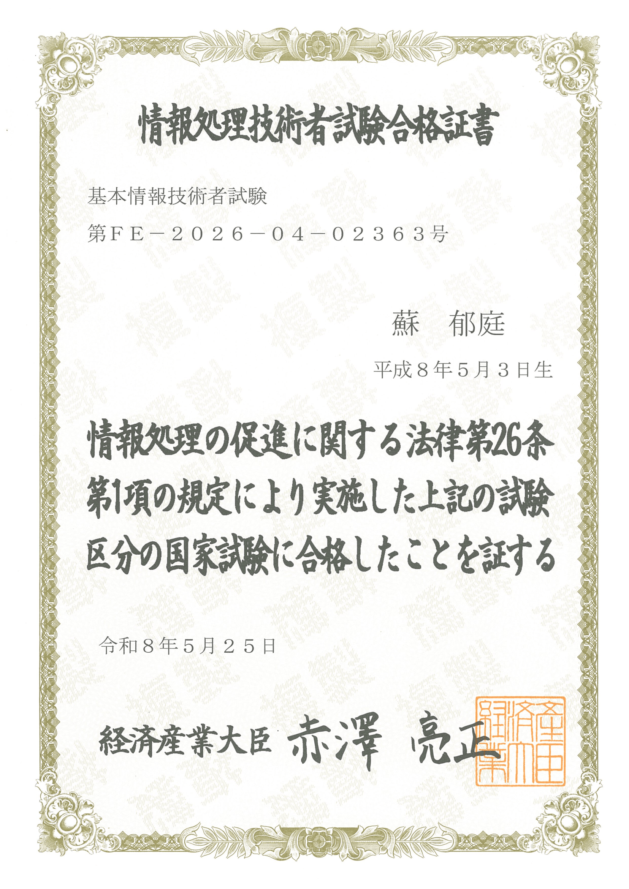
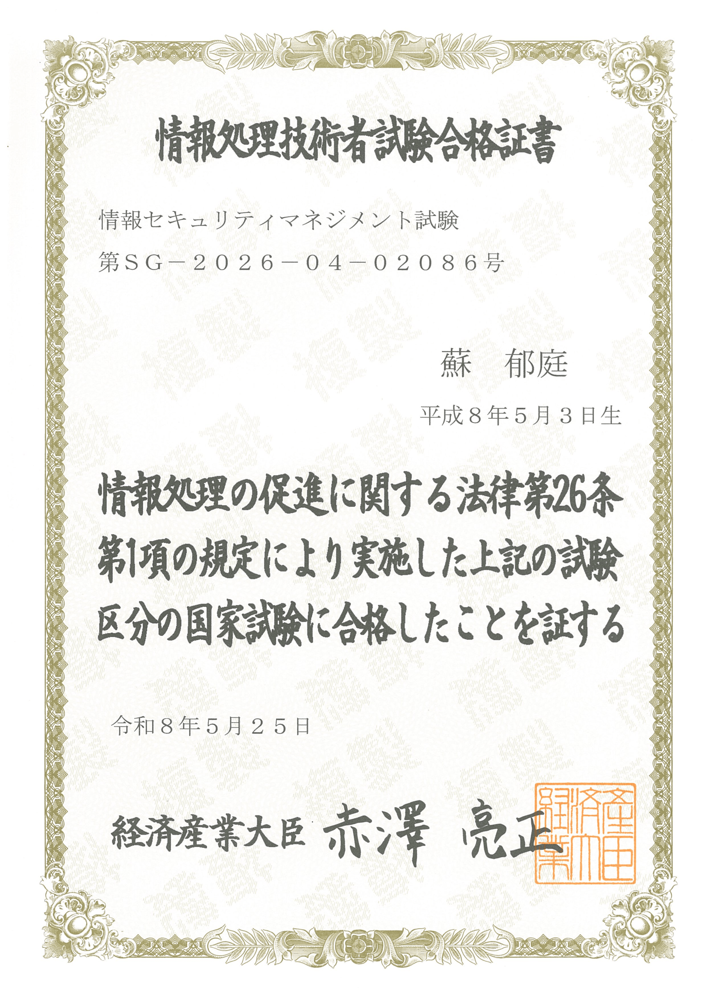
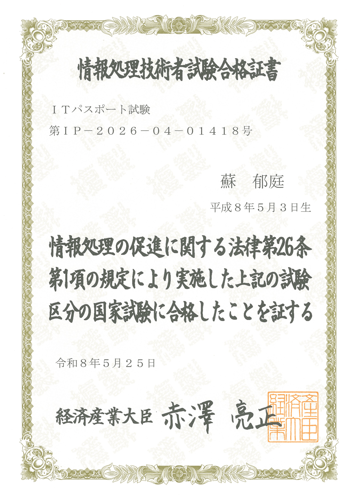

# 【注意事項】
※ 本リポジトリは日本語と繁体中国語で成り立っています。  
※ マニュアルは全部日本語で記載しています。[作品集](/作品集/)に繁体中国の内容が含まれています。  
※ **日本語のREADMEファイル**は[こちら](README_jp.md)をご覧ください。

※ 本儲存庫是由日文和繁體中文所構成。  
※ Manual皆使用日文編寫。[作品集](/作品集/)內包含繁體中文內容。  
※ **日文的README檔案**[請參考此檔案](README_jp.md)。  

***************************************************************************
# 【自我介紹】
我是來自台灣的軟體工程師，目標成為能獨當一面的軟體開發工程師。  
於2023年6月參加「Unity工程師養成班」計畫，這是我踏入軟體開發領域的第一步。  

在該計畫中，我參與多項學習與實作專案，最終完成了[成果發表報告書](https://www.canva.com/design/DAFpPVzcp1w/3RHpOZZTuXIX1gwWG60fdg/edit?utm_content=DAFpPVzcp1w&utm_campaign=designshare&utm_medium=link2&utm_source=sharebutton)，歡迎參閱。  

目前持續以 C#、Python、Java 為主進行學習，同時也在接觸資料庫與前端技術。  

此外，自2025年3月起任職於資訊產業，擔任初階軟體工程師，參與銀行系統之開發與維護工作。  
使用 Java、COBOL、Oracle SQL 進行功能開發與修改，並透過障礙調查與使用者問題回應等實務經驗持續提升技術能力。  

同時也在工作之餘準備日本資訊相關證照，並於2026年3月取得 ITパスポート、情報セキュリティマネジメント試驗及基本情報技術者試驗。  
目前正持續準備 Oracle Master Silver SQL（1Z0-071）。  

在累積實務經驗的同時，我以赴日發展為目標，持續進行作品集製作與技術學習。  
期望未來能將所學轉化為實際成果，並持續成長為更具實力的工程師。  

歡迎參考我的[作品集](#作品集)，感謝您。  

## 【技能清單】
1. **C# / Unity** (2023/06~)  
   - **熟練度**: 實戰級（paiza S等級問題通過）   
   - **學習筆記**: [C# Manual](C%23Manual/)  
   - **作品集**: [作品集](作品集/繁體中文/C%23/)  

2. **Python 3** (2024/01~)  
   - **熟練度**: 應用級（paiza S等級問題通過）  

3. **MySQL** (2024/09~)  
   - **熟練度**: 基礎級   
   - **學習筆記**: [MySQL Manual](MySQLManual/)  

4. **Java** (2024/09~)  
   - **熟練度**: 實戰級（paiza S等級問題通過）  
   - **學習筆記**: [Java Manual](JavaManual/)  
   - **作品集**: [作品集](作品集/日本語/Java/)  

5. **HTML / CSS** (2024/10~)  
   - **熟練度**: 應用級  
   - **學習筆記**: [HTML/CSS Manual](HTML_CSSManual/)  
   - **作品集**: [作品集](作品集/繁體中文/HTML_CSS/)

6. **JavaScript** (2025/02~)
   - **熟練度**: 入門級  
   - **學習筆記**: [JavaScriptManual](JavaScriptManual/)  

7. **COBOL** (2025/10~)
   - **熟練度**: 實戰級  
   - **學習筆記**: [CobolManual](CobolManual/)  
   
## 【相關證書】
1. Unity程式設計師認證（2023/07/20取得）

  

2. Unity藝術設計師認證（2023/07/20取得）

  

3. 基本情報技術者試験（2026/05/25取得）
   - **學習筆記1**: [基本情報技術者試験](基本情報技術者試験/)
   - **學習筆記2**: [基本情報技術者対策(試算表)](https://docs.google.com/spreadsheets/d/1hhQGJZJyuUzygikoteQMmnXlfWEoNTti7C5zuS0sTCM/edit?gid=0#gid=0)

  

4. 情報セキュリティマネジメント試験（2026/05/25取得）
   - **學習筆記**: 與 基本情報技術者試験 共用

  

5. ITパスポート試験（2026/05/25取得）
   - **學習筆記**: 與 基本情報技術者試験 共用

  

## 【聯絡方式】
* GitHub: [kidinjp](https://github.com/kidinjp)
* Email: `yuting53jp@gmail.com`

***************************************************************************
# 【關於此存儲庫】
從2024年11月起，我開始整理過去的學習成果，將學習心得與筆記詳細記錄並附上作品集，以便未來能夠輕鬆回顧與複習。  

## 【近期目標】
* 製作 Python 3 學習手冊
* JavaScript編碼練習
* 考Oracle Master Silver SQL 2019
  * 2026/04/13、外部網站(Google試算表筆記)：［Oracle Master Silver SQL 2019対策］（https://docs.google.com/spreadsheets/d/1rF515WZzdrP1-TDOLAm6bvIY65A7tzLZRy3JK4BDE3Q/edit?gid=1975707988#gid=1975707988）

## 【隨時更新】
* 各程式語言的演算法
* 各程式語言的內容補充及更新

***************************************************************************
# 【存儲庫更新記錄】  
* 2024/11/17，新增【未來目標】與【檔案建立日誌】
* 2025/02/10，在【檔案建立日誌】中新增【作品集】欄位
* 2025/02/15，將儲存庫設為公開，並更名為「kidinjp」，新增【注意事項】與【自我介紹】，並增添日文版 README.md，以繁體中文為主

## 【作品集】
基本路徑：【作品集】⇒【語言（繁體中文/日本語）】⇒【程式語言】⇒【作品資料夾】  
※ 上傳日期與原作品之創建日期可能不同。  
* 2025/02/20、[繁體中文/Java/1_打字遊戲](作品集/Java/1_打字遊戲/)
* 2025/02/14、[繁體中文/C#/10_Unity工程師養成班_2D_成果發表作品](作品集/繁體中文/C%23/10_Unity工程師養成班_2D_成果發表作品/)
* 2025/02/14、[繁體中文/C#/09_Unity工程師養成班_3D_AR試作](作品集/繁體中文/C%23/09_Unity工程師養成班_3D_AR試作/)
* 2025/02/14、[繁體中文/C#/08_Unity工程師養成班_3D_氣墊曲棍球(Air Hockey)](作品集/繁體中文/C%23/08_Unity工程師養成班_3D_氣墊曲棍球(Air%20Hockey)/)
* 2025/02/14、[繁體中文/C#/07_Unity工程師養成班_3D_射擊遊戲試作](作品集/繁體中文/C%23/07_Unity工程師養成班_3D_射擊遊戲試作/)
* 2025/02/14、[繁體中文/C#/06_Unity工程師養成班_3D_動畫置入及簡易UI設置](作品集/繁體中文/C%23/06_Unity工程師養成班_3D_動畫置入及簡易UI設置/)
* 2025/02/14、[繁體中文/C#/05_Unity工程師養成班_3D_帳號登入畫面試作](作品集/繁體中文/C%23/05_Unity工程師養成班_3D_帳號登入畫面試作/)
* 2025/02/14、[繁體中文/C#/04_Unity工程師養成班_3D_雪山場景製作及物件觸碰效果](作品集/繁體中文/C%23/04_Unity工程師養成班_3D_雪山場景製作及物件觸碰效果/)
* 2025/02/14、[繁體中文/C#/03_Unity工程師養成班_2D_小朋友下樓梯](作品集/繁體中文/C%23/03_Unity工程師養成班_2D_小朋友下樓梯/)
* 2025/02/14、[繁體中文/C#/02_Unity工程師養成班_2D_九宮格切割&紙片人動作](作品集/繁體中文/C%23/02_Unity工程師養成班_2D_九宮格切割&紙片人動作/)
* 2025/02/14、[繁體中文/C#/01_Unity工程師養成班_2D_動作特效&游標點擊效果測試](作品集/繁體中文/C%23/01_Unity工程師養成班_2D_動作特效&游標點擊效果測試/)
* 2025/02/11、[繁體中文/HTML_CSS/2_Grid Garden答案](作品集/繁體中文/HTML_CSS/2_Grid%20Garden答案/)
* 2025/02/10、[繁體中文/HTML_CSS/1_小水豚教你做網站作業](作品集/繁體中文/HTML_CSS/1_小水豚教你做網站作業/)
* 2025/02/10、[日本語/Java/2_タイピングゲーム](作品集/日本語/Java/2_タイピングゲーム/)
* 2025/02/10、[日本語/Java/1_Java基礎クラス課題](作品集/日本語/Java/1_Java基礎クラス課題/)

## 【基本情報技術者試験】
* 2026/03/13、ITパスポート試験、基本情報技術者試験情報、セキュリティマネジメント試験，單字考題APP
* 2026/01/19、外部網站(Google試算表) [基本情報技術者対策](https://docs.google.com/spreadsheets/d/1hhQGJZJyuUzygikoteQMmnXlfWEoNTti7C5zuS0sTCM/edit?gid=0#gid=0)

## 【Cobol】
* 2026/03/13、因業務需求開始學習，將學習筆記一次上傳
 
## 【JavaScript】
* 2025/03/06、【Tips】03_Node.jsプロジェクトの基本的な構成まとめ.md
* 2025/03/06、【Tips】02_標準入力と標準出力.md
* 2025/03/05、【Tips】01_JavaScript基礎.md

## 【HTML_CSSManual】
* 2025/02/10、4_OGPについて.md
* 2025/02/07、3_レスポンシブウェブデザインについて.md
* 2025/01/28、2_CSSの基本構造.md
* 2025/01/28、1_HTMLの基本構造.md
* 2025/01/18、0_Web_HTML_CSSの基礎概念.md

## 【MySQLManual】
* 2025/01/01、1_応用例.md
* 2025/01/16、0_よく見るSQLキーワード一覧.md
* 2025/01/16、0_基礎概念および基本操作.md

## 【C#Manual】  
* 2025/01/28、【01基本データ型】型変換.md
* 2025/01/16、0_今後のC#課題.md
* 2025/01/15、【07日時関連】DateTime.md
* 2025/01/14、【00Tips】Systemについて.md
* 2025/01/11、【03コレクション型】HashSetとSortedSet(一意).md
* 2025/01/09、【00Tips】読み込みインポート.md
* 2025/01/08、【09LINQ】LINQ.md
* 2025/01/07、【03コレクション型】Stack.md
* 2025/01/06、【03コレクション型】Queue.md
* 2025/01/05、【12例外処理】例外処理.md
* 2025/01/04、【05クラスとオブジェクト】クラスとオブジェクトについて.md
* 2025/01/04、【03コレクション型】Dictionary.md
* 2025/01/02、【01基本データ型】補完文字列.md
* 2024/12/31、【01基本データ型】正規表現.md
* 2024/12/30、【03コレクション型】List.md
* 2024/12/28、0_初心者手引き.md
* 2024/12/27、【02配列】配列.md
* 2024/12/25、【01基本データ型】数字関連_Mathクラス.md
* 2024/12/24、【01基本データ型】String関連.md
* 2024/12/24、【00Tips】C#基礎.md

## 【JavaManual】  
* 2025/03/06、01_ServletとJSPの基本概念.md
* 2025/01/16、0_今後のJava課題.md
* 2024/12/18、アルゴリズム_むずむずオブザイヤー.md
* 2024/11/27、アルゴリズム.md
* 2024/11/26、Date and Time API.md
* 2024/11/24、アノテーション.md
* 2024/11/21、例外処理.md
* 2024/11/20、Stream API.md
* 2024/11/19、コレクションファクトリーメソッド.md
* 2024/11/19、【3Queue】PriorityQueue.md
* 2024/11/19、【5Deque】ArrayDeque.md
* 2024/11/17、【Tips】配列.md
* 2024/11/15、【6Map】LinkedHashMap.md
* 2024/11/15、【2Set】LinkedHashSet.md
* 2024/11/15、【1List】ArrayList.md
* 2024/11/14、【Tips】コレクション型について.md
* 2024/11/14、【Tips】稀によく使うコード集.md
* 2024/11/13、【Tips】型変換.md
* 2024/11/12、【Tips】読み込みインポート_フォーマット指定子.md
* 2024/11/11、【Tips】数字関連_Mathクラス.md
* 2024/11/09、【Tips】String関連.md
* 2024/11/08。【Tips】Java基本文法.md
* 2024/11/08、【Tips】0Java基礎.md

## 【其他、GitHub操作相關的Manual】
* 2024/11/06、Markdownファイルについて.md
* 2024/11/06、GitHubの基礎概念.md
