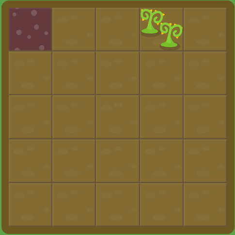
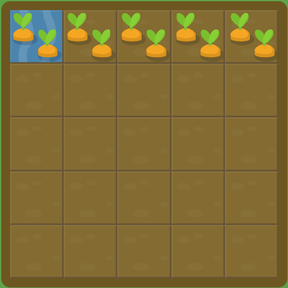
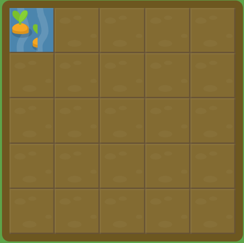

概要  
* [Grid Garden說明](#grid-garden說明)
* [grid_格線佈局之常用屬性一覽](#grid_格線佈局之常用屬性一覽)
  * [【父元素設定】](#父元素設定)
  * [【父元素設定時常用單位/指定方法】](#父元素設定時常用單位指定方法)
  * [【子元素相關設定方式】](#子元素相關設定方式)
  * [【子元素設定時常用單位/指定方法】](#子元素設定時常用單位指定方法)
* [本人回答](#本人回答)
  * [Level_01_【試用grid-column-start】](#level_01_試用grid-column-start)
  * [Level_02_【試用grid-column-start】](#level_02_試用grid-column-start)
  * [Level_03_【試用grid-column-end】](#level_03_試用grid-column-end)
  * [Level_04_【試用grid-column-end】](#level_04_試用grid-column-end)
  * [Level_05_【試用grid-column-end】](#level_05_試用grid-column-end)
  * [Level_06_【試用grid-column-start】](#level_06_試用grid-column-start)
  * [Level_07_【試用span】](#level_07_試用span)
  * [Level_08_【試用span】](#level_08_試用span)
  * [Level_09_【試用span】](#level_09_試用span)
  * [Level_10_【試用grid-column】](#level_10_試用grid-column)
  * [Level_11_【試用grid-column/span】](#level_11_試用grid-columnspan)
  * [Level_12_【試用grid-row-start】](#level_12_試用grid-row-start)
  * [Level_13_【試用grid-row】](#level_13_試用grid-row)
  * [Level_14_【試用grid-column/grid-row】](#level_14_試用grid-columngrid-row)
  * [Level_15_【試用grid-column/grid-row】](#level_15_試用grid-columngrid-row)
  * [Level_16_【試用grid-area】](#level_16_試用grid-area)
  * [Level_17_【試用grid-area】](#level_17_試用grid-area)
  * [Level_18_【試用order】](#level_18_試用order)
  * [Level_19_【試用order】](#level_19_試用order)
  * [Level_20_【試用grid-template-columns】](#level_20_試用grid-template-columns)
  * [Level_21_【試用repeat】](#level_21_試用repeat)
  * [Level_22_【試用em/px/%】](#level_22_試用empx)
  * [Level_23_【試用fr】](#level_23_試用fr)
  * [Level_24_【試用fr】](#level_24_試用fr)
  * [Level_25_【試用fr/px】](#level_25_試用frpx)
  * [Level_26_【試用fr難問】](#level_26_試用fr難問)
  * [Level_27_【試用grid-template】](#level_27_試用grid-template)
  * [Level_28_【試用grid-template】](#level_28_試用grid-template)

2025/02/11，目前含有28道題目，本文在此紀錄本人所回答內容(可正解)及grid相關寫法整理

***************************************************************************
# Grid Garden說明
[Grid Garden](https://cssgridgarden.com/#zh-tw)  
* 可藉由此網站學習格線佈局的基礎操作方法
* 可切換英/中/日等多種語言
* 本章節將附上各關卡之答案以方便後日複習  

***************************************************************************
# grid_格線佈局之常用屬性一覽
## 【父元素設定】  
| 屬性 | 說明 | 寫法範例 |
| --- | --- | --- |
| `display: grid;` | 將元素設為網格容器 | `display: grid;` |
| `grid-template` | `grid-template-rows`<br>`grid-template-columns`<br>同時設定 | `grid-template: 100px 1fr / 200px 1fr 2fr;` |
| `grid-template-columns` | 設定列數 | `grid-template-columns: 100px 1fr 2fr;` |
| `grid-template-rows` | 設定行數 | `grid-template-rows: 50px auto 1fr;` |

## 【父元素設定時常用單位/指定方法】  
| 單位/指定方法 | 說明 | 寫法範例 |
| --- | --- | --- |
| `px` | 像素<br>固定長度，適用於精確控制尺寸的場景 | `grid-template-columns: 100px 200px;`<br>第一列 100px，第二列 200px |
| `em` | 依據元素的字體大小來計算 | `grid-template-columns: 10em 20em;`<br>第一列 10 倍字體大小，第二列 20 倍 |
| `fr` | 分配剩餘空間，適合自適應布局 | `grid-template-columns: 1fr 2fr;`<br>第一列占 1 份，第二列占 2 份(1/3 + 2/3) |
| `%` | 依據父元素的尺寸來計算，相對單位 | `grid-template-columns: 50% 50%;`<br>兩列各占父容器的一半 |
| `repeat(次數, 長/寬度)` | 相同內容重複指定 | `grid-template-columns: repeat(3, 1fr);`<br> 1fr * 3 |

## 【子元素相關設定方式】  
| 屬性 | 說明 | 寫法範例 |
| --- | --- | --- |
| `grid-area` | 一次指定概括行列範圍<br>`row-start`<br>`column-start`<br>`row-end`<br>`column-end` | `grid-area: 2 / 1 / 4 / 3;`<br>第2行第1列 → 第4行第3列 |
| `grid-column` | 指定**橫方向**概括範圍 | `grid-column: 1 / 3;` |
| `grid-column-start` | 指定**橫方向**概括範圍的**開始位置** | `grid-column-start: 2;` |
| `grid-column-end` | 指定**橫方向**概括範圍的**結束位置** | `grid-column-end: 4;` |
| `grid-row` | 指定**縱方向**概括範圍 | `grid-row: 1 / span 2;` |
| `grid-row-start` | 指定**縱方向**概括範圍的**開始位置** | `grid-row-start: 2;` |
| `grid-row-end` | 指定**縱方向**概括範圍的**結束位置** | `grid-row-end: span 3;` |

## 【子元素設定時常用單位/指定方法】  
| 單位/指定方法 | 說明 | 寫法範例 |
| --- | --- | --- |
| 正整數 | 由左(上)第1條計算 | `grid-column: 1 / 3;`<br>第1列～第3列 |
| 負整數 | 負整數由右(下)第1條 | `grid-column: -3 / -1;`<br>由右數來第3列～最後 |
| `span` | 跨越的長/寬度，**只能正值** | `grid-column: span 2;`<br>占2列份 |
| `order` | 改變元素在視覺上的排列順序<br>數值越小，越靠前顯示；數值越大，越靠後顯示 |以下3層之間的比較:<br>`.A { order: 2; }`：顯示於最後<br>`.B { order: -1; }`：顯示於最前<br>`.C { order: 1; }`：顯示於中間層 |

***************************************************************************
# 本人回答
## Level_01_【試用grid-column-start】
<p align="center">
  
</p>

**【題目】**  
使用 `grid-column-start` 屬性來給胡蘿蔔澆水。  
比如說，`grid-column-start: 3;` 將會給第三行的網格開始的區域澆水，這也是描述網格中從左起第三行邊界的另一種方法。  
```css
#garden {
  display: grid;
  grid-template-columns: 20% 20% 20% 20% 20%;
  grid-template-rows: 20% 20% 20% 20% 20%;
}

#water {
  /* 回答欄位 */
}
```

**【本人答案】**  
```css
grid-column-start: 3;
```

## Level_02_【試用grid-column-start】
<p align="center">
  
</p>

**【題目】**  
用 grid-column-start 來除掉雜草。  
注意，雜草從第五行開始。  
```css
#garden {
  display: grid;
  grid-template-columns: 20% 20% 20% 20% 20%;
  grid-template-rows: 20% 20% 20% 20% 20%;
}

#poison {
  /* 回答欄位 */
}
```

**【本人答案】**  
```css
grid-column-start: 5;
```

## Level_03_【試用grid-column-end】
<p align="center">
  
</p>

**【題目】**  
若僅使用 `grid-column-start`，網格默認只佔一行。  
然而，你可以使用 `grid-column-end` 屬性將網格拓展到多行。  

使用 `grid-column-end`，將你的所有胡蘿蔔澆水，但請避免澆到泥土上，我們要節約用水！  
注意，胡蘿蔔從第一行開始，第四行结束。  
```css
#garden {
  display: grid;
  grid-template-columns: 20% 20% 20% 20% 20%;
  grid-template-rows: 20% 20% 20% 20% 20%;
}

#water {
  grid-column-start: 1;
  /* 回答欄位 */
}
```

**【本人答案】**  
```css
grid-column-end: 4;
```

## Level_04_【試用grid-column-end】
<p align="center">
  
</p>

**【題目】**  
當將 `grid-column-start` 和 `grid-column-end` 一起使用時，你也許已經注意到結束的值比起始的值大。  
但事實證明並非如此！  

嘗試設置 `grid-column-end` 的值小於 5，以此來給胡蘿蔔澆水。
```css
#garden {
  display: grid;
  grid-template-columns: 20% 20% 20% 20% 20%;
  grid-template-rows: 20% 20% 20% 20% 20%;
}

#water {
  grid-column-start: 5;
  /* 回答欄位 */
}
```

**【本人答案】**  
```css
grid-column-end: 2;
```

## Level_05_【試用grid-column-end】
<p align="center">
  
</p>

**【題目】**  
如果你想要從右邊數網格的行數而不是從左邊數，你可以設置 `grid-column-start` 和 `grid-column-end` 為負值。  
比如說，你可以設置它為 -1 來指定為右邊的第一行。  

嘗試將 `grid-column-end` **設置為負值**。  
```css
#garden {
  display: grid;
  grid-template-columns: 20% 20% 20% 20% 20%;
  grid-template-rows: 20% 20% 20% 20% 20%;
}

#water {
  grid-column-start: 1;
  /* 回答欄位 */
}
```

**【本人答案】**  
```css
grid-column-end: -2;
```

## Level_06_【試用grid-column-start】
<p align="center">
  
</p>

**【題目】**  
現在嘗試設置 `grid-column-start` 為負值。  
```css
#garden {
  display: grid;
  grid-template-columns: 20% 20% 20% 20% 20%;
  grid-template-rows: 20% 20% 20% 20% 20%;
}

#poison {
  /* 回答欄位 */
}
```

**【本人答案】**  
```css
grid-column-start: -3;
```

## Level_07_【試用span】
<p align="center">
  
</p>

**【題目】**  
你可以根據**網格的開始和結束位置**來定義一個網格項，你也可以用 `span` 關鍵詞來指定你所要跨越的寬度。  
請注意 `span` 只能是**正值**。  

比如說，你可以通過 `grid-column-end: span 2;` 來給這些胡蘿蔔澆水。  
```css
#garden {
  display: grid;
  grid-template-columns: 20% 20% 20% 20% 20%;
  grid-template-rows: 20% 20% 20% 20% 20%;
}

#water {
  grid-column-start: 2;
  /* 回答欄位 */
}
```

**【本人答案】**  
```css
grid-column-end: span 2;
```

## Level_08_【試用span】
<p align="center">
  
</p>

**【題目】**  
嘗試在 `grid-column-end` 屬性中使用 `span` 關鍵字來給胡蘿蔔澆水。  
```css
#garden {
  display: grid;
  grid-template-columns: 20% 20% 20% 20% 20%;
  grid-template-rows: 20% 20% 20% 20% 20%;
}

#water {
  grid-column-start: 1;
  /* 回答欄位 */
}
```

**【本人答案】**  
```css
grid-column-end: span 5;
```

## Level_09_【試用span】
<p align="center">
  
</p>

**【題目】**  
你也可以將 `span` 關鍵字和 `grid-column-start` 一起使用，相對於結束位置來設置其寬度。  
```css
#garden {
  display: grid;
  grid-template-columns: 20% 20% 20% 20% 20%;
  grid-template-rows: 20% 20% 20% 20% 20%;
}

#water {
  /* 回答欄位 */
  grid-column-end: 6;
}
```

**【本人答案】**  
```css
grid-column-start: span 3;
```

## Level_10_【試用grid-column】
<p align="center">
  
</p>

**【題目】**  
如果每次都輸入 `grid-column-start` 和 `grid-column-end` 兩個屬性，我們一定會厭煩的。  
幸運地是，`grid-column` 是一個縮寫屬性，它可以一次接受兩個值，只要用 '/' 分開就好。  

比如說：`grid-column: 2 / 4;` 就會設置網格項從第二行開始，到第四行结束。  
```css
#garden {
  display: grid;
  grid-template-columns: 20% 20% 20% 20% 20%;
  grid-template-rows: 20% 20% 20% 20% 20%;
}

#water {
  /* 回答欄位 */
}
```

**【本人答案】**  
```css
grid-column: 4 / 6;
```

## Level_11_【試用grid-column/span】
<p align="center">
  
</p>

**【題目】**  
嘗試使用 `grid-column` 來給胡蘿蔔澆水。  
`span` 關鍵字在這個縮寫屬性中也是可以使用的，所以你也可以試試！  
```css
#garden {
  display: grid;
  grid-template-columns: 20% 20% 20% 20% 20%;
  grid-template-rows: 20% 20% 20% 20% 20%;
}

#water {
  /* 回答欄位 */
}
```

**【本人答案】**  
```css
grid-column: 2 / span 3;
```

## Level_12_【試用grid-row-start】
<p align="center">
  
</p>

**【題目】**  
其中一件事情使 CSS 網格佈局和 `Flexbox` 佈局不同的是，你可以很輕鬆的在二維的空間裡定位一個網格項: 行和列。  
`grid-row-start` 就像 `grid-column-start` 一樣，只不過是在垂直方向指定起始位置。  

用 `grid-row-start` 來給胡蘿蔔澆水吧！  
```css
#garden {
  display: grid;
  grid-template-columns: 20% 20% 20% 20% 20%;
  grid-template-rows: 20% 20% 20% 20% 20%;
}

#water {
  /* 回答欄位 */
}
```

**【本人答案】**  
```css
grid-row-start: 3;
```

## Level_13_【試用grid-row】
<p align="center">
  
</p>

**【題目】**  
現在你可以試一試縮寫屬性 `grid-row`。  
```css
#garden {
  display: grid;
  grid-template-columns: 20% 20% 20% 20% 20%;
  grid-template-rows: 20% 20% 20% 20% 20%;
}

#water {
  /* 回答欄位 */
}
```

**【本人答案】**  
```css
grid-row: 3 / 6;
```

## Level_14_【試用grid-column/grid-row】
<p align="center">
  
</p>

**【題目】**  
同時使用 `grid-column` 和 `grid-row` 來設置網格項在行和列的位置。  
```css
#garden {
  display: grid;
  grid-template-columns: 20% 20% 20% 20% 20%;
  grid-template-rows: 20% 20% 20% 20% 20%;
}

#poison {
  /* 回答欄位 */
  /* 回答欄位 */
}
```

**【本人答案】**  
```css
grid-column: 2 / 3;
grid-row: 5;
```

## Level_15_【試用grid-column/grid-row】
<p align="center">
  
</p>

**【題目】**  
你也可以使用 `grid-column` 和 `grid-row` 一起來定義一個較大區域的網格。  
試一下吧！  
```css
#garden {
  display: grid;
  grid-template-columns: 20% 20% 20% 20% 20%;
  grid-template-rows: 20% 20% 20% 20% 20%;
}

#water {
  /* 回答欄位 */
  /* 回答欄位 */
}
```

**【本人答案】**  
```css
grid-column: 2 / 6;
grid-row: span 5; /* 別解:【1 / 6】 */
```

## Level_16_【試用grid-area】
<p align="center">
  
</p>

**【題目】**  
如果你覺得同時輸入 `grid-column` 和 `grid-row` 太麻煩，那還有另一種縮寫可用。  
`grid-area` 屬性接受 4 個由 '/' 分開的值：`grid-row-start`、`grid-column-start`、`grid-row-end`，最後是 `grid-column-end`。  

舉個例子如下所示：`grid-area: 1 / 1 / 3 / 6;`。  
```css
#garden {
  display: grid;
  grid-template-columns: 20% 20% 20% 20% 20%;
  grid-template-rows: 20% 20% 20% 20% 20%;
}

#water {
  /* 回答欄位 */
}
```

**【本人答案】**  
```css
grid-area: 1 / 2 / 4 / 6;
```

## Level_17_【試用grid-area】
<p align="center">
  
</p>

**【題目】**  
如果我們有很多個網格項呢？  
你可以任意覆蓋它們不用有任何擔心。  
用 `grid-area` 定義第二個網格項為所有未澆水的胡蘿蔔澆水。  
```css
#garden {
  display: grid;
  grid-template-columns: 20% 20% 20% 20% 20%;
  grid-template-rows: 20% 20% 20% 20% 20%;
}

#water-1 {
  grid-area: 1 / 4 / 6 / 5;
}

#water-2 {
  /* 回答欄位 */
}
```

**【本人答案】**  
```css
grid-area: 2 / 3 / 5 / 6;
```

## Level_18_【試用order】
<p align="center">
  
</p>

**【題目】**  
如果網格項不是以 `grid-area`、`grid-column`、`grid-row` 等顯示的，它們會自動按照其在原始碼中出現的位置擺放。  
我們也可以使用 `order` 屬性來**重寫它的順序**，這也是網格佈局優於表格佈局的好處之一。  

默認情況下，所有的網格項的 `order` 都是 0，但是順序也可以被任意設置為正數或者負數，就像 `z-index` 一樣。  

現在，看到第二行的胡蘿蔔中毒了並且最後有雜草的那一行也澆了水。  
現在就改變中毒的網格項的 `order` 值來修復它們吧！  
```css
#garden {
  display: grid;
  grid-template-columns: 20% 20% 20% 20% 20%;
  grid-template-rows: 20% 20% 20% 20% 20%;
}

.water {
  order: 0;
}

#poison {
  /* 回答欄位 */
}
```

**【本人答案】**  
```css
order: 1;
```

## Level_19_【試用order】
<p align="center">
  
</p>

**【題目】**  
現在水和中毒的土地是交替出現的，並且所有的雜草都出現在每一行的開始。  
設置中毒土地的正確 `order` 值來修復它們吧！  
```css
#garden {
  display: grid;
  grid-template-columns: 20% 20% 20% 20% 20%;
  grid-template-rows: 20% 20% 20% 20% 20%;
}

.water {
  order: 0;
}

.poison {
  /* 回答欄位 */
}
```

**【本人答案】**  
```css
order: -1;
```

## Level_20_【試用grid-template-columns】
<p align="center">
  
</p>

**【題目】**  
到目前為止，你已經將你的花園設置為 5 行，每行佔總寬度的 20%；以及 5 列，每列佔全部高度的 20%。  

這是通過設置 `grid-template-columns: 20% 20% 20% 20% 20%;` 和 `grid-template-rows: 20% 20% 20% 20% 20%;` 來實現的。  
每一條規則都有 5 個值，代表創建了 5 個行，每一行設置為花園寬度的 20%。  

但是你也可以任意設置網格項的寬度。  
為 `grid-template-columns` 設置一個新的值來給你的胡蘿蔔澆水吧！  
你想要將第一行的寬度設置為 50%。  
```css
#garden {
  display: grid;
  /* 回答欄位 */
  grid-template-rows: 20% 20% 20% 20% 20%;
}

#water {
  grid-column: 1;
  grid-row: 1;
}
```

**【本人答案】**  
```css
grid-template-columns: 50%;
```

## Level_21_【試用repeat】
<p align="center">
  
</p>

**【題目】**  
指定一些具有相同寬度的網格項會變得很乏味。  
幸運地是有 `repeat` 函數來幫助我們。  

比如說，之前我們使用 `grid-template-columns: 20% 20% 20% 20% 20%;` 屬性定義了 5 行，每行佔 20%。  
這可以被簡寫為：`grid-template-columns: repeat(5, 20%);`  

使用 `grid-template-columns` 屬性以及 `repeat` 函數，創建 8 行，每行佔 12.5% 的寬度。這樣你就不會給花園澆過多的水。
```css
#garden {
  display: grid;
  /* 回答欄位 */
  grid-template-rows: 20% 20% 20% 20% 20%;
}

#water {
  grid-column: 1;
  grid-row: 1;
}
```

**【本人答案】**  
```css
grid-template-columns: repeat(8, 12.5%);
```

## Level_22_【試用em/px/%】
<p align="center">
  
</p>

**【題目】**  
`grid-template-columns` 不僅僅只接受百分比的值，也接受像像素或 em 這樣的長度單位。  
你甚至可以將不同的長度單位混和使用。  

接下來，分別將行的寬度設置為 100px、3em 和 40%。  
```css
#garden {
  display: grid;
  /* 回答欄位 */
  grid-template-rows: 20% 20% 20% 20% 20%;
}
```

**【本人答案】**  
```css
grid-template-columns: 100px 3em 40%;
```

## Level_23_【試用fr】
<p align="center">
  
</p>

**【題目】**  
網格系統也引入了一個新的單位，分數 fr。每一個 fr 單位分配一個可用的空間。  
比如說，如果兩個元素分別被設置為 1fr 和 3fr，那麼空間就會被分為 4 等份；第一個元素佔 1/4，第二個元素佔 3/4。  

這裡，雜草佔據了你第一列的左 1/6，胡蘿蔔則佔了剩下的 5/6。請創建兩個行，並使用 fr 單位來定義它們的寬度。  
```css
#garden {
  display: grid;
  /* 回答欄位 */
  grid-template-rows: 20% 20% 20% 20% 20%;
}
```

**【本人答案】**  
```css
grid-template-columns: 1fr 5fr;
```

## Level_24_【試用fr】
<p align="center">
  
</p>

**【題目】**  
當行的寬度採用像素、百分比或者 em 為單位的時候，其他使用 fr 單位設置的行將會平分剩下的空間。  

這裡的胡蘿蔔在左邊形成了一個 50 像素的行，並且雜草在右邊也佔據 50 像素的寬度。  
使用 `grid-template-columns` 屬性，創建這兩個行，使用 fr 再創建三個行，使其平均佔據剩下的空間。  
```css
#garden {
  display: grid;
  /* 回答欄位 */
  grid-template-rows: 20% 20% 20% 20% 20%;
}

#water {
  grid-area: 1 / 1 / 6 / 2;
}

#poison {
  grid-area: 1 / 5 / 6 / 6;
}
```

**【本人答案】**  
```css
grid-template-columns: 50px 1fr 1fr 1fr 50px;
```

## Level_25_【試用fr/px】
<p align="center">
  
</p>

**【題目】**  
現在在你的花園的左邊有一行雜草，佔 75 像素寬。  
剩餘空間的 3/5 正種著胡蘿蔔，而剩下的 2/5 已經雜草叢生。  

用 `grid-template-columns` 屬性，將 px 和 fr 單位結合起來，來製作必要的行。  
```css
#garden {
  display: grid;
  /* 回答欄位 */
  grid-template-rows: 100%;
}
```

**【本人答案】**  
```css
grid-template-columns: 75px 3fr 2fr;
```

## Level_26_【試用fr難問】
<p align="center">
  
</p>

**【題目】**  
`grid-template-rows` 和 `grid-template-columns` 的作用大致相同。  

用 `grid-template-rows` 屬性來為花園中除了頂部 50 像素之外的所有區域澆水。  
注意：水被設置為僅填充第五列，所以你總共需要創建 5 列。  
```css
#garden {
  display: grid;
  grid-template-columns: 20% 20% 20% 20% 20%;
  /* 回答欄位 */
}

#water {
  grid-column: 1 / 6;
  grid-row: 5 / 6;
}
```

**【本人答案】**  
```css
grid-template-rows: 50px 0 0 0 5fr;
```

## Level_27_【試用grid-template】
<p align="center">
  
</p>

**【題目】**  
`grid-template` 是一個結合 `grid-template-rows` 和 `grid-template-columns` 的縮寫屬性。  

比如說，`grid-template: 50% 50% / 200px;` 將創建一個具有兩列的網格，每列佔 50%，以及一個 200 像素寬的行。  

嘗試使用 `grid-template` 屬性來澆水，需要包括你的花園上部的 60%，以及左側的 200 像素。  
```css
#garden {
  display: grid;
  /* 回答欄位 */
}

#water {
  grid-column: 1;
  grid-row: 1;
}
```

**【本人答案】**  
```css
grid-template: 60% 40% / 200px;
```

## Level_28_【試用grid-template】
<p align="center">
  
</p>

**【題目】**  
你的花園看起來很棒。  
現在，你在花園的底部留下了 50 像素的小路，其他的空間用來種植胡蘿蔔。  

不幸地是，胡蘿蔔地的 20% 已經雜草叢生了，最後一次 CSS 網格佈局來規劃你的花園吧！  
```css
#garden {
  display: grid;
  /* 回答欄位 */
}
```

**【本人答案】**  
```css
grid-template: 1fr 50px / 20% 80%; /* 別解:【1fr 50px / 1fr 4fr */
```
