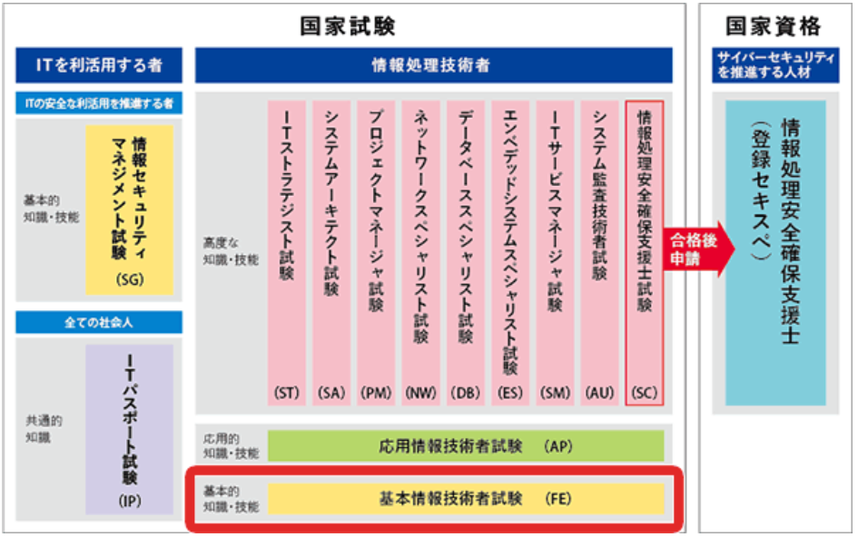

以降にて基本情報技術者試験においで、把握しておかなければならない概念を記す。

# 科目A
* [1. 基礎理論](科目A/1.基礎理論.md)
* [2. A/D変換](科目A/2.AD変換.md)
* [3. ハードウェア](科目A/3.ハードウェア.md)
* [4. ソフトウェア](科目A/4.ソフトウェア.md)
* [5. データベース](科目A/5.データベース.md)
* [6. ネットワーク](科目A/6.ネットワーク.md)
* [7. 情報セキュリティ](科目A/7.情報セキュリティ.md)
* [8. アルゴリズムとプログラミング](科目A/8.アルゴリズムとプログラミング.md)
* [9. システム構成要素](科目A/9.システム構成要素.md)
* [10. システム開発](科目A/10.システム開発.md)
* [11. マネジメント分野](科目A/11.マネジメント分野.md)
* [12. ストラテジ分野](科目A/12.ストラテジ分野.md)

* その他
  * [要復習範囲](科目A/要復習範囲.md)
  * [まさか忘れていないよね、、、？](#おやおや)
  * [公式強化コーナー]

  

* 参考資料：
    * [基本情報技術者試験ドットコム](https://www.fe-siken.com/)
    * [【基本情報技術者試験YouTuber】すーさん](https://www.youtube.com/watch?v=oqaBEnhIxk0)
    * [対策メモ（スプシ）](https://docs.google.com/spreadsheets/d/1hhQGJZJyuUzygikoteQMmnXlfWEoNTti7C5zuS0sTCM/edit?gid=1090409294#gid=1090409294)

**************
### おやおや
* log
  * 例： log28 = ( 8 = 2の3乗) 3
* lim?
* 基数変換?

