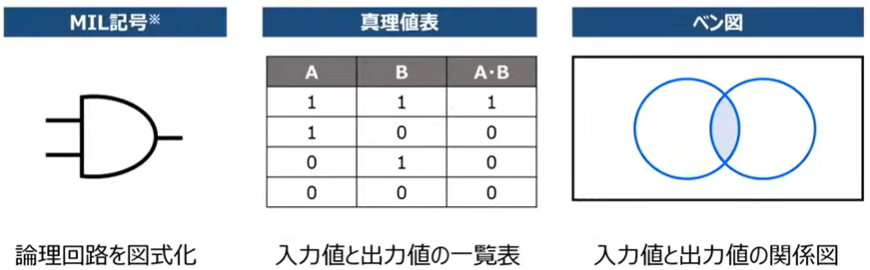
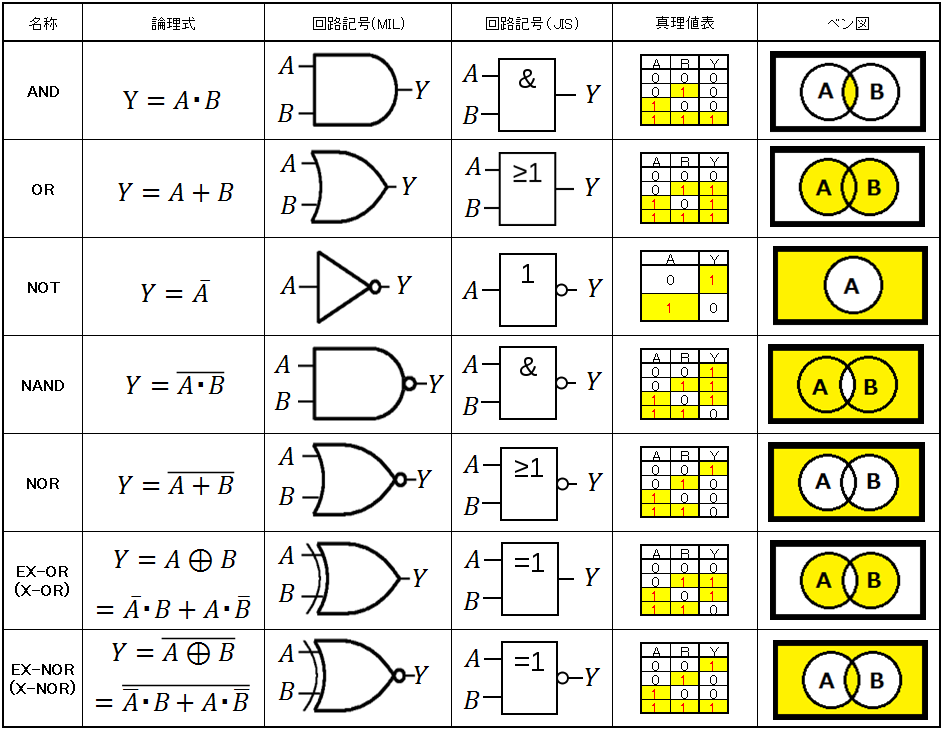
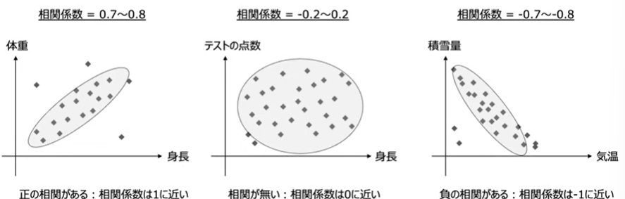
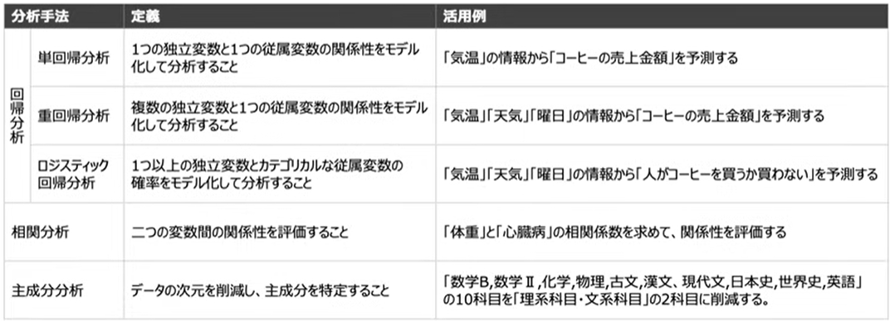
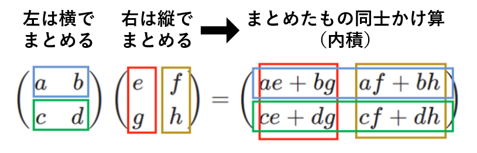

▶基礎理論

* [1. n進数、基数変換](#n進数基数変換)
* [2. 2進数の四則演算](#2進数の足し算と引き算)
* [3. 数の表現と誤差](#数の表現と誤差)
* [4. 理論演算と論理回路](#理論演算と論理回路)
* [5. 半加算器と全加算器](#半加算器と全加算器)
* [6. 確率・統計](#確率・統計)
* [7. 線形代数](#線形代数)
* [8. その他](#その他)
    * [状態遷移図（オートマトン）](#状態遷移図オートマトン)
    * [ビット演算](#ビット演算)
    * [ハフマン符号化](#ハフマン符号化)
    * [逆ポーランド表記法](#逆ポーランド表記法)
    * [BNF記法](#bnf記法)
    * [ランレングス符号化](#ランレングス符号化)

* 用語集

|用語|意味|
| --- | --- |
|パリティチェック|データ通信やメモリチェックなどにおいてデータの`ビット誤り`を検出する最もシンプルな方法|
|奇数パリティ|ビット列とパリティビットを合わせて"1"のビット数が`奇数`になるようにパリティビットを付加する方式|
|偶数パリティ|ビット列とパリティビットを合わせて"1"のビット数が`偶数`になるようにパリティビットを付加する方式|
|桁あふれ誤差<br>`オーバーフロー`<br>`アンダーフロー`|コンピューターが扱える最大値/最小値を超えること|
|情報落ち<br>桁落ち|絶対値`の大きい値と小さい値で足し算/引き算で絶対値の小さい値の計算が反映されないこと|
|打ち切り誤差|計算処理を途中で打ち切ることで生じる誤差|
|丸め誤差|`切り上げ`/`切り捨て`/`四捨五入`により生じる誤差|
|絶対誤差|測定値と理論値との差|
|論理積<br>AかつB|AND|
|論理和<br>AまたはB|OR|
|否定|NOT|
|排他的論理和|XOR|
|否定論理積|NAND|
|否定論理和|NOR|
|同値<同価演算>|XNOR/EQ|
|含意|IMPLIES|
|非含意|NIMPLIES|
|順列|`nPr = n! / (n-r)!`|
|組み合わせ|`nCr = n! / r!(n - r)!`|
|条件付き確率|`P(A ｜ B) = AかつBのパターン数 / Bのパターン数`|
|期待値|`(各事象の確率) * (得られる値)`|

************************************************************
<div style="page-break-after: always;"></div>

### 📖n進数、基数変換
* 識別番号（文字コード）：0と1での表現番号
* 2進数、8進数（バイト）、16進数（シフトJISコード）、24ビット（Unicode）
    * → 文字化けの原因になるうる要素
* `パリティチェック`
    * データ通信やメモリチェックなどにおいてデータの`ビット誤り`を検出する最もシンプルな方法
    * 一定長のビット例（通常は7～8ビット）ごとに1ビットの県さビット（パリティビット）を付加し、検査側が受信データとパリティビットを照合することで誤りを検出する
    * `奇数パリティ`：ビット列とパリティビットを合わせて"1"のビット数が`奇数`になるようにパリティビットを付加する方式
    * `偶数パリティ`：ビット列とパリティビットを合わせて"1"のビット数が`偶数`になるようにパリティビットを付加する方式
* n進数の基数重みの公式
    * n<sup>0</sup> = 1
    * n<sup>-a</sup> = 1/n<sup>a</sup>
* 指数と対数
    * 指数：M = a<sup>p</sup>
    * 対数：p = log<sup>a</sup>M
    * X 進数のけた数 D： D = |log<sup>X</sup> n| + 1
    * 桁数A(10)と桁数B(2)：A ≒ 10log<sup>2</sup> B
* 10進数 → 2進数
    * 整数部：商が0になるまで/2（下から上）
    * 小数部：積の小数部が1.0になるまで*2（上から下）
```
お題：38.625

*********************
整数部：
基数  商  余
2     38  -
2     19  0
2      9  1
2      4  1
2      2  0
2      1  0
2      0  1  -> 商が0になった
下から上：100110

*********************
小数部：
0.625　 *2 1.25
0.25    *2 0.5
0.5     *2 1.0 -> 積の小数部が1.0
上から下：101

38.625  -> 100110.101
```

* 2進数 → 8進数/16進数
    * 小数点をベースに2進数を3桁に分け、各ブロックを8進数に直す
    * 小数点をベースに2進数を4桁に分け、各ブロックを16進数に直す
```
<16進数早見表>
9 10 11 12 13 14 15
9  A  B  C  D  E  F
-----
お題        ：1101011.01 (2)
3桁に分ける  ：001 101 011 . 010
8進数に直す  ：  1   5   3 .   2

お題        ：1101101.001101 (2)
4桁に分ける  ：0110 1101 . 0011 0100
16進数に直す ：   6    D .    3    4
```

* 8/16進数 → 2進数
    * 8進数の各桁を2進数3桁で表現してくっつける
    * 6進数の各桁を2進数4桁で表現してくっつける
```
お題        ：   6   3 .   5 (8)
3桁で表現    : 110 011 . 101

お題        ：    D    4 .    C (16)
3桁で表現    : 1101 0100 . 1100
```

************************************************************
<div style="page-break-after: always;"></div>

### 📖2進数の四則演算
* マイナスの表現：先頭ビットで代用（1＝マイナス、0＝プラス）
* 2の補数：8ビット2進数では符号ありなしで表現できる範囲は違う
    * -2<sup>n - 1</sup> ~ 2<sup>n - 1</sup> - 1
    * 符号なし2進数：   0 ~ 255
    * 符号付き2進数：-128 ~ 127
    * ※ 上記範囲を超えたことを`オーバーフロー`と呼ぶ
* 足し算
    * 足して2になったら繰り上がる
* 引き算
    * 減数を2の補数で表現
        1. 8ビット2進数
        2. 0と1を反転
        3. +1
    * 被減数を8ビット2進数で表現
    * 減数+被減数の足し算を行う
    * ※ 足し算により８ビットを超えた場合、９ビット目の内容は0とする

```　
足し算： 10100011 + 10010111
   10100011
+  10010111
= 100111010 

***********************
引き算：　25(10) - 18(10)
>>> 減数
10進数を8ビット2進数で表現  ：= 0001 0010
2の補数（反転→+1）　　　　   ：= 1110 1110
>>> 被減数
10進数を8ビット2進数で表現  ：= 0001 1001
>>> 被減数(2の補数) + 減数  : = 10000 0111　→　0000 0111
```

* 掛け算/割り算（シフト演算）
    * 掛け算：左に e個ずれると 2<sup>e</sup>倍
    * 割り算：右に e個ずれると 2<sup>-e</sup>倍
* 論理シフト
    * 符号を考慮せずにシフト操作
    * ※ `1が８ビットからはみ出したらオーバーフロー`
    * ※ 割り算による右側のオーバーフローは、割り算の余りを表し、計算結果に大きな影響を与えない
* 算術シフト
    * 符号を考慮してシフト操作
    * ※ `記号ビットと異なる値が出たらオーバーフロー`

| - | 論理シフト<br>(記号を考慮せずシフト操作) | 算術シフト<br>(記号を考慮してシフト操作) |
| --- | --- | --- |
| 左シフト<br>(掛け算) | 1. 空いたスペースに`0`を入れる<br>2. `1`がはみ出るとオーバーフロー | 1. 空いたスペースに`0`を入れる<br>2. `記号ビットと異なる数字`がはみ出るとオーバーフロー |
| 右シフト<br>(割り算) | 1. 空いたスペースに`0`を入れる<br>2. はみ出た分は割り算の余り（オーバーフローしない） | 1. 空いたスペースに`記号ビット`を入れる<br>2. はみ出た分は割り算の余り（オーバーフローしない） |

```
>>> 算術シフト
お題：-24(10)を2進数にして、左シフト2
2の補数          ：     1110 1000
記号を無視(0)     :     0110 1000
左シフト2ずらす   ：   1 1010 0000
無視される桁      :   .. .
本来の記号を落とす：     1010 0000
※ はみ出した1は、元の記号と同じため、オーバーフロー起こせずに正しく計算されている

お題：-24(10)を2進数にして、右シフト2
2の補数          ：     1110 1000
記号を無視(0)     :     _110 1000
右シフト2ずらす   ：     ___1 1010 00
記号ビットをずめる :     1111 1010
```

************************************************************
<div style="page-break-after: always;"></div>

### 📖数の表現と誤差
* 数の表現
    * 固定小数点：小数点の位置を`固定して表現する`
    * 浮動小数点：小数点の位置を`フレキシブルに設定`（シフト演算）
        * 0.00001 = +1.0 * 2の-5乗
            *   + -> 符号
            * 1.0 -> 仮数
            *   2 -> 基数
            *  -5 -> 指数
        * 例：IEEE754,32ビット形式
            * 符号部：1  ビット
            * 指数部：8  ビット
            * 仮数部：23 ビット
            * ルール1：元の数を`1.xxx`になるように表示して、xxx部分を`仮数`とする
            * ルール2：`指数`部分は`バイアス値127`を加えた値を2進数で表現する
                * (-127までの指数を正の数と表現できるようになるため)

```
>>> IEEE754,32
>>> 10.25(10)
10.25(10) = 1010.01(2)
          = 1.01001 * 2の3乗（正規化）
符号部：0
指数部：1000 0010 (3 + バイアス値127)
仮数部：0100 1000 0000 0000 0000 000
```

* 誤差
    * `全ての数を完璧に表現できるわけじゃない`
    1. 桁あふれ誤差：コンピューターが扱える最大値/最小値を超えること
        * `オーバーフロー`
        * `アンダーフロー`
    2. 情報落ち：`絶対値`の大きい値と小さい値で足し算/引き算で絶対値の小さい値の計算が反映されないこと
    3. 打ち切り誤差：計算処理を途中で打ち切ることで生じる誤差
        * 例：10 / 3 = 3.3333... -> 3.33で表す際ズレが生じる
    4. けた落ち：`絶対値が近い数値で差（異符号の足し算）`を求めたときに有効桁数が減ること
        * 例：60.1（60.11）と61.1（61.19）の差は1.00（1.08）
    5. 丸め誤差：`切り上げ`/`切り捨て`/`四捨五入`により生じる誤差
    6. 絶対誤差：測定値と理論値との差

************************************************************
<div style="page-break-after: always;"></div>

### 📖理論演算と論理回路
* 論理演算：真/偽や1/0など2つの値を用いて行う演算
    * 論理積：A && B
    * 論理和：A || B
    * `・`：かつ
    * `+` ：または（範囲の追加）

* 論理回路：論理演算を実際に行う電子回路を論理回路と呼ぶ
    * MIL記号
    * 真理値表
    * ベン図：集合のステータスを視覚的に示した図

<p align="center">
  
</p>


| 名前（回路） | 英語    | 記号の例                 | 意味             |
| ------- | --------- | -------------------- | --------------------- |
| 論理積<br>AかつB     | AND       | `A && B` / `A ∧ B`   | **両方 true なら true**   |
| 論理和<br>AまたはB     | OR        | `A \|\| B` / `A ∨ B` | **どっちか true なら true** |
| 否定      | NOT       | `!A` / `¬A`          | **true ↔ false を反転**  |
| 排他的論理和  | XOR       | `A ^ B` / `A ⊕ B`    | **どっちか片方だけ true**     |
| 否定論理積   | NAND      | `!(A && B)`          | **AND の逆**            |
| 否定論理和   | NOR       | `!(A \|\| B)`        | **OR の逆**             |
| 同値<同価演算>      | XNOR / EQ | `!(A ^ B)`           | **同じなら true**         |
| 含意      | IMPLIES   | `A → B`              | **A なら B**            |
| 非含意     | NIMPLIES  | `¬(A → B)`           | **A なのに B じゃない**      |

<p align="center">
  
</p>

↑ 参考資料：[何となくサイト](https://indirect2435.jimdofree.com/%E8%AB%96%E7%90%86%E5%9B%9E%E8%B7%AF/)

* ド・モルガンの法則
    * AとBの論理和の否定はAの否定とBの否定の論理積
        * <span style="text-decoration: overline;">A + B</span> = <span style="text-decoration: overline;">A</span>・<span style="text-decoration: overline;">B</span>
        * <span style="text-decoration: overline;">A ・ B</span> = <span style="text-decoration: overline;">A</span> + <span style="text-decoration: overline;">B</span>
* 分配法則
    * A・(B + C) = (A・B) + (A・C)
    * A + (B・C) = (A + B)・(A + C)

* その他
    * A・A = A
    * A + A = A
    * A・<span style="text-decoration: overline;">A</span> = 0 (集合内で何も指していない)
    * A + <span style="text-decoration: overline;">A</span> = 1 (集合内で全てを指している)
    * A・1 = A
    * A + 1 = 1
    * A・0 = 0
    * A + 0 = A

    * A・<span style="text-decoration: overline;">B</span> + <span style="text-decoration: overline;">A</span>・B = (<span style="text-decoration: overline;">A</span>+<span style="text-decoration: overline;">B</span>)・(A + B)=排他的論理和

************************************************************
<div style="page-break-after: always;"></div>

### 📖半加算器と全加算器

* 加算器：2進数の足し算を行う回路（`論理演算`を活用して擬似的に計算を行う）
    * 半加算器：下位からの桁上がりを考慮しない　→　1桁目の計算で半加算器を使用
    * 全加算器：下位からの桁上がりを考慮する　　→　2桁目の移行の計算で全加算器を使用
        * `全加算器は半加算器を組み合わせたもの`

* 半加算器：二つの2進数を加算して同桁の値（S）と桁上がり（C）を出力
    * 下位桁からの桁上がりは考慮しない
    * Cは上の桁への桁上がりなので考慮できる
    * C: `論理積`
    * S: `排他的論理`

|  X  |  Y  |   C   |   S   |
| --- | --- | ----- | ----- |
|  1  |  1  |  `1`  |   0   |
|  1  |  0  |   0   |  `1`  |
|  0  |  1  |   0   |  `1`  |
|  0  |  0  |   0   |   0   |

```
>>> 半加算器 
  0  1  0
+ 1  1  0
= 1  0  0
  ※ 考慮して計算できない

      1   -> 入力値 X
+     1   -> 入力値 Y
=  1  0
   1 -> C
      0 -> S
```

************************************************************
<div style="page-break-after: always;"></div>

### 📖確率・統計
* 確率：物事の起こりやすさを数値で表現
    * 3つの性質
        1. 確率は必ず0 ~ 1になる（= 0% ~ 100%になる）
        2. 全事象の起こる確率は1となる
        3. 起こらない確率は「1 - 起こる確率 」
    * 計算方法 = 【ある事象が起こる場合の数】 / 【起こり得る事象のすべての場合の数】
        * `順列`：n個の中からr個取り出して並べる
            * `nPr = n! / (n-r)!` (n >= r)(! -> 階乗)
        * `組み合わせ`：n個の中からr個取り出す
            * `nCr = n! / r!(n - r)!` (n >= r)(! -> 階乗)
        * `パターン`：
            * 起こり得る複数の事象は`かつ`で発生する場合は掛け算で計算
            * 起こり得る複数の事象は`または`で発生する場合は足し算で計算
                * 例： 移動手段はそれぞれ3種類の場合、A→Bポイントにいく方法は9パターン、AまたはBポイントにいく方法は6パターン
        * `条件付き確率`：Aという事象が起こる条件下においてBという事象が起こる確率  
            * `P(A | B) = P(A ^ B) / P(B)` (P(X) -> Xが起こる確率。^ -> 両方も起こる確率)
            * `P(A | B) = AかつBのパターン数 / Bのパターン数`（トータルケースなくてもおＫ）
        * `期待値`：1回の試行で得られる値の平均値
            * `(各事象の確率) * (得られる値)`の合計値

* 統計：度数分布表とは各階級に属するデータの数を表現したもので、ヒストグラムはそれを可視化したグラフ
    * 中央値（メジアン）：データを順番に並べた際に中央に来る値
    * 最頻値（モード）　：最も頻繫に登場する値
    * 平均値　　　　　 ：データの合計をデータ数で割った値
    * 分散　　　　　　 ：平均からのずれの大きさ
    * 標準偏差         ：√分散　`※分散は計算の都合、実際の数値を2乗しているので平方根を取っている。平均値からの距離`

    * 分布
        * 平均値を中心に左右対称な分布を正規分布と呼ぶ（平均値から2*標準偏差分だけ離れた範囲に、全てのデータの95%が存在する）
    * 2種間のデータの関連性を示す指標を`相関係数`と呼び、-1 ~ 1で表現される

<p align="center">
  
</p>

* 統計的分析手法：データを解析して変数間の関係性を理解したり、データの特性を把握する手法を統計的分析手法と呼ぶ

<p align="center">
  
</p>

************************************************************
<div style="page-break-after: always;"></div>

### 📖線形代数
* 線形代数の活用例
    * 線形代数は行列やベクトルといった数学的なツールを用いて、複雑な数や変数の関係を計算する学問
    * 複雑な数式モデルが使われている身近なツールで計算する際に役立つ
        * GPS
        * 動画おすすめ機能
        * 経済モデル
* 行列
    * 行列は線形代数で使用されるツールの1つであり、数字を縦と横に並べるもの
    * `横方向`に並ぶ数字のグループを`行`
    * `縦方向`に並ぶ数字のグループを`列`
    * 行列に対し、`単一の数値`を`スカラー`と呼ぶ
    * 足し算・引き算での行列の計算は、両方`同じ大きさの行列`でなければならない
    * 行列X行列の掛け算は、`行列Aの列数`と`行列Bの行数`が一致しなければならない。得られた結果は`行列Aの列数`X`行列Bの行数`の大きさになる
        *   n行m列の数値は、左行列n行目と、右行列m列目を掛けて足し合わせる
        *   `左は横でまとめる、右は縦でまとめる`
    * `行列A * 行列B`と`行列B * 行列A`で得られる結果は異なる（特殊行列の場合除く）

| 演算 | 行列と行列 | 行列とスカラー |
| --- | --- | --- |
| 足し算 | O | X |
| 引き算 | O | X |
| 掛け算 | O<br>ただし複雑 | O |

```
[2 3] 3行
[1 4]
[4 7]
2列

>>> 足し算
[1 4]   +   [2 6]   =   [3 10]
[3 7]       [9 1]       [12 8]

>>> 引き算
[1 4]   -   [3  2]   =   [-2 2]
[3 7]       [-3 1]       [6  6]

>>> 掛け算（行列 * スカラー）
[1 4]   *   2        =   [2  8]
[3 7]                    [6  14]

>>> 掛け算（行列 * 行列）
[1 4 5]   *   [2 3]   =   [1 * 2 + 4 * 1 + 5 * 4, 1 * 3 + 4 * 4 + 5 * 7]
[3 2 8]       [1 4]       [3 * 2 + 2 * 1 + 4 * 8, 3 * 3 + 2 * 4 + 8 * 7]
              [4 7]

                      =   [26 54]
                          [40 73]
```

<p align="center">
  
</p>

* 特殊な行列：
* `単位行列`：対角成分が1でそれ以外が0の正方行列（行と列の大きさが同じ行列）を単位行列と呼ぶ（※ 単位行列は`I`で表すことが多い）
    * `行列A * 単位行列I = 行列A`/ `単位行列I * 行列A = 行列A`
```
[1 0]   -> (2 * 2)　の単位行列
[0 1]

[1 0 0]   -> (3 * 3)　の単位行列
[0 1 0]
[0 0 1]
```

* `逆行列`：行列Aに掛け算をした結果`単位行列`になる行列を、行列Aの逆行列と呼ぶ
    * A * A<sup>-1</sup>または、A<sup>-1</sup> * A、どっちでも`単位行列`になる
    * ※ Aの逆行列はA<sup>-1</sup>で表すことが多い
```
[5 3]   *   [2  -3]   =   [1 0]
[3 2]       [-3  5]       [0 1]
```

* 行列同士を利用した連立方程式の解法
    * 行基本変形（回数や順番は任意）：
        1. ある行に0でない数を掛ける
        2. ある行とほかの行を入れ替える
        3. ある行に他の行の定数倍を加える
    * `単位行列`の形になると求められる
```
    2x + 3y = 4
{   5x + 6y = 7

[2 3] * [x] = [4]
[5 6] * [y] = [7]

-----> 行基本変形
[2 3 4]
[5 6 7]

1. * -2
[-4 -6 -8]
[ 5  6  7]

1.5. 統計
[5  6 7] - [-4 -6 -8] = [1 0 -1]

2. 入れ替える
[2 3 4]   ->   [2 3  4]   ->   [1 0 -1]
[5 6 7]        [1 0 -1]        [2 3  4]

3. 行に他の行の定数倍を加える((1行目) * (-2)を2行目に)
[1 0 -1] -> [1 0 -1]
[2 3  4]    [0 3  6]

4. ある行に0でない数を掛ける(2行目に * (1 / 3))
-> [1 0 -1]
   [0 1  2]
```

************************************************************
<div style="page-break-after: always;"></div>

### 📖その他
#### 状態遷移図（オートマトン）
* `現在の状況`と`入力`によって`出力`が決定される器械をモデル化
    * 図式化したもの：状態遷移図
    * 表にしたもの　：状態遷移表
    * 状態を〇で表現
    * 状態の移り変わりを矢印で表現
    * 絶対的なルールがあるわけではないので、問題文の指示に従って読み解く

#### ビット演算
* ビット列の`取り出し`：`取り出したい部分を1`、その他を0とする。マスクパターンを作成して`論理積`
* ビット`反転`　　　　：`反転したい部分を1`、　その他を0とする。マスクパターンを作成して`排他的論理和`
* `考え方：とりあえずマスクパターンを作って元のビット列と比較して、パターン的に当てはまる論理回路を探そう`
* nビット中を持つ2進数の値X、上位n/2ビットと下位n/2ビットを入れ替える後の値：`(X / 2のn乗) + (x % 2のn乗) * 2のn乗`

```
>>> お題：1001 0101の下位4ビットを取り出したい
-> マスクパターン：0000 1111
-> 論理積
お題　　　　　：　1001 0101
マスクパターン：　0000 1111
答え　　　　　：　0000 0101

>>> お題：1011 0101の下位3ビットを反転したい
-> マスクパターン：0000 0111
-> 排他的論理和
お題　　　　　：　1011 0101
マスクパターン：　0000 0111
答え　　　　　：　1011 0010
```

#### ハフマン符号化
* 符号化とは`文字を2進数に`置き換えること
* ハフマン符号化は符号化の1種であり、`データ圧縮`を目的とした符号化方法
* ハフマン符号化は文字の出現頻度に応じて木構造を作り、そこに0と1を割り当てる
    * 例：A:45%。　B:25%。　C:20%。　D:10%
    1. `最も出現頻度の低い2つのデータを使って木構造を作成する`
    2. `低い順`：左 -> 右
    3. `0と1を割り当て`：左の線に0。右の線に1
    *　平均ビット長：各内容の`ビット数 * 出現率`

```
>>> 最も出現頻度の低い2つのデータを使って木構造を作成する
A:45%。　B:25%。　C:20%。　D:10%。
       30%          -> 親
      /   \
C(10%)     D(20%)   -> 子

>>> 最も出現頻度の低い2つのデータを使って木構造を作成する
A:45%。　B:25%。　CD:30%。
       55%
      /   \
B(25%)     CD(30%)
           /   \
     C(10%)     D(20%)

>>> 最も出現頻度の低い2つのデータを使って木構造を作成する
A:45%。　BCD:55%。　CD:30%。
       100%
      /    \
A(45%)    BCD(55%)
           /   \
     B(25%)     CD(30%)
                /   \
          C(10%)     D(20%)

>>> 0と1を割り当て：左の線に0。右の線に1
       100%
     0/    \1
A(45%)    BCD(55%)
          0/   \1
     B(25%)     CD(30%)
               0/   \1
          C(10%)     D(20%)
A: 0
B: 10
C: 110
D: 111

※ 平均ビット長：
1ビット * 45% + 2ビット * 25% +
3ビット * 20% + 3ビット * 10% = 1.85ビット（平均ビット長）
```

#### 逆ポーランド表記法
* `演算子`を最後に記述する記載法
* よく見る         ： A + B（中置記法）
* 逆ポーランド表記法： AB+  （後置記法）
* 考え方：括弧ありの場合、一つのものにしてから直訳する(`構造木のような`)
    * (A + (B * C)) - D -> (A + (BC*)) - D -> ABC*+D-　（BC*A+D-ではない）

例：  
|     中置記法       | 逆ポーランド表記法 |
| ----------------- | --------------- |
|`((A + B) * C) - D`|    `AB+C*D-`    |
|`(A + (B * C)) - D`|    `ABC*+D-`    |
|`(A + B) * (C - D)`|    `AB+CD-*`    |
|`A + (B * (C - D))`|    `ABCD-*+`    |

#### BNF記法
* プログラミング言語やデータ形式のルールをわかりやすく書き表すための記述方法
    * `::=` ：　定義の記述
    * `|`   ：　または
    * `<>`  ：　記号の記述
    * `再帰的定義`しても可

```
<数字>::= 1|2
    意味：<数字>は「1」または「2」

<コード>::= AAA | BBB | CCC

<名前>::= <コード> | <名前> <数字>
    意味：再帰的定義を利用する　→　<コード> または <コード> <1/2>で成り立つ
```

### ランレングス符号化
* ある連続したデータをそのデータ一つ分と連続した長さで表現して圧縮する
    * 【BBBBAAAAABBAAA】-> 【B4A5B2A3】
    * データに2種の文字だけあり、また最初にAが来るとの前提では【04523】、【0 4 5 2 3】、【0, 4, 5, 2, 3】、【00 04 05 02 03】などの形で表現できる
