▶システム開発
### 📖システム開発の流れ
### 📖システム開発手法
### 📖業務モデリングとユーザーインターフェース
### 📖モジュール分割
### 📖テスト手法

* 用語集

|用語|フルネーム|意味|
| --- | --- | --- |
|共通フレーム|-|1. `企画`プロセス  2. `要件定義`プロセス 3. `開発`プロセス 4. `運用`プロセス 5. `保守`プロセス|
|RFI|Request For Information|`情報提供依頼書`。一般的な情報の提供を求める（=一次審査）|
|RFP|Request For Proposal|`提案依頼書`。個別の`具体的な`提案を求める（=二次審査）|
|V字モデル|-|`設計工程`と`テスト工程`が紐づいている 1. 最初に要件を`定義`する 2. システムを作る`設計`をする 3. `コーディング`を行う 4. 細かい単位で`テスト` 5. システム全体のテスト 6. 納品のチェック|
|`レビュー`|-|工程ごとに成果物の検証を行う|
|ウォークスルー|Walk Through|担当者が関係者に対して成果物の内容を説明する|
|インスペクション|Inspection|`モデレーターが司会進行役`となり、参加者の役割を明確にして進める|
|ラウンドロビン|Round Robin|参加者全員がテーマごとに持ち回りで責任者となり進める|
|EA|-|エンタープライズアーキテクチャ 一つ一つのシステムを最適化するのではなく、`企業全体で見た時の最適化`を目指す 1. `ビジネス`アーキテクチャ 2. `データ`アーキテクチャ 3. `アプリケーション`アーキテクチャ 4. `テクノロジー`アーキテクチャ|
|`ウォーターフォール`|-|`上流から下流へ`順番に工程を進める|
|`アジャイル`|-|（機敏な、素早い） `短い開発サイクル`を回す|
|XP|eXtreme Programing|エクストリームプログラミング 顧客の要望を取り入れながら柔軟に開発を進める 開発時の習慣的な手法`5つの価値`と`19のプラクティス`が定められている|
|`ペアプログラミング`|-|`コードを書く人`（ドライバー）と`コードをチェックする人`（ナビゲーター）の役割に分担して、`2人1組`でプログラミングを行う|
|`リファクタリング`|-|外部からの挙動は変えずに、`プログラムの内部構造を変更`する|
|`テスト駆動開発`|-|プログラム実装前に`先にテストコードを書いて`、そのテストを通るようにコードを書く|
|`スクラム`|-|開発チームが一体となり短期間で開発を進める `スプリント`と呼ばれる任意から4週間程度の短い開発サイクルを回す|
|`プロトタイピングモデル`|-|`試作品を作成`し、利用者がチェックを行いながら進める|
|`リバースエンジニアリング`|-|`開発工程を遡り`、設計書を取り出す|
|`E-R図`|Entity-Relationship Diagram|`データベース設計`で使用され、実体（対象業務を構成するモノ）と実体の関連をモデル化したもの|
|`DFD`|Data Flow Diagram|システムにおける`データの流れ`をモデル化したもの|
|`UML`|-|`オブジェクト指向`のシステム開発で使用され、分析から設計、実装まで一貫した表記方法でモデル化したもの|
|ユーザーインターフェース|UI|ユーザーとコンピューターの接点となるもの。ユーザーとコンピューター間で情報をやり取りする機械や入力装置|
|`画面設計`|-|画面の項目やレイアウトなど、データを入力する際の操作方法を設計|
|`帳票設計`|-|帳簿や伝票などのレイアウト、プリンターに出力する内容などを設計|
|`GUI`|Graphical User Interface|グラフィカルユーザーインターフェース 画面上のアイコンやボタンなどを`マウス操作する視覚的`インターフェース|
|`CUI`|Character User Interface|キャラクターユーザーインターフェース `キーボードによる文字入力`を用いたインターフェース `画像やアイコンを使わず`文字だけで操作し、`テキストデータのみ`で表現される|
|モジュール分割|-|`内部設計`の段階で行う システム全体をモジュール単位で分割を行い、モジュール単位で開発・テストを行っていく|
|モジュールの独立性|-|独立性が高いとシステムとメンテナンスが行いやすい `モジュール結合度が弱い方`が、`モジュールの独立性が高く`なり、システムメンテナンスしやすい `モジュール強度が強い`方が、`モジュールの独立性が高く`なり、システムメンテナンスがしやすい|
|`モジュール結合度`|-|1. `データ結合`：処理に`必要なデータだけ`を引数として渡す 2. スタンプ結合：データ構造（データのまとまり）を引数として渡す 3. 制御結合：モジュールの実行順序を制御するデータ（制御パラメータ）を引数として渡す 4. 外部結合：外部宣言されたデータを参照する 5. 共通結合：外部宣言されたデータ構造（データのかたまり）を参照する 6. `内容結合`：`他のモジュール内のデータ`を参照する|
|モジュール強度|-|`1つのモジュールが1つの機能に洗練（強化）されているか` 1. `機能的強度`：一つの機能のみを持つモジュール 2. 情報強度：同じデータを使う複数の機能をまとめたモジュール 3. 連絡的強度：データの受け渡し・参照をしながら、順番に実行される複数の機能をまとめたモジュール 4. 手順的強度：順番に実行される複数の機能をまとめたモジュール 5. 時間的強度：ある特定の時点（プログラムの開始時など）で実行する機能をまとめたモジュール 6. 論理的強度：関連する複数の機能をまとめたモジュール 7. `暗号強度`：関係のない機能をまとめたモジュール|
|`信頼度成長曲線`|-|累積バグ件数が緩やかに増えていって`S字のような曲線`になることが理想的|
|`バグ管理図`|-|`バグ検出数`：日々検出されるため、`緩やかなグラフ`になるのが理想的 `未消化テスト項目数`：日々消化していくため、`右肩下がりのグラフ`になるのが理想的 `未解決バグ数`：　テストの進捗、バグの修正状況により増減するが、`減少するのが理想的`|
|単体テスト|-|定義した`機能要件を満たすかどうか`、`モジュール単位`でテストする|
|ブラックボックステスト|-|プログラムの`中身を見ない`（入力と出力に着目） `限界値分析`：有効値と無効値の`境界の値`をテストする `同値分割`：有効値と無効値のグループの中で、それぞれの`代表的な値`をテストする|
|ホワイトボックステスト|-|プログラムの`中身に着目` |
|`命令網羅`|-|`すべての命令`を、必ず1度は確認する。`フローチャートの図形を全部通る`|
|`判定条件網羅（分析網羅）`|-|`すべての分岐`を、少なくとも1度は確認する。`フローチャートの線を全部通る`|
|`条件網羅`|-|各条件式の`YES/NO`の組み合わせを、少なくとも1度は確認する(1+0/0+1もしくは1+1/0+0のように条件式でのテストだけで大丈夫)|
|`複数条件網羅`|-|各条件式のYes/Noの組み合わせを、全て確認する（1+1/1+0/0+1/0+0）|
|結合テスト|-|単体テストが完了したモジュール同士を結合して行う|
|`トップ`ダウンテスト|-|`上⇒下`に順番に結合 結合する際、まだ用意できていないモジュール（テスト中など）がある場合、ダミーデータ`ドライバー`（`ボトム`アップテスト）をモジュールとして用意する|
|`ボトム`アップテスト|-|`下⇒上`に順番に結合 結合する際、まだ用意できていないモジュール（テスト中など）がある場合、ダミーデータ`スタブ`（`トップ`ダウンテスト）をモジュールとして用意する|
|総合テスト|-|テスト`本番んとほぼ同じ環境`で、`開発者`がシステム全体の動作検証を行う システム全体をセキュリティや周辺環境まで含め機能観点でチェックする 機能テスト・性能テスト・負荷テスト・セキュリティテスト・ユーザアビリティテスト|
|`受け入れテスト`|-|本番とほぼ同じ環境で、ユーザーの要求通りに完成しているか`ユーザーが`テストを行う（システム全体を業務運用観点でチェックして納品できるか判断）|
|リグレッションテスト 回帰テスト|-|テストで不具合を見つけたらプログラムを修正するが、その`修正により、別の部分に不具合が生じる可能性`がある  各テスト工程での回収後や、リリース直前、`運用保守`（システムを使い続けるための管理）のタイミングで行われる|

  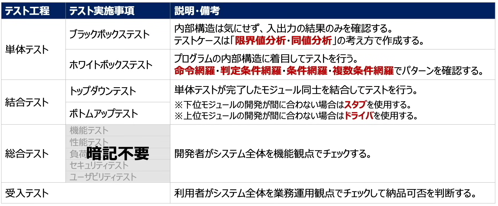

************************************************************

### 📖システム開発の流れ
* 企業がシステムを開発する際、通常は`Sier`等のシステム`開発会社`に依頼する
    * `ユーザー企業`との間は`ベンダ企業`、`共通フレーム`を使ってシステムを開発する
* 共通フレーム
    * 日本国内のユーザー、ベンダー、学識経験者が共同で策定した、国内版SLCPの共通フレームである
    * 企業で将来的に必要となる最上位の業務機能と業務組織を表した業務の全体像

    1. 【`ユーザーのみ`で実施】`企画`プロセス：ニーズや課題を確認し、（システム化構想）具体的な計画を立てる（システム化計画）、`RFIとRFPを実施して、ベンダ企業を選定する`
        * 事業の目的、目標を達成するために必要なシステムに関係する要求事項の集合とシステム化の方針、及びシステムを実現するための実施計画を得ること
        * 経営・事業の目的、目標を達成するために必要なシステムに関係する経営上のニーズ、システム化、システム改善を必要とする業務上の課題などの要求事項

    2. `要件定義`プロセス：詳細機能、仕様を明確する
        * 業務手順やコンピューター入出力情報など`実現すべき要件`
        * システムの仕様を明確し、それを基にIT化は二とその機能を明示すること
        * `業務要件の定義`：新しい業務のあり方や運用をまとめたうえで、業務上実現すべき要件を明らかにすること
            * 新しい業務のあり方や業務手順、入出力手順、業務を実施する上での責任と権限、業務上のルールや制約などの要求事項
        * `機能要件/非機能要件の定義`：業務要件を実現するために必要なシステムの機能や、システムの開発方法、システムの運用手順、障害復旧時間などの要求事項
            
    3. `開発`プロセス：要件をもとに設計、開発する
        * 必要なハードウェアやソフトウェアを記述した`最上位レベルのシステム方式`
        * `システム要件定義`：システムに関する要件にについて技術的に可能でえあるかどうかを検証し、システム設計が可能な技術要件に変換する
        * システムを構成するソフトウェアの機能及び、能力、動作のための環境条件、外部インターフェース、運用及び保守の方法などの要求事項
    4. `運用`プロセス：システムを運用する
        * 日次や月次で行う利用者業務やコンピューター入出力作業の業務手順
    5. `保守`プロセス：問題点の修正などメンテナンスを行う

  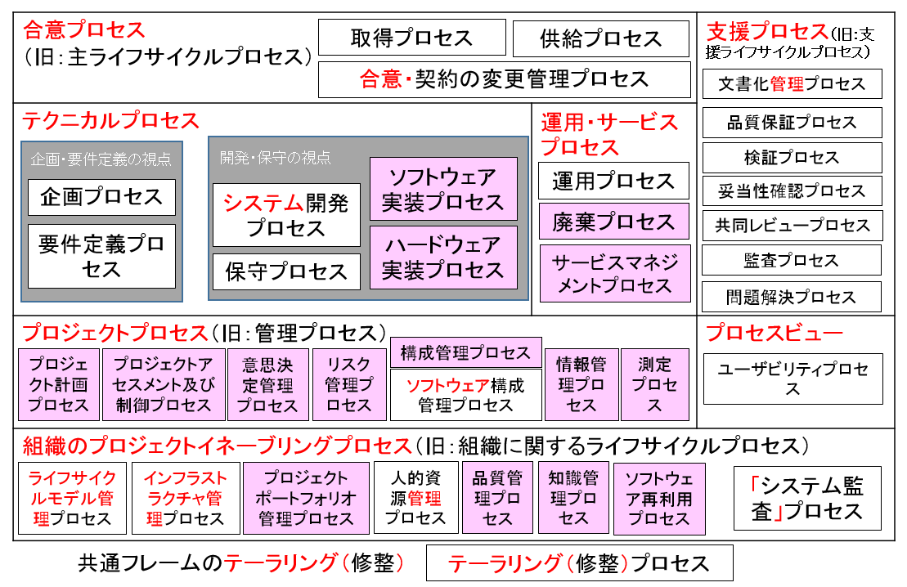

* 企画プロセス
    * RFI（Request For Information）：`情報提供依頼書`。一般的な情報の提供を求める（=一次審査）
        * ベンダ企業：サービスや製品の情報提供（開発するのにふさわしいのかの判断材料）
    * RFP（Request For Proposal）：`提案依頼書`。個別の`具体的な`提案を求める（=二次審査）
        * ベンダ企業：システム開発のスケジュール、導入計画、見積書
    * 審査通るとベンダ選定契約締結

  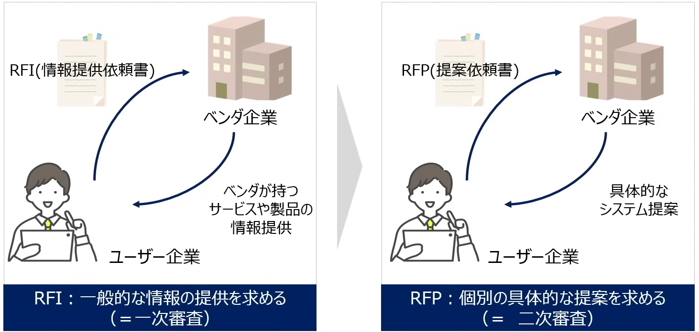

* 要件定義プロセス
    * システム化の企画に基づいて、システムで実現すべき業務、その業務を実現するためにシステムに必要な機能、システムにもtめられる性能や特性を明らかにし、`利用関係者`と合意するプロセス
        * `利用関係者`：利用者、運用者、支援者、開発者、製作者、教育訓練者、保守者、取得者など

    * V字モデル、`設計工程`と`テスト工程`が紐づいている
    * おさらい：
        1. 最初に要件を`定義`する
        2. システムを作る`設計`をする
        3. `コーディング`を行う
        4. 細かい単位で`テスト`
        5. システム全体のテスト
        6. 納品のチェック
    * 下記工程の終わりに`レビュー`を実施して、設計不備や誤りを早期に発見する

    * 要件定義：必要とする機能や要求を定義
        * 機能要件：ユーザーが求めている機能
        * 非機能要件：機能以外の要件（性能、セキュリティ、保守サービス、制約条件、品質要求など）

    * 外部設計（基本設計）：定義された要件をシステムで実現する方法を整理してプログラマーがシステムを作るための`具体的な計画書`を作成する
        * システム利用者に影響する部分を設計（`画面レイアウト`等）
    * 内部設計（詳細設計）：システム開発に影響する部分を設計（システム内のデータベース構造など）

    * コーディング：プログラムを書く

    * 単体・結合テスト：システムが正常に稼働するのか機能ごとにチェックしていく
        * 単体：一つの機能だけをテストする
        * 結合：複数の機能を組み合わせてテストする
    * 総合テスト（システムテスト）：本番運用を想定して、システム全体の動作検証を行う（ネットワークを使用する、他システムとの連携などをチェックする）
    * 受け入れテスト（UAT：User Acceptance Test）：ユーザーの要求通りに完成しているか検証する
        * ユーザー受け入れテストは、ユーザー及び運用担当者など開発当事者以外の者が参加しなくてはならない
        * ユーザー受け入れテストの結果はプロジェクト運営委員会により承認されるべきとしている

    * トレーサビリティ、Traceability
        * 製品やサービスのライフサイクルにおいて、現在の状態に至るまでのプロセスや変更の履歴を追跡できる能力のこと
        * 履歴を整えておくことで、その物品に関心を持つ人が過去の履歴を追跡したり、物品に問題がある場合に購入した顧客を特定したりといったことが可能となる
        * 元は流通業界から生まれた言葉で、対象とする物品およびその部品や原材料の流通履歴を確認できる状態にあることを言う
        * いつ・誰が・何をしたかの記録を積み重ねることによって、変更要求から実装までの経過を遡って追跡することが可能になり、問題が起こった場合に、どこに減人

  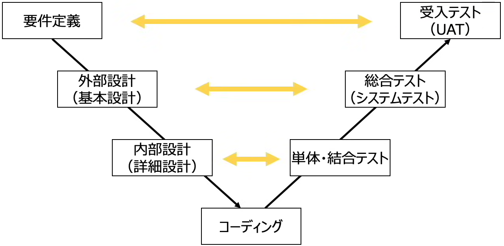
  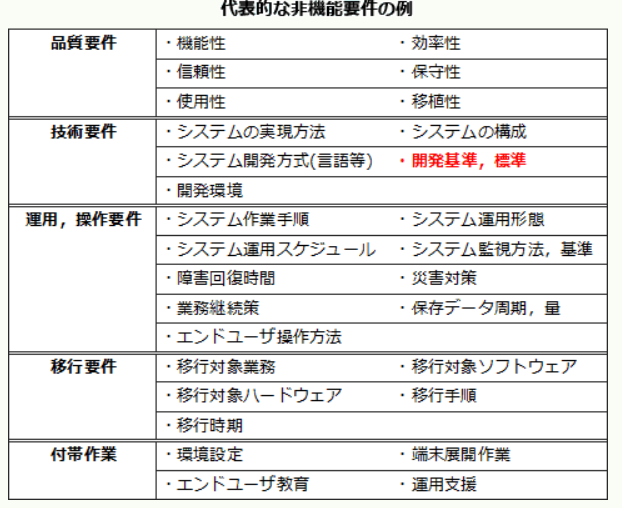

* 情報戦略における全体最適化計画策定
    1. ITガバナンスの方針を明確にすること
    2. 情報化投資及び情報化構想の決定における原則を定めること
    3. 情報システム全体の再轢過目標を経営戦略に基づいて設定すること
    4. 組織全体の情報システムのあるべき姿を明確にすること
    5. システム化によって生ずる組織及び業務の変更の方針を明確にすること
    6. 情報セキュリティ基本方針を明確にすること

* `レビュー`：工程ごとに成果物の検証を行う
    * ウォークスルー（Walk Through）：担当者が関係者に対して成果物の内容を説明する
    * インスペクション（Inspection）：`モデレーターが司会進行役`となり、参加者の役割を明確にして進める
    * ラウンドロビン（Round Robin）：参加者全員がテーマごとに持ち回りで責任者となり進める

  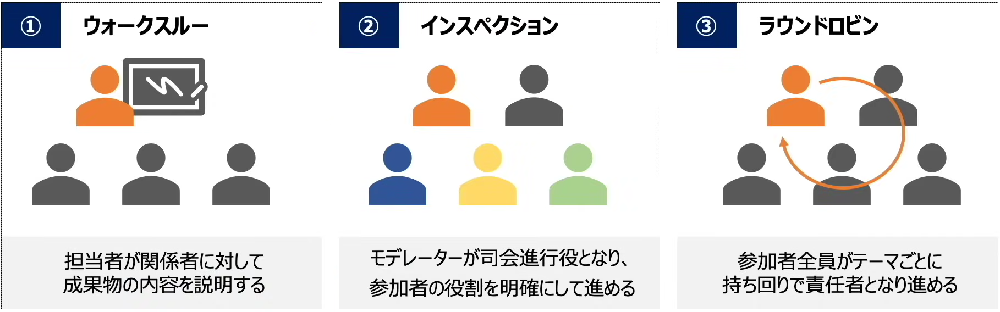

* EA(Enterprise Architecture、エンタープライズアーキテクチャ)：一つ一つのシステムを最適化するのではなく、`企業全体で見た時の最適化`を目指す
    * As-Is：現状モデル
    * To-Be：理想モデル

    * `ビジネス`アーキテクチャ
        * 企業の戦略実現に必要な業務内、業務プロセス等
        * `政策・業務の内容、実施主体、業務フロー`等について、共通化・合理化など実現すべき姿を体系的に示したもの
        * ビジネス戦略に必要な業務プロセスや情報の流れを体系的に示したもの
        * 業務説明書、機能構成図（DMM）、機能情報関連図（DFD）、業務フロー

    * `データ`アーキテクチャ
        * 業務を行う上で必要なデータ、データの関連性
        * 各業務・システムにおいて利用される情報すなわち`システム上のデータの内容、各情報（データ）間の関連性`を体系的に示したもの
        * 業務に必要なデータの内容ｍデータ間の関連や構造などを体系的に示したもの
        * 情報体系クラス図、エンティティ・リレーション図、データ定義表

    * `アプリケーション`アーキテクチャ
        * データを処理する`情報システム`の機能
        * 業務処理に`最適な情報システムの形態`を体系的に示したもの
        * 業務プロセスを支援するシステムの機能や構成などを体系的に示したもの
        * 情報システム関連図、情報システム機能構成図

    * `テクノロジー`アーキテクチャ
        * `システムの構築に必要な技術`的構成要素
        * 実際にシステムを構築する際に利用するもろもろの技術的構成要素（ハード、ソフト、ネットワーク等）を体系的に示したもの
        * 情報システムの構築・運用に必要な技術的構成要素を体系的に示したもの
        * ネットワーク構成図、ソフトウェア構成図、ハードウェア構成図

  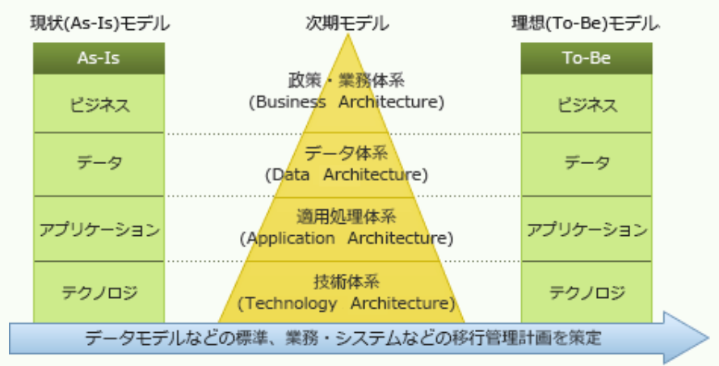

************************************************************

### 📖システム開発手法
* `ウォーターフォール`：`上流から下流へ`順番に工程を進める
    * 要件定義・設計・開発・テストなどの工程を上流工程から下流工程へ順番に進めていく手法
    * 全体スケジュールが立てやすく、計画通りに開発を進めやすい
    * 途中の仕様変更を取り入れにくい。不具合が発生すると、後戻りが難しい
    * 活躍：仕様変更の少ない大規模のシステム開発

* `アジャイル`（機敏な、素早い）：`短い開発サイクル`を回す
    * 小さな機能単位ごとに開発サイクルを回し、機能ごとにリリースし段階的にシステム全体を完成させる
    * 開発期間が短い。使用変更に柔軟に対応できる
    * 全体スケジュールが立てにくく、進捗が把握しづらい、開発の方法性がずれやすい
    * 活躍：要件の全体像が固まっていない小規模のシステム開発

    * XP、エクストリームプログラミング（eXtreme Programing）
        * アジャイル開発手法の一つで、顧客の要望を取り入れながら柔軟に開発を進める
        * 設計・開発・テスト・改善のサイクル（=イテレーション）を繰り返して開発する
        * 開発時の習慣的な手法`5つの価値`と`19のプラクティス`が定められている
            * 以下にて代表的のプラクティスを紹介する
            1. `ペアプログラミング`
                * `コードを書く人`（ドライバー）と`コードをチェックする人`（ナビゲーター）の役割に分担して、`2人1組`でプログラミングを行う
            2. `リファクタリング`
                * 外部からの挙動は変えずに、`プログラムの内部構造を変更`する
                * 理解しやすくにする（単純化）、バグ特定しやすくにするなど
            3. `テスト駆動開発`
                * プログラム実装前に`先にテストコードを書いて`、そのテストを通るようにコードを書く

    * `スクラム`
        * アジャイル開発手法の一つで、開発チームが一体となり短期間で開発を進める
        * `スプリント`と呼ばれる任意から4週間程度の短い開発サイクルを回す

  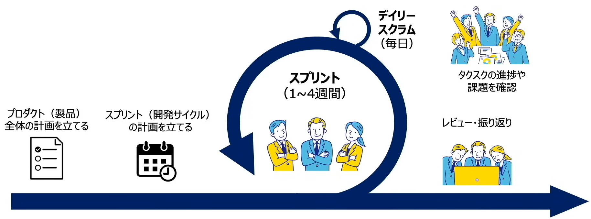

* `プロトタイピングモデル`：`試作品を作成`し、利用者がチェックを行いながら進める
    * 開発の早い段階で試作品（プロトタイプ）を作り、利用者の確認を取りながら開発を進めていく手法
    * `要件定義`で利用者の要望を聞き、システムの仕様を決めた後、見かけ上は完成品と同じである試作品を作成し、完成イメージを確認し、すりあうまで試作品を作り直す
    * 利用者との認識のズレが発生する可能性が低く、手戻りになりにくい
    * プロトタイプを作るのにコストがかかる

* `リバースエンジニアリング`：`開発工程を遡り`、設計書を取り出す
    * 既存の製品・プログラムを解析して、その仕組みや仕様、設計を明らかにする開発手法
    * 開発にかかるコストと時間を削減できる
    * 特許権や著作権の侵害に当たる可能性がある

************************************************************

### 📖業務モデリングとユーザーインターフェース
* 業務モデリング
    * `要件定義`を行う前にはユーザー業務の`ヒアリング`を行う
    * ヒアリングした業務プロセス等業務モデルとして図式化（クラス図、シーケンス図、アクティビティ図）する
    
    * 代表的な業務モデリング
        * `E-R図`：`データベース設計`で使用され、実体（対象業務を構成するモノ）と実体の関連をモデル化したもの
        * `DFD`：システムにおける`データの流れ`をモデル化したもの
        * `UML`：`オブジェクト指向`のシステム開発で使用され、分析から設計、実装まで一貫した表記方法でモデル化したもの

* `E-R図`
    * Entity-Relationship Diagram
    * エンティティ：（Entity）実体（`データテーブルの`ことを指す）
    * リレーションシップ：（Relationship）関連
    * データテーブルの関係性をモデル化したもの
    * データベース設計で使用され、`実体と実体`（対象業務を構成するモノ）の関連をモデル化したもの

    * リレーションシップは4種類の関連があり、矢印の有無や矢印の向きで表現される

  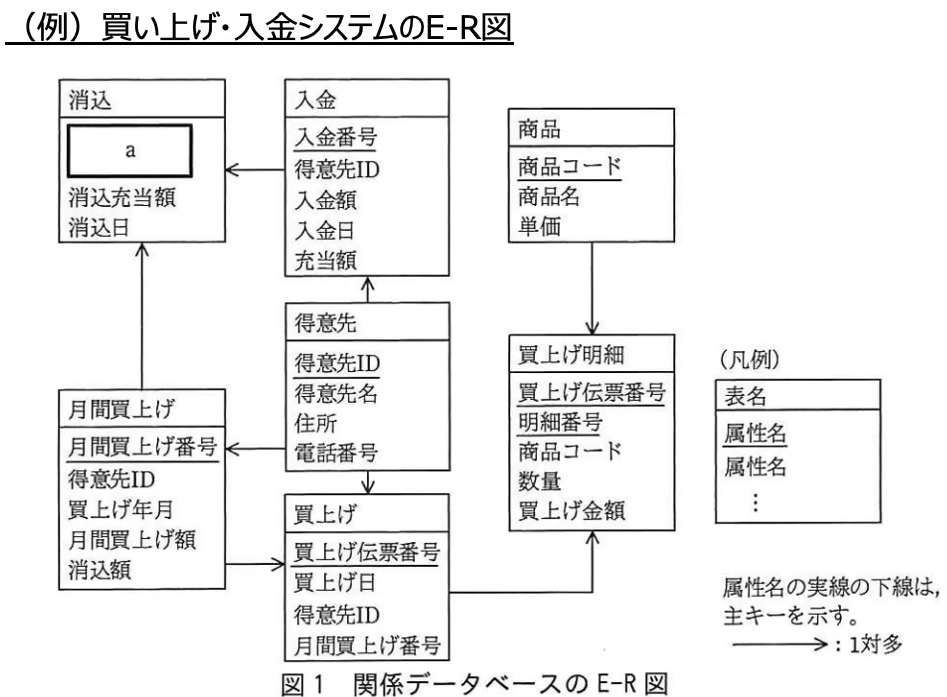
  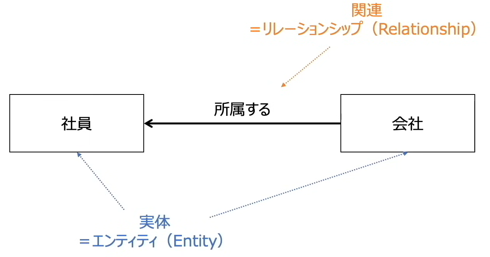
  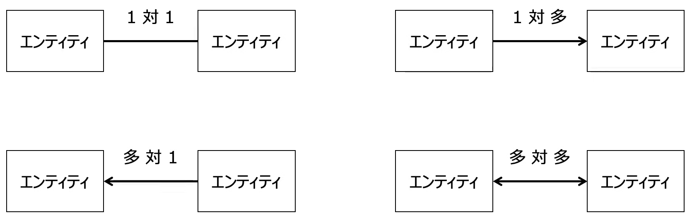

* `DFD`
    * Data Flow Diagram
    * システムにおける`データの流れ`をモデル化したもの
    * 4つの記号で記述する
        * データストア：データテーブル

  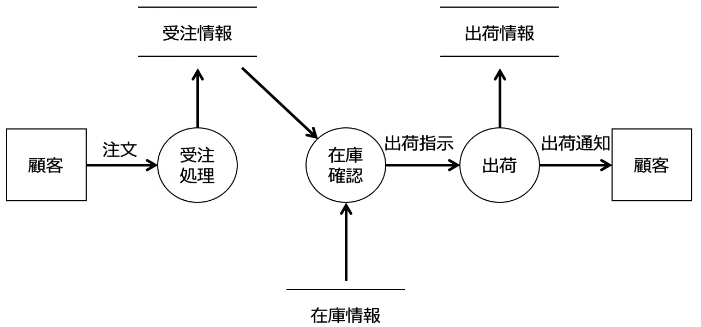
  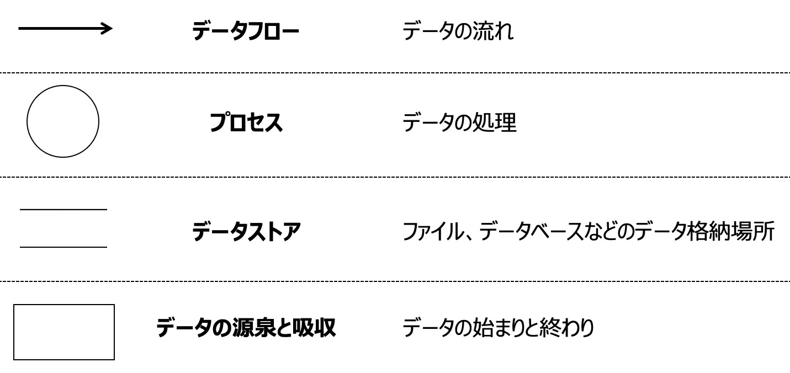

* ユーザーインターフェース（UI）
    * ユーザーとコンピューターの接点となるもの。ユーザーとコンピューター間で情報をやり取りする機械や入力装置
    * 外部設計の1つであり`インターフェース設計`と呼ばれる

    * インターフェース設計
        * `画面設計`と`帳票設計`がある
        * `画面設計`：画面の項目やレイアウトなど、データを入力する際の操作方法を設計
            * 入力順序が画面の左上から右下へ流れていくように配置
            * 操作ボタンの形や表示位置を同じにする
            * 色に同一性を保つなど
        * `帳票設計`：帳簿や伝票などのレイアウト、プリンターに出力する内容などを設計
            * 関連項目を近くに配置し、余分な情報を除いて必要
            * 最小限の情報を盛り込むなど

    * 画面を操作するもの
        * `GUI`
            * Graphical User Interface、グラフィカルユーザーインターフェース
            * 画面上のアイコンやボタンなどを`マウス操作する視覚的`インターフェース
            * ラジオボタン：排他的な項目から1つを選択
            * チェックボックス：それぞれの項目で選択する/しないを指定
            * プルダウンメニュー：一覧形式のメニューから選択
        * `CUI`
            * Character User Interface、キャラクターユーザーインターフェース
            * `キーボードによる文字入力`を用いたインターフェース
            * `画像やアイコンを使わず`文字だけで操作し、`テキストデータのみ`で表現される
            * Windowsのコマンドプロンプト
            * MacOSのターミナル

************************************************************

### 📖モジュール分割
* モジュール
    * システムや機器を構成する、1つの機能や要素（=部品）
* モジュール分割
    * `内部設計`の段階で行う
    * システム全体をモジュール単位で分割を行い、モジュール単位で開発・テストを行っていく
    * メリット
        * 複数人で`並行して作業`を進めることができる
        * 共通する機能を他のところでも`再利用できる`
        * プログラムに問題が起こった場合、`一部の修正で解決`

    * モジュールの独立性
        * 独立性とは他モジュールとの関係度合のことであり、独立性が高いとシステムとメンテナンスが行いやすい
        * モジュールの独立性が高いと、あるモジュールを変更しても、`他のモジュールへの影響が少ない`
        * 設計をする際、モジュール分割をする際は`独立性が高くなる`ように設計することが大切
        * モジュールを表す指標：`モジュール結合度`と`モジュール強度`

* `モジュール結合度`
    * モジュール同士の`関連性の強さ`を表す
    * `モジュール結合度が弱い方`が、`モジュールの独立性が高く`なり、システムメンテナンスしやすい

    1. `データ結合`：処理に`必要なデータだけ`を引数として渡す
    2. スタンプ結合：データ構造（データのまとまり）を引数として渡す
    3. 制御結合：モジュールの実行順序を制御するデータ（制御パラメータ）を引数として渡す
    4. 外部結合：外部宣言されたデータを参照する
    5. 共通結合：外部宣言されたデータ構造（データのかたまり）を参照する
    6. `内容結合`：`他のモジュール内のデータ`を参照する

  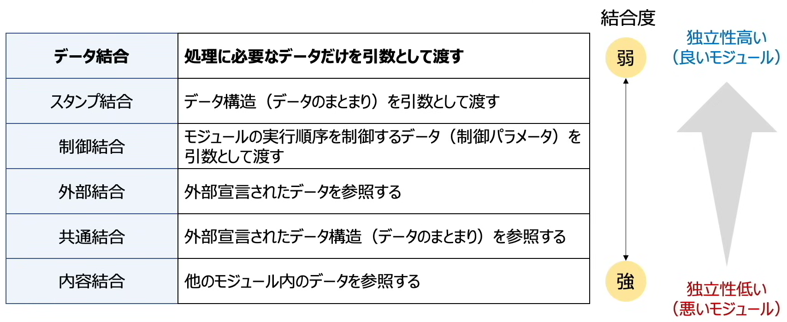

* `モジュール強度`
    * モジュール内部の関連性の強さを表す
    * `モジュール強度が強い`方が、`モジュールの独立性が高く`なり、システムメンテナンスがしやすい
    * `1つのモジュールが1つの機能に洗練（強化）されているか`

    1. `機能的強度`：一つの機能のみを持つモジュール
    2. 情報強度：同じデータを使う複数の機能をまとめたモジュール
    3. 連絡的強度：データの受け渡し・参照をしながら、順番に実行される複数の機能をまとめたモジュール
    4. 手順的強度：順番に実行される複数の機能をまとめたモジュール
    5. 時間的強度：ある特定の時点（プログラムの開始時など）で実行する機能をまとめたモジュール
    6. 論理的強度：関連する複数の機能をまとめたモジュール
    7. `暗号強度`：関係のない機能をまとめたモジュール

  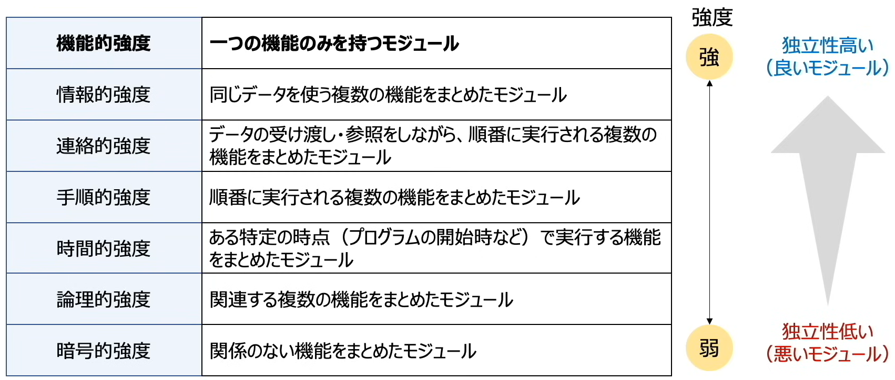
  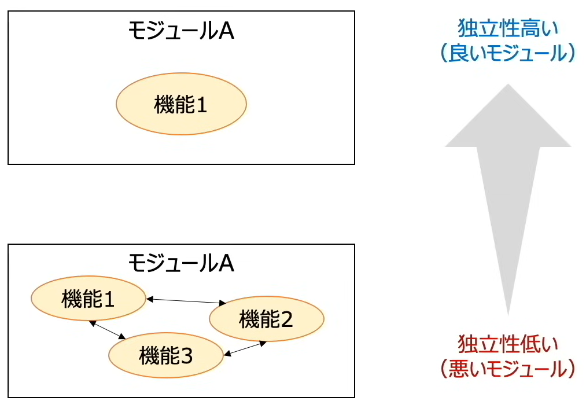

************************************************************

### 📖テスト手法
* テストとバグの関係
    * テストを行う目的は、プログラムのバグを発見し修正すること
    * `信頼度成長曲線`や`バグ管理図`を見ることで、テストの進捗や品質を確認する
    * `信頼度成長曲線`：累積バグ件数が緩やかに増えていって`S字のような曲線`になることが理想的
    * `バグ管理図`：
        * `バグ検出数`：日々検出されるため、`緩やかなグラフ`になるのが理想的
        * `未消化テスト項目数`：日々消化していくため、`右肩下がりのグラフ`になるのが理想的
        * `未解決バグ数`：　テストの進捗、バグの修正状況により増減するが、`減少するのが理想的`

  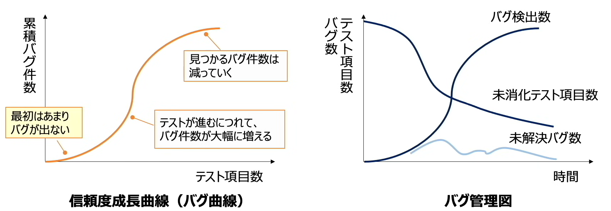

* テスト工程
    * 単体・結合テスト：プログラムを構成する機能単位でテストする

* 単体テスト：定義した`機能要件を満たすかどうか`、`モジュール単位`でテストする
    * ブラックボックステスト：プログラムの`中身を見ない`（入力と出力に着目）
        * テストケースを作成する考え方として`限界値分析`と`同値分割`がある
        * `限界値分析`：有効値と無効値の`境界の値`をテストする
        * `同値分割`：有効値と無効値のグループの中で、それぞれの`代表的な値`をテストする
    * ホワイトボックステスト：プログラムの`中身に着目`
        * 網羅するために4パターンのテストケースがある
        * `命令網羅`：`すべての命令`を、必ず1度は確認する。`フローチャートの図形を全部通る`
        * `判定条件網羅（分析網羅）`：`すべての分岐`を、少なくとも1度は確認する。`フローチャートの線を全部通る`
        * `条件網羅`：各条件式の`YES/NO`の組み合わせを、少なくとも1度は確認する(1+0/0+1もしくは1+1/0+0のように条件式でのテストだけで大丈夫)
        * `複数条件網羅`：各条件式のYes/Noの組み合わせを、全て確認する（1+1/1+0/0+1/0+0）

  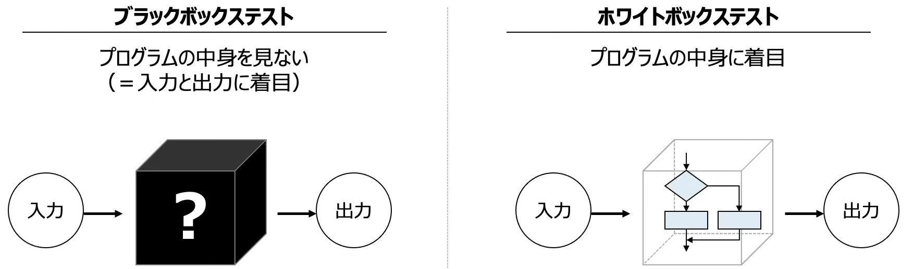

* 結合テスト
    * 単体テストが完了したモジュール同士を結合して行う
        * `トップ`ダウンテスト：`上⇒下`に順番に結合
        * `ボトム`アップテスト：`下⇒上`に順番に結合
        * 結合する際、まだ用意できていないモジュール（テスト中など）がある場合、ダミーデータ`スタブ`（`トップ`ダウンテスト）もしくはダミーデータ`ドライバー`（`ボトム`アップテスト）をモジュールとして用意する

  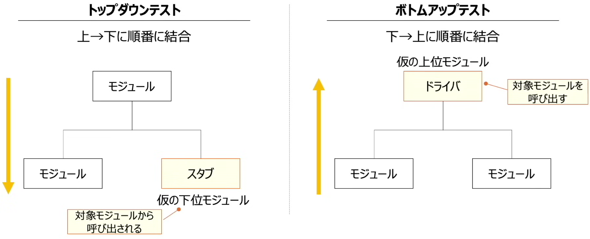

* 総合テスト
    * `本番んとほぼ同じ環境`で、`開発者`がシステム全体の動作検証を行う（システム全体をセキュリティや周辺環境まで含め機能観点でチェックする）

    * 代表的なテストの種類：
    * 機能テスト：必要な機能が全て含まれており、要件通りに動作するか確認する
    * 性能テスト：システムの`処理速度`など`パフォーマンス`を確認する
    * 負荷テスト：システムに大きな負荷をかけ、`負荷がかかった状態でも`正常に動作するか確認する
    * セキュリティテスト：シ`ステムが攻撃されても`、要件通りセキュリティを保持できるかを確認する
    * ユーザビリティテスト：操作がしやすいか、画面が見やすいかなどユーザーにとって`使いやすいかどうか`を確認する

* `受け入れテスト`：本番とほぼ同じ環境で、ユーザーの要求通りに完成しているか`ユーザーが`テストを行う（システム全体を業務運用観点でチェックして納品できるか判断）

  

* リグレッションテスト（回帰テスト）
    * テストで不具合を見つけたらプログラムを修正するが、その`修正により、別の部分に不具合が生じる可能性`がある
    * 各テスト工程での回収後や、リリース直前、`運用保守`（システムを使い続けるための管理）のタイミングで行われる
