▶マネジメント分野
* [1. プロジェクトマネジメントとは](#プロジェクトマネジメントとは)
    * [統合管理](#統合管理)
    * [スコープ管理](#スコープ管理)
    * [スケジュール管理](#スケジュール管理)
    * [コスト管理](#コスト管理)
    * [品質管理](#品質管理)
    * [資源管理](#資源管理)
    * [コミュニケーション管理](#コミュニケーション管理)
    * [リスク管理](#リスク管理)
    * [調達管理](#調達管理)
    * [ステークホルダー管理](#ステークホルダー管理)
* [2. コスト管理とスケジュール管理](#コスト管理とスケジュール管理)
* [3. itサービスマネジメント](#itサービスマネジメント)
* [4. システム監査](#システム監査)

* 用語集

|用語|フルネーム|意味|
| --- | --- | --- |
|プロジェクト|-|決められた`期限内`で、`特定の目的`を達成する活動 タスクの進捗管理 遅延リスクの管理 予算や人員体制の計画|
|フィージビリティスタディ|Feasibility Study|Feasibility = 実現可能性 プロジェクト`開始前に実施する` 新しいプロジェクトなどの計画に対して、その実行可能性を評価するために調査・検証すること 投資対効果・スケジュール確認・マーケット調査・業界動向|
|PMBOK|Project Management Body Of Knowledge|プロジェクトマネジメントに関する知識を体系的にまとめたもの（プロジェクトマネジメントの世界標準） `5つのプロセス`と`10個の知識エリア`で整理|
|`5つのプロセス`|-|1. 立ち上げ 2. 計画（Plan） 3. 実行（Do） 4. 監視・コントロール（Check・Action） 5. 終結 ※ 2.計画+3.実行+4.監視・コントロール　⇒　`PDCAサイクル`|
|`10個の知識エリア`|-|1. 統合管理 2. スコープ管理 3. スケジュール管理 4. コスト管理 5. 品質管理 6. 資源管理 7. コミュニケーション管理 8. リスク管理 9. 調達管理 10. ステークホルダー管理 |
|統合管理|-|他の9つの知識を取りまとめて、全体をマネジメントする|
|スコープ管理|-|（スコープ＝作業範囲）プロジェクトの`作業範囲`を決め、`成果物`と`タスク`を定義する 管理する手法：WBS|
|`WBS`|Work Breakdown Structure|`作業分解構造図`|
|スケジュール管理|-|納期を守るために、作業スケジュールや日程を細かく管理する 管理する手法：`ガントチャート`と`アローダイアグラム`|
|`ガントチャート`|-|プロジェクトの進捗を管理するためのスケジュール表 各タスクの進捗状況、全体の計画が一目でわかる|
|`アローダイアグラム`|-|`作業の順序`や`所要時間`などの情報を組み合わせて、プロジェクト全体の流れを図示する 使用する概念：`最早結合点時刻`、`最遅結合点時刻`、`クリティカルパス`|
|コスト管理|-|プロジェクトにかかる`費用の見積もり`、予算内におさめるよう管理する 管理する手法：`ファンクションポイント法`、類推見積法、プログラムステップ法、COCOMO法|
|`ファンクションポイント法`|FP|`画面数`・`帳票数`・`ファイル数`などを基準に、`機能の難易度`を定義して見積もる 算出された点数は`ファクションポイント値`と呼ぶ|
|類推見積法|-|`過去の類似プロジェクト`の`実績値`を参考に見積もる|
|プログラムステップ法|-|`LOC法`（Lines of Code）とも呼ばれ、プロジェクトの`ステップ数`（行数）を基に見積もる|
|COCOMO法|-|LOC法を基に、`開発スキル`や`難易度`などを考慮して見積もる|
|品質管理|-|プロセスの`成果物の品質`を管理する|
|資源管理|-|プロジェクトに`必要な人材`、`物的資源`を管理する|
|コミュニケーション管理|-|ステークホルダー = 株主・経営者・顧客・取引先などの利害関係者 `チームメンバー`、`ステークホルダー`との情報交換を管理する|
|リスク管理|-|プロジェクトで`発生する可能性があるリスク`を管理する|
|調達管理|-|プロジェクトに`必要なサービス`や`製品の調達`や`契約`を管理する|
|ステークホルダー管理|-|`ステークホルダーとの関係`を管理する|
|開発工数|-|工数とは、ある作業を完了するまでに必要な時間|
|人月（にんげつ）|-|1人が`1カ月`でこなすことができる作業量（人日、人時などもある）|
|インシデント問い合わせ|Incident|ITサービスに関するトラブル、インシデントの問い合わせ|
|インシデント管理|-|インシデントの根本下人を特定し、再発を防止する|
|`エスカレーション`|-|サービスデスクで解決できなかった場合、専門知識のある担当者に解決依頼をする|
|変更管理|-|ITサービスの変更が必要と判断された場合、変更に伴う`影響を検証・評価`し、`承認`または`却下`を行う|
|構成管理|-|変更管理を行う際は、`構成管理DB`（ITサービスの提供に必要な情報を保存されている）を使用し、ITサービスの提供に必要な情報を正しく把握し、効果的な情報を提供する|
|リリース管理|-|変更管理で承認された変更内容を、適切な時期に`本番環境に適用`（リリース）する |
|サービス要求|-|利用者からの質問（要求）|
|`SLA`|Service Level Agreement|サービス品質保証/合意書 サービスレベル管理|
|可用性管理|-|サ－ビスを利用したい時に確実に利用できるように、個々の機能を維持管理|
|キャパシティ管理|-|ITサービスの`提供に必要なネットワーク`や`システム`などの`容量・能力`を管理|
|システム監査|-|監査対象からは独立した立場（第三者の立場）となる、`システム監査人`が行う 情報システムを`信頼性`、`安全性`、`効率性`などの観点で評価し、`問題点を指摘`したり`改善策を助言`する|
|`監査対象部門`（被監査部門）|-|実際にシステムを運営している部門|
|`監査依頼人`|-|その会社の経営者|
|`システム監査人`|-|対象部門と関係がない第三者|
|`監査計画の作成`|-|依頼人の意向や経営課題を調査して目的・対象を明らかにしたうえで計画を立案する 監査内容、監査時期、監査を行う範囲を立案する|
|`監査実施`|-|監査計画を基に`予備調査`・`本調査`を行い、`入手した監査証拠に基づいて`評価する 予備調査：アンケート調査などを行い監査対象の概要を把握する 本調査：インタビュー・現地調査を行い監査証拠を入手する|
|`フォローアップ`|-|監査対象部門による改善の実施状況をモニタリングし、システム監査人の立場で`改善の実現を支援`する|
|独立性を担保することが重要|-|`物理的`および`精神的`に独立した人が監査する 1. `外観上の独立性`: 監査対象と利害関係にならないように、`独立した部署・組織`でなくてはならない 2. `精神上の独立性` 監査の実施にあたり、客観的な視点から`公正な判断`を行われなければならない|
|コーポレートガバナンスと内部統制|-|`企業が不祥事や法令違反`などを起こさず、健全な経営を行うために作られたルール・仕組み `上場会社`においては、`内部統制の整備・運用が義務付けら`れている|
|`コーポレートガバナンス`|Corporate Governance|企業統治 `経営者`が不正を行わないように、`株主や監査役や企業経営`そのものを監視・監視する仕組み|
|内部統制|-|`従業員`が不正を行わないように、`経営者`が企業内を管理する仕組み|
|`アカウンタビリティ`|Accountability|説明責任 広く会社に影響をもちうる活動を行う団体は、その利害関係者に対して、その活動や権限行使の予定、内容、結果などの報告をする必要がある|

************************************************************

### 📖プロジェクトマネジメントとは
* プロジェクト
    * 決められた`期限内`で、`特定の目的`を達成する活動
    * プロジェクトを成功させるため、どのように遂行すればいいか計画を立て、コントロールしていく
        * タスクの進捗管理
        * 遅延リスクの管理
        * 予算や人員体制の計画

* フィージビリティスタディ
    * Feasibility Study
    * Feasibility = 実現可能性
    * プロジェクト`開始前に実施する`
    * 新しいプロジェクトなどの計画に対して、その実行可能性を評価するために調査・検証すること
        * 投資対効果
        * スケジュール確認
        * マーケット調査
        * 業界動向

* `PMBOK`
    * Project Management Body Of Knowledge
    * プロジェクトマネジメントに関する知識を体系的にまとめたもの（プロジェクトマネジメントの世界標準）
    * `5つのプロセス`と`10個の知識エリア`で整理

  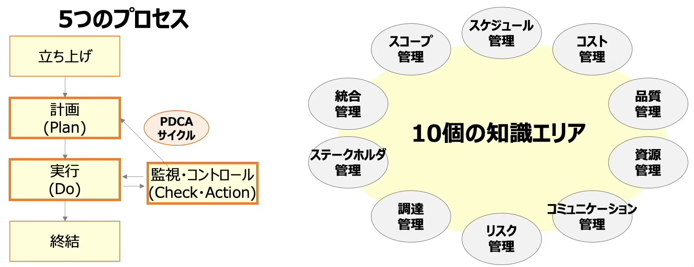

* `5つのプロセス`
    1. 立ち上げ
    2. 計画（Plan）
    3. 実行（Do）
    4. 監視・コントロール（Check・Action）
    5. 終結

    * 2.計画+3.実行+4.監視・コントロール　⇒　`PDCAサイクル`

#### 統合管理
* 他の9つの知識を取りまとめて、全体をマネジメントする

#### スコープ管理
* （スコープ＝作業範囲）プロジェクトの`作業範囲`を決め、`成果物`と`タスク`を定義する
* 管理する手法：WBS
* Work Breakdown Structure、`作業分解構造図`
* プロジェクトで行う作業を階層的に分解する

  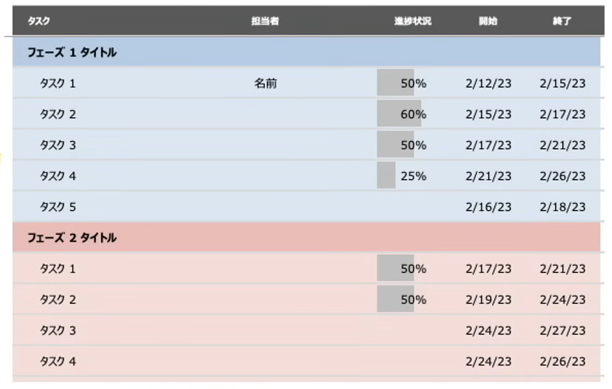

#### スケジュール管理
* 納期を守るために、作業スケジュールや日程を細かく管理する
* `ガントチャート`
    * プロジェクトの進捗を管理するためのスケジュール表
    * 各タスクの進捗状況、全体の計画が一目でわかる

  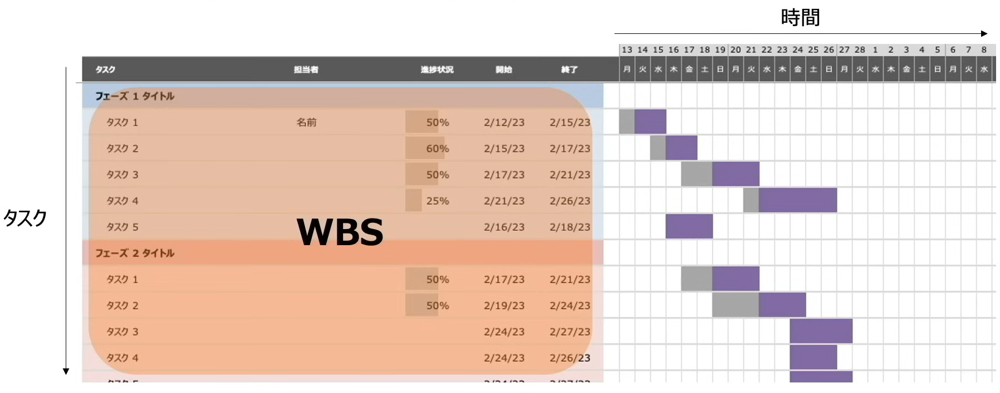

* レーダーチャート
    * 円状または正多角形状に配置されるため、`クモの巣グラフ`とも呼ばれる
    * 複数の項目に対応する放射状の各軸上に、基準値に対する度合をプロットし、各点を結んで全体のバランスを比較する

  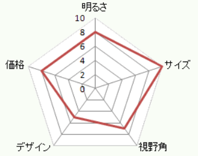

* `アローダイアグラム`
    * `作業の順序`や`所要時間`などの情報を組み合わせて、プロジェクト全体の流れを図示する
    * `最早結合点時刻`：最も早く作業が開始できる結合点
        * スタート地点で`0`から出発
        * 複数のルートを含めた結合点は、日数が`大きい`ほうのルートを取る

    * `最遅結合点時刻`：
        * 少なくともこの日までには作業を開始そなければ間に合わない日（`タイムリミット`）
        * ゴール地点からで`最早結合点時刻`から出発
        * 複数のルートを含めた結合点は、日数が`小さい`ほうのルートを取る

    * `最早結合点時刻`と`最遅結合点時刻`は、スタート時点は必ずどちらも0で、ゴール地点は必ず同じ値になる
    * `最早結合点時刻` > `最遅結合点時刻` = `日数差`日も作業が`遅れても問題ない`ライン
    
    * `クリティカルパス`：作業日数の一番長い経路（余裕のない経路）
        * 求め方：`最早結合点時刻`と`最遅結合点時刻`が等しい作業を結んだ経路が`クリティカルパス`（作業が遅れると全体遅延に繋がる）

  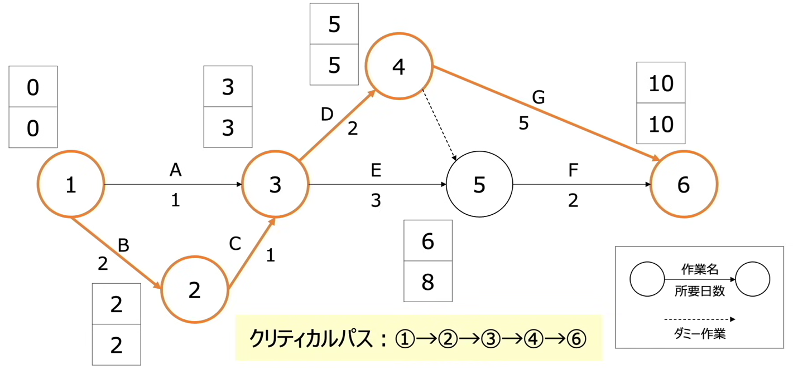

#### コスト管理
* プロジェクトにかかる`費用の見積もり`、予算内におさめるよう管理する
* `ファンクションポイント法`（FP）
    * `画面数`・`帳票数`・`ファイル数`などを基準に、`機能の難易度`を定義して見積もる

    * `機能の数`と`各機能の難易度`を基に開発コストを見積もる
    * `機能の難易度`に対してポイントを付与してその`ポイントと機能の数`を掛け合わせて全体点数を算出する
    * 算出された点数は`ファクションポイント値`と呼ぶ

  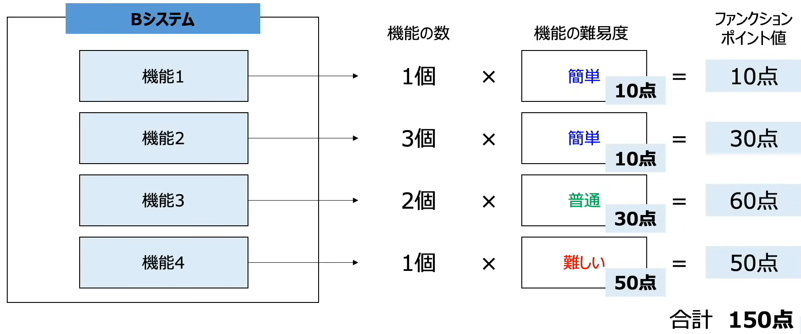

* 類推見積法
    * `過去の類似プロジェクト`の`実績値`を参考に見積もる
* プログラムステップ法
    * `LOC法`（Lines of Code）とも呼ばれ、プロジェクトの`ステップ数`（行数）を基に見積もる
* COCOMO法
    * LOC法を基に、`開発スキル`や`難易度`などを考慮して見積もる

#### 品質管理
* プロセスの`成果物の品質`を管理する

#### 資源管理
* プロジェクトに`必要な人材`、`物的資源`を管理する

#### コミュニケーション管理
* `チームメンバー`、`ステークホルダー`との情報交換を管理する
    * ステークホルダー = 株主・経営者・顧客・取引先などの利害関係者

#### リスク管理
* プロジェクトで`発生する可能性があるリスク`を管理する
    * 許容できるリスクを取って、機会損失しないようにコントロールすることも大事

* リスクへの対応戦略
    * 回避：リスクそのものを取り除いたり、プロジェクトに影響がないようにスコープや目標を縮小・変更したりする戦略
    * 転嫁：リスクによるマイナスの影響を第三者へ移転する戦略。リスクのある業務・作業のアウトソーシングや損害保険契約によってリスクの影響を自社から他社に移転する
    * 軽減：リスクの影響範囲を狭くしたり、発生確率を低減したりするような戦略
    * 受容：リスクが現実化した時の影響が許容可能範囲内である時やリスクの除去が困難である場合に、特段対策をせずにそのままにしておく戦略。対策費用が予想される損失金額を上回っているときなどに採られる

#### 調達管理
* プロジェクトに`必要なサービス`や`製品の調達`や`契約`を管理する

#### ステークホルダー管理
* `ステークホルダーとの関係`を管理する

************************************************************

### 📖コスト管理とスケジュール管理
* 開発工数
    * 工数とは、ある作業を完了するまでに必要な時間
    * 人月（にんげつ）、1人が`1カ月`でこなすことができる作業量（人日、人時などもある）
    * プロジェクトで発生する作業は多岐に渡る
        * 絶対的かつ定量的に作業を表現できない
        * 平均的な人間の作業量をベースに見積もる
    * `ファンクションポイント法`で使用する概念でもある

************************************************************

### 📖ITサービスマネジメント
* ITサービスマネジメント
    * 利用者が必要とする「ITサービス」を`継続的に提供`または`サポート`できるように管理すること

* `ITIL`
    * Information Technology Infrastructure Library
    * ITサービスマネジメントに関する`ベストプラクティス`（成功事例）　を体系的にまとめたもの（ITサービスマネジメントの世界標準）

  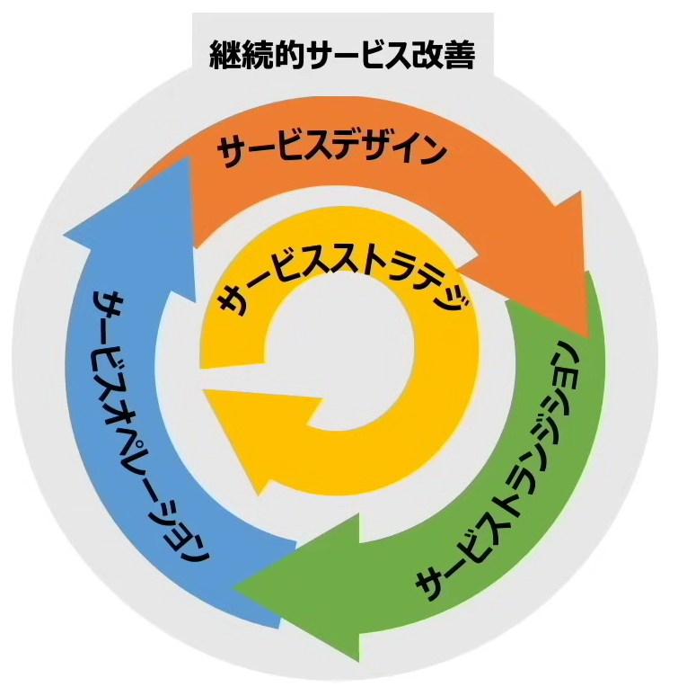

* ITサービス運用方法
    * ITサービスマネジメントは、`日々のサービ運用`と`中長期的なサービス運用`がある
        * `日々のサービ運用`：日常の問い合わせ対応
        * `中長期的なサービス運用`：品質維持やサービス全体の改善活動

* サービスデスク
    * ITサービス`利用者`とITサービス`提供者`の間の`単一窓口`
    * トラブル時の`対処方法`、`使用方法`、`苦情`など、様々な問い合わせを受け付け
    * 形態
        1. 中央サービスデスク：サービスデスクを`一か所に集中`
            * 運用コストが低く、情報共有がしやすい。
            * 迅速な現地対応ができない
        2. ローカルサービスデスク：利用者の`近くにサービスデスク`を配置
            * 迅速な現地対応ができる
            * 人員確保などのコストがかかる
        3. バーチャルサービスデスク：各地にスタッフが分散していても`ITツール`で`仮想的に一か所に集中`
            * 柔軟なサービス体制を構築できる
            * サービス品質の一貫性の担保が難しい
        4. フォロー・ザ・サン
            * 2つ以上の異なる（大陸の）拠点に配置され、中央の統括管理によって24時間365日のサービスを提供するサービスデスク
            * 分散拠点のサービス要員を含めた全員を中央で統括して管理することによって、統制の取れたサービスが提供できる

  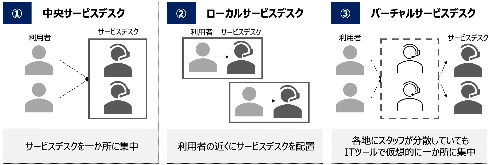

#### サービスの運用プロセス
* 日々のサービス運用プロセスは以下通り
    * インシデント管理及びサービス要求管理
    * インシデント問い合わせ
        * Incident
        * ITサービスに関するトラブル、インシデントの問い合わせ
        * `ITサービスの稼働`に直接な影響があるため、`緊急な対応が必要`になる

        * インシデント管理
            * インシデントの根本下人を特定し、再発を防止する
            * 可能な限り迅速に、正常なITサービスを復旧させることを優先
            * 利用者への悪影響を最小限に抑える
            * `エスカレーション`：サービスデスクで解決できなかった場合、専門知識のある担当者に解決依頼をする

        * 変更管理
            * ITサービスの変更が必要と判断された場合、変更に伴う`影響を検証・評価`し、`承認`または`却下`を行う
        * 構成管理
            * 変更管理を行う際は、`構成管理DB`（ITサービスの提供に必要な情報を保存されている）を使用し、ITサービスの提供に必要な情報を正しく把握し、効果的な情報を提供する
        
        * リリース管理
            * 変更管理で承認された変更内容を、適切な時期に`本番環境に適用`（リリース）する 

    * サービス要求
        * 利用者からの質問（要求）
        * 緊急度が低い
        * マニュアルに沿った対応

  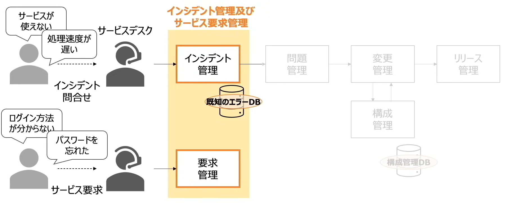
  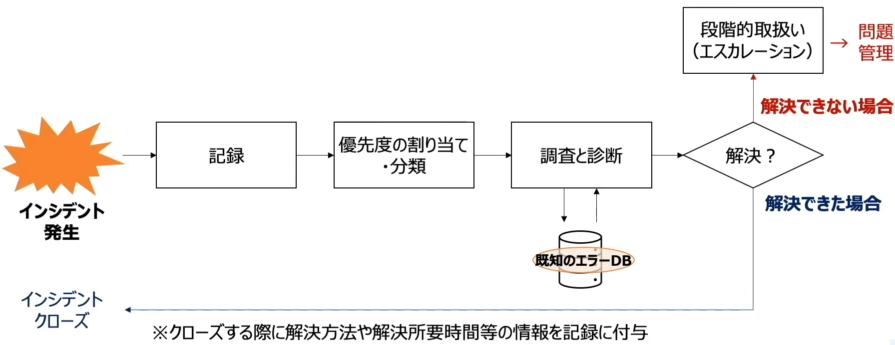

* 中長期的な視点でITサービスと改善を図る運用プロセスは以下通り
    * サービスレベル管理：利用者の求めるサービスレベルを満たしているか評価・管理
        * `SLA`
            * Service Level Agreement
            * サービス品質保証/合意書
            * ITサービス利用者と提供者でどの程度のサービス品質を保証するか事前に取り決めておく
            * サービス時間帯/問い合わせ受け付け時間/障害時の復旧時間/追加料金の発生など
        * SLM
            * Service Level Management
            * サービスレベル合意書に基づき、顧客要件を満たすITサービスの提供を実現し、その品質の継続的な改善に必要なプロセスを構築するという管理手法や考え方

    * 可用性管理：サ－ビスを利用したい時に確実に利用できるように、個々の機能を維持管理
        * 稼働が停止しないようにすること
    * キャパシティ管理：ITサービスの`提供に必要なネットワーク`や`システム`などの`容量・能力`を管理
        * キャパシティが不足していると、利用者が不機嫌になる
        * オーバースペックのサーバーを用意してしまうと、コストが無駄にかかる

  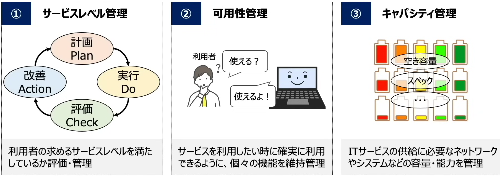

************************************************************

### 📖システム監査
* システム監査
    * 監査対象からは独立した立場（第三者の立場）となる、`システム監査人`が行う
    * 情報システムを`信頼性`、`安全性`、`効率性`などの観点で評価し、`問題点を指摘`したり`改善策を助言`する
        * 信頼性：システムの品質は十分であるか、システム障害に対する予防策がとられているか
        * 安全性：`災害`や`不正アクセス`などのシステムに`悪影響を与える脅威から、保護されているか`
        * 効率性：投資対効果の向上が図られているか。経営に対して、システムが効果的に使われているか、費用対効果に見合ったリターン？が得られているのか

    * `監査対象部門`（被監査部門）：実際にシステムを運営している部門
    * `監査依頼人`：その会社の経営者
    * `システム監査人`：対象部門と関係がない第三者
    * 作業の流れ：
        * `監査計画の作成`、`監査実施`、`フォローアップ`を順に実施する

        1. `依頼`：`監査依頼人`が、`システム監査人`に依頼をする
            * `監査計画の作成`：依頼人の意向や経営課題を調査して目的・対象を明らかにしたうえで計画を立案する
                * 監査内容、監査時期、監査を行う範囲を立案する

        2. `調査`：`システム監査人`が`監査対象部門`に対して、システム監査を行う
            * `監査実施`：監査計画を基に`予備調査`・`本調査`を行い、`入手した監査証拠に基づいて`評価する
                * 予備調査：アンケート調査などを行い監査対象の概要を把握する
                * 本調査：インタビュー・現地調査を行い監査証拠を入手する

        3. `報告`：`システム監査人`が監査結果を`監査依頼人`に報告する

        4. `改善指示`：`監査依頼人`は結果報告を受け、`監査対象部門`に対し、問題点の改善命令や改善活動を行う
            * `フォローアップ`：監査対象部門による改善の実施状況をモニタリングし、システム監査人の立場で`改善の実現を支援`する

        5. `改善の助言`：`システム監査人`も改善の助言活動を`監査対象部門`に対して行う

    * 独立性を担保することが重要
        * `物理的`および`精神的`に独立した人が監査する
        * `外観上の独立性`
            * 監査対象と利害関係にならないように、`独立した部署・組織`でなくてはならない
            * 例：内部監査部門を設ける。監査法人などの第三者機関に監査を依頼する
        * `精神上の独立性`
            * 監査の実施にあたり、客観的な視点から`公正な判断`を行われなければならない

* コーポレートガバナンスと内部統制
    * `企業が不祥事や法令違反`などを起こさず、健全な経営を行うために作られたルール・仕組み
    * `上場会社`においては、`内部統制の整備・運用が義務付け`られている

    * `コーポレートガバナンス`（Corporate Governance）：企業統治
        * `経営者`が不正を行わないように、`株主や監査役や企業経営`そのものを監視・監視する仕組み

    * 内部統制
        * `従業員`が不正を行わないように、`経営者`が企業内を管理する仕組み

    * `アカウンタビリティ`（Accountability）：説明責任
        * アカウンティング（会計）
        * レスポンシビリティ（責任）
        * 広く会社に影響をもちうる活動を行う団体は、その利害関係者に対して、その活動や権限行使の予定、内容、結果などの報告をする必要がある
