▶ストラテジ分野
* [1. ソリューションビジネス](#ソリューションビジネス)
* [2. ビジネスインダストリ](#ビジネスインダストリ)
* [3. 経営事業戦略とマーケティング](#経営事業戦略とマーケティング)
    * [事情戦略](#事情戦略)
    * [マーケティング](#マーケティング)
* [4. 経営管理システム](#経営管理システム)
* [5. 経営組織と会計財務](#経営組織と会計財務)
* [6. 法規と標準化](#法規と標準化)

|用語|フルネーム|意味|
| --- | --- | --- |
|ソリューションビジネス|-|`顧客が抱える問題や課題を解決する`ことを目的として、製品やサービスを提供するビジネス|
|`オンプレミス`|-|サーバーなどのITリソースを自社内やデータセンターで`ユーザー企業自身が管理・運用`|
|`従来型オンプレミス`|-|`自社施設内`で`自社サーバー`を運用|
|`ハウジングサービス`|-|`データセンター`に`自社サーバーを預けて`運用|
|`ホスティングサービス`|-|サービス事業者から`サーバーをレンタル`|
|`クラウド`|-|`クラウド事業者`が用意したITリソースを`ネットワーク経由`で利用|
|ハイブリッドクラウド|-|複数の異なるクラウド環境（パブリッククラウド・プライベートクラウド）やオンプレミス環境（自社運用システム）を組み合わせてひとつのシステムとして利用する形態|
|`IaaS` `インフラ`|Infrastructure as a service|`システム構築に必要な基盤のみ提供`|
|`PaaS` `プラットフォーム`|Platform as a service|`アプリケーション稼働に必要な環境を提供`|
|`SaaS` `ソフトウェア`|Software as a Service|`アプリケーションまでの全サービスを提供`|
|SOA|Service Oriented Architecture|`サービス試行アーキテクチャ`|
|`情報リテラシー`|-|世の中にあるさまざまな情報を適切に読み切り、`活用する能力`|
|`デジタルデバイド`|Digital Divide|社会のデジタル化が進むにつれて、`情報格差`も生まれている|
|`BYOD`|Bring Your Own Device|`個人で所有する`PCやスマートフォンなどの`情報機器を業務に利用`すること|
|`RPA`|Robotic Process Automation|人が実施している`定型的な業務`を`ソフトウェアロボット`により`自動化`・`効率化`すること|
|`BI`|Business Intelligence|データベースに蓄積された情報を統計的・数学的な手法で分析（`データマイニング`）し、`経営戦略の意思決定において有用な情報を取り出すこと`|
|インダストリ|Industry|産業、業界、工業|
|`EC` eコマース|Electric Commerce|インターネット技術を活用したビジネスである`e-ビジネス`の一つで、ネットショッピングなどの電子商取引をECという `C 個人`：Consumer `E 従業員`：Employee `B 企業`：Business `B 政府`：Government|
|`CtoC`|-|個人取引。ネットオークション|
|`BtoC`|-|企業対個人間取引。ネットショップで物を買う|
|`GtoB`|-|政府対企業間取引。政府・自治体と企業で行う資材調達や電子入札|
|`EDI`|Electronic Data Interchange|`電子データ交換` 受発注、請求、支払いなど商取引に関する情報を、ネットワークを介して電子データとしてやり取りすること|
|暗号資産 仮想通貨|-|インターネット上でやり取りできる財産的価値（例：`ビットコイン`） `ブロックチェーン`の技術により、改ざんなどの不正を防ぐ|
|`マイニング`|-|取引の確認や記録の計算作業に参加して、報酬として仮想通貨を得ること|
|`コンバージョン率`|-|`Webサイトに訪れた人`のうち`実際に商品を購入した人`の割合|
|ページビュー PV|-|そのWebページが何回表示されたか示す指標 一般にページビューが上がるとそれに伴い成約数も増える|
|ROAS|Return On Advertising Spend|広告費に対して、どれだけ売上があったかを示す指標 `ROAD(%) = 広告経由での売り上げ / 広告費 * 100`|
|`SEO`|Search Engine Optimization|検索エンジン最適化|
|`アフィリエイト`|-|個人のWebサイトやブロックに企業の広告を掲載し、ユーザーがそのアフィリエイト広告を経由し、商品を購入するなどの`成果条件を満たした場合、報酬が発生する`|
|`ソーシャルメディア`|SNS（Social Networking Service）|`利用者同士のつながりを促進する`ことで、利用者が発信する情報を多数の利用者に伝播させる|
|`CGM`|Consumer Generated Media|Generated：生成された、生み出された `掲示板`や`口コミサイト`など、ユーザーが参加してコンテンツが作成されるメディア|
|オムニチャネル|Omni Channel|オムニ：すべて 店舗やネット通販、SNSなど、オンライン/オフライン問わず、あらゆる販売チャンネルを持ち、どの手段でも不便なく購入できるようにする オンラインからオフラインに誘導する`OtoO`（Online to Offline）の考え方もある|
|ロングテール|-|売れ筋商品の売り上げ合計よりも、`あまり売れない商品の売り上げ合計のほうが、無視できないくらい大きくなっている現象`|
|`JIT` `かんばん方式`|Just In Time|必要なものを、必要な時に、必要な量だけ`生産する` 中間在庫をなるべくなくすために、後工程は後工程の生産に合わせて、必要な部品のみを前工程から調達する|
|`セル生産方式`|-|1人または数人のチームが、`製品の組み立て工程を完成まで作業を行う` 作業者の`モチベーションアップ`・`多品種生産可能`|
|`MRP`|Material Requirements Planning|`資材所要量計画` 必要なものを、必要なときに、必要な量だけ購入・製造するため、`生産計画をもとに発注量・発注時期を決める` `在庫管理や発注業務を効率化する手法`|
|`CAS`|Computer Aided Design|設計作業を`コンピューターを使って支援する`|
|`IoT`|Internet of Things|今までインターネットに繋がっていなかったものをつなぐこと|
|`HEMS`|Home Energy Management System|庭での`電力使用量を可視化`して、エネルギー商品の最適化を図る|
|`デジタルサイネージ`|-|ディスプレイに映像、文字などを表示する`電子看板`|
|`コアコンピタンス`|-|`企業の中核`となる強み `他社に真似できない自社の優位性を活かし`て、競争環境で優位を確立する手法|
|ベンチマーキング|-|他社の優れた製品やサービス（`ベストラクティス`）を分析し、それを指標（ベンチマーク）に自社と比較検討し経営革新を進める手法|
|PPM|Product Portfolio Management|事業や製品を`市場成長率`と`市場占有率`の`マトリックス`によって分類し、`最適な経営資源配分`を判断する手法 `市場成長率`：事業の市場規模が前年と比べて増加した割合。`高いほど積極的な投資が必要` `市場占有率`：マーケットシェア。市場を占める自社の事業や商品の売り上げの割合。`高いほど利益を生み出す力が大きくなる`|
|`花形`|-|継続的に投資することで、大きな成長が見込める|
|`金のなる木`|-|激しい競争も起こりにくく（市場成長率=新規参入企業が少ないため）、高く安定した収益を上げる（企業の資金源）|
|`問題児`|-|事業として成長する可能性を秘めているが、事業を育てるためには`積極的な投資が必要`|
|`負け犬`|-|`利益なし`、成長なしのため`早期に縮小または撤退せざるを得ない`|
|M&A|Mergers and Acquisitions|企業を`合併`（Merges）・`買収`（Acquistions）する手法 `事業の成長のための時間を買うこと`で、経営資源を短期間で獲得できる|
|`アウトソーシング` BPO|Business Process Outsourcing|業務に`必要な人`や`ノウハウ`を`外部から調達`する手法|
|アンゾフの成長マトリクス|-|市場X製品、既存X新規|
|`SWOT分析`|-|`内部環境`・`外部環境`を分析することで、競合他社と差別化する戦略を立てる|
|`バリューチェーン分析`|-|活動を`主活動`と`支援活動`に分け、`企業の製品`や`サービスの利益`がどの活動で生み出されているか分析することで、自社の強み・弱みを明確にする|
|ファイブフォース分析|-|業界の収益性を決める5つの競争要因から、業界の構造分析を行う手法のこと 供給企業の交渉力 買い手の交渉力 競争企業間の敵対関係 新規参入者の脅威 代替品の脅威|
|クラスタ分析法|-|複数の変数（項目、属性、次元数）を持つデータ（多変量データ）を利用し、その`変数間の総合の関係性`をとらえるために使われる`多変量解析`の手法     * 複数の異なる性質のものが混ざり合っている対象の中から、`類似したものを集めてグループを作り`、対象を分類するために用いられる|
|デルファイ法|Delphi|`複数の専門家から個別に意見の収集を行い`、得られた意見の集約をフィードバックするということを繰り返して、最終的に`意見の収束をしていく`手法|
|モンテカルロ法|-|数値解析の分野において、`確率を近似的に求める`ために使われる手法 n回のシミュレーションを行い、ある事象がm会起これば、その事象の起こる確率は`m/n`で近似できる 試行回数nが大きくなるほど、よい近似値となる|
|指数平滑法|-|`過去の予測値`と`実績値`を利用して`需要値を予測する`方法|
|`プロダクトライフサイクル`|-|`導入期`、`成長期`、`成熟期`、`衰退期`の4つのステージに分類し、成長ステージにあった戦略を分析する手法 1. `導入期`：`市場拡大`を狙って、商品の認知度を高める 2. `成長期`：`市場浸透`を目的に、競合他社との差別化を図るために自社のブランドを高める  3. `成熟期`：商品を改良するなどして、`シェア維持`・利益の確保を狙う 4. `衰退期`：コストを抑えながら、`生産性を確保`する（場合によっては撤退）|
|`コトラーの競争戦略`|-|マーケットシェアの大きさの観点から、競争地位に応じた企業の戦略をとる手法 `経営資源の量`と`経営資源の質`によって、リーダー、ニッチャー、チャレンジャー、フォロワーと4つの地位分類|
|`マーケティングミックス` `4P`と`4C`|-|マーケティングの`フレームワーク`や`ツール`を組み合わせて、自社の商品を効果的に販売する手法|
|`コストプラス価格決定法`|-|製品のコストに`一定のマージンを加えて製品価格`とする、`コスト志向型`の価格設定法|
|ゼクメンテーション|-|顧客市場をある基準で細分化し、その中から最も競争優位に立てる市場を選定すること|
|`SCM`|Supply Chain Management|`調達から販売までの一連のプロセス`（`サプライチェーン`）の情報を一元管理することで、`コスト削減や納期短縮`を目指す|
|`CRM`|Customer Relationship Management|`顧客に関する情報や購入履歴、クレーム`などを一元管理し、顧客に合った対応をすることで、顧客との良好な関係構築を目指す|
|`ERP`|Enterprise Resource PLanning|`企業資源計画` 生産・流通・販売・会計などの`基幹業務の情報`を一元管理することで、効率的な経営の実現を目指す|
|`ナレッジマネジメント`|-|知識管理 企業が保持している情報や、社員が持っている`ノウハウや経験`を一元管理することで、`企業全体の問題解決力を高める`経営を目指す|
|BSC、`バランススコアコード`|-|売り上げや利益などの財務観点だけで評価するのではなく、`財務以外の観点`からもバランス良く評価する 経営状況の変化に気づきやすくなり、目標達成のために強化すべくポイントを客観的に判断できる 財務・顧客・内部ビジネスプロセス・学習と成長|
|`KGI`|Key Goal Indicator|目指すべき`最終的な目標` 例：売り上げ高xx% UP|
|`CSF`|Critical Success Factor|KGIを達成するのに`必要な要素` 例：来客数など|
|`KPI`|Key Performance Indicator|CSFを達成するための`数値目標` 例：新規顧客数　xx・既存顧客数xx|
|技術開発戦略|-|企業を発展させていくため、今後`開発を進めていくべき技術`や`その技術開発への投資`など、`市場のニーズや将来的な動向を踏まえて方向性`を決定する|
|イノベーション|-|今までにない、新たな価値を生み出すこと|
|`プロダクトイノベーション`|-|`製品改革`。革新的な新商品を開発するなど、`製品そのものの技術革新`|
|`プロセスイノベーション`|-|開発や製造、物流などの`プロセスの技術革新`|
|インクリメンタルイノベーション|-|既存製品の部品改良など小さな改善をする技術革新|
|ラディカルイノベーション|-|経営構造など根本的な部分の改革を必要とする技術革新|
|`オープンイノベーション`|-|社外からアイデアを募集し、新サービスの開発に活用する|
|`コーポレートブランディング`|-|ブランド向上を図るために、自社製品の革新性についてWebに掲載する|
|技術のSカーブ|-|技術は、最初は緩やかに進歩するが、どこかの時点で急激に進歩し、その後伸びなくなる|
|経営組織|-|1. `職能別組織`（機能別組織）：生産、販売、人事など仕事の機能別 2. `事業部別組織`：`製品や地域別`に各事情部として独立 3. `マトリックス組織`：職能X事業（専門）のマトリックス 4. `プロジェクト組織`：一時的に編成される|
|`CIO`|Chief Information Officer|最高情報責任者。情報や情報技術に関する役員 経営戦略と整合性をとりながら、全社的な視点から情報戦略を立案する|
|CEO|Chief Executive Officer|最高`経営`責任者。`経営戦略`の立案及び`業務執行`を統括する最高責任者|
|CFO|Chief Financial Officer|最高`財務`責任者。`資金調達、財務報告`などの財務面での`戦略策定`及び`執行`を統括する最高責任者|
|CHO|Chief Human resource Officer|最高`人事`責任者 経営戦略を実現するための人事制度を構築し、勤務の実態を把握するなど管理・運営全般を把握する|
|CLO|Chief Legal Officer|最高`法務`責任者 企業の法令遵守の体制の構築と運用|
|COO|Chief Operating Officer|最高`執行`責任者|
|CTO|Chief Technology Officer|最高`技術`責任者。`自社の技術戦略`や`研究開発計画の立案及`び`執行`を統括する最高責任者|
|`OR`|Operations Research|現状の問題に対して数学的に分析し`最適な解決策を見つける`手法|
|`IE`|Industrial Engineering|生産現場における作業手順、工程などの`問題を改善するため`の手法|
|線形計画法|-|限られた材料・予算の中で、最大の利益や効果を得るためにはどうすればいいかを求める手法|
|特性要因図 フィッシュボーンダイアグラム（魚の骨）|-|原因と結果の関連を体系的に表しあ図 結果に対して`直接的`なまたは`間接的`な原因を分類でき、真の`問題点を明確に`する|
|パレート図|-|値が`大きい項目から順に`並べた棒グラフと、その数値の`累積比率`を折れ線グラフで表した図 各項目が全体でどれくらいの割合を占めているかが一目でわかり、`改善活動の優先度`付けができる `ABC分析`：累積比率に対して、Aランク、Bランク、、、とランク付けし、重点項目を把握する|
|OC曲線|Operating Characteristic curve|製品の抜き取り検査を行う際に、製造ロットの`不良率`と`合格率`の関係を表した図|
|管理図|-|工程の状況や品質を時系列に表した図で、工程が安定した状態にあるかどうかを判断するために用いる|
|`利益`|-|`売上`と`費用`の差分が`利益`となる 変動費：売上に比例して発生（材料や運賃） 固定費：売上に関係なく発生（人件費や家賃） 比例：`変動比率` `変動比率 = 変動費 / 売上` `変動費 = 変動比率 * 売上`|
|損益分岐点|-|`売上`と`費用`が一致する`売上高`（=利益が0円） `売上高`が`損益分岐点`を下回ると、赤字 `売上高`が`損益分岐点`を上回ると、黒字 `損益分岐点の売上` = `変動費` + `固定費` `損益分岐点の売上` = `損益分岐点の売上` * `変動比率` + `固定費` `損益分岐点の売上` * (1 - `変動比率`) = `固定費` `損益分岐点の売上` = `固定費` / (1 - `変動比率`)|
|財務諸表|-|企業の`財務状況`や`経営成績`を`ステークホルダーに報告するために作成される`|
|`貸借対照表`(B/S)|-|資産・負債・純資産を掲載し、ある時点の財務状況を表す|
|`損益計算書`(P/L)|-|ある一定期間における収益と費用を明らかにして企業の経営成績を表す|
|`キャッシュフロー計算書`(C/F)|-|ある一定期間における資金の増減を`営業活動`・`投資活動`・`財務活動`ごとに区分して表す|
|減価償却|げんかしょうきゃく|設備や機械など時間の経過とともに価値が減っていく資産|
|`定額法` `定率法`|-|毎年同じ価格で減価償却すること `1年の減価償却費` = (`取得価格` - `残存価格`) / `耐用年数` `取得価額`：購入金額 `耐用年数`：利用可能な年数（法律で定められている） `残存価額`：耐用年数が経過した際の価値（基本は0となることが多い）|
|知的財産権|-|人の知的活動によって生み出されたアイデア、デザインなどの`知的財産`の価値を保護する権利|
|`著作権`|-|文芸、学術、美術、音楽などの著作物について、作品がどう使われるかを決めることが出来る|
|`著作人格権`|-|著作者の`思いや名誉を守る`|
|`同一性保持権`|-|他人に作品を無断で修正されないように要求する|
|`公表権`|-|未公表の著作物を公表するかなどを決定する|
|`氏名表示権`|-|著作物を表示するか、ペンネーム表示するかなどを決定する|
|`著作財産権`|-|著作物の利用を許可して`利益`を得る `複製権`|
|コンピューターに関する著作物|-|`プログラム`は、`著作権の保護対象` `プログラム言語`、`プログラム規約`、`アルゴリズム`は、著作権の`保護対象外` A社がB車に`プログラム開発を委託`した場合、著作権は委託者（A社）ではなく`製作者（B社）にある`|
|`産業財産権`|-|新しい技術やデザインが模倣されないよう独占権を与えて産業の発展を保護する権利 `特許権`：創作性の高い新しい発明を保護 `実用新案権`：物品の構造・形状の考案を保護 `意匠権`：デザインを保護 `商標権`：商品のマークやロゴを保護|
|`特流通促進事業`|-|民間企業が保有する休眠特許を発掘し、他企業にライセンスして活用を図る|
|`不正アクセス禁止法`|-|不正アクセス行為とそれを助長する行為を禁止する法律 `コンピューターウィルスを用いて`、企業で使用されているコンピューターのデータを消去した場合、`刑法に罰せられる`|
|`サイバーセキュリティ基本法`|-|サイバーセキュリティに関する施策の基本理念や戦略を定めた法律|
|`個人情報保護法`|-|氏名や生年月日、住所などの個人情報を保護する法律|
|`労働者派遣契約`|-|派遣元企業（派遣会社）が雇用する労働者が、`派遣先企業の指揮命令を受け`て仕事を行う契約|
|`請負契約`|-|請負会社が仕事の完成を約束し、発注企業はその成果物に対して報酬を支払う契約|
|`労働基準法`|-|賃金や労働時間など、労働者に適用される労働条件の`最低基準`を定めた法律|
|`シュリンクラップ契約`|Shrink-wrap|購入者が`ソフトウェアのパッケージを開封する`ことで、`使用許諾に同意した`とみなす契約|
|`ISO`|International Organization for Standardization|`国際標準機構`が制定する、サービスや品質に関する国際的な基準|
|`JIS`|-|日本産業標準調査会が制定する、日本の産業製品に関する規格（=日本の国家規格）|
|`IEEE`|-|`米国`の`電気や電気工学`に関する学会が制定する、`LANケーブル`などの標準規格|
|`IETF`|The Internet Engineering Task Force|インターネットで利用される技術の標準化を図り、技術仕様を`RFC`として公開|
|ANSI|-|アメリカ合衆国に本部を持つ電気・電子技術の学会が定めた規格|
|`サイトライセンス`|-|特定の企業や団体などにある複数のコンピューターの使用を一括して認める|
|`ボリュームライセンス`|-|`特定のコンピューター`または一定数のコンピューターの使用を認める `特定のユーザー`または一定数のユーザーに使用を認める|
|`サーバライセンス`|-|`特定のサーバー`に`インストール`し、そのクライアントでの使用を認める|
|`クリックラップ契約` `オンクリック契約`|-|ソフトウェアをインターネットからダウンロードしたとき画面に表示される契約内容に同意するを選択することによって、使用が許される契約|
|フランチャイズチェーン >FC|-|本部が契約した加盟店に対して、営業権や商標の使用権、出店や運営のノウハウを提供し、その見返りとして加盟店からロイヤルティを徴収するという関係を有した小売り形態|
|リテールサポート|-|卸売業・メーカーが小売店の経営活動を支援することによって、自社との取引量の拡大につなげる手法|

************************************************************

### 📖ソリューションビジネス
* ソリューションビジネス
    * `顧客が抱える問題や課題を解決する`ことを目的として、製品やサービスを提供するビジネス
    * どこまでサービス事業者提供のITソリューションを利用するかによって、形態が異なる

    * `オンプレミス`
        * サーバーなどのITリソースを自社内やデータセンターで`ユーザー企業自身が管理・運用`
        * 管理・設定の構築が難点
        1. `従来型オンプレミス`：`自社施設内`で`自社サーバー`を運用
        2. `ハウジングサービス`：`データセンター`に`自社サーバーを預けて`運用
        3. `ホスティングサービス`：サービス事業者から`サーバーをレンタル`

    * `クラウド`
        * `クラウド事業者`が用意したITリソースを`ネットワーク経由`で利用

        * 使用例
            * 従来：所有するゲーム機でプレイする
            * クラウドサービス：クラウドからゲームをプレイできる

        * クラウド事業者が容易したITリソースをネットワーク経由で利用
            * `IaaS`（`インフラ`）（Infrastructure as a service）
                * サービスとしてのインフラ
                * システム稼働に必要なインフラを提供する
                * 土地を借りる
                * `システム構築に必要な基盤のみ提供`
                * `※ メリット：`自由にカスタマイズすることが出来る

            * `PaaS`（`プラットフォーム`）（Platform as a service）
                * サービスとしてのプラットフォーム
                * アプリ開発のための開発環境をまとめて提供するサービス
                * 家を借りる（家具家電付いてない）
                * `アプリケーション稼働に必要な環境を提供`

            * `SaaS`（`ソフトウェア`）（Software as a Service）
                * サービスとしてのソフトウェア
                * サービス事業者がソフトウェアのインフラやプラットフォームなどすべてひっくるめてソフトウェアを丸々提供してくれるもの
                * 土地と家と家の中の細かい家電まですべてまると借りるイメージ
                * `アプリケーションまでの全サービスを提供`
                * `※ メリット：`構築難易度が低い

        * ハイブリッドクラウド：複数の異なるクラウド環境（パブリッククラウド・プライベートクラウド）やオンプレミス環境（自社運用システム）を組み合わせてひとつのシステムとして利用する形態

  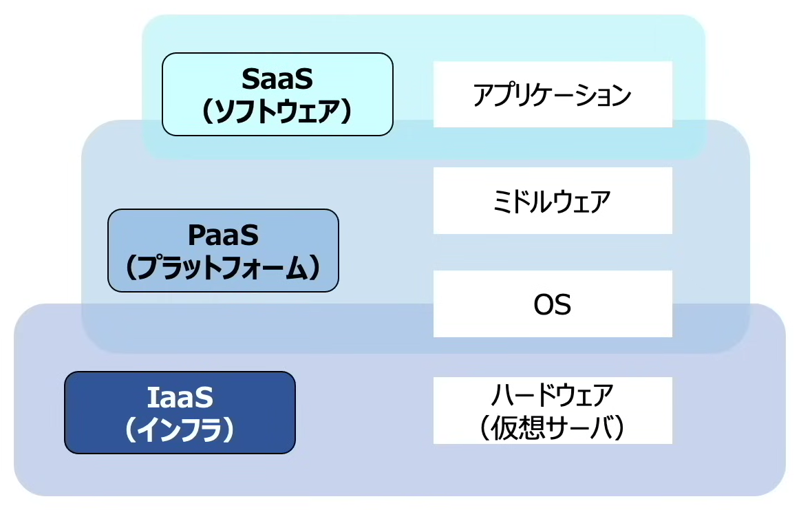
  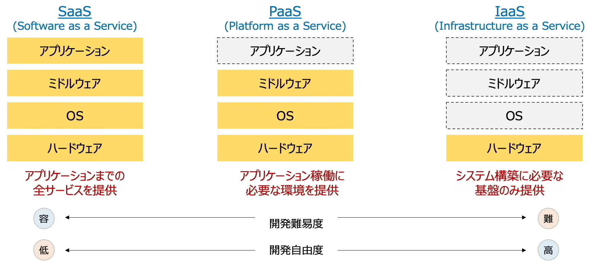

* SOA
    * Service Oriented Architecture
    * `サービス試行アーキテクチャ`
    * システムをサービス（ソフトウェアの機能）の組み合わせで`構築する`

  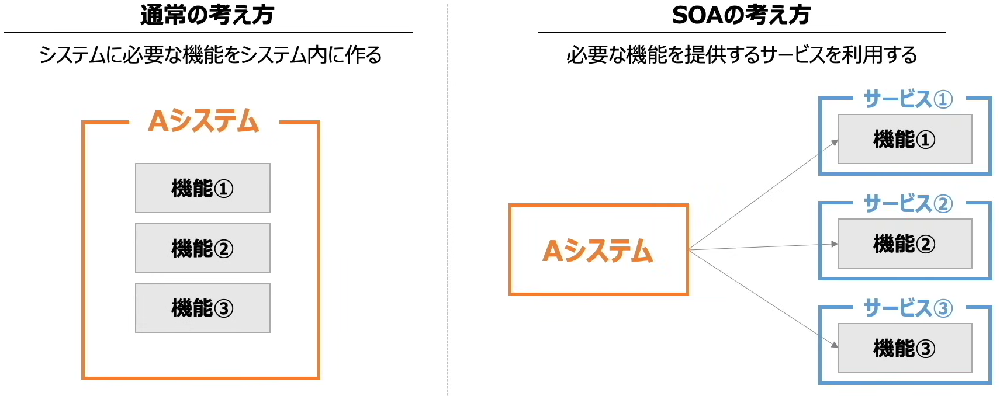

* システムの活用
    * 世の中にあるさまざまな情報を適切に読み切り、`活用する能力`（＝`情報リテラシー`）が必要
    * `デジタルデバイド`：社会のデジタル化が進むにつれて、`情報格差`も生まれている

    * 大量のデータやシステムを有効活用している事例：
        * `BYOD`（Bring Your Own Device）：`個人で所有する`PCやスマートフォンなどの`情報機器を業務に利用`すること
            * `※ メリット：`企業側の負担コストが安くなる、社員側の業務効率あ向上する

        * `RPA`（Robotic Process Automation）：人が実施している`定型的な業務`を`ソフトウェアロボット`により`自動化`・`効率化`すること
            * 定期業務の入金・支払い処理における入力作業など　

        * `BI`（Business Intelligence）：データベースに蓄積された情報を統計的・数学的な手法で分析（`データマイニング`）し、`経営戦略の意思決定において有用な情報を取り出すこと`

************************************************************

### 📖ビジネスインダストリ
* インダストリ（Industry）：産業、業界、工業
* `EC`（Electric Commerce, eコマース）
    * インターネット技術を活用したビジネスである`e-ビジネス`の一つで、ネットショッピングなどの電子商取引をECという
    * 誰と取引を行うかによって取引形態が異なり、売り手と借り手の頭文字を使って表現する
        * `C 個人`：Consumer
        * `E 従業員`：Employee
        * `B 企業`：Business
        * `B 政府`：Government
    * `CtoC`：個人取引。ネットオークション
    * `BtoC`：企業対個人間取引。ネットショップで物を買う
    * BtoB：企業間取引。`企業間取引`
    * BtoE：企業対従業員取引
    * GtoC：政府対個人間取引
    * `GtoB`：政府対企業間取引。政府・自治体と企業で行う資材調達や電子入札
    * GtoG：政府間取引

* `EDI`
    * Electronic Data Interchange
    * `電子データ交換`
    * 受発注、請求、支払いなど商取引に関する情報を、ネットワークを介して電子データとしてやり取りすること
        * 従来：郵送やFAXなどのやり取りだち、管理が煩雑でミスも多発
        * EDI：帳票を電子化してシステム化
    1. `情報伝達規約`：ネットワーク回線や伝送手順など文字通り情報をやり取りするための取り決め
        * 伝送制御手順
    2. `情報表現規約`：データの構造やデータ項目など、表現法のルールなど情報データをお互いのコンピューターで理解できるようにするための取り決め
        * メッセージの形式
    3. `業務運用規約`：どんな情報をやり取りするか、情報の訂正方法やエラーの扱いなどの業務やシステムの運用に関する取り決め
        * システムの運用時間
    4. `取引基本規約`：検収時期、支払時期、支払方法などEDIにおける取引の法的有効性を確立するための取り決め
        * 企業間の取引の契約内容

* 暗号資産（仮想通貨）
    * インターネット上でやり取りできる財産的価値（例：`ビットコイン`）
    * `ブロックチェーン`の技術により、改ざんなどの不正を防ぐ
    * `マイニング`：取引の確認や記録の計算作業に参加して、報酬として仮想通貨を得ること

* Webマーケティング手法
    * Webサイトを用いて自社商品の販売を促進することが重要になっている
    * 評価指標`コンバージョン率`：`Webサイトに訪れた人`のうち`実際に商品を購入した人`の割合

    * ページビュー（PV）
        * そのWebページが何回表示されたか示す指標
        * 一般にページビューが上がるとそれに伴い成約数も増える
    * ROAS
        * Return On Advertising Spend
        * 広告費に対して、どれだけ売上があったかを示す指標
        * `ROAD(%) = 広告経由での売り上げ / 広告費 * 100`

    * `SEO`
        * Search Engine Optimization
        * 検索エンジン最適化
        * 検索サイトで自分のページを上位に表示させるようにする
    
    * `アフィリエイト`
        * 成果報酬型広告
        * 個人のWebサイトやブロックに企業の広告を掲載し、ユーザーがそのアフィリエイト広告を経由し、商品を購入するなどの`成果条件を満たした場合、報酬が発生する`

    * `ソーシャルメディア`
        * SNS（Social Networking Service）
        * `利用者同士のつながりを促進する`ことで、利用者が発信する情報を多数の利用者に伝播させる

    * `CGM`
        * Consumer Generated Media
        * Generated：生成された、生み出された
        * `掲示板`や`口コミサイト`など、ユーザーが参加してコンテンツが作成されるメディア

* オムニチャネル
     * Omni Channel。オムニ：すべて
     * 店舗やネット通販、SNSなど、オンライン/オフライン問わず、あらゆる販売チャンネルを持ち、どの手段でも不便なく購入できるようにする
     * オンラインからオフラインに誘導する`OtoO`（Online to Offline）の考え方もある
        * 実際の店舗で使えるクーポンをWeb上で配布するような仕組み
     * `購入経路を意識させない`。実際の店舗とネットショップの境をなくすことで、販売を促す

  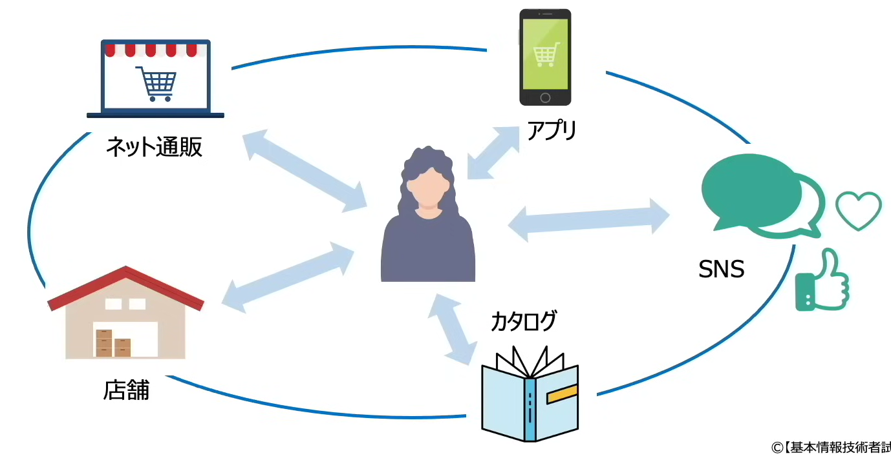

* ロングテール
    * 売れ筋商品の売り上げ合計よりも、`あまり売れない商品の売り上げ合計のほうが、無視できないくらい大きくなっている現象`
    * リアル店舗だと売り場面積が限られているため、売れ筋商品しか並ばないが、`ネットショッピングではあまり売れない商品も取り扱える`

  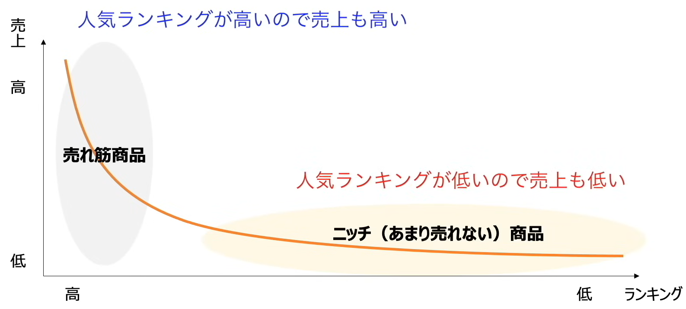

* エンジニアリングシステム
    * 設計や製造、生理管理、在庫管理、生産工程において効率化・自動化を図る
    * `JIT`
        * Just In Time
        * 必要なものを、必要な時に、必要な量だけ`生産する`
        * 中間在庫をなるべくなくすために、後工程は後工程の生産に合わせて、必要な部品のみを前工程から調達する
        * `かんばん方式`ともいう

    * `セル生産方式`
        * 1人または数人のチームが、`製品の組み立て工程を完成まで作業を行う`
        * 従来は`ライン生産方式`、同じ作業を淡々とこなす
        * セル生産方式、製品の一連の組み立て工程を担う
        * メリット：作業者の`モチベーションアップ`・`多品種生産可能`

    * `MRP`
        * Material Requirements Planning
        * `資材所要量計画`
        * 必要なものを、必要なときに、必要な量だけ購入・製造するため、`生産計画をもとに発注量・発注時期を決める`
        * `在庫管理や発注業務を効率化する手法`

    * `CAS`
        * Computer Aided Design
        * 設計作業を`コンピューターを使って支援する`

    * 生産方式
        * 個別生産：受注した注文ごとに仕様や製造計画・納期を設定し製品を生産する方式
        * ロット生産：同じ製品をロットと呼ばれる単位で生産する方式。一度に大量に生産することで製品1つあたりに要する段取り時間を少なく出来る
        * 連続生産：`止まらずに生産する`。ライン生産方式とも呼ばれ、大量生産を行う工場で製品の組み立て工程、作業員の配置を一連化（ライン化）させ、ベルトコンベアなどによりン流れてくる機械に部品の取り付けや小加工を連続的に行う生産方式
        * プロセス生産：食品/飲料、化学製品、医薬品、石油、素材などのように、液体やガスなどの原材料を加工することで製品価値を生み出す方式

|生産方式|個別生産|ロット生産|連続生産|プロセス生産|
| --- | --- | --- | --- ||
|生産量|少|中|多|多|
|主な生産形態|`受注生産`|受注・見込生産|見込生産|受注・見込生産|
|生産品種|多|中|少|少|
|段取頻度|多|中|少|極少|
|処理|組立て|組立て|組立て|`化学的`|

* `IoT`
    * Internet of Things
    * 今までインターネットに繋がっていなかったものをつなぐこと
    * IoTの応用事例
        * `HEMS`
            * Home Energy Management System
            * 家庭での`電力使用量を可視化`して、エネルギー商品の最適化を図る
        * `デジタルサイネージ`
            * ディスプレイに映像、文字などを表示する`電子看板`

        * ICTの活用
            * ICTが最大限に活用され、サイバー空間とフィジカル空間とが融合された`超スマート社会`の実現を推進してきた
            * `超スマート社会`の実現：
                * 必要なものやサービスが人々に過不足なく提供され、年齢や性別などの違いにかかわらず、だれもが快適に生活することができるとされる
                * Society 5.0
                    1. Society 1.0：狩猟社会
                    2. Society 2.0：農耕社会
                    3. Society 3.0：工業社会
                    4. Society 4.0：情報社会
                    5. Society 5.0：超スマート社会

************************************************************

### 📖経営事業戦略とマーケティング
* 経営戦略手法
    * 企業が経営目的・経営目標を達成するための方針や計画全般を意味する

* コアコンピタンス
    * `企業の中核`となる強み
    * `他社に真似できない自社の優位性を活かし`て、競争環境で優位を確立する手法
    * 例：ホンダのエンジン技術、ソニーの小型化技術、シャープの液晶技術

* ベンチマーキング
    * 他社の優れた製品やサービス（`ベストラクティス`）を分析し、それを指標（ベンチマーク）に自社と比較検討し経営革新を進める手法

* ゴーイングコンサーン
    * 継続企業の前提
    * 企業が将来にわたって無期限に事業を継続することを全体とする考えか阿多のこと
    * または倒産せず発展し続けることを目指す経営という意味で用いられる

* アライアンス
    * 同盟
    * 企業同士の提携の意味で、ある企業と提携し共同で事業を行っていくこと

* リエンジニアリング
    * ビジネスプロセスを根本的に考え直し、抜本的にデザインし直すことによって、企業のコスト、品質、サービス、スピードなどのパフォーマンスを劇的に改善するもの

* 3C分析
    * マーケティング分析に必要不可欠な顧客（Custimer）、自社（Company）、競合他社（Competitor）の3要素において自社の置かれている状況を分析する手法

* ITポートフォリオ
    * ポートフォリオの考え方を情報化投資戦略に応用したもの
    * IT投資をその目的やリスクの特性ごとにカテゴライズし、そのカテゴリーごとに投資割合を管理することで、限りある経営資源を有効に配分することで可能になる
    * 経済産業省が提唱するモデルに分類した後、いくつかの評価項目を用いて優先順位を決定する
        1. 戦略目標達成型
        2. 業務効率化型
        3. インフラ構築型

    * 情報化システムにかかる総コスト（TCO）
        * `イニシャルコスト`
            * システム`稼働開始のために要する初期費用`のことで、ハードウェア購入・設置費用、パッケージソフトの購入費用・開発費・初期教育費などシステムの構築までにかかった費用などが含まれる
        * ライニングコスト
            * システムの`稼働後に生じる維持費用`のことで、保守・サポート契約費、ライセンス料、運用人件費、消耗品費などシステム運用後の維持費用が含まれる

* PPM
    * Product Portfolio Management
    * 事業や製品を`市場成長率`と`市場占有率`の`マトリックス`によって分類し、`最適な経営資源配分`を判断する手法

    * `問題児`、`花形`、`負け犬`、`金のなる木`
    * `市場成長率`：事業の市場規模が前年と比べて増加した割合。`高いほど積極的な投資が必要`
    * `市場占有率`：マーケットシェア。市場を占める自社の事業や商品の売り上げの割合。`高いほど利益を生み出す力が大きくなる`
    * `花形`：継続的に投資することで、大きな成長が見込める
    * `金のなる木`：激しい競争も起こりにくく（市場成長率=新規参入企業が少ないため）、高く安定した収益を上げる（企業の資金源）
    * `問題児`：事業として成長する可能性を秘めているが、事業を育てるためには`積極的な投資が必要`
    * `負け犬`：`利益なし`、成長なしのため`早期に縮小または撤退せざるを得ない`

  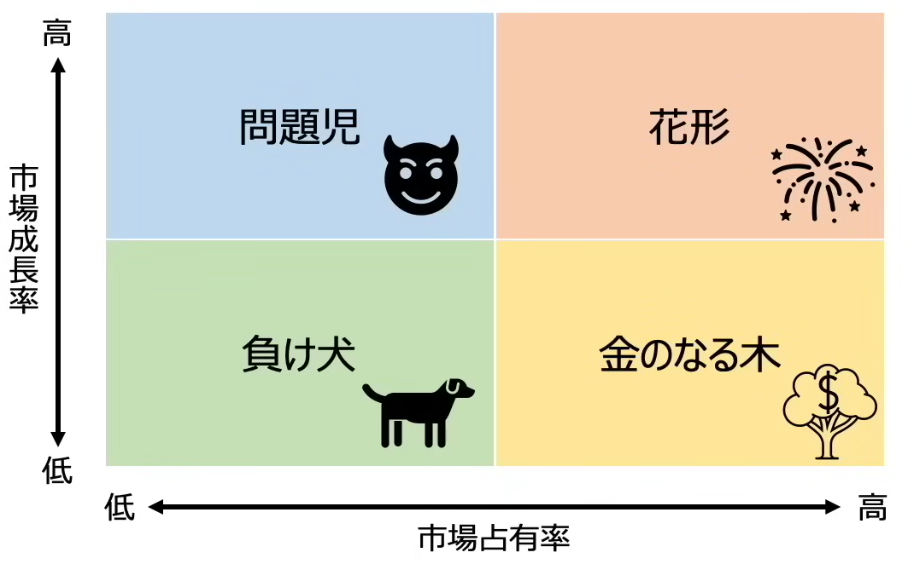

* M&A
    * Mergers and Acquisitions
    * 企業を`合併`（Merges）・`買収`（Acquistions）する手法
    * `事業の成長のための時間を買うこと`で、経営資源を短期間で獲得できる

    * 垂直統合型
        * 生産を行う工場が`部品工場`や`営業会社`などのサプライチェーンの上流や下流にある工程を企業グループに統合することで市場競争力や資材の供給力を高める形のM&A
    * 水平統合型
        * 同業他社を買収する形のM&A
        * 市場シェアや事業規模を拡大する目的などで実施される
    * 混合型
        * 異業種との合併となるM&A
        * 新規分野・新規市場に進出する目的などで実施される

* `アウトソーシング`（BPO）
    * 業務に`必要な人`や`ノウハウ`を`外部から調達`する手法
    * `社内の業務プロセス`を外部に委託することを`BPO`（Business Process Outsourcing）と言う
    * 人件費が比較的に安い海外の企業に委託することでコストを下げる

* クラウドソーシング
    * Crowd Sourcing
    * クラウド＝群衆
    * マッチングを行うWebサイトを通じ、インターネット上の不特定多数の人に仕事を依頼できるサービス

* アンゾフの成長マトリクス
    * 市場X製品、既存X新規
    * 市場浸透：`既存市場`に対して、`既存製品`で事業拡大する場合の戦略
        * 例：現在の市場で現有製品の広告、宣伝を強化し、顧客の購入頻度や購入量を増やす
    * 製品開発：`既存市場`に対して、`新規製品`で事業拡大する場合の戦略
        * 例：新たな機能を付加した製品や新規に開発した製品を、現在の市場に投入する
    * 市場開拓：`新規市場`に対して、`既存製品`で事業拡大する場合の戦略
        * 例：現有製品で海外市場に進出し、新たな市場セグメントの開拓を図る
    * 多角化　：`新規市場`に対して、`新規製品`で事業拡大する場合の戦略
        * 例：技術開発、業務提携、M&Aなどで、新たな製品や市場での成長の機会を求める

  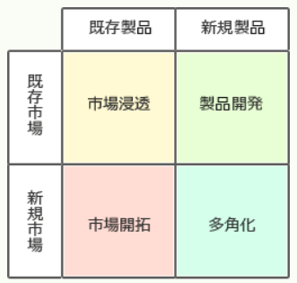

* ブルーオーシャン戦略
    * 血みどろの競争が行われている市場（レッドオーシャン、コモディティ化が進んだ既存の市場）で競合相手を打ち負かすための競争を戦略の中心に据えるのではなく、新しい価値や新機軸の市場領域を自ら創出し、未開拓も市場で高成長と高収益化を目指す戦略
    * 未知の市場や競争相手がいない市場をブルーオーシャン、青い平和な海というイメージで言い表したもの
    * 従来の戦略マイケル・ポーターの競争戦略`事業が成功するためにはあ低価格戦略か差別化（高付加価値）戦略のいずれかを選択する必要がある`に対し、ブルーオーシャン戦略では、価値曲線を適切にデザインすることにより`低コスト`と`顧客にとっての高付加価値`を両立することを提唱している

#### 事情戦略
* 経営戦略をベースにして事業ごとに目的や方向性を示したもの

* `SWOT分析`
    * `内部環境`・`外部環境`を分析することで、競合他社と差別化する戦略を立てる

  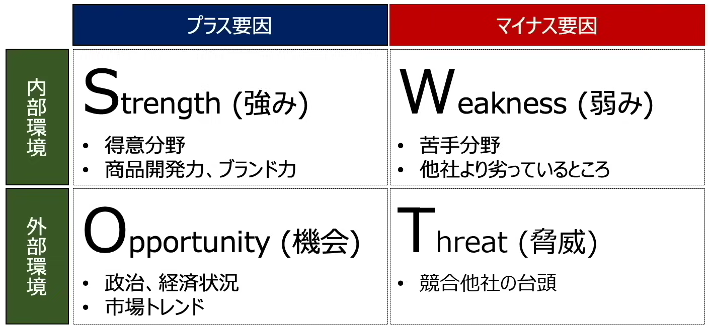

* `バリューチェーン分析`
    * 活動を`主活動`と`支援活動`に分け、`企業の製品`や`サービスの利益`がどの活動で生み出されているか分析することで、自社の強み・弱みを明確にする

  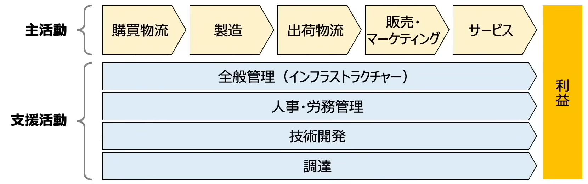

* ファイブフォース分析
    * 業界の収益性を決める5つの競争要因から、業界の構造分析を行う手法のこと
    * 要因から業界全体の`魅力度`を測る
    * 内的要因
        * 供給企業の交渉力
        * 買い手の交渉力
        * 競争企業間の敵対関係
    * 外的要因
        * 新規参入者の脅威
        * 代替品の脅威

* クラスタ分析法
    * 複数の変数（項目、属性、次元数）を持つデータ（多変量データ）を利用し、その`変数間の総合の関係性`をとらえるために使われる`多変量解析`の手法
    * 複数の異なる性質のものが混ざり合っている対象の中から、`類似したものを集めてグループを作り`、対象を分類するために用いられる
* デルファイ法（Delphi）
    * `複数の専門家から個別に意見の収集を行い`、得られた意見の集約をフィードバックするということを繰り返して、最終的に`意見の収束をしていく`手法
* モンテカルロ法
    * 数値解析の分野において、`確率を近似的に求める`ために使われる手法
    * n回のシミュレーションを行い、ある事象がm会起これば、その事象の起こる確率は`m/n`で近似できる
    * 試行回数nが大きくなるほど、よい近似値となる
* 指数平滑法
    * `過去の予測値`と`実績値`を利用して`需要値を予測する`方法
* クロスセクション法
    * 時間の経過につれて変動していく現象を、ある一時点で横断的に取ったデータを分析する方法。時系列分析とは対比的な分析概念
* 時系列列回帰分析法
    * 時系列データを分析することで、それらの関係を表す`回帰モデル`と呼ばれる数式を明らかにし、将来の売り上げヨソ子などに用いる手法

#### マーケティング
* 顧客が求める製品やサービスを作り、適切なターゲットに価値を届ける一連の活動（商品が売れるための仕組みづくり）

* `プロダクトライフサイクル`
    * `導入期`、`成長期`、`成熟期`、`衰退期`の4つのステージに分類し、成長ステージにあった戦略を分析する手法
        * `導入期`：`市場拡大`を狙って、商品の認知度を高める
        * `成長期`：`市場浸透`を目的に、競合他社との差別化を図るために自社のブランドを高める 
        * `成熟期`：商品を改良するなどして、`シェア維持`・利益の確保を狙う
        * `衰退期`：コストを抑えながら、`生産性を確保`する（場合によっては撤退）

  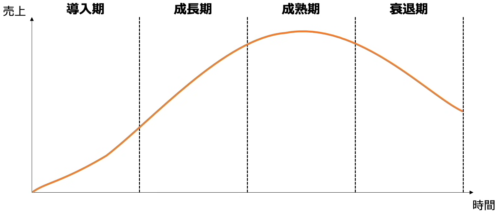

* `コトラーの競争戦略`
    * マーケットシェアの大きさの観点から、競争地位に応じた企業の戦略をとる手法
    * `経営資源の量`と`経営資源の質`によって、リーダー、ニッチャー、チャレンジャー、フォロワーと4つの地位分類

  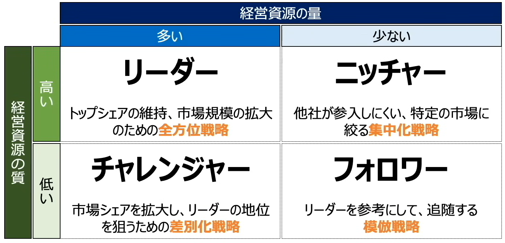

* `マーケティングミックス`（`4P`と`4C`）
    * マーケティングの`フレームワーク`や`ツール`を組み合わせて、自社の商品を`効果的に販売する`手法
    * 製品戦略、価格戦略、チャネル戦略、プロモーション戦略などを組み合わせる
    * プッシュ戦略（メーカーから`小売業者`に対する）：製造業者が、流通業者に何らかのインセンティブ（主に経済的メリット）を提供することで、自社製品を強力に販売し、消費者に商品を提供する戦略（メーカーが消費者に製品を押し出す戦略）
    * プル戦略（メーカーから`消費者`に対する）：製造者が、広告・宣伝などにより消費者に直接働きかけ、消費者から流通業者に自社製品を取り扱うように仕向ける戦略（消費者の需要が製品を引っ張る戦略）

  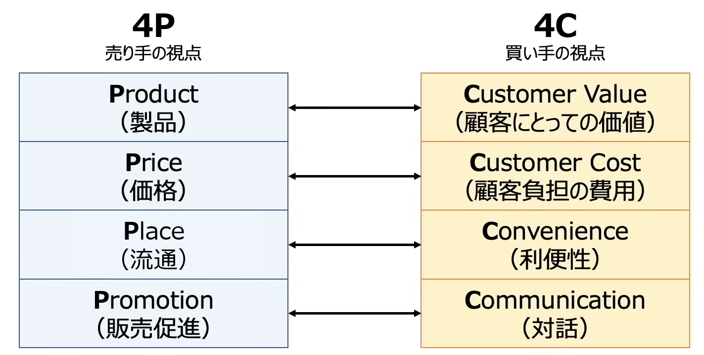

* `コストプラス価格決定法`
    * 製品のコストに`一定のマージンを加えて製品価格`とする、`コスト志向型`の価格設定法

  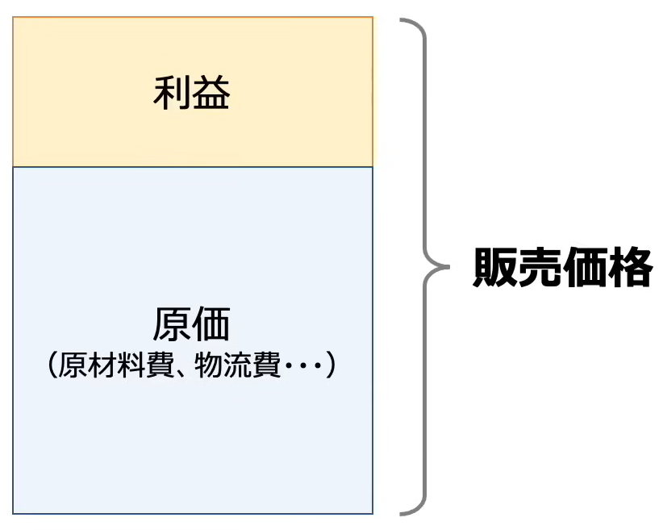

* ゼクメンテーション
    * 顧客市場をある基準で細分化し、その中から最も競争優位に立てる市場を選定すること

************************************************************

### 📖経営管理システム
* 経営管理を効率的に行うための仕組み

* 会社内でバラバラだった情報を一元管理し、企業内・企業間で情報共有する
    * `SCM`
        * Supply Chain Management
        * `調達から販売までの一連のプロセス`（`サプライチェーン`）の情報を一元管理することで、`コスト削減や納期短縮`を目指す
    * `CRM`
        * Customer Relationship Management
        * `顧客に関する情報や購入履歴、クレーム`などを一元管理し、顧客に合った対応をすることで、顧客との良好な関係構築を目指す
    * `ERP`
        * Enterprise Resource PLanning
        * `企業資源計画`
        * 生産・流通・販売・会計などの`基幹業務の情報`を一元管理することで、効率的な経営の実現を目指す
    * `ナレッジマネジメント`
        * 知識管理
        * 企業が保持している情報や、社員が持っている`ノウハウや経験`を一元管理することで、`企業全体の問題解決力を高める`経営を目指す

* 業績評価
    * BSC、`バランススコアコード`
    * 売り上げや利益などの財務観点だけで評価するのではなく、`財務以外の観点`からもバランス良く評価する
    * 経営状況の変化に気づきやすくなり、目標達成のために強化すべくポイントを客観的に判断できる
        * 財務・顧客・内部ビジネスプロセス・学習と成長

  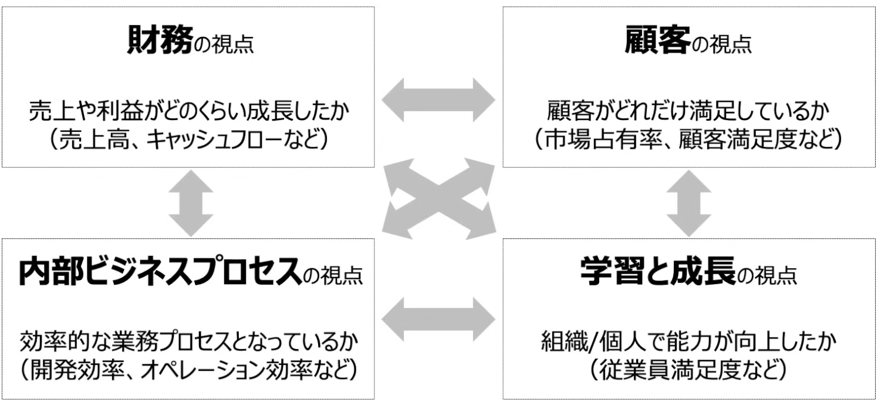

* `バランススコアコード`の４つの視点においで、それぞれ`KGI`/ `CSF`/ `KPI`を設定することで、目標達成までのアクションプランが明確になる
    * `KGI`
        * Key Goal Indicator
        * 目指すべき`最終的な目標`
        * 例：売り上げ高xx% UP
    * `CSF`
        * Critical Success Factor
        * KGIを達成するのに`必要な要素`
        * 例：来客数など
    * `KPI`
        * Key Performance Indicator
        * CSFを達成するための`数値目標`
        * 例：新規顧客数　xx・既存顧客数xx

  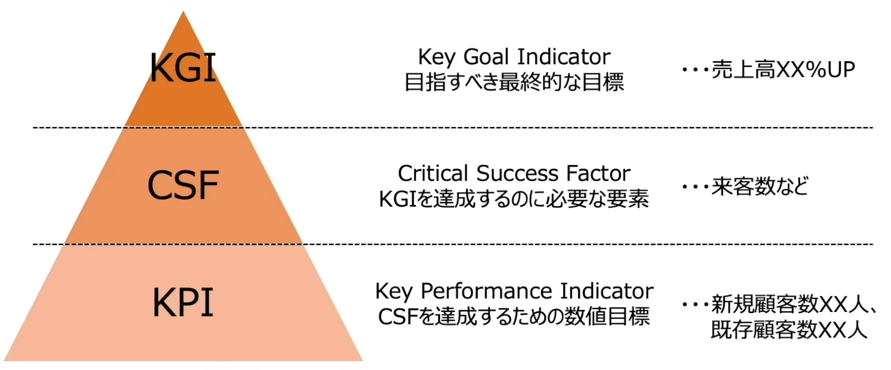

* 技術開発戦略
    * 企業を発展させていくため、今後`開発を進めていくべき技術`や`その技術開発への投資`など、`市場のニーズや将来的な動向を踏まえて方向性`を決定する

* イノベーション
    * 今までにない、新たな価値を生み出すこと

    * `プロダクトイノベーション`：`製品改革`。革新的な新商品を開発するなど、`製品そのものの技術革新`。共同プロジェクトを設置して新規製品を開発する
    * `プロセスイノベーション`：開発や製造、物流などの`プロセスの技術革新`
    * `インクリメンタルイノベーション`：既存製品の部品改良など小さな改善をする技術革新
    * `ラディカルイノベーション`：経営構造など根本的な部分の改革を必要とする技術革新
    * `オープンイノベーション`：社外からアイデアを募集し、新サービスの開発に活用する
    * 破壊的イノベーション：技術革新によって、後発製品が先発製品の市場を衰退させること

    * `コーポレートブランディング`：ブランド向上を図るために、自社製品の革新性についてWebに掲載する

* イノベータ理論
    * 革新的な商品・サービスなどのイノベーションの普及に関する理論
    * 商品購入の態度を新商品購入の早い順に5つの層に分類している

    * イノベータ、Innovators、革新者
        * 冒険心にあふれ、新しいものを進んで採用する人
    * アーリーアダプタ、Early Adopters、初期採用者
        * 流行に敏感で、情報収集を自ら行い、判断する人
        * 他の消費層への影響力が大きく
        * オピニオンリーダー
    * アーリーマジョリティ、Early Majority、前期追随者
        * 比較的慎重派な人
        * 平均より早く新しいものを取り入れる
        * ブリッジピープル
    * レイトマジョリティ、Late Majority、後期追随者
        * 比較的懐疑的な人
        * 周囲の大多数が試している場面を見てから同じ選択をする
        * フォロワーズ
    * ラガード、Laggards、遅滞者
        * 最も保守的な人
        * 流行や世の中の動きに関心が薄い
        * イノベーションが伝統になるまで採用しない
        * 伝統主義者

* 技術のSカーブ
    * 技術は、最初は緩やかに進歩するが、どこかの時点で急激に進歩し、その後伸びなくなる

  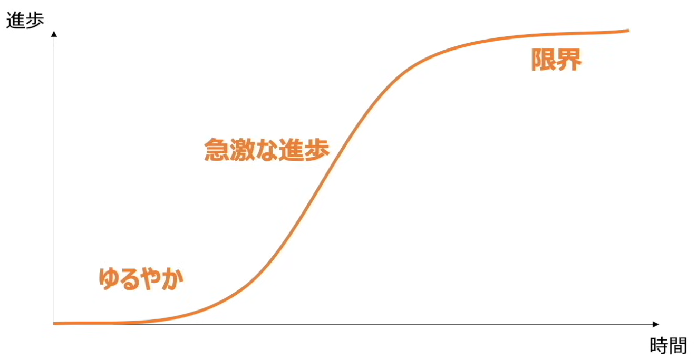

* 業務モデル化
    * システムをモデル化するには、下記通りでDFDを用いて業務のモデル化を進める
        1. 現物理モデル
            * 現行業務の`流れ`を、`物理的な仕組みも含め具体的に表現`したモデル
            * 基幹系の機能とそれに必要なデータ項目を定義する
        2. 現理論モデル
            * 現物理モデルから物理的な仕組みを取り除き、`データを中心として記述した`モデル
            * 既存の情報システムとデータベースの関係を定義する
        3. 新理論モデル
            * 現理論モデルに`新システムに求められる要件`を加えたモデル
            * 組織の機能と帳票とを関連付ける
        4. 新物理モデル
            * 新理論モデルに物理的要件を加え、`新システムの業務遂行の仕組み`を記述した最終的なモデル
            * ビジネスプロセスとデータクラスを関連付ける

************************************************************

### 📖経営組織と会計財務
* 経営組織
    * `職能別組織`（機能別組織）：生産、販売、人事など仕事の機能別
    * `事業部別組織`：`製品や地域別`に各事情部として独立
    * `マトリックス組織`：職能X事業（専門）のマトリックス
    * `プロジェクト組織`：一時的に編成される

  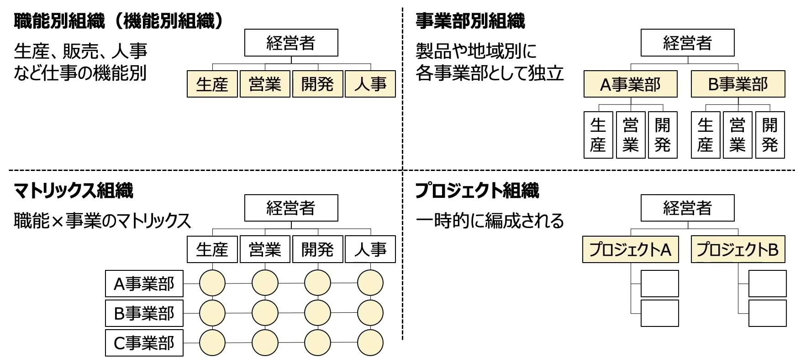

* `CIO`
    * Chief Information Officer
    * 最高情報責任者。`情報`や`情報技術`に関する役員
    * `経営戦略`と`整合性`をとりながら、全社的な視点から情報戦略を立案する

* CEO
    * Chief Executive Officer
    * 最高`経営`責任者
    * `経営戦略`の立案及び`業務執行`を統括する最高責任者
* CFO
    * Chief Financial Officer
    * 最高`財務`責任者
    * `資金調達、財務報告`などの財務面での`戦略策定`及び`執行`を統括する最高責任者
* CHO
    * Chief Human resource Officer
    * 最高`人事`責任者
    * 経営戦略を実現するための人事制度を構築し、勤務の実態を把握するなど管理・運営全般を把握する
* CLO
    * Chief Legal Officer
    * 最高`法務`責任者
    * 企業の法令遵守の体制の構築と運用    
* COO
    * Chief Operating Officer
    * 最高`執行`責任者
* CTO
    * Chief Technology Officer
    * 最高`技術`責任者
    * `自社の技術戦略`や`研究開発計画の立案及`び`執行`を統括する最高責任者

* `ORとIE`
    * 現状の`問題や方を解消するために作業やデータを分析`して課題を解消する運用や改善方法を見つけること
    * `OR`
        * Operations Research
        * 現状の問題に対して数学的に分析し`最適な解決策を見つける`手法
    * `IE`
        * Industrial Engineering
        * 生産現場における作業手順、工程などの`問題を改善するため`の手法

    * 線形計画法：限られた材料・予算の中で、最大の利益や効果を得るためにはどうすればいいかを求める手法

    * 定量的または定性的にデータを分析し、以下のような図解にして整理する
        * 特性要因図
            * フィッシュボーンダイアグラム（魚の骨）
            * 原因と結果の関連を体系的に表しあ図
            * 結果に対して`直接的`なまたは`間接的`な原因を分類でき、真の`問題点を明確に`する

        * パレート図
            * 値が`大きい項目から順に`並べた棒グラフと、その数値の`累積比率`を折れ線グラフで表した図
            * 各項目が全体でどれくらいの割合を占めているかが一目でわかり、`改善活動の優先度`付けができる
            * `ABC分析`：累積比率に対して、Aランク、Bランク、、、とランク付けし、重点項目を把握する

        * OC曲線
            * Operating Characteristic curve。検査特性曲線
            * 製品の抜き取り検査を行う際に、製造ロットの`不良率`と`合格率`の関係を表した図
            * ある不良率のロットがどのくらいの確率で合格できるかがわかる

        * 管理図
            * 工程の状況や品質を時系列に表した図で、工程が安定した状態にあるかどうかを判断するために用いる
            * 日ごとの不良品の個数を記録するしていき、統計的に求めた上方管理限界と下方管理限界を超えた位置に値が記録された場合には、その日に何らかの異常が発生していることがわかる

  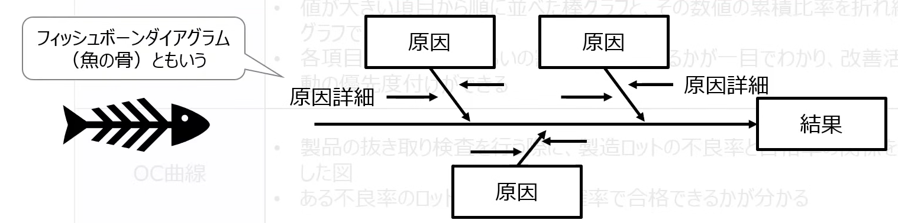
  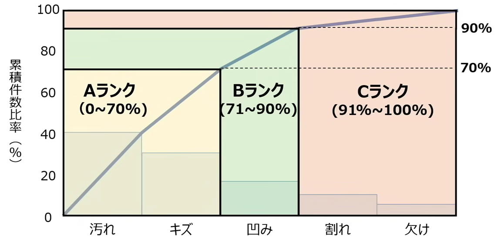
  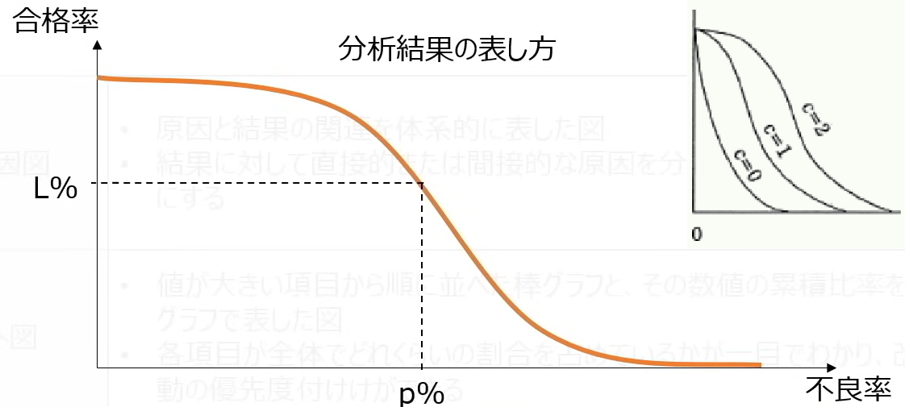
  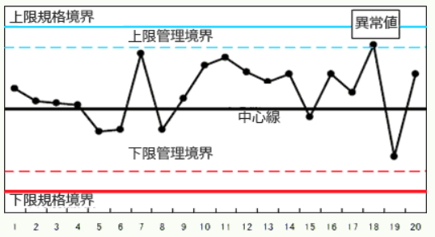

* `利益と費用
    * `売上`と`費用`の差分が`利益`となる
    * 費用：
        * 変動費：売上に比例して発生（材料や運賃）
        * 固定費：売上に関係なく発生（人件費や家賃）
        * 比例：`変動比率`
            * `変動比率 = 変動費 / 売上`
            * `変動費 = 変動比率 * 売上`

* 損益分岐点
    * `売上`と`費用`が一致する`売上高`（=利益が0円）
    * `売上高`が`損益分岐点`を下回ると、赤字
    * `売上高`が`損益分岐点`を上回ると、黒字

    * `損益分岐点の売上` = `変動費` + `固定費`
    * `損益分岐点の売上` = `損益分岐点の売上` * `変動比率` + `固定費`
    * `損益分岐点の売上` * (1 - `変動比率`) = `固定費`
    * `損益分岐点の売上` = `固定費` / (1 - `変動比率`)

  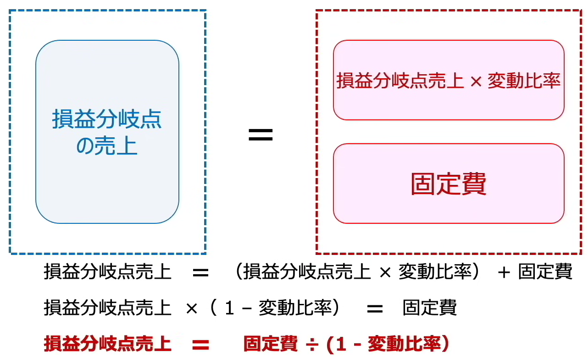

* 財務諸表
    * 企業の`財務状況`や`経営成績`を`ステークホルダーに報告するために作成される`
    * 特に`貸借対照表`(B/S)、`損益計算書`(P/L)、`キャッシュフロー計算書`(C/F)の3つを`財務三表`という

    * `貸借対照表`(B/S)
        * ある時点での企業の財布状況、貯金額
        * 会計期間の期末日時点での財政状態を示したもの
    * `損益計算書`(P/L)
        * 企業が1年間の儲け、家計簿
        * 会計期間に属するすべての収益と費用を記載し、算出した利益を示したもの
    * `キャッシュフロー計算書`(C/F)
        * 企業1年間の現金の流れ

  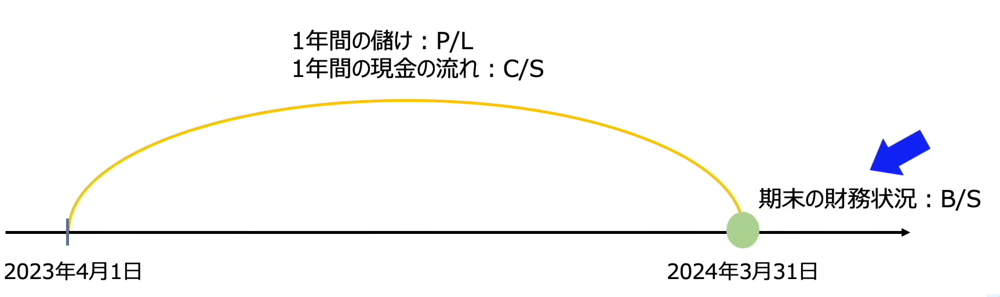
  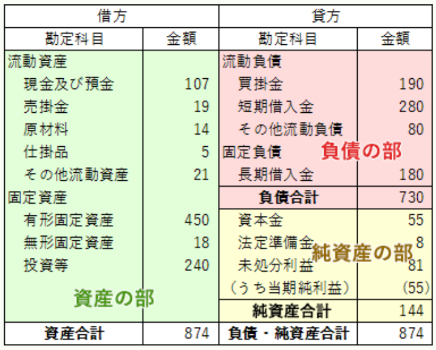

* `貸借対照表`(B/S)
    * 資産・負債・純資産を掲載し、ある時点の財務状況を表す

  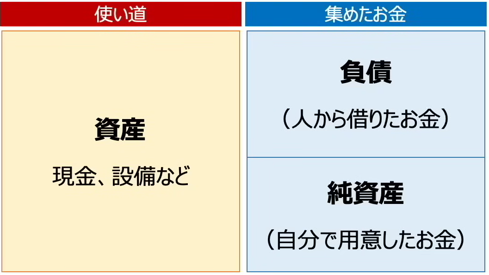

* `損益計算書`(P/L)
    * ある一定期間における収益と費用を明らかにして企業の経営成績を表す
    1. 本業で発生する収支
        1. `売上総利益`：`売上`に関することしか見てない
            1. 売上：商品の売上
            2. 売上原価：商品の部品の価格
        2. `営業利益`：売上総利益から人件費なども引き、`営業全体の利益`
            3. 販売費及び一般管理費：人件費、広告費
    2. 本業ではないが`頻繁に発生する`収支
        3. `経常利益`：営業利益に本業以外の収支を考慮したものが経常利益（=`毎年発生する費用を考慮したもの`）
            4. 営業外収益：株の配当など
            5. 営業外費用：従業員が起こした事故の賠償
    3. その他の`レアケース`収支&`税金`を考慮した収支
        4. `税引前当期純利益`：経常利益に`レアケース`を考慮
            6. 特別利益：株の売買による収益など
            7. 特別損益：天災による損失
        5. `当期純利益`：`税金`も考慮して、最終的に残った利益
            8. 法人税、住民税及び事業税等：税金

  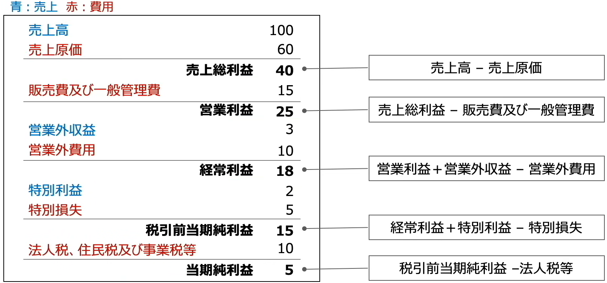

* `キャッシュフロー計算書`(C/F)
    * ある一定期間における資金の増減を`営業活動`・`投資活動`・`財務活動`ごとに区分して表す

    * `営業活動`によるキャッシュフロー
        * 企業の中心的な事業がいくら資金を生み出ししているかを示す
        * 商品の仕入れによる支出
        * 例：車の`販売`によるキャッシュ、商品の仕入れによる支出
    * `投資活動`によるキャッシュフロー
        * `設備投資や事業への投資`など投資活動による資金の増減を表す
        * 有形固定資産の売却による収入
        * 例：車の`工場に投資`、有形固定資産の売却による収入
    * `財務活動`によるキャッシュフロー
        * `資金の調達`や`返済`における資金の増減を表す
        * 株式の発行による収入
        * 短期借入金の返済による支出
        * 例：銀行から`資金を調達する`、株式の発行による収入、短期借入金の返済による支出

* 減価償却資産と減価償却（げんかしょうきゃく）
    * 設備や機械など時間の経過とともに価値が減っていく資産を`減価償却資産`という
    * 減価償却資産は、時間の経過とともに`目には見えない費用`が発生する

    * `定額法`/ `定率法`：毎年同じ価格で減価償却すること
    * `1年の減価償却費` = (`取得価格` - `残存価格`) / `耐用年数`
    * `取得価額`：購入金額
    * `耐用年数`：利用可能な年数（法律で定められている）
    * `残存価額`：耐用年数が経過した際の価値（基本は0となることが多い）

* 先入先出法（在庫）評価
    * 先に仕入れた商品から先に販売したと仮定して、在庫を計算する方法

************************************************************

### 📖法規と標準化
* 知的財産権
    * 人の知的活動によって生み出されたアイデア、デザインなどの`知的財産`の価値を保護する権利
    * 文化に関わる`著作権`と産業に関わる`産業財産権`に分けられる

  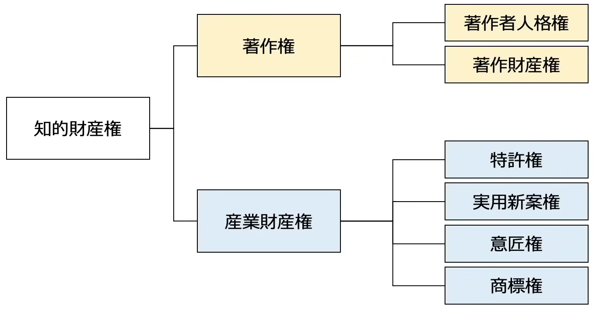

* `著作権`：文芸、学術、美術、音楽などの著作物について、作品がどう使われるかを決めることが出来る
    * `著作人格権`：著作者の`思いや名誉を守る`
        * `同一性保持権`：他人に作品を無断で修正されないように要求する
        * `公表権`：未公表の著作物を公表するかなどを決定する
        * `氏名表示権`：著作物を表示するか、ペンネーム表示するかなどを決定する
    * `著作財産権`：著作物の利用を許可して`利益`を得る
        * `複製権`

* プログラムやWebページも著作権の対象となり、試験では`著作権対象有無や権利の帰属先`が問われる
    * コンピューターに関する著作物
        * `プログラム`は、`著作権の保護対象`
        * `プログラム言語`、`プログラム規約`、`アルゴリズム`は、著作権の`保護対象外`

        * A社がB車に`プログラム開発を委託`した場合、著作権は委託者（A社）ではなく`製作者（B社）にある`
        * 就業規則などに特段取り決めがない限り、権利は法人に帰属する

  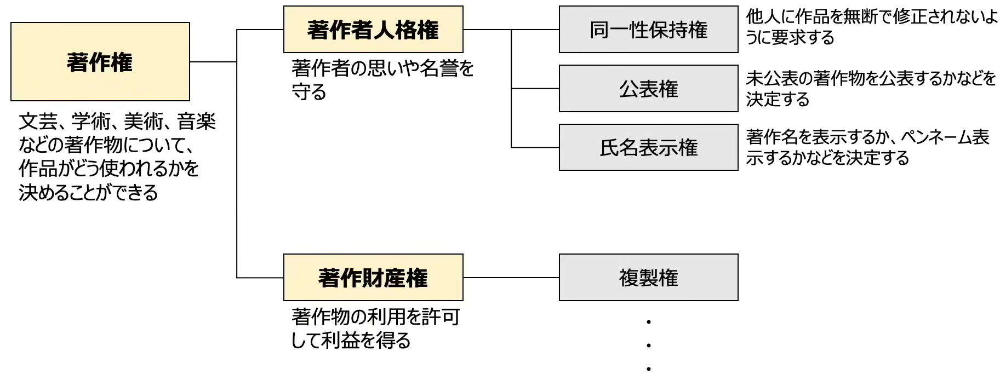

* `産業財産権`：新しい技術やデザインが模倣されないよう独占権を与えて産業の発展を保護する権利
    * `特許権`：創作性の高い新しい発明を保護
        * `特流通促進事業`：民間企業が保有する休眠特許を発掘し、他企業にライセンスして活用を図る
    * `実用新案権`：物品の構造・形状の考案を保護
    * `意匠権`：デザインを保護
    * `商標権`：商品のマークやロゴを保護

    * TLO(Technology Licensing Organization)法
        * 大学の研究成果を特許化し、又は企業への技術移転を支援し、産学の仲介役を果たす

  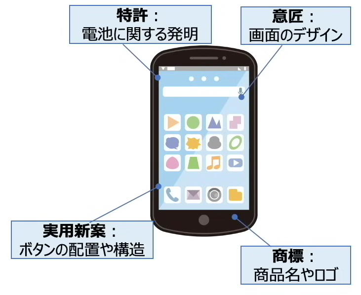

* セキュリティに関する主な法律は以下の通り
    * `不正アクセス禁止法`：不正アクセス行為とそれを助長する行為を禁止する法律 
        * 無断で他人のID・パスワードを使って、コンピューターにアクセスする
        * 本人の許可なく第三者にID・パスワードを教える
        * `コンピューターウィルスを用いて`、企業で使用されているコンピューターのデータを消去した場合、`刑法に罰せられる`
    * `サイバーセキュリティ基本法`：サイバーセキュリティに関する施策の基本理念や戦略を定めた法律
        * サイバー攻撃から情報資産を守るために定められている
    * `個人情報保護法`：氏名や生年月日、住所などの個人情報を保護する法律
        * 個人の権利や利益を守ることを目的に定められている

* 労働関連法規
    * `労働者派遣契約/請負契約`：
        * `労働者派遣契約`：派遣元企業（派遣会社）が雇用する労働者が、`派遣先企業の指揮命令を受け`て仕事を行う契約
        * `請負契約`：請負会社が仕事の完成を約束し、発注企業はその成果物に対して報酬を支払う契約
    * `労働基準法`：賃金や労働時間など、労働者に適用される労働条件の`最低基準`を定めた法律

    * 準委任契約
        * 通常の委託契約（請負契約）と同様に別の組織に業務を委託する契約ですが、仕事の完成を契約の目的とする請負契約と異なり、`委託された仕事の実施`自体を目的とする契約形態
        * 受託者は善良な管理者の注意をもって委託事務を処理する義務を負うものの、`仕事の完成についての義務は負わない`
        * 主に業務分析やIT戦略のコンサルティングなど成果物が特定されていない状況で結ばれる

  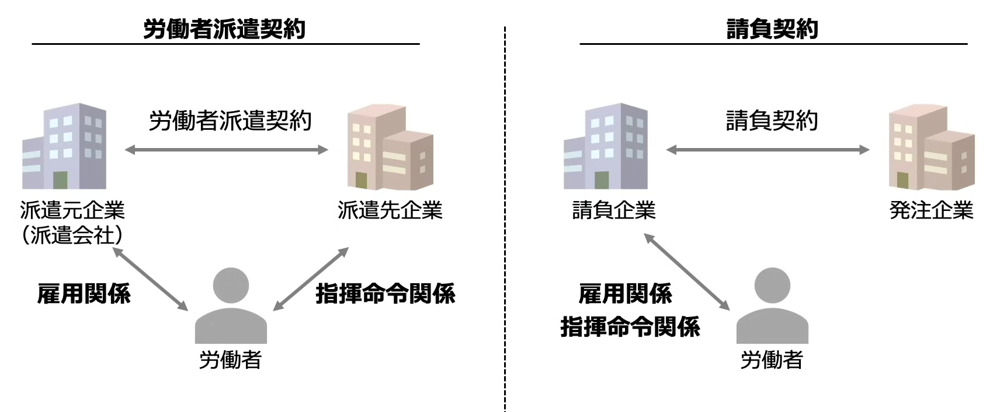

||請負契約|準委託契約|
| --- | --- | --- |
|契約目的|仕事の完成|仕事の遂行|
|成果物の完成責任|ある|ない|
|受託者の義務・責任|仕事の完成 契約不適合責任|報告責任 善管注意義務|
|著作権の帰属|受託者|委託者|

* 特定商取引法
    * 訪問販売や通信販売などのトラブルが生じやすい取引において、購入者が受ける被害を防止するために事業者が守るべき義務を定めた法律
    * 対象とばる取引には以下のように規制・ルールが定められており、違反した場合には行政処分や罰則の対象となる
        * 氏名等の明示の義務付け
        * 不当な勧誘行為の禁止
        * 虚偽・誇大な広告の禁止
        * クーリング・オフ制度の適用
    * `シュリンクラップ契約`：Shrink-wrap。購入者が`ソフトウェアのパッケージを開封する`ことで、`使用許諾に同意した`とみなす契約

* 標準化
    * 仕様や構造などを同じものに統一すること

    * `ISO`：
        * International Organization for Standardization
        * `国際標準機構`が制定する、サービスや品質に関する国際的な基準

        * `ISO 9000`      シリーズ：`品質`マネジメントシステム
        * `ISO 14000`     シリーズ：`環境`マネジメントシステム
        * `ISO/IEC 20000` シリーズ：`ITサービス`マネジメントシステム
        * `ISO/IEC 27000` シリーズ：`情報セキュリティ`マネジメントシステム

    * `JIS`：日本産業標準調査会が制定する、日本の産業製品に関する規格（=日本の国家規格）
        * [JISC 日本産業標準調査会](https://www.jisc.go.jp/)
        * `ISOと対応可能`
        * `ISO 9000`      シリーズ：JIS Q 9000 シリーズ
        * `ISO 14000`     シリーズ：JIS Q 14000 シリーズ
        * `ISO/IEC 20000` シリーズ：JIS Q 20000 シリーズ
        * `ISO/IEC 27000` シリーズ：JIS Q 27000 シリーズ

        * `JIS X 0160`：ソフトウェアライフサイクルプロセス
            * ソフトウェアの取引における供給者の責任だけでなく、購入者の責任も規定している
            * 受入基準及び手続の明確化

    * `IEEE`：`米国`の`電気や電気工学`に関する学会が制定する、`LANケーブル`などの標準規格

    * `IETF`：
        * The Internet Engineering Task Force
        * インターネット技術特別調査委員会
        * インターネットで利用される技術の標準化を図り、技術仕様を`RFC`として公開

    * ANSI：
        * アメリカ合衆国に本部を持つ電気・電子技術の学会が定めた規格

* ソフトウェアパッケージのライセンス契約形態
    1. `サイトライセンス`
        * 特定の企業や団体などにある複数のコンピューターの使用を一括して認める
    2. `ボリュームライセンス`
        * `特定のコンピューター`または一定数のコンピューターの使用を認める
        * `特定のユーザー`または一定数のユーザーに使用を認める
    3. `サーバライセンス`
        * `特定のサーバー`に`インストール`し、そのクライアントでの使用を認める
    4. `クリックラップ契約`/`オンクリック契約`
        * ソフトウェアをインターネットからダウンロードしたとき画面に表示される契約内容に同意するを選択することによって、使用が許される契約

* フランチャイズチェーン（FC）
    * 本部が契約した加盟店に対して、営業権や商標の使用権、出店や運営のノウハウを提供し、その見返りとして加盟店からロイヤルティを徴収するという関係を有した小売り形態

* リテールサポート
    * 卸売業・メーカーが小売店の経営活動を支援することによって、自社との取引量の拡大につなげる手法