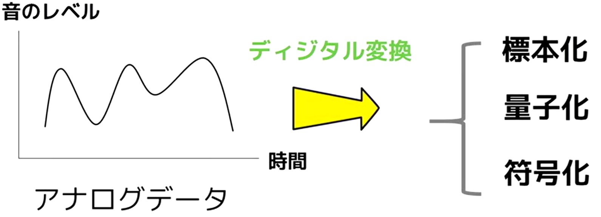

▶A/D変換

* [1. データ表現のための基本知識](#データ表現のための基本知識)
* [2. ディジタルデータへの変換方法](#ディジタルデータへの変換方法)
* [3. データと機器の制御（コントロール）](#データと機器の制御コントロール）)

* 用語集

|用語|意味|
| --- | --- |
|k(キロ)|103|
|M(メガ)|106|
|G(ギガ)|109|
|T(テラ)|1012|
|m(ミリ)|10-3|
|μ(マイクロ)|10-6|
|n(ナノ)|10-9|
|p(ピコ)|10-12|
|A/D変換|`アナログデータ`を`ディジタルデータ`に変換する|
|画像データ|データサイズ：(`画像全体のドット数`) * (`色の情報を保持するビット数`)|
|PCM変換|1. `標本化`で`サンプリング周期`を短くする（細かく`縦に`区切る） 2. `量子化`で`量子化ビット`を多くする（細かく`横に`区切る） 3. 符号化：量子化で数値化した値を2進数に変換|
|サンプリング周波数(Hz)|1秒あたりのサンプリング回数|
|サンプリング周期|（一定時間単位）`1 / サンプリング周波数`|
|センサ|温度や湿度などアナログデータを取得（温度計、湿度計）|
|CPU|情報処理/機器制御|
|アクチュエータ|電気信号を物理的な操作に変換（モーター、電磁石）|
|シーケンス制御|予め定められた順序や条件に従って機器を制御|
|フィードバック制御|外乱の影響をセンサで検知してコンピューターが修正|
|フィードフォワード制御|外乱の影響を予測して予め修正|

************************************************************

### 📖データ表現のための基本知識
* アナログデータ：時間/値的に連続したデータ（1 → 1.1 → 1.2 → .... → 2）
* ディジタルデータ：とびとびで段階的なデータ（1 → 2）
    * とびとびの値が小さいほど、精度の高いディジタルデータになる

* 基本の利用
    * `アナログデータ`を`ディジタルデータ`に変換するの略：`A/D変換`
    1. `A/D変換`によりコンピューターに保存
    2. `A/D変換`によりコンピューターが機器を制御

* 利用する概念
    * ビットとバイト
        * ビット：コンピューターの扱う最小単位で0か1を表現
        * バイト：ビットを8個集めたバイトという単位を主に使用（256通り）
    * 補助単位
        * 大きい/小さい数値を表現する際に使用
        * 例: 1,000 m のことを 1kmとあらわす時に見るkが補助単位

|補助単位|意味|
| --- | --- |
|k(キロ)|103|
|M(メガ)|106|
|G(ギガ)|109|
|T(テラ)|1012|
|m(ミリ)|10-3|
|μ(マイクロ)|10-6|
|n(ナノ)|10-9|
|p(ピコ)|10-12|

************************************************************

### 📖ディジタルデータへの変換方法
* 画像データのA/D変換
    * ビットマップ方式、画像をドットの集まりで表示（ドット絵など）
        * ドットの数 → 解像度
        * 画像の色 → 一つのドットにつき、X色の情報を要する
            * 白黒のみの場合：1ビット（21）
            * フルカラーの場合：24ビット(224 = 16,777,216色)
        * データサイズ：(`画像全体のドット数`) * (`色の情報を保持するビット数`)

* 音声データ
    * アナログデータ
        * 横軸：時間
        * 縦軸：音のレベル
    * ディジタルデータ（`PCM変換`）
        * 標本化（サンプリング）：一定時間単位でデータを区切り標本を抽出
            * 時間単位が細かく区切るほど変換が正確になる
            * `サンプリング周波数(Hz)`：1秒あたりのサンプリング回数
            * `サンプリング周期`（一定時間単位）： `1 / サンプリング周波数`
            * 例：1秒で100回サンプリング→一回のサンプリングは1/100秒が必要→サンプリング周波数 = 100Hz
        * 量子化：測定したデータを数値化。音のレベルを区切って数値化する
            1. 音のレベルをX段階に区切って各サンプルに数値を割り振る
            2. 連続データからとびとびデータへ
            * `量子化ビット`：データの段回数を決定するビット
        * 符号化：量子化で数値化した値を2進数に変換
        * 正確に変換するには、データ量も大きくなる
            1. `標本化`で`サンプリング周期`を短くする（細かく`縦に`区切る）
            2. `量子化`で`量子化ビット`を多くする（細かく`横に`区切る）
        * x Hz * 量子化ビット = Y ビット -> データ量はY ビット
        * サンプリング周期1秒の間にサンプリング周波数11,000Hz。各サンプリング8ビットのデータを記録する。512*106バイトの容量を持つ場合最大何分の音声データを何分記録できる？

  

************************************************************

### 📖データと機器の制御（コントロール）
エアコンのは温度を検知して機械を制御する  
→`温度`というアナログデータがデジタルデータに変換されエアコンの中のコンピューターに入り、そのコンピューターが処理を行って`エアコンを制御する`
→温度をA/D変換してコンピューターに入力することは目的ではなく手段で、本当の目的は`入力されたデータを用いて`部屋の温度を適切に保つためにエアコンを`制御する`こと  

* 機器の制御の仕組み
    * `センサ`：温度や湿度などアナログデータを取得（温度計、湿度計）
    * センサで取得したデータにA/D変換を行う
    * `CPU`：情報処理/機器制御
    * アクチュエータにデータを送信するためにD/A変換を行う
    * `アクチュエータ`：電気信号を物理的な操作に変換（モーター、電磁石）

* 機器の制御方式
    * `シーケンス制御`：予め定められた順序や条件に従って機器を制御
        * 洗濯機はワンボタンで一連の動作を行う
    * `フィードバック制御`：外乱の影響をセンサで検知してコンピューターが修正
        * エアコン付けてる中、扉を開けたため`冷気が入ったため`（外乱の影響）、冷気を検知して風量を上げる
    * `フィードフォワード制御`：外乱の影響を予測して予め修正
        * 人の動きなどから冷気が入ってくることを予測して`冷気が入る前に対応を`行う
