▶ハードウェア

* [1. ハードウェアの5大装置](#ハードウェアの5大装置)
* [2. cpu](#cpu)
    * [命令実行手順](#命令実行手順)
    * [アドレス指定方式](#アドレス指定方式)
    * [CPUの性能評価](#cpuの性能評価)
    * [CPUの性能向上](#cpuの性能向上)
* [3. 主記憶装置](#主記憶装置)
    * [メモリの分類](#メモリの分類)
    * [メモリの高速化](#メモリの高速化)
* [4. 補助記憶装置](#補助記憶装置)
    * [ハードディスクの記憶容量](#ハードディスクの記憶容量)
    * [ハードディスクのアクセス時間](#ハードディスクのアクセス時間)
    * [ハードディスクのデータ管理](#ハードディスクのデータ管理)
    * [ハードディスクの性能向上](#ハードディスクの性能向上)
    * [その他補助記憶装置](#その他補助記憶装置)
* [5. 入出力装置](#入出力装置)
    * [入出力装置](#入出力装置)
    * [入出力インターフェース](#入出力インターフェース)

* 用語集

|用語|意味|
| --- | --- |
|ノイマン型コンピューター|主流<br>プログラム内蔵方式：プログラムを実行するタイミングでデータを`主記憶装置`に読み込ませる<br>逐次制御方式：命令を前から一つずつ取り出し、順番に実行していく|
|ノイマン型コンピューター|主流。プログラム内蔵方式で命令を主記憶装置に読み込み、逐次制御方式で順番に実行する方式|
|CPU|中央処理装置。コンピューターの「脳」にあたり、制御装置と演算装置から構成される|
|制御装置|CPUの一部。命令を解釈し、各装置の動作を制御する|
|演算装置（ALU）|CPUの一部。演算・計算処理を実行する|
|レジスタ|CPU内部の高速小容量記憶装置。命令やデータを一時的に保存する|
|プログラムカウンタ（プログラムレジスタ）|次に実行する命令のアドレスを保持|
|命令レジスタ|実行する命令を一時的に記憶。命令部とオペランド部を含む|
|インデックスレジスタ|基準アドレスを保持（インデックスアドレス指定方式で使用）|
|ベースレジスタ|基準アドレスを保持（ベースアドレス指定方式で使用）|
|アキュムレーター|演算対象や演算結果を保持|
|汎用レジスタ|用途を限定せず様々な目的で使用|
|フェッチ（命令取り出し）|命令をメモリから取り出し、命令レジスタに格納する処理|
|オペランド読み出し|命令に指定されたデータをメモリから取得しレジスタに格納する処理|
|即値アドレス指定方式|オペランド部の値そのものを使用する方式|
|直接アドレス指定方式|オペランド部に書かれたメモリアドレスのデータを使用する方式|
|間接アドレス指定方式|オペランド部に書かれたアドレスのアドレスを参照し、データを取得する方式|
|インデックスアドレス指定方式|オペランド部 + インデックスレジスタ値をアドレスとしてデータを使用|
|ベースアドレス指定方式|オペランド部 + ベースレジスタ値をアドレスとしてデータを使用|
|相対アドレス指定方式|オペランド部 + プログラムカウンタ値をアドレスとしてデータを使用|
|クロック周波数|CPUが1秒間に動作するクロックの回数。Hzで表す|
|CPI(ClockcyclesPerInstruction)|1命令を実行するのに必要なクロック数|
|MIPS|1秒間に実行できる命令数（百万単位）|
|逐次制御方式|CPUが1命令ずつ処理する方式|
|パイプライン方式|命令の各段階を並行処理することでCPU速度を向上させる方式|
|分岐予測|分岐命令の結果を予測して命令を先行実行する技術|
|投機実行|分岐予測に基づき命令を先行実行すること|
|スーパーパイプライン|命令実行手順を細分化し、パイプライン処理効率を上げる|
|スーパースカラ|複数のパイプラインを持ち、同時に複数命令を実行する|
|CISC|複雑な命令体系を持つCPU設計思想|
|RISC|単純な命令体系を持ち、高速に命令を実行するCPU設計思想|
|RAM|揮発性の主記憶装置。自由に読み書き可能|
|DRAM|コンデンサ回路でデータを保持するRAM。主記憶装置に使用|
|SRAM|フリップフロップ回路でデータ保持。高速だが高価|
|ROM|不揮発性。読み出し専用メモリ|
|マスクROM|工場出荷時に書き込み済み。以後書き込み不可|
|PROM|書き込み可能なROM|
|EPROM|紫外線照射で全消去可能なROM|
|EEPROM|電圧で部分消去可能なROM|
|フラッシュメモリ|EEPROMの一種でブロック単位で書き換え可能|
|キャッシュメモリ|CPUと主記憶装置間の高速中間メモリ|
|ヒット率|キャッシュにデータがある確率|
|ライトスルー方式|キャッシュと主記憶装置両方に同時書き込み|
|ライトバック方式|キャッシュにのみ書き込み、満杯時に主記憶へ書き戻す|
|メモリインタリーブ|主記憶装置を分割し、並列にデータ読み出しを行う高速化手法|
|HDD|磁気ディスクでデータを長期保存する補助記憶装置|
|プラッタ|HDD内部の磁性体ディスク|
|セクタ|HDDにおけるデータの最小記録単位|
|トラック|セクタが一周した円周|
|シリンダ|複数トラックを縦に重ねた単位|
|アクセスアーム|磁気ヘッドを目的位置に移動させる装置|
|位置決め時間（シーク時間）|HDDヘッドを目的トラックに移動させる時間|
|回転待ち時間（サーチ時間）|目的セクタがヘッド下に来るまでの回転時間|
|データ転送時間|HDDからデータを読み書きする時間|
|フラグメンテーション|データの断片化。アクセス効率低下の原因|
|デフラグ|断片化したデータをまとめる作業|
|RAID|複数HDDを束ねて1つのストレージのように使う技術|
|RAID0|ストライピング。複数HDDに分散書き込み。高速だが冗長性なし|
|RAID1|ミラーリング。複数HDDに同じデータを書き込む。信頼性高い|
|RAID5|ストライピング＋パリティ。3台以上HDDで分散記録。高速かつ冗長性あり|

<p align="center">
  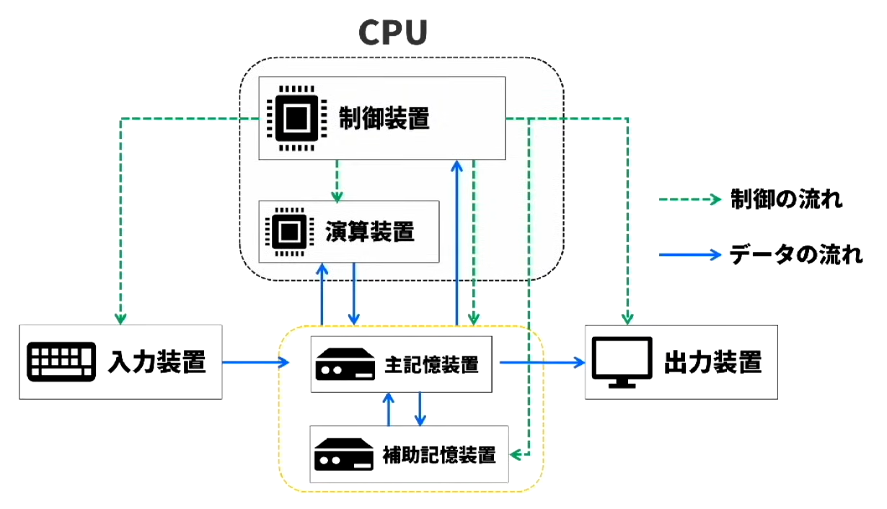
</p>

************************************************************
<div style="page-break-after: always;"></div>

### 📖ハードウェアの5大装置
* コンピューターの構成要素
    * ハードウェア：キーボードやマウスなど直接触ることが出来るもの
    * ソフトウェア：Excelなど直接触ることが出来ないもの

* CPU(コンピューターの脳みそ)
    * `制御装置`：命令を解釈してコンピューターの動作を制御
    * `演算装置`：データの計算や演算処理を実行
        * どのように命令を実行してパソコンを制御するか
        * CPUの性能はどうやって評価するか
        * どうすればCPUの性能を上げることができるか
* `記憶装置`：プログラムやデータを保存しておく装置（`RAM`など）
    * `主記憶装置`：データを`一時的に`保存する装置（`メモリ`） → 容量が`小さい`・読み書きが`速い`
        * `メモリの分類・高速化手法`
        * 命令そのもの/ 処理に必要なデータ/ その他データ
    * `補助記憶装置`：データを`長期間`保存する装置（`HDD`、`SDD`など） → 容量が`大きい`・読み書きが`遅い`
        * `HDDに関する問題`
* 入出力
    * `入力装置`：データを入力する機械（マウス・キーボードなど）
    * `出力装置`：データを出力する機械（モニター・プリンターなど）
    * 試験の出題頻度は高くないので代表的な装置や出題される分野に絞ればと

* 流れ
    * 命令実行時に`補助記憶装置`から`主記憶装置`へプログラム（命令）を移す
        * 命令に含むデータ：命令そのもの/ 処理に必要なデータ/ その他データ
    * `主記憶装置`のプログラムをCPUが読み込む

<p align="center">
  
</p>

* `制御の流れ`は`制御装置`から各装置へ
* `データの流れ`は`入力装置から記憶装置を経由して`各装置へ

* メモリ処理について
    * 上に行くほど速い・小さい・高い
    * 下に行くほど遅い・大きい・安い
```
CPU
 ├─ レジスタ（最速・最小）
 ├─ キャッシュ（速い・小）
 │    ├─ L1
 │    ├─ L2
 │    └─ L3
 └─ ↓
メインメモリ（RAM）
 └─ ↓
ストレージ（SSD / HDD）
```

* ノイマン型コンピューター
    * 主流
    * プログラム内蔵方式：プログラムを実行するタイミングでデータを`主記憶装置`に読み込ませる
    * 逐次制御方式：命令を前から一つずつ取り出し、順番に実行していく

************************************************************
<div style="page-break-after: always;"></div>

### 📖CPU

<p align="center">
  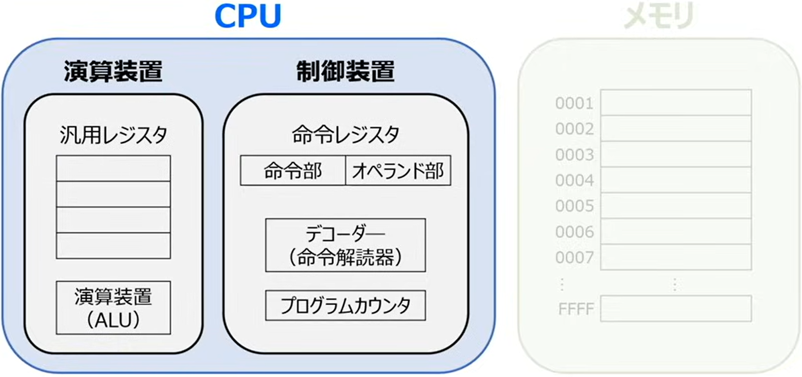
</p>

* 制御装置
    * レジスタ：命令やデータを一時的に保存する`CPU内部`の記憶装置
        * CPUのど真ん中
        * 数はめちゃ少ない（数十〜数百）
        * アクセス速度：`最速`
        * `超小容量`（iPhoneの平均的なストレージ128GBの100億分の1以下）
        * プログラムから直接は見えない（ほぼ）

    * デコーダー（命令解読器）
        * 命令を解読して必要な装置に支持を出す
    * 補足：
        * キャッシュ：RAMからとってきたデータを置いておく`CPU側`の記憶装置

* レジスタの種類：

|名称|役割|
|   ---   | ---   |
|`プログラムカウンタ`<br>`（プログラムレジスタ）`|次に実行する命令のアドレスを記憶|
|`命令レジスタ`|実行する命令を一時的に記憶<br>`命令部`：命令を格納<br>`オペランド部`：対象データがどこにあるか格納<br>※実際は「データがどこにあるか」をいろいろな方法で表現（アドレス指定方式）|
|インデックスレジスタ|基準アドレスを記憶（インデックスアドレス指定方式を使用）|
|ベースレジスタ|基準アドレスを記憶（ベースレアドレス指定方式を使用）|
|アキュムレーター|演算対象や演算結果を記憶|
|`汎用レジスタ`|用途を限定せず、各主目的で使用|

* 演算装置
    * 演算装置（ALU）：演算を行う装置
    * 汎用レジスタ：演算結果を一時的に保存するなど様々な用途で使用
    * 基本上記二つで足りるが、インデックスレジスタやベースレジスタが入ることもある

#### 命令実行手順

<p align="center">
  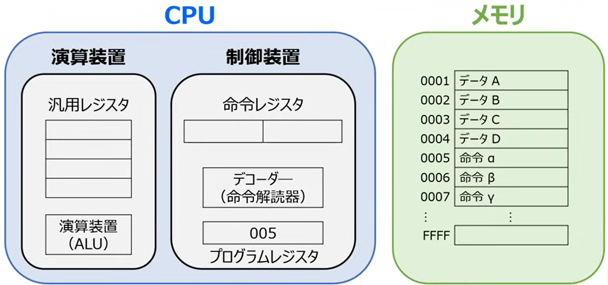
</p>

以下にて、上の画像を例にして命令実行手順を説明する

1. `命令取り出し（フェッチ）`
    * `プログラムレジスタ`は次の命令を格納されている`メモリ`のアドレスを保持しているため、`プログラムカウンタ`のアドレスを参照することで次に実行する命令がわかる（`プログラムカウンタ`: 005 → `メモリ`：0005 命令α）
    * 命令を取り出して実行する
    * 実行するために取り出した命令を一時的に`命令レジスタ`に記憶する
        * 命令は`命令部`と`オペランド部`で構成されているため、`命令レジスタ`にα命令部とαオペランド部が記憶される
    * `命令レジスタ`に命令が記憶されたら、プログラムカウンタは次の命令に備えて数字を1増やす
2. `命令の解読`
    * `命令レジスタ`に格納された命令の`命令部`がオーダーに送られ、中身を解読される
        * 例：命令が足し算の場合、演算装置に処理を行うための信号を飛ばすなど、命令に応じて機器を制御する
3. `オペランド読み出し`
    * `オペランド部`にはデータの場所に関する情報が入っているため、色々な方法でデータの場所を指定する
    * 例（メモリアドレスを使用する）：
        1. αオペランド部 = 0001番のデータを使用する
        2. 0001アドレスに格納されているデータAを取り出して使用
        3. 取り出したデータは`汎用レジスタ`に保存される
4. `命令実行`
    * 命令が演算処理の場合、
        1. 汎用レジスタに記憶されたデータを、演算装置に読み込ませる
        2. 演算装置が計算を行う
        3. 結果を`汎用レジスタ`に書き戻す
        4. 命令の取り出しに戻り、命令を実施する

#### アドレス指定方式
1. `即値アドレス指定方式`：オペランド部の値をデータとして使用
    * デメリット：もしほかのデータを使って計算しようとすると、命令の中のオペランド部そのものを書き換える必要がある`（推奨しない）`
2. `直接アドレス指定方式`：オペランド部に入ってる値のメモリアドレスに入ってるデータを使用（辞書のような）
    * データを変えたい場合、命令を変動せずに、該当アドレスに入ってるデータを置き換えればおｋ
3. `間接アドレス指定方式`：オペランド部に入ってる値の`メモリアドレスに入ってる`値の`メモリアドレスに入ってる`データを使用
    * 0001メモリ:2　　⇒　これから演算に使用するデータが格納されているメモリアドレス
    * 0002メモリ:201　⇒　演算に使うデータ
    * メリット：`直接アドレス指定方式`より自由度がより高い
4. `インデックスアドレス指定方式`：オペランド部に`インデックスレジスタの値`を加算した値の`アドレスに入ってるデータ`を使用
    * `インデックスレジスタの値`を変更すればオペランド部を変更せずに済む
    * 活躍ポイント：`連続したアドレスを扱うとくに用いる`
5. `ベースアドレス指定方式`：オペランド部に`ベースレジスタの値`を加算した値のアドレスに入ってるデータを使用
    * ベースレジスタはプログラムが`メモリに移された際の先頭アドレス`を記憶
    * `読み込むメモリの場所が異なっても、相対的な位置関係を保つことで、実行する際に命令を変えなくて済んで、同じデータを取得可能`
6. `相対アドレス指定方式`：オペランドに`プログラムカウンタの値`を加算した値の`アドレスに入ってるデータ`を使用
    * プログラムカウンタは次に実行されるアドレスを保持すしているので、ベースレジスタを指定方式と同様相対的な位置関係を保つことが可能
    * `ベースレジスタを持たないCPUで使われる`

#### CPUの性能評価
* CPUの性能が良いほど処理が高速

* クロック周波数（`クロック周波数`が大きいほど性能がいい）
    * `足並みを揃えて動く`特徴　⇒　電圧の高い/低いで合図を出している
    * 電圧の高い低い状態を一定間隔で繰り返し、電圧が高くなったタイミングでCPUが足並みを揃えて動くイメージ
    * `電圧信号　⇒　クロック信号`
    * `高い低いの1周期 = 1クロック`
    * `クロック周波数`（Hz）：`1秒間のクロック数`　⇒`クロック周波数`が高いほど性能がいい 
    * `1クロックに必要な時間` : `1 / クロック周波数`（秒）

```
Hz = 回 / 秒
→ 1回 = 1 / Hz 秒

1GHz → 10⁹Hz
→ 10⁻⁹ 秒

1 Hz = 1クロック/秒
1 kHz = 1,000クロック/秒
1 MHz = 1,000,000クロック/秒
1 GHz = 1,000,000,000クロック/秒
```

* CPI(Clock cycles Per Instruction)
    * `1命令当たり何クロック必要か`
    * `1 (s) / X (クロック数、Hz)`
        * 1秒間に1億回動けるCPUでも1命令を処理するために1万回数動く場合
        * 1秒間100万回しか動けないCPUでも1命令を処理するために1回数動く場合
    * 例：1命令あたり2クロック必要：2CPI

```
MIPS = クロック周波数 / (CPI × 10⁶)
     = 10⁹ / (5 × 10⁶)
     = 200 MIPS
```

* MIPS(Million Instructions Per Second)
    * `1秒間に実行できる命令の数（百万単位）`
    * 1秒間で実行できる命令数⇒1つの命令に必要な時間が分かれば算出可能
    * 命令は複数のクロックを使用
        1. 何個のクロックが必要？    ⇒　CPIから算出
        2. 1クロックは何秒          ⇒　クロック周波数から算出
    * 100万 = 10<sup>6</sup>

* お題：5CPI、クロック周波数1GHzとしてMIPSを計算する
    1. 何個のクロックが必要？    ⇒　CPIから
        * CPI = 1命令あたり必要なクロック数
        * 5クロックが必要
    2. 1クロックは何秒          ⇒　クロック周波数から算出
        * Hz = 1秒あたりのクロック数、10⁹Hz = 1GHz
        * 1クロック = 1 / 10⁹
    3. MIPS: 1秒あたりの命令数
        * 1命令 = 8 * 10<sup>-9</sup>秒
        * 1秒あたりの命令数 = 1 / 8 * 10<sup>-9</sup> = 0.2 * 10<sup>9</sup>
        * 1秒あたりの命令数 -> 100万単位：0.2 * 10<sup>9</sup> / 10<sup>6</sup> = 200MIPS

おさらい：  
| 記号       | 単位説明 | 説明             |
| -------- | -------- | ------------------ |
| **Hz**   | 1回/秒     | 周波数の基本単位。1秒に1回     |
| **GHz**  | 10⁹回/秒   | クロックが1秒間に何回カチカチするか |
| **CPI**  | クロック/命令  | 1命令を実行するのに必要なクロック数 |
| **MIPS** | 百万命令/秒   | 1秒間に何百万命令処理できるか    |

MIPS = クロック周波数 / (CPI * 10<sup>6</sup>)  

* 命令ミックス
    * 命令の種類によって必要なクロック数（CPI）が異なる
    * `出現頻度で重み付け`（命名ミックス）したクロック数を用いてMIPSを算出

|命令|必要クロック数|出現頻度|
| --- | --- | --- |
|命令A|10|50%|
|命令B|16|25%|
|命令C|8|25%|

平均クロック数：  
10 * 50% + 16 * 25% + 8 * 25% = 5 + 4 + 2 = 11クロック

#### CPUの性能向上
1. CPUの高速化_逐次制御方式
    * `逐次制御方式`ではCPUが1命令ずつ処理を行うため、命令処理効率が悪い
        * 1つの命令が完了してから次の命令に移るのっで処理に時間がかかる

2. CPUの高速化_パイプライン方式
    * `パイプライン方式`では命令を1ずつステージをずらして処理を行う
        * `平行処理`ですることでCPUの高速化が可能
    * 分岐処理命令に対して、`分岐予測`と`投機実行`で対応
        * 分岐処理例：ある命令結果がAの時に命令1を、Bの時に命令2を実行する
        * 例：命令2の結果で命令3を実行する可能性ある場合、分岐結果を予測（`分岐予測`）して、予測をもとに命令を実行する（`投機実行`）
        * 精度の高い分岐予測が大切

<p align="center">
  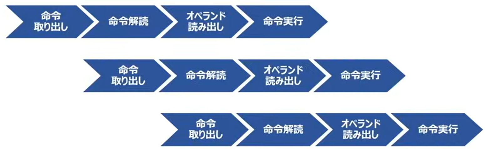
</p>

3. パイプライン方式以上の高速化
    1. `スーパーパイプライン`：命令実行手順を細分化することでパイプライン処理の効率を上げる
    2. `スーパースカラ`：パイプライン処理を複数持たせて、同時に複数の命令を実行すさせる

4. CPUの設計思想（アーキテクチャ）
    * CPUを作る際にどのようにして高速化させるか
    * 2つの設計思想があり、`用途によって`使い分ける
    1. CISC：1つの命令で`複雑な処理`を実行する
    2. RISC：1つの命令で`単純な処理`を高速で実行する

||CISC<br>(Complex Instruction Set Computer)|RISC<br>(Reduced Instruction Set Computer)|
| --- | --- | --- |
|設計思想|CPUに`複雑な`命令体系を持たせる|CPUに`単純な`命令を持たせる|
|特徴|1つの命令で複雑な命令の処理が可能となり、`少ない行数の命令で処理を実行する`|命令実行時間が均等になり、パイプライン方式で効率よく命令を処理することが可能。また`1つ1つの命令が高速`となる|
|CPU性能|処理を少ない命令回数で完結させることでパフォーマンス向上を目指す|1つ1つの処理を高速に実施することでトータルのパフォーマンス向上を目指す|

************************************************************
<div style="page-break-after: always;"></div>

### 📖主記憶装置
#### メモリの分類
* RAM(Random Access Memory)
    * 自由に読み書きが可能
    * 電源を切るとデータが消える　->　`揮発性`
        * `DRAM`：これだけが主記憶装置（その他は補助記憶装置/キャッシュメモリなどになる）
        * SRAM

||DRAM|SRAM|
| --- | --- | --- |
|回路|`コンデンサ`<br>電気を蓄える回路（ビット情報を記憶）|`フリップフロッグ回路`<br>いくつかの論理回路を組み合わせてビット情報を保持する回路|
|リフレッシュ動作|`必要`<br>コンデンサは永久に電気を蓄えることができないため、データを失わないように定期的に電荷を補充（再書き込み）する必須の操作|`不要`|
|集積度<br>半導体以降あたりに組み込まれた素子（トランジスタ）の数|高い|低い|
|価格|`安価`|`高価`|
|速度|遅い|速い|
|主な用途|主記憶装置|キャッシュメモリ|

* ROM(Read Only MEmory)
    * 読み出し専用（データを書き込めない
    * 電源を切ってもデータが消えない　->　`不揮発性`
        * マスクROM（読み出し専用ROM）
            * 工場から出荷する際にパソコンの基本となる最低限のデータを書き込む際に使う
            * 基本データはほかのデータに上書き/削除されないように読み込み専用ROMに保存する必要がある
        * PROM（Programmable ROM）：頑張ってデータをROM書き読めるようにした
            * EPROM
            * EEPRO
                * フラッシメモリ

<table>
  <thead>
    <tr>
      <th colspan="2">種類</th>
      <th>特徴</th>
    </tr>
  </thead>
  <tbody>
    <tr>
      <td colspan="2">マスクROM</td>
      <td>読み出し専用メモリ。工場出荷時にデータを書き込み、その後はデータの書き込み不可</td>
    </tr>
    <tr>
      <td rowspan="3">PROM</td>
      <td>EPROM</td>
      <td><b>紫外線照射</b>でデータを<b>全消去</b>して書き換える</td>
    </tr>
    <tr>
      <td>EEPROM</td>
      <td><b>電圧</b>をかけてデータを<b>部分消去</b>して書き換える</td>
    </tr>
    <tr>
      <td>フラッシュメモリ</td>
      <td><b>EEPROMの一種で、ブロック単位でデータを書き換える</b></td>
    </tr>
  </tbody>
</table>

* 広い意味のメモリ：下記画像関連の内容
* 狭い意味のメモリ：`DRAM`のみ（= 主記憶装置）

<p align="center">
  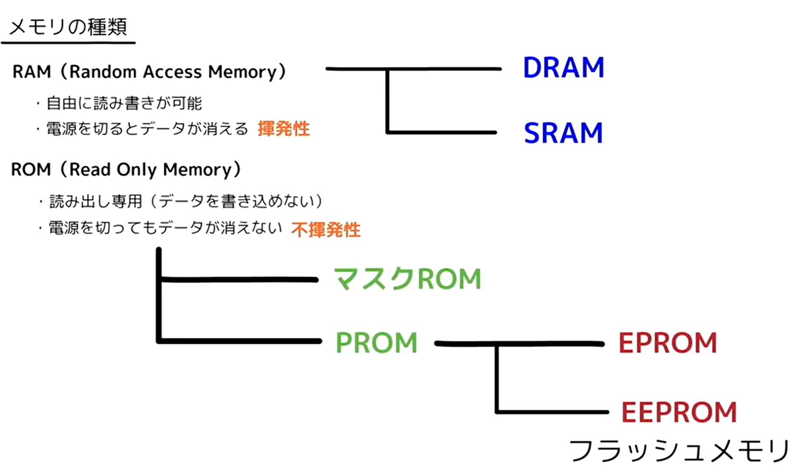
</p>


#### メモリの高速化
* `CPUの性能が良くても主記憶装置の読み書きが遅いと処理が遅くなる`
* 主記憶装置の高速化も必要！

1. キャッシュメモリの使用
    * 使用背景：
        * CPU内のレジスタは容量が小さいが高速、メモリはレジスタと比べると容量が大きいが低速
        * 記憶装置間の速度差を埋めるため、レジスタと主記憶装置の`中間速度メモリ`を使用
        * `中間速度メモリ` -> キャッシュメモリ
    * 主記憶装置　⇒　レジスタ（読み込み）
        * データの読み込み：実行アクセス時間の計算問題が出題されるので、主記憶装置からレジスタへの読み込み原理を理解しよう
        * 処理手順
            1. `主記憶装置`からデータを読み込むと同時に、`キャッシュメモリ`にも読み込まれる
            2. データを再度使用する際は、キャッシュメモリからデータを取得できるので処理が高速
        * `ヒット率`：キャッシュメモリにデータがある確率
        * `実行アクセス時間`：キャッシュメモリ/主記憶装置からデータを取得する時間の平均
        * `キャッシュメモリからの時間 * ヒット率 + 主記憶装置のアクセス時間 * (1 - ヒット率)`

    * レジスタ　⇒　主記憶装置（書き出し）
        * データの書き出し：`ライトバック方式`が`ライトスルー方式`での書き出し問題が出題されるので、それぞれの特徴を理解しよう
        * CPUの計算結果などはキャッシュメモリと主記憶装置で一致させる
        * `ライトスルー方式`：キャッシュメモリと同時に主記憶装置へも書き込みを行う（高速化：X、信頼度・制御の容易さ：O）
        * `ライトバック方式`：キャッシュメモリのみ書き込みを行い、キャッシュメモリのデータが一杯になったときに主記憶装置に書き戻しを行う

<p align="center">
  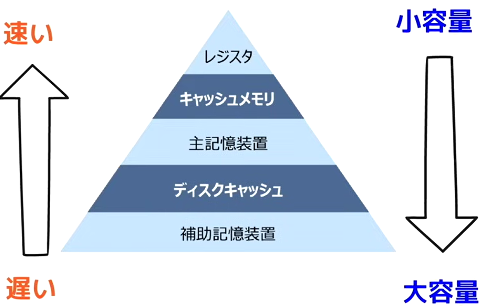
  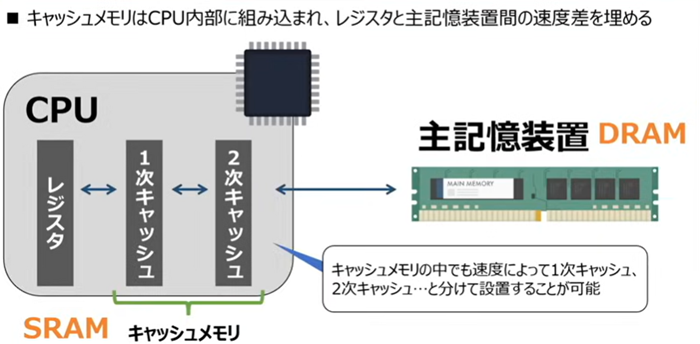
</p>

2. メモリインタリーブ
    * キャッシュメモリを使用しない主記憶装置の高速化手法で、メモリを複数の区画に分割することで、一気にデータを取得することが可能となる
    * `連続しないデータ読み出しではあまり効果が無い`

<p align="center">
  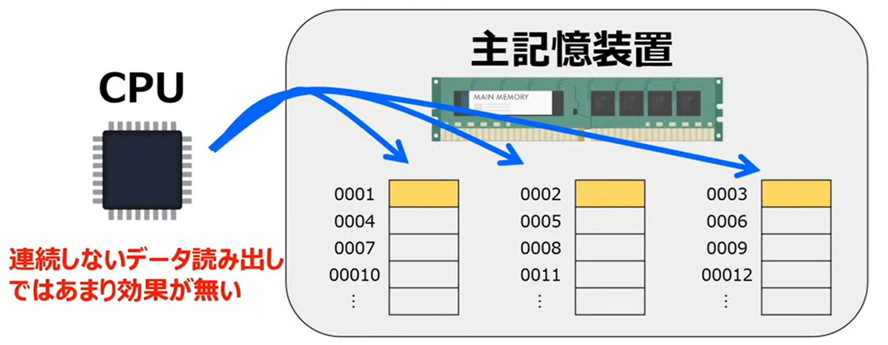
</p>

************************************************************
<div style="page-break-after: always;"></div>

### 📖補助記憶装置
#### ハードディスクの記憶容量
* データを長期的に保存する装置：
    * 光ディスク
    * USBメモリ
    * SSSD
    * HDD など
* ハードディスクの構成
    * `時期ヘッド`：磁界によってデータを記録したり読み取る
    * `プラッタ`：磁性体を磁化させて情報を保存する
        * `セクタ`：データを書き込む最小単位
        * `トラック`：セクタを一周回った物
        * `シリンダ`：トラックを縦に複数枚を並べる
        * 注意点：
            1. 1つのセクタに収まらない場合は複数セクタ使用
            2. セクタで使われない領域は無駄になる（例えばあるデータは1.5個のセクタを要する場合、2セクタ分のデータ量は該データに使い、0.5分の空白が無駄になる）
    * `アクセスアーム`：目的地まで磁気ヘッドを運ぶ
    * ハードディスクの記録容量：
        * `セクタ` * `トラック` * `シリンダ` * `シリンダ数`（バイト）

<p align="center">
  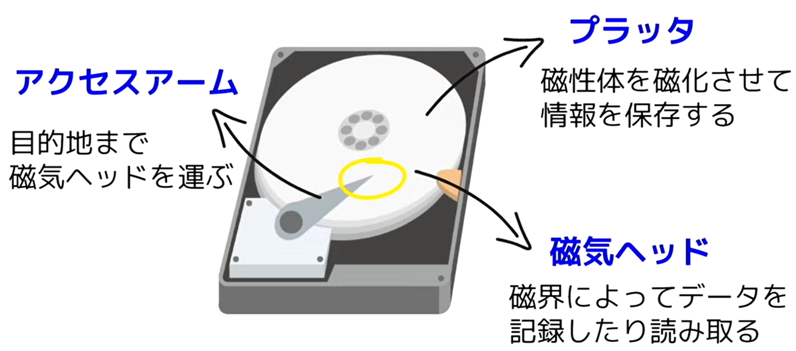
  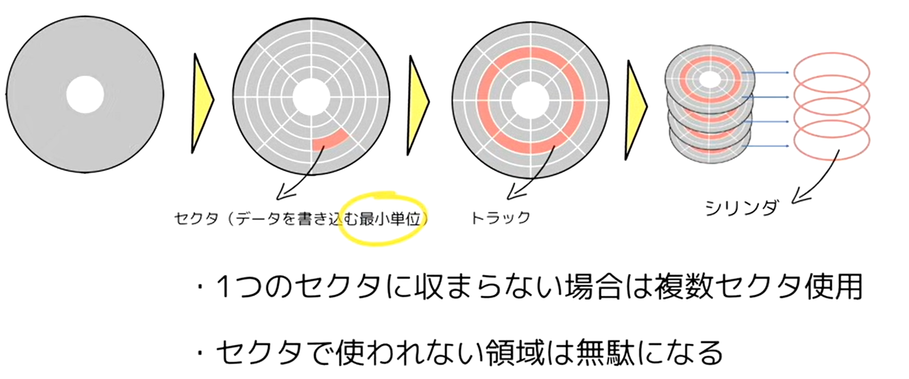
</p>

#### ハードディスクのアクセス時間
* アクセス時間：データの読み込み命令/データの書き出し命令　⇒　データの読み込み/データの書き出し
    * 待ち時間
        * `位置決め時間`（シーク時間）：トラックまで磁気ヘッドを移動させる時間
        * `回転待ち時間`（サーチ時間）：磁気ヘッドの位置まで回転する時間
            * データが磁気ヘッドの真下にある場合、回転待ち時間0秒（最小のケース）
            * データが磁気ヘッドを丁度通り過ぎた：回転待ち時間が1回転する時間（最大のケース）
            * 最大時間と最小時間の平均：`プラッタが1/2回転する時間`
    * `データ転送時間`：最初の部分から最後の部分まで磁気ヘッドが通貨する時間
    * アクセス時間 = 位置決め時間 + 回転待ち時間 + データ転送時間
    * 待ち時間 = 位置決め時間 + 回転待ち時間
    * 位置決め時間 = プラッタ時間が1/2回転する時間


<p align="center">
  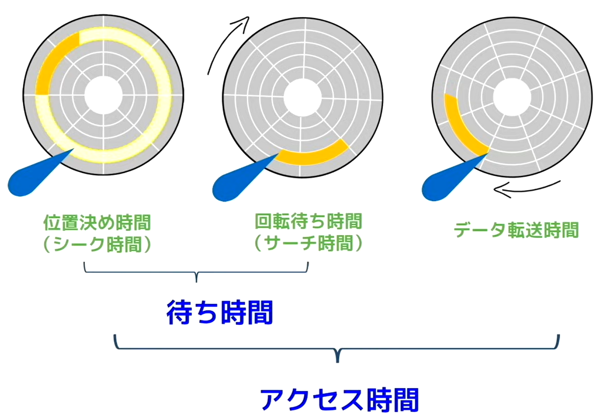
</p>

#### ハードディスクのデータ管理
* データの管理
    * `フラグメンテーション`：頻繁なデータ追加/データ更新/データ削除により、データの保存場所がバラバラになる現象　⇒　磁気ヘッドが回る場所が増える　⇒　`アクセス時間増加に繋がってしまう`
    * 解消法、`デフラグ`：バラまいたデータを一つにまとめ直す　

#### ハードディスクの性能向上
* ハードディスクの性能向上
    * `RAID`：`複数のハードディスクを束ねて、1個のハードディスクっぽく使う技術`
        * 目的：性能を早く、壊れても大丈夫（耐障害性）、容量を無駄にしない（コスト）
        * 複数のハードディスクを組み合わせ、処理速度や信頼性を向上させる
        * `RAID`には上記目標を解決すべく、様々な設計パターンがある
        * `RAID 0`：2台以上のハードディスクに`分散してデータを書き込む`（`ストライピング`）
            * 冗長性ゼロ
            * `処理が高速化`、`信頼性は低い`
        * `RAID 1`：2台以上のハードディスクに`同じデータを`書き込む（`ミラーリング`）
            * 完全コピーが1セット
            * `信頼性は高い`
        * `RAID 5`：`3台以上の`ハードディスクに分散して`データ`と`パリティ`を書き込む
            * ストライピング + パリティ
            * データを保存したデータは、パリティにより復元可能
            * `信頼性向上`、`高速化`

<p align="center">
  
  <p>👆 RAID 0 👆</p>
  
  <p>👆 RAID 1 👆</p>
  
  <p>👆 RAID 5 👆</p>
</p>

|用途|よく使うRAID|
| --- | --- |
|高速重視（壊れてもおＫ）|RAID 0|
|超重要データ|RAID 1|
|コスパそこそこ|RAID 5|
|DB・業務システム|RAID 10(0 + 1)|

#### その他補助記憶装置
* 光ディスク：`レザー光線によってデータを読み書きする記憶媒体`
    * 下記の表について、下に行くにつれ、波長が短く、記憶容量は大きくになる

|媒体の種類\データの記憶方式|再生専用型<br>書き込み不可<br>Read Only Memory|追記型<br>一度だけ書き込み可能<br>Recordable|書き換え型<br>何度でも書き込み可能<br>ReWritable|概要|
| ---- | --- | --- | --- | --- |
| `CD`<br>コンパクトディスク | CD-ROM | CD-R | CD-RW | 波長`780nm`のレーザー光を使用<br>記憶容量は最大`700 MB` |
| `DVD`| DVD-ROM | DVD-R | DVD-RW<br>DVD-RAM | 波長`635nm`の`赤色レーザー光`を使用<br>記憶容量は最大`17 GB` |
| `BD` | BD-ROM | BD-R | BD-RE | 波長`405nm`の`青色/青紫色レーザー光`を使用<br>記憶容量は最大`100 GB` |


* フラッシュメモリ：`EEPROM`（[メモリの種類](#メモリの分類)にて紹介）の1種で`SDカード`や`USB`メモリなど、半導体っを用いて`電気的に`読み書きを実施

* SSD：`フラッシュメモリ`を記憶媒体として内蔵する装置。ハードディスクの代替として注目
    * ハードディスクと比べるとのメリット：`衝撃に強い`、`処理が静か`、`処理が速い`
    * ハードディスクと比べるとのデメリット：`高価`

<p align="center">
  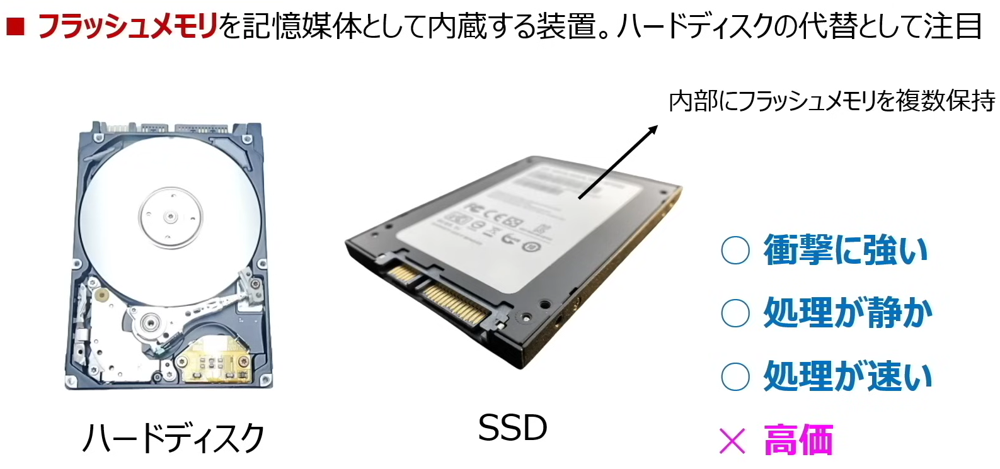
</p>

************************************************************
<div style="page-break-after: always;"></div>

### 📖入出力装置
#### 入出力装置
* 入力装置：コンピューター内部にデータを入力する装置
    1. キーボード
    2. `ポインティングディバイス`：画面上の位置情報を入力する装置
        * マウス：画面内の位置情報を入力する装置
        * トラックパッド：ノートパソコンでマウスの代わりに搭載されている装置
        * タッチパネル：銀行ATMや発券機などに使用されており、画面を直接タッチして位置情報を入力する装置
        * タブレット：パネル上で専用のペンなどを動かして位置情報を入力する
    3. `読み取り装置`：処理対象のデータそのものを読み取る装置
        * スキャナ：絵や写真を画像データとして読み取る装置
        * OCR(Optical Character Reader)：手書き文字や印刷文字を文字データとして読み取る装置（`レシートを読み込むアプリ`など）
        * OMR(Optical `Mark` Reader)：`マークシート`上で塗りつぶされた位置を読み取る装置
        * バーコードリーダー：バーコードを読み取る装置（`JANコード`、`QRコード`など）

* 出力装置：コンピューターが処理したデータを外部に出力する装置
    1. `ディスプレイ`
        * 処理前提：ディスプレイ上の文字や画像はドットと呼ばれる点の集まりで表現される（[AD変換](科目A/2.AD変換.md#ディジタルデータへの変換方法)にて）
        * `ディスプレイの解像度`：横方向と縦方向のドット数で表現。解像度が大きいほど高画質
            * `4K`    解像度：3,840 * 2,160
            * `フルHD`解像度：1,920 * 1,080
        * `VRAM`：ディスプレイに表示される内容を一時的に記憶するメモリ
            * VRAMの容量によってディスプレイに表示できる`色/解像度`が決まる
            * `4K`     1ビット当たり必要なビット数：`24ビット` -> 大容量のVARMが必要
            * `フルHD` 1ビット当たり必要なビット数：`1ビット` -> 小容量のVARMで済む
        * `ディスプレイの種類`
            * `（シラバスから削除）`CRTディスプレイ　　：ブラウン管ディスプレイのことであり、`電子銃から発射された電子ビームを蛍光体に当てる`ことで映像を表示する。サイズ・消費電力が大きい
            * 液晶ディスプレイ　　：自身で発光しないため、`バックライトや外部からの光`で映像を表示する
            * 有機ELディスプレイ　：電極間に有機化合物を挟んだ構造で、電気を流すと発光する。これを利用し、`自ら発光`して映像を表示する
            * `（シラバスから削除）`プラズマディスプレイ：`ガス放電によって発光`する光を利用して映像を表示する
    2. `プリンター：`
        * プリンタの種類
            * レーザープリンタ：`レーザー光線を使用して印刷`する。`印字音が静かで品質も高い`ため、ビジネス用プリンタとして使用されることが多い（コンビニの主流）
            * インクジェットプリンタ：印字ヘッドのノズルから`インクを吹き付けて印刷`する。`低価格`で`比較的高品質`な印刷が可能であるため、個人向けプリンタとして使用されることが多い
            * ドットインパクトプリンタ：印字ヘッドの多数のピンをインクリボンに打ち付けて印刷する。`物理的に叩けつけて印刷`するため、`印字音が大きく品質も低い`。複写手紙への印刷は可能であるため、`事務処理分野で活用`されている
            * 3Dプリンタ：3Dデータに基づき、`熱溶解積層方式`などで立体物を造形する
        * プリンタの性能評価指標
            * `【品質】dpi`(dot per inch)：1インチ(=2.54cm)あたりのドット数。dpiが`大きいほど高品質`な印字結果を得る
            * `【速度】cps`(character per second)：1秒間に印刷できる文字数。`ドットインパクトプリンタの性能評価`で使用されることが多い
            * `【速度】ppm`(page per minute)：1分間に印刷できるページ数。`レーザープリンタの性能評価`で使用されることが多い

#### 入出力インターフェース
* インターフェース：境界面・接点
    * プログラムにおいでの意味：異なる2つの物体を繋いでいる概念や物体
    * 例1：User Interface(ユーザーインターフェース＝UI)：見た目や使いやすさ
    * 例2：入出力インターフェース：パソコンと入出力装置を繋ぐルール（接続口の形や接続方法など）

* パラレルインターフェース
    * 複雑なデータを並行して受送信する。制御が難しいため、現在はシリアルインターフェースが主流

<p align="center">
  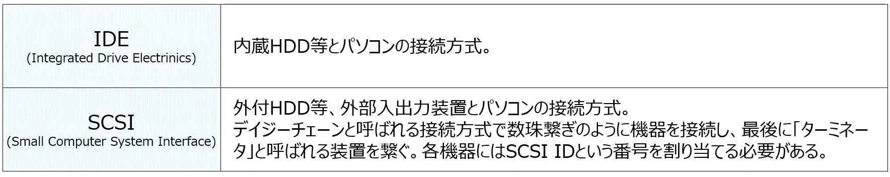
</p>

* シリアルインターフェース
    * 単一のデータを1つずつ受信する
    * Gbps（bit per second）とは、1秒あたりに転送できるビットの数
    * `ホットプラグ`：電源を入れたまま機器を抜き差しできる
    * `プラグ・アンド・プレイ`：周辺機器を接続すると自動で設定が完了

<p align="center">
  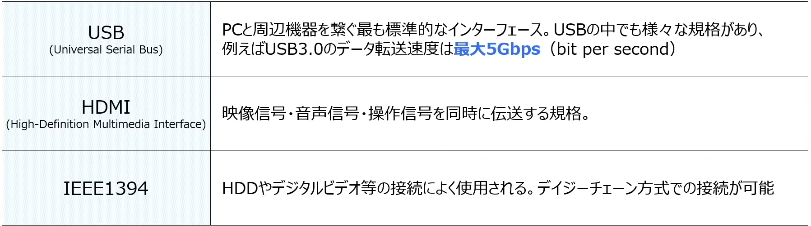
</p>

* 無線インターフェース
    * ケーブルを使用せずデータを受送信する

<p align="center">
  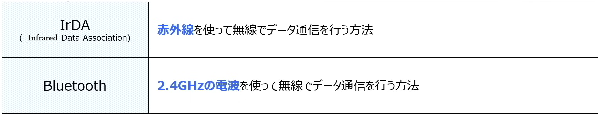
</p>
