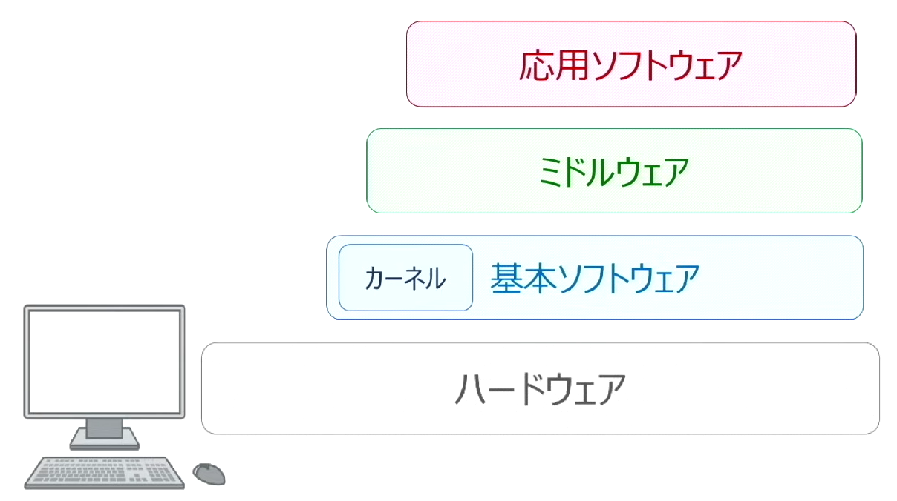
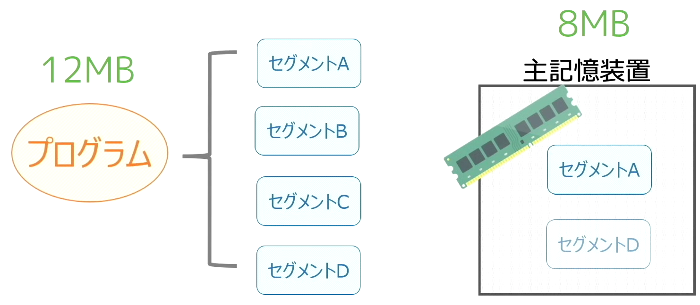
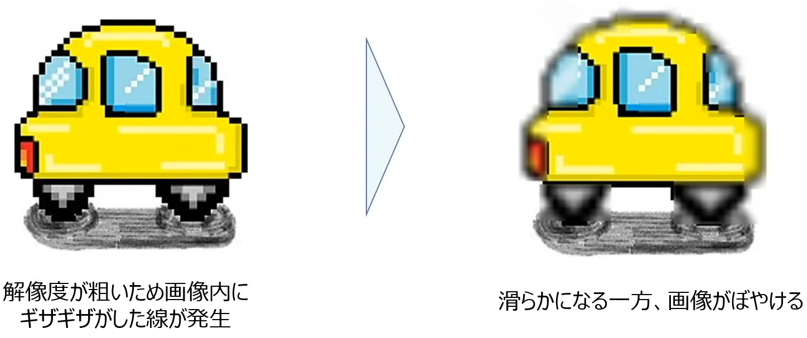
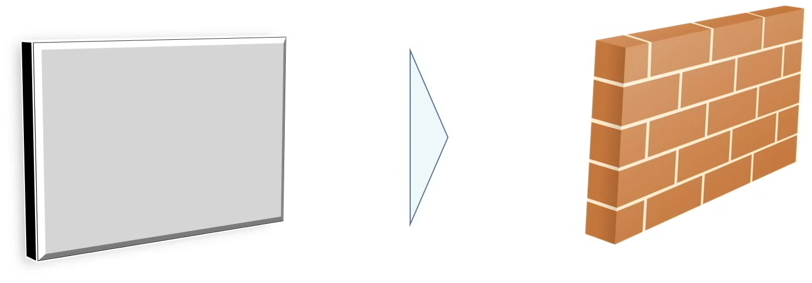
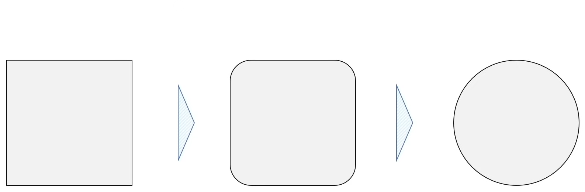
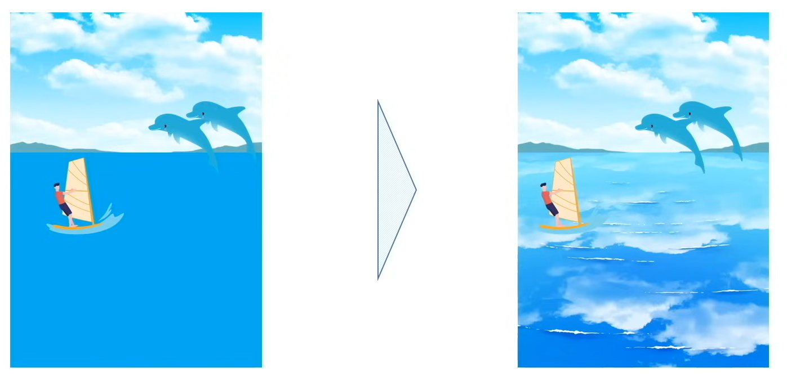
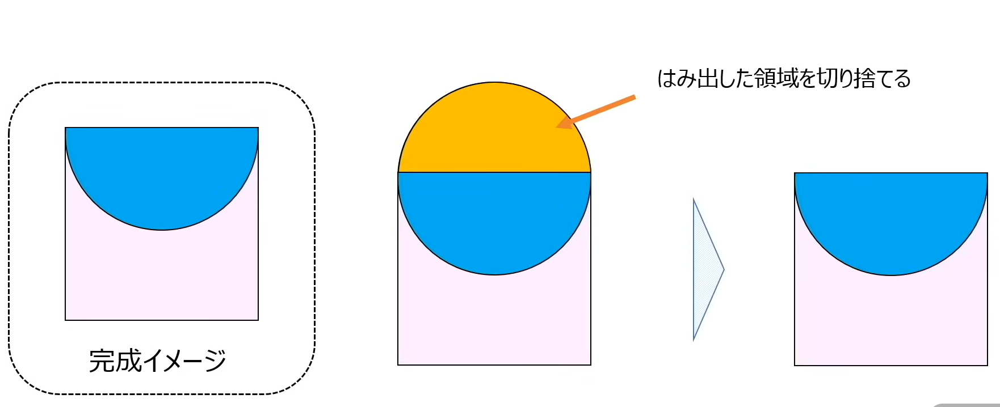
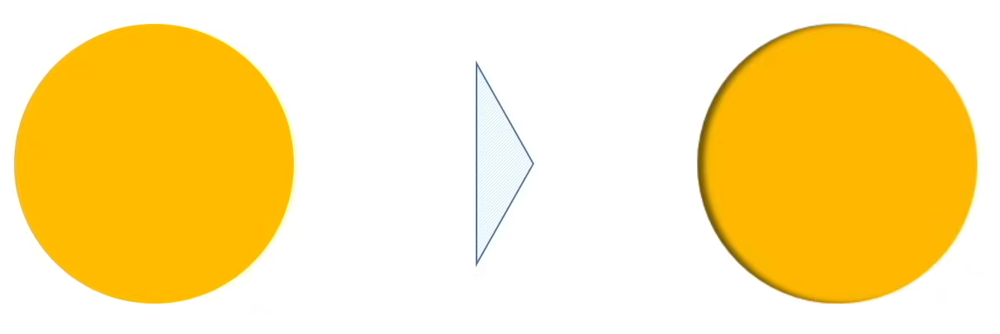

▶ソフトウェア
* [1. 基本ソフトウェア（os）](#基本ソフトウェアos)
* [2. ジョブ管理とタスク管理](#ジョブ管理とタスク管理)
* [3. 実管理記憶](#実管理記憶)
* [4. 仮想記憶管理](#仮想記憶管理)
* [5. ファイル管理](#ファイル管理)
* [6. マルチメディア](#マルチメディア)

* 用語集

|用語|意味|
| --- | --- |
|OS（OperatingSystem）|コンピューターの基本的な動作を担うソフトウェアWindows、Mac、Linux、iOS、Androidなど|
|GUI|OSとユーザーを繋ぐ画面操作の仕組み視覚的に操作して命令を伝える|
|API|OSとアプリを繋ぐ仕組みアプリがOS機能を利用するためのインターフェース|
|カーネル|OSの中核部分最も重要なソフトウェア|
|ミドルウェア|アプリ共通機能を提供するが、OSでは提供できない機能を持つソフトウェア|
|ジョブ|人間視点での仕事の単位コンピューターに処理してほしい一連の作業|
|タスク|OS視点での仕事の単位ジョブを細かく分解したもの|
|スプーリング|CPUより遅い入出力装置への出力を一旦ディスクに書き込み、処理効率を上げる仕組み|
|実行可能状態|タスクがCPU処理を待っている状態|
|実行状態|タスクがCPUで処理中の状態|
|待機状態|タスクが入出力の終了を待っている状態|
|ディスパッチャ|CPUの割り当てを実行するプログラム|
|プリエンプティブ方式|OSがCPUを管理し、実行中のタスクを途中で中断して他のタスクにCPUを割り当てる方式|
|ノンプリエンプティブ方式|実行中のタスクを途中で中断せず、プログラムに処理を任せる方式|
|固定区画方式|主記憶をあらかじめ区画分けしてプログラムを読み込む方式処理は高速だが無駄が多い|
|可変区画方式|プログラム読み込み時に必要な分だけ主記憶を使用する方式|
|フラグメンテーション|主記憶がプログラム終了でバラバラに分かれてしまう現象|
|メモリコンパクション|バラバラの主記憶をまとめて空き領域を確保すること|
|オーバーレイ方式|プログラムをセグメント単位で読み込み、必要な部分だけ使用する方式|
|スワッピング|実行中プログラムを主記憶と補助記憶で入れ替える方式|
|メモリリーク|解放されないメモリ領域が残る現象|
|仮想記憶|実際の主記憶の制約を回避するために、補助記憶を主記憶として扱う仕組み|
|ページング方式|仮想記憶をページ単位で管理する方式|
|ページフォールト|必要なページが主記憶にないときに発生するエラー|
|ページイン|ページフォールト時に補助記憶から主記憶にページを読み込むこと|
|ページアウト|主記憶容量が足りない時に不要ページを補助記憶に退避すること|
|スラッシング|ページイン／アウトが多発し処理効率が低下する現象|
|FIFO|ページ置換アルゴリズムの1つ最初に入ったページを追い出す|
|LIFO|ページ置換アルゴリズムの1つ最後に入ったページを追い出す|
|LRU|ページ置換アルゴリズムの1つ最も長く参照されていないページを追い出す|
|LFU|ページ置換アルゴリズムの1つ最も参照回数が少ないページを追い出す|
|ディレクトリ（フォルダ）|ファイルや他のディレクトリをまとめて管理する単位|
|階層構造|ディレクトリをルート・親・サブ・カレントなどで整理した構造|
|絶対パス|ルートディレクトリから目的ファイルまでの経路|
|相対パス|カレントディレクトリから目的ファイルまでの経路|
|可逆圧縮|圧縮したデータを完全に元に戻せる方式|
|不可逆圧縮|圧縮したデータを完全には元に戻せない方式|
|アンチエイリアシング|画像のギザギザを滑らかにする技術|
|テクスチャマッピング|立体物に模様や画像を貼り付ける技術|
|モーフィング|画像の変化過程を演算して表現する技術|
|レイトレーシング|光の反射・屈折を演算しリアルな画像を生成する技術|
|クリッピング|ある領域からはみ出した部分を切り捨てる処理|
|シェーディング|物体に影を付け立体感を出す技術|
|VR（VirtualReality）|仮想空間に入り込む感覚を与える技術|
|AR（AugmentedReality）|現実世界に仮想情報を重ねる技術|

************************************************************
<div style="page-break-after: always;"></div>

### 📖基本ソフトウェア（OS）
* 基本ソフトウェア
    * `Operating System`(OS)の略で、コンピューターの基本的な動作を担う
        * どのコンピューターでも普遍的に必要とされる昨日を担うソフトウェア
            * Windows/ Mac OS
            * 業務用サーバー向け：Unix/ Linux
            * スマホ：iOS/ Android OS
        * OSとのインターフェース
            * GUI：OSとユーザーとつなぐもの　⇒　視覚的に操作して命令を伝える画面
            * API(Application Programming Interface)：OSと応用ソフトウェアであるアプリケーションを繋ぐもの　⇒　アプリケーションからOSが保持している各種機能を利用するための仕組み
    * `カーネル`：中核を成すような部分、最も大切なソフトウェア
* ミドルウェア
    * 多くのアプリケーションが共通して必要とするが、OSでは提供できないような機能を持つソフトウェア
* 応用ソフトウェア
    * 日常生活に使われているアプリケーション（Excel・Word・メールソフトなど）

<p align="center">
  
</p>

* ジョブ/タスク管理
    * `CPUはOSが管理している`
    * CPUをどのように使用するか管理すること
    * `OSが上手くCPUをコントロールすることで、複数処理を同時進行で行っているように見える`
* 記憶管理
    * 主記憶装置の容量は少ないため、上手く記憶領域を管理する必要がある
* ファイル管理
    * ファイルやフォルダの管理もOSが行っている

************************************************************
<div style="page-break-after: always;"></div>

### 📖ジョブ管理とタスク管理
* ジョブとタスクの定義
    * ジョブ：人間から見た仕事の単位、コンピューターに処理してほしい一連の作業のこと
    * タスク：OSから見た仕事の単位、ジョブを細かく分解したもの
    * CPUがこのタスクを実行してくれることで、コンピューターは複雑な処理を実施するが、その時に`どのジョブやタスクをどのタイミングでCPUに作業させる`かが管理

* ジョブ管理：
    * 人間がコンピューターに1つのジョブを命令するとOSは`入力待ち行列`と呼ばれるものにジョブを登録し、順番に処理が実施されていくもを待つ
    * 処理される順番が決まったら、ジョブはたくさんのタスクに分担され`タスク処理に入る`
    * タスクが実行されて処理が終わると、その結果は`出力待ち行列`に登録しプリンターなどに、処理が出力されるのを待つ
        * `スプーリング`（spooling）：
            1. プリンターなどの出力装置はCPUより処理が遅いため、CPUは入出力データを一旦磁気ディスクに書き込み次の仕事に移る
            2. プリンターが自分のタイミングで出力処理
            * メリット：単位時間当たりに処理できる仕事量（`スループット`、throughput）が向上
            * `スプーリング`によって`スループット`が向上

* タスク管理：
    * `入力待ち行列`に登録されたジョブは、自分の順番に回ってくるとタスクに分解されそのタスクをCPUが処理していく
    * 3つの状態を遷移しながら処理
        1. `実行可能状態`：CPUの処理を待っている状態
        2. `実行状態`　　：タスクが処理されている状態。実行中にもっと優先度の高いタスクが発生し、CPUの使用権が剝奪されると、`実行可能状態`に戻る
        3. `待機状態`　　：入出力処理の終了を待っている状態
    * `ディスパッチャ`：CPUの割り当てを実行するプログラム（優先順位は`スケジューリング`依存）
    * `ディスパッチ`  ：CPUを割り当てること自体
    * 3つの`スケジューリング`
        * プリエンプティブ方式：OSがCPUを管理し、実行中のタスクを途中で中断して他のタスクにCPU使用権を割り当てる
        * ノンプリエンプティブ方式：実行中のタスクを途中で中断せずプログラムに処理を任せる

        1. 【ノンプリエンプティブ方式】``到着順方式``：実行可能状態になった順にCPUの使用権を割り当てる
        2. 【プリエンプティブ方式】`優先順方式`：優先順位が高いタスクから順にCPUの使用権を割り当てる
        3. 【プリエンプティブ方式】`ラウンドロビン方式`：一定時間ごとにCPU使用権を切り替える
    * `マルチプログラミング`・`マルチタスク`：処理待ち状態を活用しないのはもったいないため、余った時間をほかのタスクに割り当てCPUを有効活用する

* 割り込み処理
    * 実行中のタスクを待機状態や実行可能状態にして別のタスクを実施させるような処理
        1. `内部割込み`（プログラムが要因）
            * `プログラム割込み`：処理することが出来ない不正な命令により発生
                * `0での割り算`
                * `オーバーフロー`
                * `ページフォールト`（仮想記憶の記憶領域のなかで存在しないページにアクセスしようとする）など
            * `SVC割込み`（スーパーバイザコール）：プログラムが`OSに入出力要求したとき`などに発生
            
        2. `外部割込み`（プログラム`外`の要因）
            * `機械チェック割込み`：電源の異常や装置の故障など、`ハードウェアの不具合`で発生
            * `タイマ割込み`　　　：設定された`時間`が経過してプログラムが中断されることで発生
            * `コンソール割込み`　：PCを操作している`利用者の介入`が行われた際に発生
            * `入出力割込み`　　　：`入出力装置`の動作完了時や中断時に発生

************************************************************
<div style="page-break-after: always;"></div>

### 📖実管理記憶
* プログラム読み込み方式
    1. 固定区画方式
        * 主記憶装置をあらかじめ大きさが決まったいくつかの区画に分けておこ、そこの区画にプログラムを読み込ませる
        * `処理効率が悪い`
        * `処理が高速`
    2. 可変区画方式
        * プログラムを読み込ませるタイミングでサイズを主記憶装置を区切る方法
        * 必要な分だけ主記憶領域を使用する
        * `無駄な領域を作らない`
        * `大容量プログラムの読み込み可能`
        * `フラグメンテーション`：処理が終わったプログラムから順に主記憶装置から解放していくと、主記憶装置がバラバラな状態でプログラムを保持する様子
        * `メモリコンパクション`：主記憶装置内にバラバラ状態になったプログラムを一つにギュットすること
            * ※ `デフラグ`：ハードディスクをギュットすること

* オーバーレイ方式（命令読み込み方法）
    * 1つのプログラムを`セグメント`っと呼ばれる独立した処理単位に分割し、必要な部分だけを使用
    * 必要なセグメントを交代で読み込ませることで主記憶の容量以上のプログラム読み込みが可能

<p align="center">
  
</p>

* スワッピング方式
    * マルチプログラミング環境では、優先度の高いプログラムの割込みが発生した際に実行中のプログラムを一時中断
    * `スワップアウト`：中断したプログラムを`主記憶装置`から`補助記憶装置`に一旦退避
    * `スワップイン`　：処理を再実行する際に`主記憶装置`に呼び戻す
    * `補助記憶装置`を利用するため、処理速度が低下する

* メモリリーク
    * 命令が読み込まれた主記憶装置の領域はその命令の処理が終わると解放されるはずだが、`OSのバグ等により処理をしていないのに使用不可領域が発生`
    * メモリリーク：利用可能な主記憶装置の領域が減少すること
    * メモリリークを解消するために、何の処理もしていないのに使用不可になっている領域を解放する`ガーベジコレクション`（grabage collection）処理が必要

************************************************************
<div style="page-break-after: always;"></div>

### 📖仮想記憶管理
* 実記憶管理
    * 主記憶装置の活用法を学習
        * プログラムをどのように配置するか
        * 断片化（フラグメンテーション）の対応
    * 実記憶の壁：`物理的な記憶領域`、`容量の制限あり`
    * 対策：`仮想的な記憶領域`を作り、そこの仮想領域にプログラミングを読み込ませることで物理的な制約を取っ払える
        * プログラムの整理不要
        * 好きなだけ読み込み可能

* 仮想記憶の仕組み
    * 仮想領域にプログラムを読み込ませる際、実際には主記憶装置にプログラムを読み込ませ、主記憶装置では処理しきれないため、`補助記憶装置の一部を主記憶装置とみなし`、必要に応じてプログラムを補助記憶装置に残しておく
    * 見かけ上、プログラムを仮想記憶領域という空間に読み込ませている

    * 見かけ上、仮想アドレスと呼ばれるメモリのアドレスが割り振られており、プログラムはこの仮想アドレスのどこかに読み込まれる
    * 実際、仮想記憶の裏側でプログラムは主記憶装置に読み込まれていたり、もしくは補助記憶装置に（いったん不要なプログラムが）眠ったままになっている
    * 仮想アドレスと実記憶のアドレスを紐づける必要があり、それをCPUに内蔵されているメモリ変換ユニットが紐づけ作業を実施　⇒　`動的アドレス変換機構`（`DAT`・Fynamic Address Translation）

* 仮想領域の管理方法
    * ページング方式：装置プログラムや仮想記憶領域を「ページ」と呼ばれる細かい単位に分割して管理
        * `ページフォールト`：仮想記憶領域にプログラムが読み込まれたが、その裏側で補助記憶装置にプログラムが眠ったままになっている場合、そのプログラムにCPUがアクセスしたとき実際には主記憶装置に存在しないページため、引き起こすエラー
        * `ページイン`：`ページフォールト`が起こった場合、補助記憶装置から必要なページを主記憶装置に持ってくる
        * `ページアウト`：ページイン時に主記憶装置の容量が一杯である場合、補助記憶装置に不要なページを退避する
        * `スラッシング`：`ページイン`/`ページアウト`が多発すると処理効率が低下

    * ページング置き換えアルゴリズム
        * ページアウトのリスク：適当なページを退避させるとすぐにページインが発生する疑念がある

        1. FIFO(First In First Out)：一番最初にページインしたページを追い出す
        2. LIFO(Last In First Out)：一番最後にページインしたページを追い出す
        3. LRU(Least Recently Used)：最も`長い時間参照されていない`ページを追い出す
        3. LFU(Least Frequently Used)：最も`参照回数の少ない`ページを追い出す

************************************************************
<div style="page-break-after: always;"></div>

### 📖ファイル管理
* ディレクトリ（フォルダ）とファイル
    * ディレクトリ：複数のファイルやディレクトリをまとめて管理するもの（＝フォルダ）
    * ディレクトリを活用してファイルを整理している
    * `階層構造`：下記のようなディレクトリの構成を表すもの
        * "yy"ディレクトリ目線とする場合各ディレクトリとの関係性を説明する
            * `カレントディレクトリ`：今いるディレクトリ
            * `親ディレクトリ`：カレントディレクトリの一個上
            * `サブディレクトリ`：ディレクトリの中にあるディレクトリ
            * `ルートディレクトリ`：一番上のディレクトリ
        * その他
            * `ホームディレクトリ`：ユーザーがログインした際に一番最初に入るディレクトリ

```
C:
 ├─ Users
 │  └─ ユーザー名
 │       ├─ Desktop
 │       ├─ Download
 │       └─ ...
 ├─xx
 │  └─ yy  ─ ...
 │     └─ zz  ─ ...
 └ ...
```

* ファイルパスの表記方法：
    * ファイルパス：目的ファイルが保管されているディレクトリの経路
    * `絶対パス`：`ルートディレクトリ`から目的ファイルまでの経路
    * `相対パス`：`カレントディレクトリ`から目的ファイルまでの経路
        * 【ファイルパス記載方法】
            1. ルートディレクトリは省略されると考える
            2. ディレクトリとディレクトリの間は`￥`もしく`/`で表記
            3. カレントディレクトリは`.`で表記
            4. 1階層上のディレクトリ（親ディレクトリ）は`..`で表記

```
C:
 ├─ Users
 │  └─ ユーザー名
 │       ├─ Desktop
 │       ├─ Download ─ 写真.png
 │       └─ ...
 ├─xx
 │  └─ yy  ─ ...
 │     └─ zz  ─ ...
 └ ...


【絶対パス】
/Users/ユーザー名/Download/写真.png

【相対パス】
カレントディレクトリ：ユーザー名
./Download/写真.png


カレントディレクトリ：Desktop
./../Download/写真.png
```

************************************************************
<div style="page-break-after: always;"></div>

### 📖マルチメディア
* マルチメディア（圧縮と解凍）
    * 圧縮：マルチメディアの容量は大きいため、ある決まりに従ってデータサイズを小さくする必要がある
    * 解凍：圧縮されたでデータを元に戻す方法
    * `可逆圧縮方法`：圧縮データを完全に復元できる
    * `不可逆圧縮方式`：圧縮データを完全に復元できない

* 代表的なファイル形式
    * 静止画
        * BMP：画像が`圧縮されない`ため容量が大きい
        * GIF：256色の`可逆圧縮`
        * PNG：256色・もしくはフルカラーの`可逆圧縮`
        * JPEG：フルカラーの`不可逆圧縮`。`国際標準規格`
    * 動画
        * MPEG：`不可逆圧縮`。`国際標準規格`

* 画像処理技術（CG。Computer Graphics）
1. `アンチエイリアシング`：画像内に発生するギザギザなど、傾いた直線を滑らかにする技術

<p align="center">
  
</p>

2. `ラクスチャマッピング`：画像に柄や模様などを貼り付け、膣間や立体感を表現する技術
    * ただの立方体に模様を記載することでレンガの立体感を表現している

<p align="center">
  
</p>

3. `モーフィング`：ある物体画像変化の中間をコンピューターで演算子、変化の過程を表現する技術

<p align="center">
  
</p>

4. `レイトレーシング`：画像内の水たまりなどの光の反射をよりリアルに表現する技術
    * 画像の光源と物体間の光の反射や屈折をコンピューターで演算することで実現させる

<p align="center">
  
</p>

5. `クリッピング`：ある領域からはみ出した画像を切り捨てる作業

<p align="center">
  
</p>

6. `シェーディング`：物体画像に影を入れて、より立体感を出す技術

<p align="center">
  
</p>

* VRとAR
    * `VR`(Virtual Reality)  ：仮想現実。`仮想の空間`に入り込む感覚を与える技術
    * `AR`(Augmented Reality)：拡張現実。`現実世界の中に`仮想の情報を与える技術
