▶データベース
* [1. データベースの基本](#データベースの基本)
* [2. データベースの正規化](#データベースの正規化)
* [3. トランザクション処理](#トランザクション処理)
* [4. データの復元方法](#データの復元方法)
* [5. 関係演算とSQL](#関係演算とsql)
    * [DML](#dml)
        * [SELECT文](#select文)
        * [UPDATE文](#update文)
        * [DELETE文](#delete文)
        * [INSERT文](#insert文)
    * [SELECT文を構成する句](#select文を構成する句)
        * [WHERE句](#where句)
        * [ORDER BY句](#order-by句)
        * [GROUP BY句](#group-by句)
        * [HAVING句](#having句)
* [6. 機械学習とディープラーニング](#機械学習とディープラーニング)

* 用語集

|用語|意味|
| --- | --- |
|データベース|決まった形で整理されたデータの集まり|
|データベース管理システム（DBMS）|データベースの操作や制御機能を持つソフトウェア|
|リレーショナルデータベース（RDB）|表形式で整理されたデータベース|
|スキーマ|データベースの構造を表す設計図|
|外部スキーマ|利用者やアプリから見たデータベースの見た目|
|概念スキーマ|開発者から見たデータベースの理論的構造|
|内部スキーマ|データベースを記憶媒体に物理的に記録する構造|
|主キー|表中の行を一意に特定する列|
|複合キー|複数の列を組み合わせて主キーとする場合|
|外部キー|他の表の主キーを参照する列|
|正規化|データの矛盾や重複をなくすため表を整理・分割すること|
|第1正規化|列方向の重複を行方向に移動し不要な列を削除|
|第2正規化|主キーや複合キーを基に表を分割|
|第3正規化|第2正規化で分割できなかった部分をさらに分割|
|関数従属性|主キーの項目だけで列の値が一意に決まる関係|
|部分関数従属性|複合キーの一部の項目だけで列の値が一意に決まる関係|
|トランザクション|データベース操作に関する一連の処理|
|ACID特性|トランザクションの信頼性を保証する4つの特性（原子性、一貫性、隔離性、耐久性）|
|排他制御|トランザクション中にデータをロックして他からの影響を防ぐ方法|
|共有ロック|他のユーザーはデータを閲覧できるが更新できない|
|専有ロック|他のユーザーはデータを閲覧も更新もできない|
|デッドロック|複数のトランザクションが互いのロックを待ち続ける状態|
|ロックの粒度|ロックをかける範囲の大きさ|
|ストアドプロシージャ|よく使うSQL命令群をまとめてDBMS上に用意したもの|
|ジャーナルファイル|更新前・更新後のデータ状態を記録するログファイル|
|バックアップファイル|データベースの復元用に保存されたコピー|
|コミット|トランザクションの処理内容をすべて確定して反映|
|ロールバック|トランザクションの処理内容をすべて取り消す|
|ロールフォワード|バックアップと更新後ジャーナルを使ってデータを復元|
|分散データベース|複数のデータベースを1つのデータベースとして扱う仕組み|
|2相コミット|分散データベースで全DBのコミット可否を確認して処理を決定|
|関係演算|関係データベースの操作（選択、射影、結合など）|
|ビュー表|関係演算により作成される一時的なテーブル|
|SQL|データベースを操作するための言語|
|DDL|データを定義するSQL（CREATE、DROP、ALTER、TRUNCATE）|
|DML|データを操作するSQL（SELECT、UPDATE、DELETE、INSERT）|
|SELECT文|レコードや列を抽出するSQL文|
|UPDATE文|レコードの内容を更新するSQL文|
|DELETE文|レコードを削除するSQL文|
|INSERT文|レコードを追加するSQL文|
|WHERE句|SELECT文で条件を指定して行を抽出|
|ORDERBY句|SELECT文で結果を並び替え|
|GROUPBY句|SELECT文で行をグループ化|
|HAVING句|グループ化した結果に条件を指定|
|比較演算子|=,<>,<,<=,>,>=など|
|論理演算子|AND,OR,NOTなど|
|集合関数|MAX,MIN,SUM,AVG,COUNTなど|
|ビッグデータ|大量・多様・高速に取得できるデータ|
|AI（ArtificialIntelligence）|人間の知能を機械で表現する技術|
|機械学習|データからパターンを学習して予測や分類を行うAI技術|
|教師あり学習|正解付きデータで学習してモデルを作る方法|
|教師なし学習|正解なしデータでパターンやグループを見つける方法|
|強化学習|行動に報酬を与えて最適行動を学習する方法|
|ディープラーニング|ニューラルネットワークを用いて認識や判断を行う技術|
|ニューロン|人工ニューラルネットワークの基本単位、脳の神経細胞に類似|
|エキスパートシステム|判断式を人間が与えければならない|
|エドテック|EdTech。Education（教育） × Technology（技術）<br>教育にITやAIを使うこと全般|   

************************************************************
<div style="page-break-after: always;"></div>

### 📖データベースの基本
* データベースとデータベース管理システム（DBMS）（ミドルウェア）
    * `データベース`：決まった形で整理されたデータの集まりのこと
    * `データベース管理システム`：データベースの操作や制御機能を持つソフトウェア
    * `ほとんどのアプリケーションはデータベース操作が必要なので、その機能をDMBSがまとめて提供している`

* リレーショナルデータベース
    * データベースはデータの保持形式によっていくつかの種類がある
    * 代表的なデータベースは`表形式`で整理されたデータベースであり、これを`リレーショナルデータベース`（RDB:Relational Database/関数型データベース）と呼ぶ

<p align="center">
  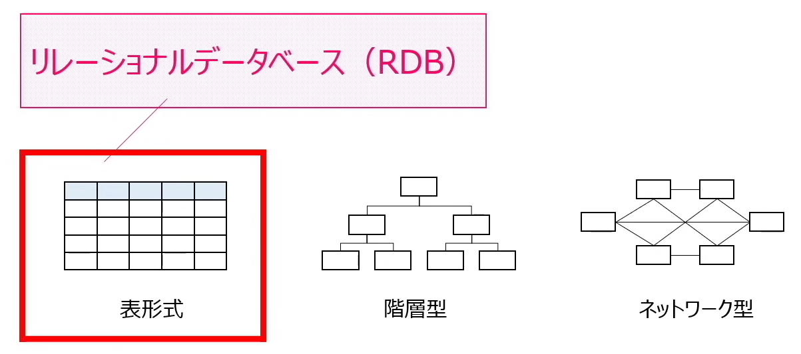
  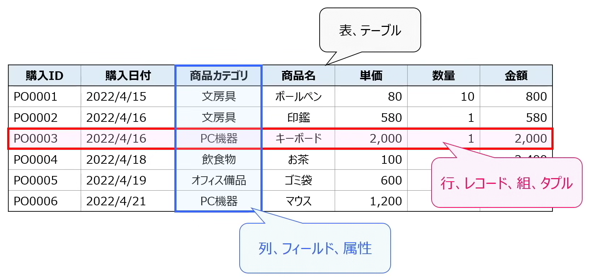
</p>

* スキーマ（構造）
    * データベースを設計する際に、データの独立性を高めるため`3層スキーマ構造`を取っている
        1. `外部スキーマ`（見た目）：`利用者`やアプリケーションから見たデータベースの見た目
        2. `概念スキーマ`（データの構造）：`開発者`から見たデータベースの理論的構造
        3. `内部スキーマ`（ハードウェアとの関係）：データベースを記憶媒体に物理的に記録する際の構造


************************************************************
<div style="page-break-after: always;"></div>

### 📖データベースの正規化
* 主キーと外部キー
    * 表中の行を1つに特定するための列を`主キー`と呼ぶ
    * キーの値が重複しない`一意制約`（ユニークデータ）とキーの値が空値でない`非NULL制約`（空値が入ってはいけない）の2つが必要
    * 複数の列を組み合わせて主キーの役割とすることもある（`複合キー`）
    * 表と表をくっつけるため、他の表の主キーを参照する列を`外部キー`と呼ぶ

* データベースの正規化
    * 表を分けることでデータの独立性が高まり、管理しやすくなる（`正規化`の考え方）
    * `正規化`：データの整理・削除し、矛盾や重複の無い優れたデータベースを作成すること。`いらない列を削除した後に表っを分割する`
        1. 第1正規化：列方向のデータ重複を行方向に`移動`。不要な列を`削除`する
        2. 第2正規化：主キーや複合キーを基に``表を分割する``
        3. 第3正規化：第2正規化で分割できなかった部分を`更に分割する`

* 関数従属性と部分関数従属性
    * `部分関数従属性`：複合キーの一部の項目だけで列の値が一意に決まる関係
    * `関数従属性`：主キーの項目だけで列の値が一意に決まる関係

************************************************************
<div style="page-break-after: always;"></div>

### 📖トランザクション処理
* トランザクション：データベース操作に関する一連の処理
* `ACID特性`（アコイド）：トランザクション処理を実施する際に要求される特性
    * `Atomicity`（原始性）：トランザクションは「全て実行完了」「全て処理されていない」のいずれかであること（`中途半端に一部分だけ処理を実施しない`）
    * `Consistency`（一貫性）：データベースの内容に`矛盾が無い`こと
    * `Isolation`（隔離性）：複数のトランザクションを同時に実行しても順番に実行しても結果が等しくなること（トランザクションが`相互に影響を及ぼさない`）
    * `Durability`（耐久性）：障害が発生してもデータベースから`データが消失しない`こと
* ACID特性を担保するための1つの手段として排他制御を実施
    * 排他制御：1つのトランザクションが処理を行っている間はデータベースにロックをかけて他のトランザクションの影響を受けないようにする
    * 排他制御の方法は`共有ロック`と`専有ロック`の2種類
        * 共有ロック：他のユーザーはデータを`見ることは出来るが、更新は出来ない`（データの共有は可能なので共有ロック）
        * 専有ロック：他のユーザーはデータを`見ることも、更新することも出来ない`（データの共有は可能なので共有ロック）
        * 注意点：
            1. トランザクション1：AのデータをロックしながらBのデータを読みたい
            2. トランザクション2：BのデータをロックしながらAのデータを読みたい
            3. ⇒　互いが互いのロックを永遠に待ち続ける（`デッドロック`）
            4. 解決法：どちらかのトランザクションを強制終了させるしかない
        * `ロックの粒度`：ロックをかける際の粒度（ロックを掛ける範囲の大きさ）によって特徴が異なる

<p align="center">
  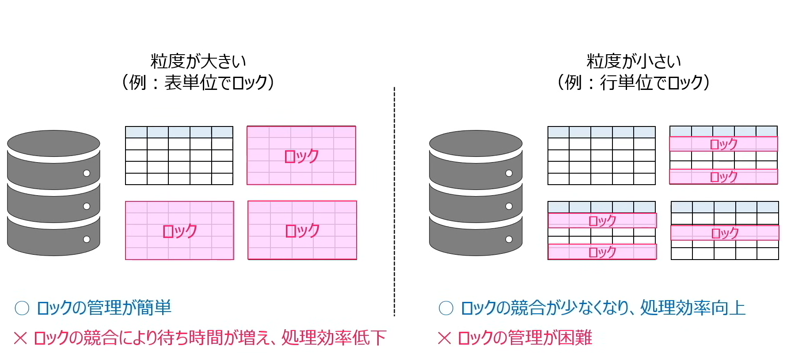
</p>

* `ストアドプロシージャ`
    * 利用頻度の高いSQL命令群を予めDBMS上に用意しておき、`ネットワーク負荷の低減`や`処理速度向上`を実現する
    * SQLとデータベースの操作：データベースを取得したり更新する際はSQLという言語を使用してデータベースを操作する
        * `プロシージャ`：よく使うSQLの命令群をひとつにまとめる

************************************************************
<div style="page-break-after: always;"></div>

### 📖データの復元方法
* ジャーナルファイルとバックアップファイル
    * データベースはアプリケーション等で必要な大切なデータが保管されている
    * データベースはジャーナルファイル（=ログファイル）とバックアップファイルでデータを保護する
        * ジャーナルファイル
            * `更新前ジャーナル`：処理を更新する前の状態を記録する
            * `更新後ジャーナル`：処理を更新した後の状態を記録する

<p align="center">
  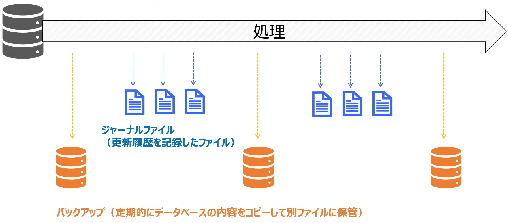
</p>

* コミットとロールバック
    * データベースはトランザクション内の更新すぉすべて反映するか、一切反映しないのどちらかの特徴がある（原子性）
    * 該特徴を満たすため、処理は`コミット`と`ロールバック`により実施される
        * `コミット`：トランザクション内の一連の処理が全て更新できたことを確認して初めてデータベースに更新内容を反映（`処理が全て反映される`）
        * `ロールバック`：処理の途中で障害が発生した場合は更新前ジャーナルを使用して、トランザクション処理開始直前の状態を戻す（`処理が一切反映されない`）

* データベースの復元（ロールフォワード）
    * `ロールフォワード`：システム障害発生時等によりデータが破損した際は、バックアップファイル更新後ジャーナルを使用してデータベースを復元する

<p align="center">
  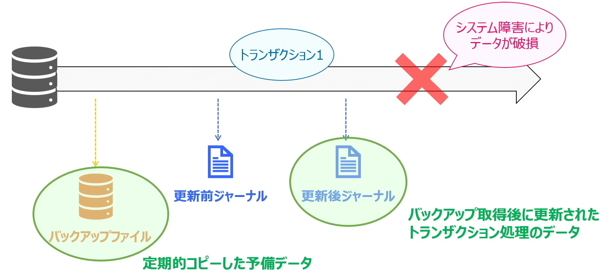
</p>

* ロールバックとロールフォワード
    * `ロールバック`：トランザクション処理中に`エラーが発生した際`、`更新前ジャーナル`で復元
    * `ロールフォワード`：システム障害等で`データが破損した際`、`バックアップファイル`と`更新後ジャーナル`で復元

<p align="center">
  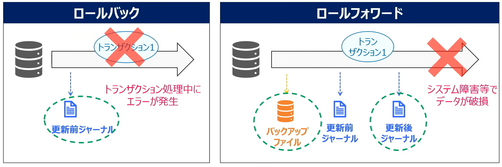
</p>

* 分散データベースと2相コミット
    * `分散データベース`：複数のデータベースを見かけた1つのデータベースとして扱うことが可能
    * `2相コミット`：この際、全てのデータベースにコミット可能か確認して、コミット OR ロールバックを実施する

<p align="center">
  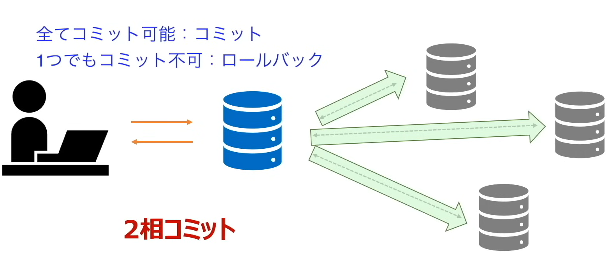
</p>

************************************************************
<div style="page-break-after: always;"></div>

### 📖関係演算とSQL
* 関係演算：関係データベースの操作のこと
    * `選択`：特定の`行`を取り出す
    * `射影`：特定の`列`を取り出す
    * `結合`：表を`結合する`
    * 関係演算を用いて好きな列や行で仮想的に一時的なテーブル（`ビュー表`）を作成することが出来る

<p align="center">
  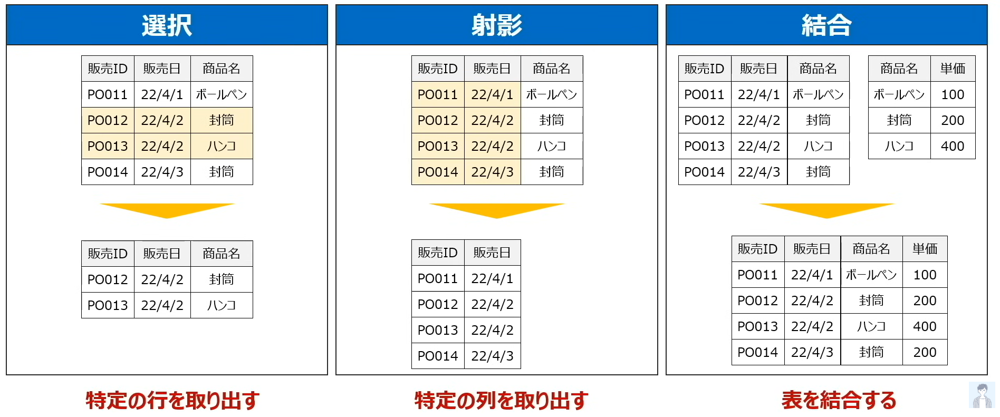
</p>

* SQL(Structured Query Language)
    * データベースを操作する際は`SQL`でDBMSに命令を出す
    * SQLが大きく`DDL`と`DML`の2つの言語で構成されている
    * DDL (Data Definition Language)
        * データを`定義する`言語。データの型を指定し、列に一意制約・NULL制約などを定義する
        * CREATE  ：新しいテーブル/ビュー表を作成
        * DROP    ：既存のデータベースオブジェクトを削除する
        * ALTER   ：既存のテーブルベースオブジェクトを変更する
        * TRUNCATE：テーブルを再編成する
    * DML<br>(Data Manipulation Language)
        * データを`操作する`言語（下記は4大命令）
        * SELECT：レコードを抽出する
        * UPDATE：レコードを更新する
        * DELETE：レコードを削除する
        * INSERT：レコードを挿入する

#### DML
##### SELECT文
* レコードやカラムを選択するコード
``` SQL
SELECT 販売日, 商品名       ---行を指定
FROM 販売データ             ---テーブルを指定
WHERE 販売日="2022/04/21"   ---行を指定（無くてもおK）
```

##### UPDATE文
* レコードを更新するコード
``` SQL
UPDATE 販売データ           ---テーブル指定
SET 単価=150                ---更新内容を指定
WHERE 商品名="ボールペン"   ---更新する行を指定
```

##### DELETE文
* レコードを削除するコード
``` SQL
DELETE
FROM 販売データ             ---テーブルを指定
WHERE 商品名="ボールペン"   ---削除する行を指定
```

##### INSERT文
* レコードを挿入するコード
``` SQL
INSERT INTO 販売データ              ---テーブルを指定
        (販売ID, 商品名, 単価)
VALUES ("P0001", "ノード", "200")   ---追加する列とその列の値を指定

---例：
---| AAA | YYYY | MM  | DD  | EEE |
---| --- | ---- | --- | --- | --- |
---| 001 | 1900 | 01  | 01  | AAA |
---| 002 | 2025 | 12  | 31  | BBB |

INSERT TEBLE_NAME
       (AAA, YYYY, DD)
VALUES (999, 2222, 10)

---| AAA | YYYY | MM  | DD  | EEE |
---| --- | ---- | --- | --- | --- |
---...
---| 999 | 2222 |     | 10  |     |  -> が追加される（MMやEEEに非NULL制約の制限があった場合、エラーが出る）
```

#### SELECT文を構成する句
* 行の選択方法
    * 直接行の名前を指定（,区切り）
    * `*`全指定

* 比較演算子
    * `=`    ：左辺と右辺が等しい
    * `<>`   ：左辺と右辺が等しくない
    * `<`    ：左辺と右辺よりも小さい
    * `<=`   ：左辺と右辺よりも小さい、もしくは等しい
    * `>`    ：左辺と右辺よりも大きい
    * `>=`   ：左辺と右辺よりもも大きい、もしくは等しい

* 論理演算子
    * `AND`  ：かつ
    * `OR`   ：または
    * `NOT`  ：でない

* 集合関数：データを取り出す際の集計を実施する
    * `MAX(列名)`    ：列の最大値を算出
    * `MIN(列名)`    ：列の最小値を算出
    * `SUM(列名)`    ：列の合計を算出
    * `AVG(列名)`    ：列の平均値を算出
    * `COUNT(列名)`  ：指令された列の中で値が入っている行の数を算出
    * `COUNT(*)`    ：行数を算出

* 実行順序
    * FROM
    * WHERE (`テーブルデータ`の中から行を選択)
    * GROUP BY
    * HAVING (`グループ化された行`の中から選択)
    * SELECY
    * ORDER BY

```SQL
SELECT 販売日, SUM(売上)
FROM 販売データ
WHERE 商品名<>"ファイル"
GROUP BY 販売日
HAVING SUM(売上) > 1000
ORDER BY SUM(売上)
```

##### WHERE句
* 条件を指定して行を選択

``` SQL
--- 表の結合：
SELECT *
FROM TABLE_A, TABLE_B
WHERE TABLE_A.商品名=TABLE_B.商品名 ---列名が被っている場合、テーブル指定する必要がある
WHERE 商品名=商品名                 ---列名が被っていない場合、テーブル指定する必要がない
```

##### ORDER BY句
* 並び替え
    * `ASC`  ：昇順（省略可）
    * `DESC` ：降順

``` SQL
SELECT *
FROM TABLE_A
ORDER BY 販売日 DESC, 数量 DESC
```

##### GROUP BY句
* グループ化と集合関数

``` SQL
--- 販売日ごとに、売り上げの合計を集計する
SELECT 販売日, SUM(売上)
FROM TABLE_A
GROUP BY 販売日
```

##### HAVING句
* グループ化された行を選択

``` SQL
SELECT 販売日, SUM(売上)
FROM TABLE_A
GROUP BY 販売日
HAVING SUM(売上) > 1000
```

************************************************************
<div style="page-break-after: always;"></div>

### 📖機械学習とディープラーニング
* ビッグデータ
    * `大量`・`多様`な種類・`高い頻度`で取得できるデータのこと
    * AI楽手することで、精度の高い予測をしてビジネスに活用することが出来る

<p align="center">
  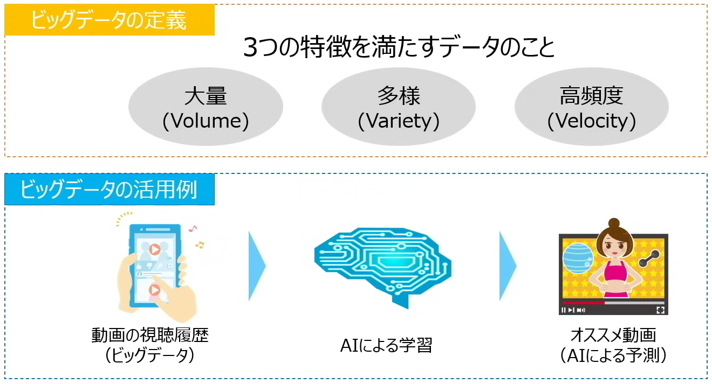
</p>

* AI(Artificial Intelligence)
    * 人工知能、人間の知能を機械で表現しようとした技術
    * 制御工学（非AI）：あらかじめ決められた処理を行う
    * 人工知能：状況によって判断・動作を実施

* AI・機械学習・ディープラーニング
    * `機械学習`：AIを実現するための仕組み
    * `ディープラーニング`：数ある機械学習の手法の中の1つ

<p align="center">
  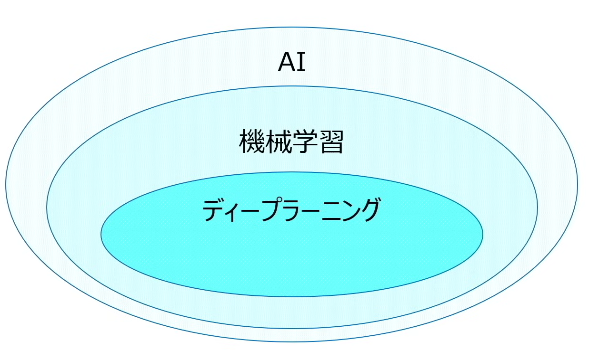
</p>

* 機械学習
    * AIを支える技術の1つであり、大量データからコンピューターが学習を行って、データに潜むパターンを見つけ出すこと。パターンを見つけることでビジネスや生活に活用することが出来る
    * 3つの学習方法
        * `教師あり学習`：コンピューターに`問題と正解をセット`で提示して、コンピューターがそれぞれの特徴を学習する
            * 学習した結果`学習済モデル`が生成される
            * `特徴量`：学習済モデル`に入れ込むデータ
        * `教師なし学習`：コンピューターに正解は提示せずに、与えられたデータの中から統計的な性質等に基づいて`データのグルーピングや集約`を実施する
            * データを読み込ませてコンピューターに学習させることで、属性毎にグルーピングをする
        * `強化学習`　　：個々の行動に対して`報酬として得点が与えられ`、その`得点を最大化する`ように試行錯誤して、最大得点を取得できる行動を学習する

* ディープラーニング
    * `ニューラルネットワーク`を用いて人間と同じような認識を実現する技術
        * ニューロン（脳が情報を識別する際の電気信号が伝わる神経細胞）

<p align="center">
  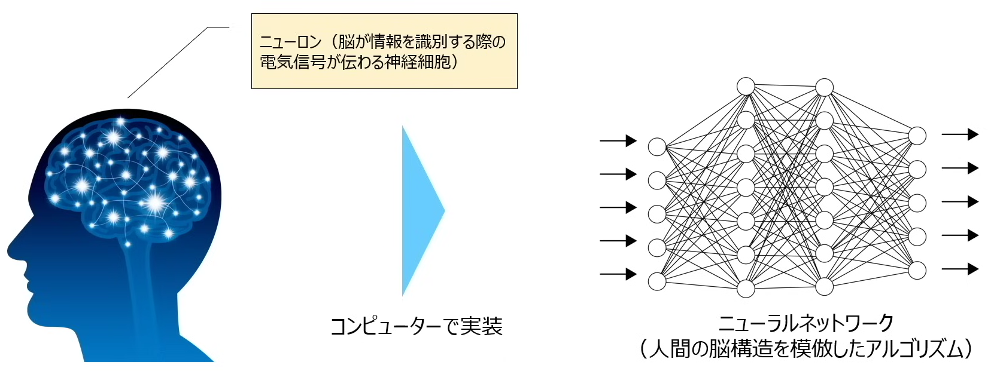
</p>

* エキスパートシステム
    * AIだが`自ら学習はしない`
    * 判断式を人間が与えなければならない
    * 例：IF 咳が出た AND 熱がある THEN 風邪

* エドテック
    * EdTech。Education（教育） × Technology（技術）
    * 教育にITやAIを使うこと全般
        * オンライン授業
        * 学習アプリ
        * AIが問題を出す → 苦手な所を分析して問題を変える
        * LMS（学習管理システム） → 成績・出席・課題を一括管理
