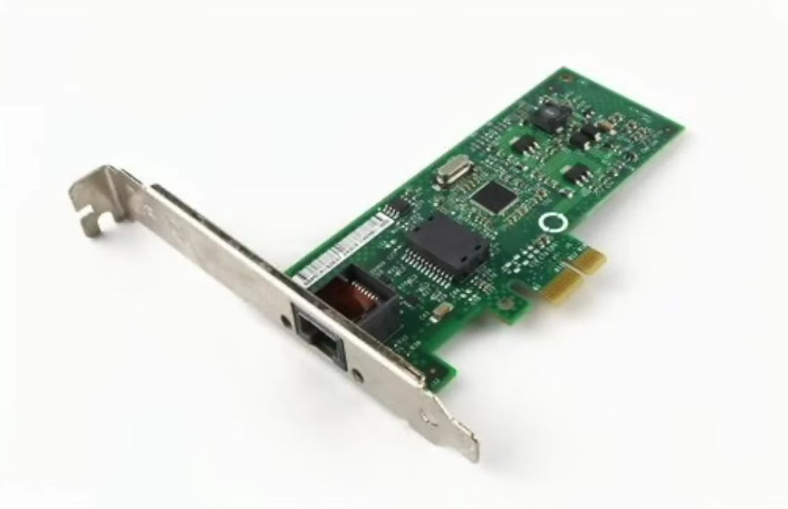
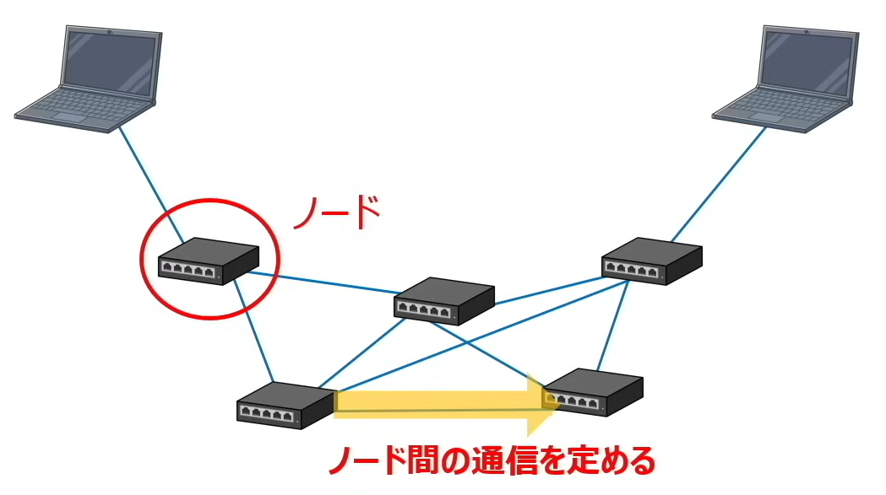
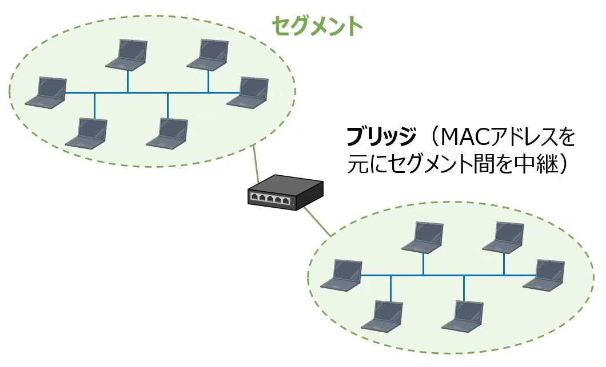
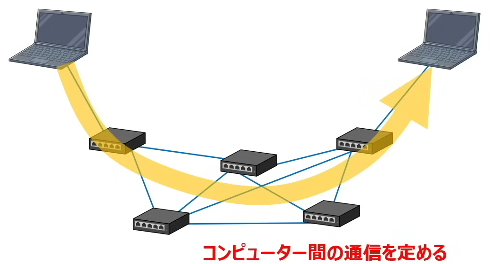
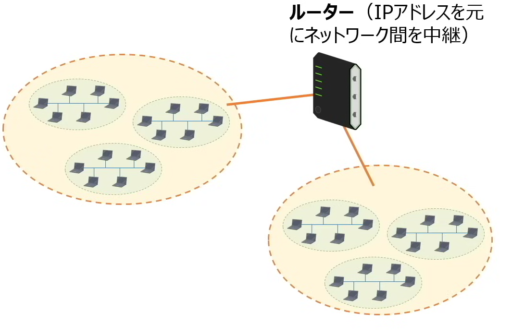
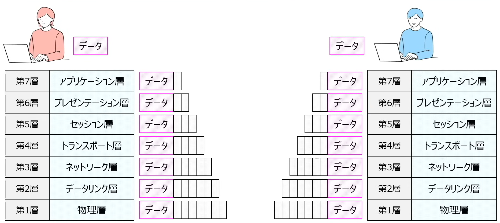
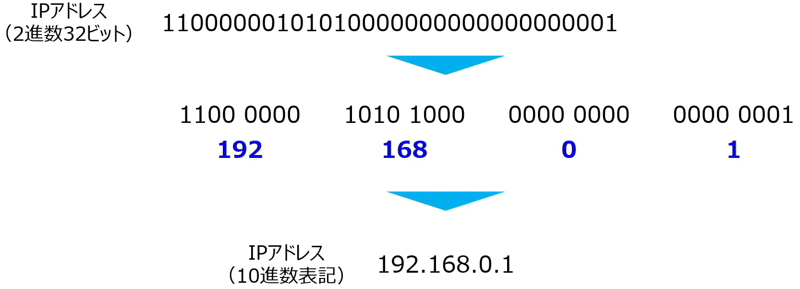
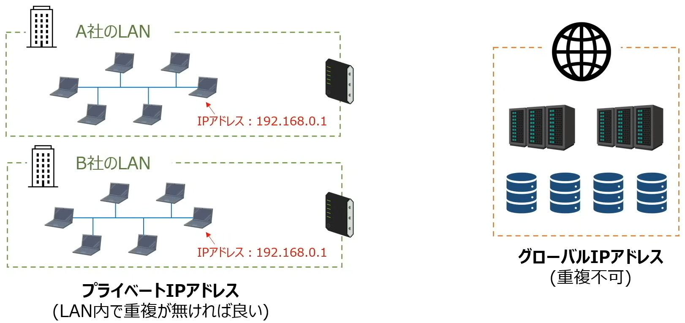
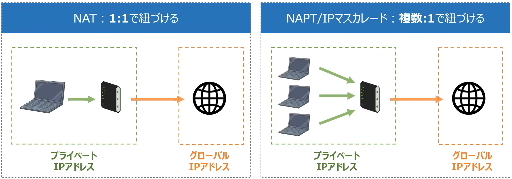
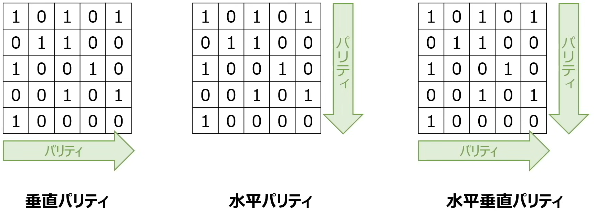

▶ネットワーク
* [1. ネットワークの基本](#ネットワークの基本)
* [2. OSI基本参照モデル](#osi基本参照モデル)
* [3. TCP/IPネットワーク](#tcp/ipネットワーク)
* [4. IPアドレスとサブネットマスク](#ipアドレスとサブネットマスク)
* [5. その他出題範囲](#その他出題範囲)
    * [アプリケーション層のプロトコル](#アプリケーション層のプロトコル)
    * [誤り制御](#誤り制御)
    * [ネットワークに関連する重要な用語](#ネットワークに関連する重要な用語)
* 用語集

|用語|フルネーム|意味|
| --- | --- | --- |
|IP|Internet Protocol|ネットワークを制御するために機器にIPアドレスを割り当て、そのIPアドレスに対して`パケットでデータを送る`|
|TCP|Transmission Control Protocol|通信相手との接続が確認されてから通信を行うルール<br>`信頼性の高いデータ転送`を提供することが可能|
|UDP|User Fatagram Protocol|通信相手の`接続確認をせずに`データを送りつけるルール<br>`信頼性は落ちるが高速`であり、ライブ配信など`リアルタイム性が必要な場合`に使用される|
|IPアドレス|-|IPアドレスはインターネット上の住所のようなもので、`2進数32ビット`のビット列を`8桁ずつ10進数に`直して表現する（IPv4 とIPv6がある）|
|NAT|Network Address Translation|プライベートIPアドレスをグローバルIPアドレスに変換する仕組み|
|NAPT|Network Address Port Translation|複数のプライベートIPアドレスをグローバルIPアドレスに変換する仕組み|
|IPマスカレード|-|上同様|
|ルーター|-|プライベートIPアドレスをグローバルIPアドレスに変換する|
|DHCP|Dynamic Host Configuration Protocol|IPアドレスの割り当てなどネットワークの設定を`自動化`できる仕組み|
|DNS|Domain Name System|ドメインとIPアドレスを紐づけるものがDNSサーバー|
|ネットワーク部|-|`どのネットワークを`使用しているかを指定する部分|
|ホスト部|ネットワーク内で`どのコンピューターを`使用しているか指定する部分|
|クラスA|-| 10.  0`.0.0` ~  10.255`.255.255`|
|クラスB|-|172. 16`.0.0` ~ 172. 31`.255.255`|
|クラスC|-|192.168`.0.0` ~ 192.168`.255.255`|
|`サブネットマスク`|-|用意することでIPアドレスのネットワーク部を自由に設定可能<br>最初にいくつか1が羅列され、残りに0が羅列された`32ビットの2進数`<br>ホスト部はサブネットマスクの0のビット数で取得できる|
|`ネットワークドレス`|ホスト部が全て0であるIPアドレスを`ネットワークドレス`と呼び、`IPアドレス`と`サブネットマスク`の`論理積`で算出することが出来る|
|ポート番号|-|アプリケーションを識別するための番号|
|HTTP|Hyper Text Transfer Protocol|`【80】``Web情報を通信`する際のルール|
|FTP|File Transfer Protocol|【20, 21】`ファイルを転送`する際のルール|
|NTP|Netword Time Protocol|【123】`時刻を調整`する際のルール|
|SMTP|Simple Mail Transfer Protocol|`【25】`メールを`送信`する際のルール|
|POP3|Post Office Protocol Version 3|`【110】`メールを受信する際のルール<br>（メールサーバーから`コンピューターにメールを落とす`）|
|IMAP|Internet Message Access Protocol|【143】メールを受信する際のルール<br>（`メールサーバー上で`メールを`確認する`）|
|MIME|(Secure)Multipurpose Internet Mail Extension|日本語/画像/音声などを扱えるように拡張した仕様|
|S/MINE|-|暗号化・署名の仕組みを扱えるように拡張した仕様|
|誤り制御|-|`誤りを検出する仕組み`を構築することでデータの誤りを検出し、正しいデータに訂正する|
|パリティチェック|-|ビット列に`パリティビットを付与することで`誤りを検出する方法<br>奇数パリティ、偶数パリティ、水平パリティ、垂直パリティ、水平垂直パリティ|
|CRC|-|ビット列を`生成多項式`と呼ばれる特定の式で割り算を行い、その余りをチェック用データとして付加する|
|SDN|Software Defined Networking|ネットワーク設定を`ソフトウェアによって`実現する|
|OpenFlow|-|データ転送機能：ネットワーク機器が担当する<br>経路制御機能：ソフトウェアが担当する|
|IPsec|-|OSI基本参照モデルの`ネットワーク層`のプロトコル<br>`暗号化の機能`がある<br>`複数のプロトコル`で構成|
|CGI|-|Webサイトに`動きをつけたいとき`に使用されるプログラム<br>`アンケートフォーム`等動きのあるサイトが作成<br>※`HTML`は`静的ページ`で、`CGI`は`動的ページ`|

************************************************************
<div style="page-break-after: always;"></div>

### 📖ネットワークの基本
* ネットワーク
    * コンピューターなどのデバイスを繋ぐもの
    * `通信回線` + `通信機器` -> ネットワークを活用してデータを送り合っている
        * `データが大きい`と回線が詰まって`通信速度が遅くなる` = データが送られる`時間が長くなる`
    * `パケット`：【`ヘッダ` + `データ本体`】データを細かく分解して送っている。パケットにはそれぞれにデータの送り先である`宛先情報`が付与されているそれを`ヘッダ`と言う
        * 分解したメリット
            * ネットワークを詰まらせずに通信が可能
            * エラー時はそのパケットだけ再送すれば良い

* 伝送時間：データが送られる時間
    1. データ容量
    2. 回線速度：
        * 単位：bps(bit per second) = ビット/秒
        * 1秒当たりに送ることが出来るデータ量
    3. 伝送効率、`回線利用率`など
        * 実際に送ることが出来るデータ量は減少する
        * 例：回線速度が3M bps、伝送効率が50%
        * 1秒間で送ることが出来るデータ量は1.5Mビット

    * `回線利用率(%) = 実際に送れるデータ量 / 理論上の最大データ量`

* LAN と WAN
    * `LANとWANは、明確の定義はないため、厳密な区別は不要`
    * `LAN`(Local Area Network)：家庭内や事業所など狭い範囲のネットワーク
        * 有線LAN：
            * イーサネット
            * CSMA/CS方式（ネットワークを監視し、空いているタイミングで通信する。`データが衝突（コリジョン）`した場合は、一定時間を空いたあとに再度送信する）
        * 無線LAN：Wi-Fi、便利性が高い、`セキュリティ対策が必要`
    * `WAN`(Wide Area Network)：LANよりも広い範囲のネットワーク

************************************************************
<div style="page-break-after: always;"></div>

### 📖OSI基本参照モデル
* プロトコル：`データが受信するためのルール`
    * ネットワーク上でデータをやり取りするにはプロトコルが必要

* OSI基本参照モデル
    * 複雑なルール（プロトコル）が必要
        * むかしむかし、プロトコルは会社ごとに混在していました。同一会社の製品でないとネットワークを構成できないため、`データ送信のルールを標準化`をすべく`OSI基本参照モデル`が生まれたとさ
    * ネットワークを構成するためのルールを大きく`7つのカテゴリー`に分け、それぞれのカテゴリーで具体的なルール（プロトコル）を管理している

|階層|階層名|各階層におけるプロトコル例|使用される機器|
| --- | --- | --- | --- |
|第1層|物理層              |RS-232, UTP etc.|`NIC`、`リピーター`、`リピーターハブ`|
|第2層|データリング層       |PPP, Ethernet etc.|`ブリッジ`、`スイッチングハブ`|
|第3層|ネットワーク層       |IP, ARP, ICMP etc.|`ルーター`|
|第4層|トランスポート層     |TCP, UDP etc.|`ゲートウェイ`|
|第5層|セッション層        |NetBIOS, DSI etc.|`ゲートウェイ`|
|第6層|プレゼンテーション層 |TLS, SSL, JPEG, MPEG etc.|`ゲートウェイ`|
|第7層|アプリケーション層   |HTTP, DHCP, DNS, SMTP, POP etc.|`ゲートウェイ`|

1. 物理層
    * ネットワークの物理的な機能を定めた階層
    * データを送るためには送信元のコンピューターが作成したデータを電気信号に変換する必要がある
        * 電圧レベル
        * ネットワーク接続に必要なケーブルの種類
    * 使用される機器：`NIC`、`リピーター`、`リピーターハブ`
        * NIC(Network Interface Card)：データを電気信号に変換してケーブルに流す装置
        * リピーター：電気信号を増幅させ、通信距離をの伸ばす装置
        * リピーターハブ：リピーターが複数連なったもの

<p align="center">
  
</p>

2. データリンク層
    * ノード間の通信に関するルールを定めたか階層
    * ノード：ネットワークを構成する機器
    * コンピューター同士は直接に繋がってるのではなく、多くの機器（ノード）が繋がってネットワークを構成している
    * ノード間における通信ルールがデータリンク層に定義されており
        * ルール：`データの送信元と宛先の識別`、`データ衝突の回避方法`、`データ衝突した対応方法`が定義されている
    * 使用される機器：`ブリッジ`、`スイッチングハブ`
        * ネットワーク内には`セグメント`と呼ばれている小さなネットワークを形成することがある
        * ブリッジ：MACアドレスを元にセグメント間を中継する。コンピューターから流れてきた`パケット`の宛先`MACアドレス`と呼ばれている番号確認し、適切なセグメントへパケットを渡す
            * `パケット`：相手に送るデータを細かく分割したもの
            * `MACアドレス`：ネットワーク機器に割り当てられている番号（世界中で重複がない）コンピューターなどのデバイスを識別するためにコンピューター製造時に割り当てられている番号みたいな
        * スイッチングハブ（`レイヤ2スイッチ`）：ブリッジが複数連なったもの、複数セグメント間の通信を可能にする

<p align="center">
  
  
</p>

3. ネットワーク層
    * 送信元コンピューターから送信先コンピューターへデータ通信するルール定めた階層
    * `どのノードを経由してデータを送っていくのか`、`ネットワーク全体`に関するルール
        * ルール：データを送る際に、`どのようにネットワークを識別するのか`、`どのネットワーク経路を選択するか`などを定義している
    * 使用される機器：`ルーター`
        * ルーター（`レイヤ3スイッチ`）：（宛先）IPアドレスを元にネットワーク間を中継

<p align="center">
  
  
</p>

|MACアドレス|IPアドレス|
| --- | --- |
|例：A1-BB-D4-7F-29-C3<br>コンピューターを識別するための番号<br>番号が`体系的でない`<br>使用される階層：`第2層（データリンク層）`|例：192.168.0.1<br>コンピューターを識別するための番号<br>番号が`体系的に整理されている`<br>使用される階層：`第3層（ネットワーク層）`|

4. トランスポート層
    * データを送る際の`信頼性`に関するルールを定めた階層
    * 通信する際は`信頼性とスピードのどちらを重視するか`、データ通信で`異常が発生した際の対象法`を定義し、通信が期待通りに行われていることを担保する
    * `第4層以降に`使用される機器：`ゲートウェイ`
        * `ゲートウェイ`：異なるネットワーク間でプロトコル変換を行う装置　

5. セッション層
    * 通信の開始から終了までのルールを定めた階層
    * 通信を行うために接`続することを相手機器に知らせ`たり、`接続が切れた時の対象法`を定義している

6. プレゼンテーション層
    * `データの表現形式`に関するルール定めた階層
    * 例：メールで入力された日本語は、文字コードを使い0,1に変換されるが、その際に、どの文字コードで表現をしているのかといったことを定義している
    * データの`圧縮解凍`、`暗号化ルール`もこの層にて定義する

7. アプリケーション層
    * ネットワークというよりアプリケーション固有のルールを定めた階層

* OSI基本参照モデルにおけるデータ通信の流れ
    1. 送信元（数字が`高い層`から⇒`低い層`に向かって処理する）
        7. 添付ファイルをどのように送信するかなど、メールに関するルールを定める、定めた情報を元データに付与する（`ヘッダ`）
        6. メールに記載された日本語を01に変換するルールなどを定める（`ヘッダ`を付与）
        5. 通信の開始から終了までのルールを定める（`ヘッダ`を付与）
        4. データを送る際のルールを定める（`ヘッダ`を付与）
        3. 送信元から受信元までのネットワーク通信に関するルールを定める（`ヘッダ`を付与）
        2. ノード間に関するルールを定める（`ヘッダ`を付与）
        1. 物理的なルールを定める（`ヘッダ`を付与）
    2. 受信元（数字が`低い層`から⇒`高い層`に向かって処理する）
        1. 第1層に定められた物理的なルールに従って、電気信号に変換されたデータをコンピューターが受信する（第1層に付与された`ヘッダ`を外す）
        2. ノード間に関するルールがヘッダに定義されているため、そのルールに従ってノード間でデータを通信すると同時に処理を終わったら（第2層に付与された`ヘッダ`を外す）
        3. 3 ~ 7層も同じように、各層に付与されたルールに従ってデータを受信していき、ルールが確認できたら不要となったヘッダをはずす

<p align="center">
  
</p>

************************************************************
<div style="page-break-after: always;"></div>

### 📖TCP/IPネットワーク
* TCP/IPネットワーク
    * OSI基本参照モデルが浸透する前に、`TCP/IPネットワーク`が登場しより標準ルールとして浸透しており、より簡略化されたもの

|階層|階層名|OSI基本参照モデル相当|各階層におけるプロトコル例|
| --- | --- | --- | --- |
|第1層|ネットワーク層<br>インターフェース層|第1層、第2層|PPP, PPPoE|
|第2層|インターネット層  |第3層|`IP`, ICMP, ARP|
|第3層|トランスポート層  |第4層|`TCP`, `UDP`|
|第4層|アプリケーション層|第5層、第6層、第7層|HTTP, FTP, Telnet, SMTP, POP3, IMAP, NTP|

* IP(Internet Protocol)
    * 異なるネットワークをつなぐ方法を定義
    * ネットワークを制御するために機器にIPアドレスを割り当て、そのIPアドレスに対して`パケットでデータを送る`
* TCP(Transmission Control Protocol)
    * 通信相手との接続が確認されてから通信を行うルール
    * `信頼性の高いデータ転送`を提供することが可能
* UDP(User Fatagram Protocol)
    * 通信相手の`接続確認をせずに`データを送りつけるルール
    * `信頼性は落ちるが高速`であり、ライブ配信など`リアルタイム性が必要な場合`に使用される

* IPアドレス
    * IPアドレスはインターネット上の住所のようなもので、`2進数32ビット`のビット列を`8桁ずつ10進数に`直して表現する

<p align="center">
  
</p>

* IPv4 とIPv6
    * IPアドレスは最初にIPv4(32ビット)が作られたが、ネットの高速な普及により数が不足したため、128ビットに拡張したIPv6(128ビット)が作成された
        * なんだかんだIPv4で事足りており、あまり使われていない

    * グローバルIPアドレスとプライベートIPアドレス（IPv4で上手くやりくりしたら事足りてしまった理由）
        * IPアドレスをグローバルIPアドレスとプライベートIPアドレスに分けることで、IPアドレスの数を節約している
        * `グローバルIPアドレス`：インターネットの世界で使用するIPアドレスで、世界中で一つでなけらばいけない（YouTube、Facebook）
        * `プライベートIPアドレス`：企業や家庭内などのLAN内で使うことができるアドレス。同一ネットワーク内で重複がなければ自由に割り当てればおk
    
    * NATとNAPT/IPマスカレード
        * アドレスから直接グローバルIPアドレスにアクセスすることが出来ない。プライベートIPアドレスは同一ネットワーク内での重複はないが、異なるネットワーク間に重複がある可能性がある
        * そのため、プライベートIPアドレスをグローバルIPアドレスに変換する必要がある
        * `NAT`（Network Address Translation）：プライベートIPアドレスをグローバルIPアドレスに変換する仕組み
            * `ルーター`：プライベートIPアドレスをグローバルIPアドレスに変換する
        * `NAPT`（Network Address Port Translation）または`IPマスカレード`：複数のプライベートIPアドレスをグローバルIPアドレスに変換する仕組み

        * プライベートIPアドレスとグローバルIPアドレスを1対1で紐づける技術が`NAT`、複数対1で紐づける技術が`NAPT`もしくは`IPマスカレード`

<p align="center">
  
  
</p>

* DHCP（Dynamic Host Configuration Protocol）
    * LAN内で重複がないようにIPアドレスを割り当てる必要がある
    * IPアドレスの割り当てなどネットワークの設定を`自動化`できる仕組み

* ドメインとDNSサーバー
    * IPアドレスはネット上の住所のことなので、IPアドレスでWebサイトにアクセス可能
    * 実際はドメインを使用してサイトにアクセスする
    * `ドメイン`：IPアドレスを人間には分かりやすくするように変換してものであり、IPアドレスと同じ効果を発揮する
    * `DNS`（Domain Name System）：ドメインとIPアドレスを紐づけるものがDNSサーバー

************************************************************
<div style="page-break-after: always;"></div>

### 📖IPアドレスとサブネットマスク
* IPアドレス（8ビット列 * 4）は、`ネットワーク部`と`ホスト部`から構成される
    * `ネットワーク部`または`ネットワークアドレス`：`どのネットワークを`使用しているかを指定する部分
    * `ホスト部`：ネットワーク内で`どのコンピューターを`使用しているか指定する部分
    * クラスによってIPアドレスのネットワーク部/ホスト部が定義される
        * クラスA
            * `先頭8ビット`ネットワーク部(一番先頭は`0固定`)
            * `残り24ビット`がホスト部　⇒　2<sup>24</sup> - 2 = 約1677万通り
            * 採用傾向：大量のコンピューターにIPアドレスを割り当てられるため、1つのネットワーク内で`大量のコンピューターを使用するような大規模なネットワークを構成する際`に採用する

        * クラスB
            * `先頭6ビット`がネットワーク部(一番先頭は`10固定`)
            * `残り16ビット`がホスト部　⇒　2<sup>16</sup> - 2 = 約6万通り
            * 採用傾向：中規模のネットワークに採用される

        * クラスC
            * `先頭24ビット`がネットワーク部(一番先頭は`110固定`)
            * `残り8ビット`がホスト部　⇒　2<sup>8</sup> - 2 = 約254台
            * 採用傾向：小規模のネットワークに採用される

        * 共通点
            * 予約アドレスあり（ホスト部が全部`1`または`0`）：
                * `ブロードキャストアドレス`：11111111 11111111 11111111
                * `ネットワークアドレス`　　：00000000 00000000 00000000(`ネットワーク部`と同名)
            
|クラス|プライベートIPアドレス範囲|覚え方|
| --- | --- | --- |
|クラスA| 10.  0`.0.0` ~  10.255`.255.255`|最初：10.0<br>最後：10.255|
|クラスB|172. 16`.0.0` ~ 172. 31`.255.255`|いなにいちろく ~ いなにさんいち<br>172.16   ~ 172.31|
|クラスC|192.168`.0.0` ~ 192.168`.255.255`|いちくにいちろっぱ ~ いちくにいちろっぱ<br>192.168 ~ 192.168|

```
クラスA
 10.  0.  0.  0 -> 00001010 00000000 00000000 00000000
 10.255.255.255 -> 00001010 11111111 11111111 11111111

クラスB
172. 16.  0.  0 -> 10101100 00010000 00000000 00000000
172. 31.255.255 -> 10101100 00011111 11111111 11111111

クラスC
192.168.  0.  0 -> 11000000 10101000 00000000 00000000
192.168.255.255 -> 11000000 10101000 11111111 11111111
```

* IPアドレスとサブネットマスク
    * IPアドレスのネットワーク部とホスト部を自由に設定したいケースがある
    * `サブネットマスク`を用意することでIPアドレスのネットワーク部を自由に設定可能
    * `サブネットマスク`：最初にいくつか1が羅列され、残りに0が羅列された`32ビットの2進数`。柔軟にネットワークを設定することが可能
        * 記載方法：サブネットマスクはIPアドレスの後ろに掲載される
            * 例：192.168.0.1/ 255.255.255.192
            * 例：192.168.0.1/ 26 -> `サブネットマスクの1の数`

    * `ネットワークドレス`：ホスト部が全て0であるIPアドレスを`ネットワークドレス`と呼び、`IPアドレス`と`サブネットマスク`の`論理積`で算出することが出来る
        * `IPアドレス`のネットワーク部自体を`ネットワークドレス`と呼ぶこともある
        * ここのホスト部は論理積の結果ではなく、`サブネットマスク`に依存する
        * ホストとして使用できるアドレス個数：`2の(ホスト部のビット数)乗 - 2`

```
IPアドレス
192.168.  0.  1 -> 11000000 10101000 00000000 00000001
サブネットマスク
255.255.255.192 -> 11111111 11111111 11111111 11000000　⇒　ホスト部は一番➡ビット、2の6乗-2

ネットワークドレス
               11000000 10101000 00000000 00000000
```

************************************************************
<div style="page-break-after: always;"></div>

### 📖その他出題範囲
#### アプリケーション層のプロトコル
* ポート番号：アプリケーションを識別するための番号
    * ポート番号の種類
        * 0 ~ 1023番：WELL KNOWN PORT NUMBERS
            * よく利用されるアプリケーション用いて予め予約
        * 1024番以降：ランダムポート
            * クライアントPC使用する番号

|プロトコル|役割|ポート番号|
| --- | --- | --- |
|HTTP|`Web情報を通信`する際のルール|`80`|
|FTP|`ファイルを転送`する際のルール|20, 21|
|NTP|`時刻を調整`する際のルール|123|
|SMTP|メールを`送信`する際のルール|`25`|
|POP3|メールを受信する際のルール<br>（メールサーバーから`コンピューターにメールを落とす`）|`110`|
|IMAP|メールを受信する際のルール<br>（`メールサーバー上で`メールを`確認する`）|143|

* HTTP(Hyper Text Transfer Protocol)
    * ポート番号：`80`
    * Webサイトを閲覧する際のルール
    * ブラウザがサーバーというコンピューターにリクエストを送り、サーバーはブラウザに情報を返す（データの通信）

* FTP(File Transfer Protocol)
    * ポート番号：`80`
    * ネットワークを用いてファイルを送る際のルール

* NTP(Netword Time Protocol)
    * コンピューター内の時刻を同期する際のルール
    * 時間がずれないように、コンピューター内の時計は、定期的にタイムサーバーと通信を行うことで調整している

* 電子メールに関するプロトコル
* SMTP(Simple Mail Transfer Protocol)
    * ポート番号：`25`
    * メール送信する際のルール

* POP3(Post Office Protocol Version 3)
    * ポート番号：`110`
    * メール受信する際のルール
    * メールサーバーから、コンピューターにメールを持ってきて、`コンピューター内で`メールを確認

* IMAP(Internet Message Access Protocol)
    * メール受信する際のルール
    * `メールサーバー上`でメールを確認

* MIME((Secure)Multipurpose Internet Mail Extension)
    * 電子メールはもともと半角英数字しか扱えなかった
    * 日本語/画像/音声などを扱えるように拡張した拡張仕様　⇒　`MIME`
    * 暗号化・署名の仕組みも追加　⇒　`S/MIME`

#### 誤り制御
* ネットワークを用いてデータを送りあうだが、ネットワークのエラーにより誤ったデータに代わる可能性がある。その`誤りを検出する仕組み`を構築することでデータの誤りを検出し、正しいデータに訂正することができる

* パリティチェック
    * ビット列に`パリティビットを付与することで`誤りを検出する方法
        * 奇数パリティ：ビット列の中の「1」の数が奇数になるようにパリティビットを追加する。もし送信結果「1」の数がが偶数個がある場合誤りが発生したとみなす
        * 注意点：複数ビットで誤りが発生したとき、誤っているのに検出できなくなる

        * パリティを付与する方向によって名称が異なる
            * 垂直パリティ
            * 水平パリティ
            * 水平垂直パリティ

```
--- 奇数パリティ
ファイルA:  1010000
ファイルB:  1011000

奇数になるようにパリティを追加
ファイルA: 11010000
ファイルB: 01011000

送信
データの1の数が奇数の場合　⇒　誤り未検出
```

<p align="center">
  
</p>

* CRC
    * ビット列を`生成多項式`と呼ばれる特定の式で割り算を行い、その余りをチェック用データとして付加する

#### ネットワークに関連する重要な用語
* SDN（Software Defined Networking）
    * ネットワーク設定を`ソフトウェアによって`実現する
    * OpenFlow
        * ネットワーク機器内にある`データ転送機能`と`経路制御機能`を分割する
            * データ転送機能：ネットワーク機器が担当する
            * 経路制御機能：ソフトウェアが担当する

* IPsec
    * OSI基本参照モデルの`ネットワーク層`のプロトコル
    * `暗号化の機能`がある
    * `複数のプロトコル`で構成

* CGI
    * Webサイトに`動きをつけたいとき`に使用されるプログラム
    * ブラウザがサーバーへリクエストが発生したタイミングで、サーバー側でプログラムが稼働し、処理を実行し、結果をブラウザに返されること
    * `アンケートフォーム`等動きのあるサイトが作成
    * `HTML`は`静的ページ`で、`CGI`は`動的ページ`
