▶情報セキュリティ
- [📖情報セキュリティの考え方](#情報セキュリティの考え方)
- [📖コンピューターウィルスとサイバー攻撃](#コンピューターウィルスとサイバー攻撃)
- [📖暗号化とデジタル署名](#暗号化とデジタル署名)
- [📖ネットワークセキュリティ](#ネットワークセキュリティ)
- [📖ネットワークセキュリティ過去問演習](#ネットワークセキュリティ過去問演習)

|用語|フルネーム|意味|
| --- | --- | --- |
|情報セキュリティ上の重大な欠陥<br>セキュリティホール|-|OSやソフトなどにおいで、設計上の不具合、プログラムのミスにより発生する|
|ソーシャルエンジニアリング|-|人の心理の隙をついて機密情報を入力する行為|
|不正のトライアングル|-|機会・動機・正当化<br>`機会`：`自分以外のパソコン`にログインできてしまう<br>`動機`：`営業ノルマ`のプレッシャー<br>`正当化`：不正を働いても`仕方がない、会社のためでもある`|
|ISMS|Information Security Management System|`ISMS適合評価制度`。情報セキュリティを管理する仕組み|
|JIS Q 27000|-|用語の定義|
|JIS Q 27001|-|ISMS認証評価事故|
|JIS Q 27004|-|情報セキュリティガバナンス|
|情報セキュリティの3大要素|-|`機密性`：`許可された人だけ`が情報にアクセスできるようにすること<br>`安全性`：情報が`正確`・`安全`であること<br>`可用性`：利用者が`必要な時にいつでも情報にアクセスできる`こと<br><br>`真正性`：偽造やなりすましがなく`情報が本物`であること<br>`信頼性`：`意図した通りの結果`が返ってくること<br>`責任追跡性`：誰が関与したか`追跡ができるようにする`こと<br>`否認防止性`：あとで`「自分ではない」と否定されないように`すること|
|マルウェア|-|コンピューターに悪影響を与えるソフトウェアの総称|
|`コンピューターウィルス`|-|他のプログラムに寄生しながらコンピューターに悪影響を与えるウィルス|
|`マクロウィルス`|-|`Excel`や`Word`などの`マクロ機能`を悪用して感染するウィルス|
|`ワーム`|-|`自己増殖機能`を持ち、`自ら感染を広めていく`ウィルス|
|`トロイの木馬`|-|有`益なソフトウェアと見せかけ`てユーザーに実行を促し、その`裏で不正操作をする`ウィルス|
|`スパイウェア`|-|`他ソフトに紛れて`コンピューターに`インストールされ`、`利用者の情報を抜き取る`ウィルス|
|`ランサムウェア`|-|（ランサム|-|身代金）利用者PCの`ファイル勝手に暗号化`し、暗号化の解除と引き替えに`金銭を要求する`こと|
|`キーロガー`|-|`キーボード操作を不正に記録`して`利用者の個人情報を抜き取る`こと|
|`ルートキット`|-|（バックドア|-|攻撃者がこっそりと作るWebサイトへの侵入経路（バックドアからのアクセスは検知できない））`バックドア生成ツール`や`ログ改ざんツール`など、コンピューターへの`不正アクセスに有用なツールがパッケージとして`まとめられたもの|
|`ボット`|-|`ウィルス感染した情報機器`を外部から不正に操作するプログラム|
|C&Cサーバー|-|遠隔操作をするために命令を出すサーバー|
|ゾンビ|-|ウィルスに感染して不正に操作されるコンピューター|
|ビヘイビア法|-|`メモリ上の仮想環境`で`検査対象のプログラムを実際に動かし`、その挙動からマルウェアを検知する。`未知ウィルスの検知も可能`。`※誤った検知をすることもある`|
|パターンマッチング法|-|既存のウィルスのパターン（シグネチャコード）と検査対象プログラムを`比較して`マルウェアを検知する。未知ウィルスの検知は不可能|
|辞書攻撃|-|パスワードに何かしら単語を使用する人が多いことを悪用し、辞書に載っている単語でパスワードを推測する手法|
|`ブルートフォース攻撃`/総当たり攻撃|-|IDを1つ定め、`パスワード`として使用可能な文字`を総当たり`で試す手法|
|`リバースブルートフォース攻撃`/総当たり攻撃|-|パスワードを1つ定め、`ID`として使用可能な文字`を総当たり`で試す手法|
|`パスワードリスト攻撃`|-|他のサイト等で不正に入手したパスワードとIDを用いてログインを試す手法。IDとパスワードを`複数のサイトで使いまわす人`を狙った攻撃|
|レインボー攻撃|-|不正に入手した`パスワードのハッシュ値`（あるデータを特定のアルゴリズム（ハッシュ関数）で変換したもの（データ➡ハッシュ値〇、不可逆））から`元のパスワードを推測する`手法|
|`クロスサイトスクリプティング`|-|正規のWebサイト上に`偽のWebページを表示させる`手法。`問い合わせフォーム`等の偽サイトを表示して利用者に個人情報を入力させることで情報を抜き取る|
|`SQLインジェクション`|-|（インジェクション：注入）`SQLの中に不正な命令を紛れ込ませ`、データベースを不当に操作する手法。`データの漏洩`や`データベースの破壊`等の被害が想定される|
|OSコマンドインジェクション|-|ユーザーが`Webサイトに入力したデータ`に`OSへの命令文（コマンド）`を紛れ込ませる手法。OS操作コマンド（`ファイルの削除`や`書き換え`等）を不正操作され、`情報漏洩`等に繋がる|
|ディレクトリリスティング|-|Webサイトを構成する`ディレクトリやファイルの一覧をすべて表示させる攻撃`（ユーザーに公開していないファイルも表示されてしまう）|
|ディレクトリトラバーサル|-|（トラバーサル：横断、縦走、走査）`Webの非公開ファイルに不正にアクセス`し、`ファイルの閲覧や削除`などを実施する攻撃|
|`DNSキャッシュポイズニング`|-|ドメインとIPアドレスを結びつけるDNSサーバーに偽サイトのドメインを紛れ込ませ、利用者を偽サイトに誘導する手法|
|フィッシング|-|金融機関などを装った電子メールを送信して偽サイトに誘導し、使用者から個人情報を抜き取る手法|
|セッションハイジャック|-|利用者がWebサイトにログインした際に発行される`セッションIDをはく奪`し、`そのIDを用いて利用者になりすます`手法|
|SEOポイズニング|Search Engine Optimization|SEO（Webサイトの掲載順位を決定するアルゴリズム）を悪用し、悪意のあるWebサイトが検索上位に表示されるようにすること（Googleで某銀行を検索したが一番上に出てきたのは偽サイト）|
|IPスプーフィング|-|攻撃者のIPアドレスを`正規のアドレスに詐称`してサイトに不正アクセスする手法|
|`ドライブバイダウンロード`|-|Webサイトを閲覧しただけでマルウェアを閲覧者のPCにダウンロードさせる手法|
|バッファオーバーフロー|-|サーバーの`処理能力を超える大容量データ`等を送り付け、サービスを停止させる攻撃|
|Dos攻撃|-|特定のWebサイトに対して`大量のアクセス`を行い、サーバー機能を停止させること（攻撃者PCが1台）|
|DDos攻撃|-|特定のWebサイトに対して`大量のアクセス`を行い、サーバー機能を停止させること（攻撃者PCが複数台）|
|共通鍵暗号方式|-|（盗聴を防ぐ手法）暗号化と復号で`同じ鍵`を使用し、鍵を`秘密`にしておく|
|公開鍵暗号方式|-|（盗聴を防ぐ手法）暗号化と復号で`別々の鍵`を使用し、暗号化用の鍵を`公開`する|
|ハッシュ関数<br>メッセージダイジェスト|-|（改ざん防ぐ手法）入力データにハッシュ関数（`SHA-256`）を利用して出力されたデータはハッシュ値|
|デジタル署名|-|（改ざん・なりすましを防ぐ手法）ハッシュ化及び公開暗号方式の逆手順で`デジタル署名`を実施することで改ざんとなりすましを防ぐ|
|認証局とPKI（公開鍵基盤）|Public Key Infrastructure|`公開鍵が本人のものであることを証明`する認証機関を認証局（CA:Certification Authority）|
|ファイアウォール|-|`内部ネットワーク`と`外部ネットワーク`の間で機能する、外部からの不正アクセスを防ぐ仕組み|
|パケットフィルタアリング|-|`パケットのヘッダ情報で`通信可否を制御する方法|
|ホワイトリスト|-|通過`許可`IPアドレスを設定|
|ブラックリスト|-|通過`禁止`IPアドレスを設定|
|プロキシサーバー|-|`内部から外部へ`のアクセスを`代理実施`するサーバー|
|リバースプロキシサーバー|-|`外部から内部へ`のアクセスを`代理実施`するサーバー|
|DMZ|DeMilitarized Zone|`内部・外部から切り離されたネットワーク`をDMZと呼び、自社サイトのWebサーバーなど外部に公開するサーバーを設置|
|WAF|Web Application Firewall|`Webアプリケーション`への攻撃を防ぐ仕組み|
|`バイオメトリクス認証`|-|（Biometric：生体認証）指紋認証、顔認証、音声認証など`身体的特徴`を用いて本人確認をする方法|
|ワンタイムパスワード|-|一定時間ごとに発行され、`一度きりしか使用出来ないパスワード`（一回しか使用しないため、仮にパスワードを盗まれても問題ない）|
|CAPTCHA/ reCAPTCHA|-|`コンピューターでは識別不可能な文字や画像をユーザー`に回答させ、ユーザーがコンピューターbotではないことを証明する方法|
|VPN|Virtual Private Network|ネット回線上に特定の人だけがアクセスできる`仮想的な専用機`を引き、通信の安全性を高める方法|
|SSL|Secure Sockets Layer|`インターネットの通信を暗号化`するプロトコルであり、`クレジットカード等の機密情報`を送る際に使用される（`※　SSLの次世代規格をTLSと呼び、あまり区別されない`）|
|ペネトレーションテスト|-|（Penetration：浸透/ 侵入）`システムの脆弱性を検知するため`、システムに対して`実際に攻撃を仕掛け`、セキュリティレベルをチェックすること（攻撃する人をホワイトハッカーと呼ぶ）|
|ファジング|-|（Fuzz：毛羽/ 綿毛　⇒　けばだたせる/ ぼやけさせる）`ソフトウェアの脆弱性を検知するため`、プログラムに対して異常を引き起こす可能性がある`多様なデータ`を自動入力してチェックすること|
|`HTTP`|-|Webサーバーとブラウザ間で情報を通信する際に使用されるプロトコル|
|`HTTPS`|-|HTTP over SSL/TLSの略で、SSL/TLSを用いてHTTP通信を`暗号化`したプロトコル|
|`IP`|-|TCP/IPモデル第2層で使用され、データを正しいアドレスに送るためのプロトコル|
|`IPsec`|-|IPプロトコルを拡張し`暗号化`を実現するプロトコル|
|`TELNET`|-|現在のコンピューターから別のコンピューターを遠隔操作するプロトコル|
|`SSH`|-|現在のコンピューターから別のコンピューターを`暗号化通信`で安全に遠隔操作するプロトコル|

<p align="center">
  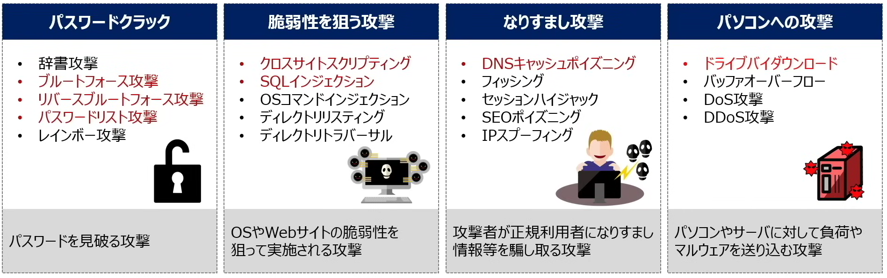
</p>


* 【共通鍵暗号方式（秘密鍵暗号）】
```
>>> 送信側 <<<
  ↓
① 共通鍵（秘密鍵）で暗号化
  ↓
② 暗号文を送信
  ↓
>>> 受信側 <<<
  ↓
③ 同じ共通鍵で復号
```

* 【公開鍵暗号方式（秘密鍵暗号）】
```
>>> 送信側 <<<
  ↓
① 受信側の「公開鍵」で暗号化
  ↓
② 暗号文を送信
  ↓
>>> 受信側 <<<
  ↓
③ 自分の「秘密鍵」で復号
```

* 【デジタル署名（改ざん防止＋本人確認）】
```
>>> 送信側 <<<
  ↓
① メッセージのハッシュ値を作る
  ↓
② 自分の「秘密鍵」で署名（暗号化）
  ↓
③ メッセージ + 署名 を送信
  ↓
>>> 受信側 <<<

  ↓
④ 送信者の「公開鍵」で署名を復号
  ↓
⑤ 自分で計算したハッシュ値と比較
```

************************************************************
<div style="page-break-after: always;"></div>

### 📖情報セキュリティの考え方
* 情報セキュリティ
    * インターネットの発達により、サーバー攻撃や情報漏洩のリスクも増えてきたため、重視すべき項目となってきた
    * `脆弱性`
        * OSやソフトなどにおいで、設計上の不具合、プログラムのミスにより発生する`情報セキュリティ上の重大な欠陥`（`セキュリティホール`）
        * コンピューターウイルスの攻撃に利用される
    * `脅威`
        * 情報資産を脅かす
            * 物理的脅威：地震や火災などの災害による故障、侵入者による装置の破壊
            * 人的脅威：操作ミス、情報の不正利用、怠慢・不注意
                * `ソーシャルエンジニアリング`：人の心理の隙をついて機密情報を入力する行為
                    * 画面を覗く
                    * ゴミ箱から機密情報を抜き出す
                * `不正のトライアングル`：機会・動機・正当化
                    * 機会：`自分以外のパソコン`にログインできてしまう
                    * 動機：`営業ノルマ`のプレッシャー
                    * 正当化：不正を働いても`仕方がない、会社のためでもある`
            * 技術脅威：コンピューターウィルス、サイバー攻撃

* 情報セキュリティマネジメント
    * ISMS（Information Security Management System）
        * `ISMS適合評価制度`。情報セキュリティを管理する仕組み
            1. `情報セキュリティに関する評価事項`が定められており、第三者がこの評価事項に沿って企業の情報セキュリティを評価する
            2. その評価が高かった企業は情報を安全に取り扱っていると認められ、`ISMS認証`というものが発行される
        * `ISMS認証`を持つ会社は、すなわち情報セキュリティ意識が高いということ。消費者/取引先企業が安心して個人情報を提供できる
        * `JIS Q 27000シリーズ`：情報セキュリティに関する評価事項を定義する
            * JIS Q 27000：用語の定義
            * JIS Q 27001：ISMS認証評価事故
              * ISMSの確率
                1. ISMS取得への準備～基本方針の定義
                    * まず最初に認証に向けて組織の体制作りをしたり、`ISMSの適用範囲`を決める
                    * 情報セキュリティ活動の方向性、法令・義務などを考慮して、`ISMS基本方針`を定義する
                2. リスクアセスメントの実施
                    * `リスクアセスメント`を行い、洗い出されたリスクを識別・分析および評価する
                3. リスク対応の選択
                    * リスクに対しての適切な`対応策を選択`する
                4. 経営陣の承認を得る
                    * 3.の結果残った`残留リスクと、ISMS導入・運用`について経営陣の承認を得る
                5. 適用宣言書の作成
                    * 管理目的及び管理策、基準書・規定類などから構成される`適用宣言書`を作成する

            * JIS Q 27004：情報セキュリティガバナンス
            * 情報セキュリティの3大要素
                * 機密性：`許可された人だけ`が情報にアクセスできるようにすること
                * 安全性：情報が`正確`・`安全`であること
                * 可用性：利用者が`必要な時にいつでも情報にアクセスできる`こと

                * 真正性：偽造やなりすましがなく`情報が本物`であること
                * 信頼性：`意図した通りの結果`が返ってくること。意図する行動と結果とが一貫している
                * 責任追跡性：誰が関与したか`追跡ができるようにする`こと
                * 否認防止性：あとで`「自分ではない」と否定されないように`すること

************************************************************
<div style="page-break-after: always;"></div>

### 📖コンピューターウィルスとサイバー攻撃
* マルウェア
    * コンピューターに悪影響を与えるソフトウェアの総称（コンピューターウィルスはマルウェアの1種）
        * `コンピューターウィルス`：他のプログラムに寄生しながらコンピューターに悪影響を与えるウィルス
        * `マクロウィルス`：`Excel`や`Word`などの`マクロ機能`を悪用して感染するウィルス
        * `ワーム`：`自己増殖機能`を持ち、`自ら感染を広めていく`ウィルス
        * `トロイの木馬`：有`益なソフトウェアと見せかけ`てユーザーに実行を促し、その`裏で不正操作をする`ウィルス
        * `スパイウェア`：`他ソフトに紛れて`コンピューターに`インストールされ`、`利用者の情報を抜き取る`ウィルス
        * `ランサムウェア`：（ランサム：身代金）利用者PCの`ファイル勝手に暗号化`し、暗号化の解除と引き替えに`金銭を要求する`こと
        * `キーロガー`：`キーボード操作を不正に記録`して`利用者の個人情報を抜き取る`こと
        * `ルートキット`：（バックドア：攻撃者がこっそりと作るWebサイトへの侵入経路（バックドアからのアクセスは検知できない））`バックドア生成ツール`や`ログ改ざんツール`など、コンピューターへの`不正アクセスに有用なツールがパッケージとして`まとめられたもの
        * `ボット`：`ウィルス感染した情報機器`を外部から不正に操作するプログラム
            * `C&Cサーバー`：遠隔操作をするために命令を出すサーバー
            * `ゾンビ`：ウィルスに感染して不正に操作されるコンピューター

<p align="center">
  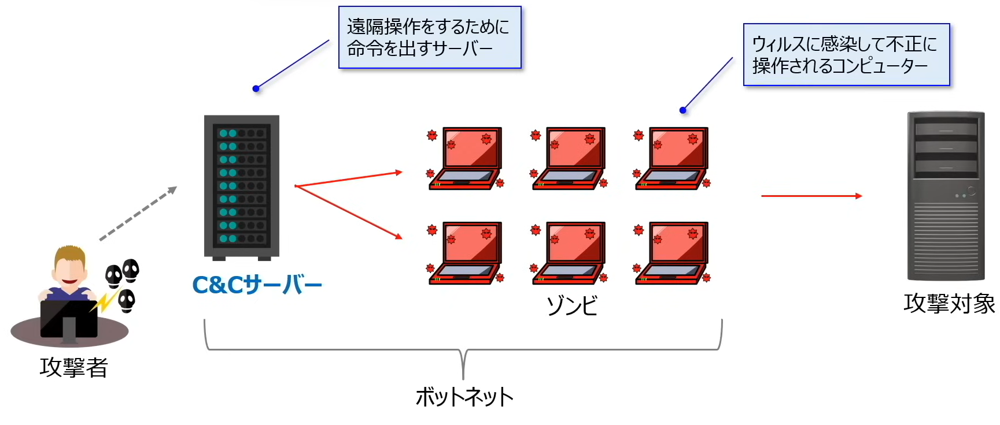
</p>

* ウィルス対策ソフト
    * ウィルスソフトはマルウェアを検知してブロックする
    * ウィルスの検知方法
        * `ビヘイビア法`：（ビヘイビア：態度・振る舞い）`メモリ上の仮想環境`で`検査対象のプログラムを実際に動かし`、その挙動からマルウェアを検知する。`未知ウィルスの検知も可能`。`※誤った検知をすることもある`
        * `パターンマッチング法`：既存のウィルスのパターン（シグネチャコード）と検査対象プログラムを`比較して`マルウェアを検知する。未知ウィルスの検知は不可能

* サーバー攻撃の種類
    * パスワードクラック：パスワードを見破る攻撃
        * 辞書攻撃：パスワードに何かしら単語を使用する人が多いことを悪用し、辞書に載っている単語でパスワードを推測する手法
        * `ブルートフォース攻撃`/総当たり攻撃：IDを1つ定め、`パスワード`として使用可能な文字`を総当たり`で試す手法
        * `リバースブルートフォース攻撃`：パスワードを1つ定め、`ID`として使用可能な文字`を総当たり`で試す手法
        * `パスワードリスト攻撃`：他のサイト等で不正に入手したパスワードとIDを用いてログインを試す手法。IDとパスワードを`複数のサイトで使いまわす人`を狙った攻撃
        * レインボー攻撃：不正に入手した`パスワードのハッシュ値`（あるデータを特定のアルゴリズム（ハッシュ関数）で変換したもの（データ➡ハッシュ値〇、不可逆））から`元のパスワードを推測する`手法
    * 脆弱性を狙う攻撃：OSやWebサイトの脆弱性を狙って実施される攻撃
        * `クロスサイトスクリプティング`：正規のWebサイト上に`偽のWebページを表示させる`手法。`問い合わせフォーム`等の偽サイトを表示して利用者に個人情報を入力させることで情報を抜き取る
        * `SQLインジェクション`：（インジェクション：注入）`SQLの中に不正な命令を紛れ込ませ`、データベースを不当に操作する手法。`データの漏洩`や`データベースの破壊`等の被害が想定される
            * 被害を防ぐ方法：入力された文字が、データベースへの問い合わせや操作において、特別な意味を持つ文字として解釈されないようにする
            * 入力者が使用した`シングルクォーテーション`はSQLの命令と判断されないように設定する
            * `シングルクォーテーション`を、`ダブルクォーテーション`に変換する方法も有効（`エスケープ処理`）
        * OSコマンドインジェクション：ユーザーが`Webサイトに入力したデータ`に`OSへの命令文（コマンド）`を紛れ込ませる手法。OS操作コマンド（`ファイルの削除`や`書き換え`等）を不正操作され、`情報漏洩`等に繋がる
        * ディレクトリリスティング：Webサイトを構成する`ディレクトリやファイルの一覧をすべて表示させる攻撃`（ユーザーに公開していないファイルも表示されてしまう）
        * ディレクトリトラバーサル：（トラバーサル：横断、縦走、走査）`Webの非公開ファイルに不正にアクセス`し、`ファイルの閲覧や削除`などを実施する攻撃
    * なりすまし攻撃：攻撃者が正規利用者になりすまし、情報等を騙し取る攻撃
        * `DNSキャッシュポイズニング`：ドメインとIPアドレスを結びつけるDNSサーバーに偽サイトのドメインを紛れ込ませ、利用者を偽サイトに誘導する手法
        * フィッシング：金融機関などを装った電子メールを送信して偽サイトに誘導し、使用者から個人情報を抜き取る手法
        * セッションハイジャック：利用者がWebサイトにログインした際に発行される`セッションIDをはく奪`し、`そのIDを用いて利用者になりすます`手法
            * セッション：Webページにアクセスしたユーザーが行う一連の操作（ログイン～ログアウトまで等）
            * セッションID：セッションごとに割り振られた番号で、そのセッションIDを盗み取ることで不正にログインできてしまう
        * SEOポイズニング（Search Engine Optimization）：SEO（Webサイトの掲載順位を決定するアルゴリズム）を悪用し、悪意のあるWebサイトが検索上位に表示されるようにすること（Googleで某銀行を検索したが一番上に出てきたのは偽サイト）
        * IPスプーフィング：攻撃者のIPアドレスを`正規のアドレスに詐称`してサイトに不正アクセスする手法
    * パソコンへの攻撃：パソコンやサーバーに対して負荷やマルウェアを送り込む攻撃
        * `ドライブバイダウンロード`：Webサイトを閲覧しただけでマルウェアを閲覧者のPCにダウンロードさせる手法
        * バッファオーバーフロー：サーバーの`処理能力を超える大容量データ`等を送り付け、サービスを停止させる攻撃
        * Dos攻撃：特定のWebサイトに対して`大量のアクセス`を行い、サーバー機能を停止させること（攻撃者PCが1台）
        * DDos攻撃：特定のWebサイトに対して`大量のアクセス`を行い、サーバー機能を停止させること（攻撃者PCが複数台）

<p align="center">
  
  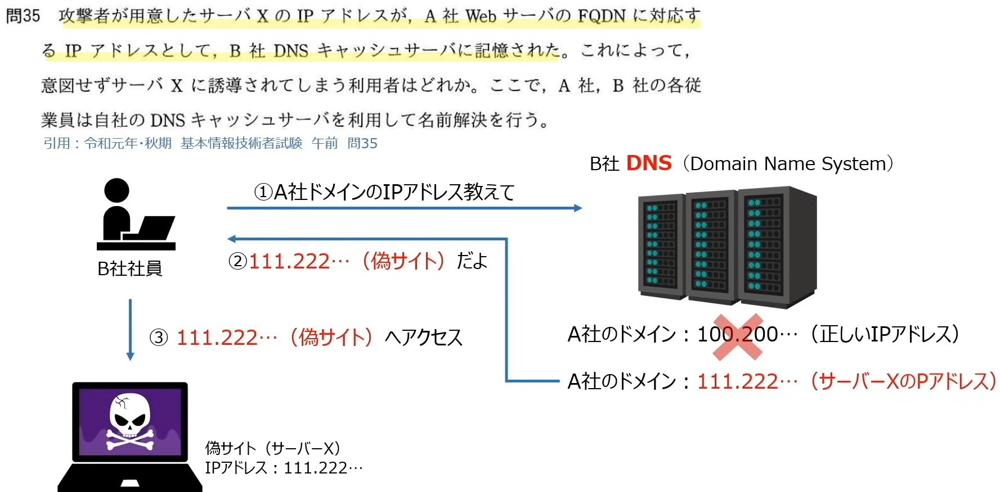
</p>

************************************************************
<div style="page-break-after: always;"></div>

### 📖暗号化とデジタル署名
* ネットワークを用いたデータのやり取りでは「盗聴・改ざん・なりすまし」の危険がある
    * 盗聴：データのやり取りを盗み読まれること
    * 改ざん：データをやり取り中に改ざんされること
    * なりすまし：第三者が正当な人物になりすましてデータをやり取りすること

* 暗号化（盗聴を防ぐ手法）
    * 暗号化によるデータ送信し、鍵を使って復号する
    * 鍵：数学的アルゴリズムで作成された数字の羅列
    * 鍵をかける：数字を使ってデータを変形させること
    * 暗号化の方法
        * 共通鍵暗号方式：暗号化と復号で`同じ鍵`を使用し、鍵を`秘密`にしておく
            * 暗号化と復号で同じ鍵を使用し、その鍵を秘密にしておく
            * 送信側と受信側は同じ1本の鍵を使う
            * `秘密鍵の管理が困難`
        * 公開鍵暗号方式：暗号化と復号で`別々の鍵`を使用し、暗号化用の鍵を`公開`する
            * 鍵Aで暗号化されたデータは鍵A'でしか復号できない
            * 暗号化用の鍵が公開されても復号化の鍵が秘密になっていれば問題ない
            * `受信者公開鍵で暗号化`
            * `送信者が増えても鍵の数が増えず管理が簡単`
            * `暗号化の仕組みが複雑であり、暗号化や複合に時間が要する`

| - |共通鍵暗号方式|公開鍵暗号方式|
| --- | --- | --- |
|仕組み|暗号化と復号で同じ鍵を使用し、その鍵を秘密にしておく|暗号化と復号で別々の鍵を使用し、暗号化用の鍵を公開する|
|暗号アルゴリズム|`AES`など|`RSA`、楕円曲線暗号など|
|メリット|処理速度が`速い`|鍵の`管理が容易`|
|デメリット|鍵の`管理が煩雑`|処理速度が`遅い`|

* ハッシュ関数（改ざん防ぐ手法）
    * メッセージダイジェスト
    * ハッシュ関数と呼ばれるデータ変換アルゴリズムを用いることでデータの改ざんを防ぐ
    * 入力データにハッシュ関数（`SHA-256`）を利用して出力されたデータはハッシュ値
    * 特徴
        * 入力データに対し必ず`唯一の出力データ`が生成される
        * 同じハッシュ関数を使用する場合、入力データから得られるハッシュ値に等しい
        * 出力データから入力データの変換はできない

        * 二つの出力データが同じ場合、ハッシュ化前は100%同じデータ
        * この特徴を利用して改ざんを防ぐ
    * ハッシュ関数を用いた改ざん防止の仕組み
        1. 送信側：本来のデータと一緒にハッシュ値データを送付する
        2. 受信側：受け取ったデータをハッシュ化してみて、送られてきたハッシュ値と一致するか確認

<p align="center">
  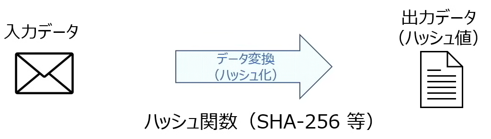
</p>

* デジタル署名（改ざん・なりすましを防ぐ手法）
    * ハッシュ化及び公開暗号方式の逆手順で`デジタル署名`を実施することで改ざんとなりすましを防ぐ
    * デジタル署名の仕組み
        * `送信者`の秘密鍵・公開鍵を用意する
            * 送るデータのハッシュ値を用意する
            * さらにハッシュ化されたデータを、`送信者の秘密鍵`で暗号化する
            * 暗号化されたデータと元データを送信する
        * `受信者`
            * 元データをハッシュ化
            * 送信者の秘密鍵で暗号化されたハッシュ値を`送信者の公開鍵`で復号
            * `ハッシュ化してみたデータ`と`公開鍵によって復号化されたハッシュ値`が一致しているかどうか
        * `送信者の公開鍵`で復号できた　＝　`送信者の秘密鍵A`で暗号化された　＝　なりすましではない

        * 公開暗号方式：データを`安全に送る`ため、`受信者の公開鍵`で暗号化
        * デジタル署名：送信者の`本人確認`をするため`送信者の秘密鍵`で暗号化

<p align="center">
  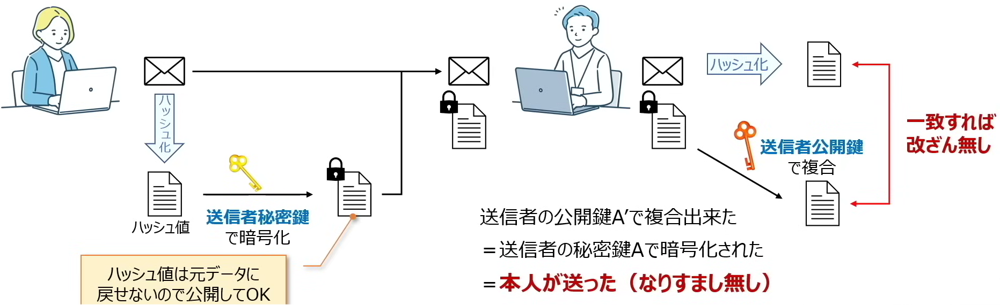
</p>

* 認証局とPKI（公開鍵基盤）
    * `公開鍵が本人のものであることを証明`する認証機関を認証局（CA:Certification Authority）
        * `公開鍵基盤`、`PKI`(Public Key Infrastructure)承認期間や公開鍵暗号化技術を用いて安産に通信を行う仕組み

<p align="center">
  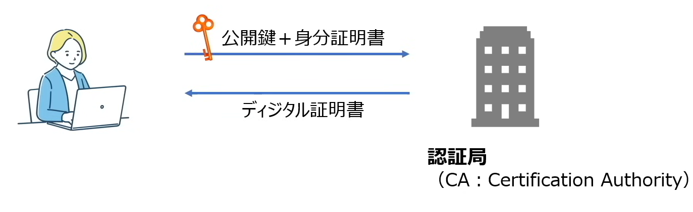
</p>

* 応用：デジタル署名と暗号化
    * デジタル署名と暗号化を組み合わせることで「盗聴・改ざん・なりすまし」をすべて防げるようになる
        * 送信者の秘密鍵・送信者の公開鍵
        * 受信者の公開鍵・受信者の秘密鍵
        * `送信者`
            * データをハッシュ化させて、`送信社の秘密鍵`で暗号化（デジタル署名）
            * データを更に`受信者の公開鍵`で暗号化し送信
        * `受信者`
            * `受信者の秘密鍵`でデータを復号し、元データと暗号化されたハッシュ値を取得（公開鍵暗号・盗聴防止）
            * 元データをハッシュ化し、`送信者の公開鍵`でデータを復号する（デジタル署名・なりすまし防止）
            * ハッシュ化したデータと復号したハッシュ化したデータと照らし合わせする（改ざん防止）

<p align="center">
  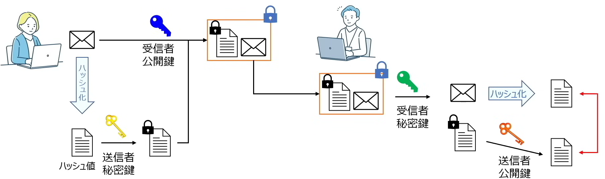
</p>

************************************************************
<div style="page-break-after: always;"></div>

### 📖ネットワークセキュリティ
* ファイアウォール
    * `内部ネットワーク`と`外部ネットワーク`の間で機能する、外部からの不正アクセスを防ぐ仕組み

<p align="center">
  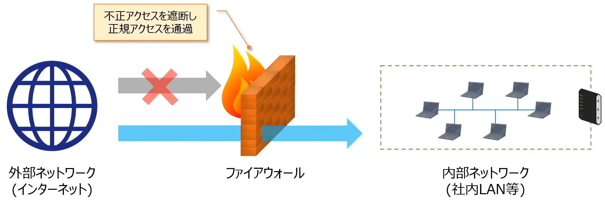
</p>

* パケットフィルタアリング
    * ファイアウォールの仕組みの1つであり、`パケットのヘッダ情報で`通信可否を制御する方法
        * パケットはヘッダ部分とデータ部分があり、ヘッダ部分には送信元IPアドレス・宛先IPアドレス・送信元ポート番号・宛先ポート番号
    * パケットフィルタアリングを持つ機器はフィルタリングテーブルと言う表があり、通過を許可するIPアドレスやボード番号が記載されている
    * 通過`許可`IPアドレスを設定：`ホワイトリスト`
    * 通過`禁止`IPアドレスを設定：`ブラックリスト`

* プロキシサーバー/リバースプロキシサーバー
    * プロキシ：代理
    * `内部から外部へ`のアクセスを`代理実施`するサーバーをプロキシサーバーと呼ぶ
    * `外部から内部へ`のアクセスを`代理実施`するサーバーをリバースプロキシサーバーと呼ぶ

<p align="center">
  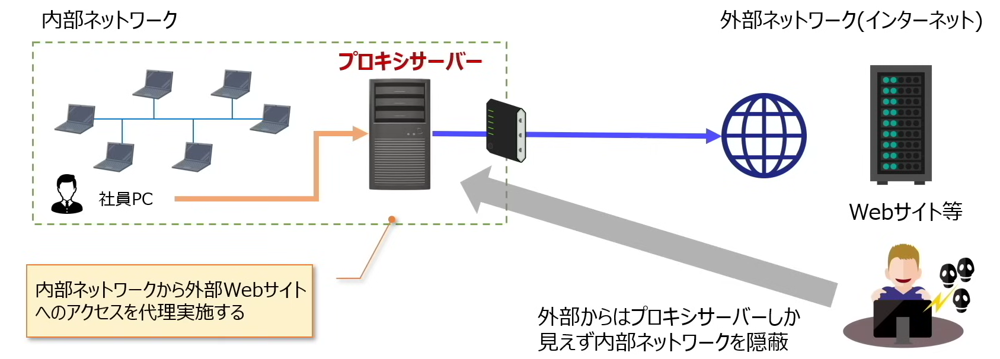
  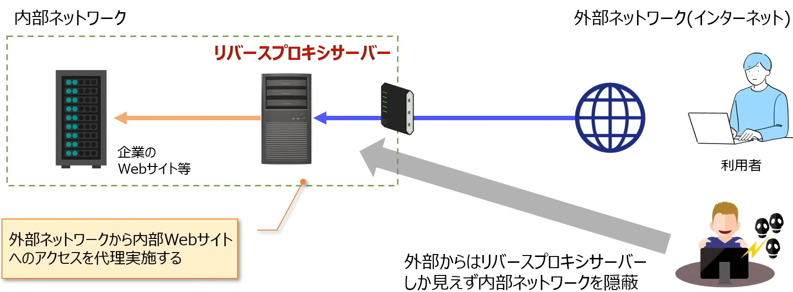
</p>

* DMZ（DeMilitarized Zone、非武装地帯）
    * `内部・外部から切り離されたネットワーク`をDMZと呼び、自社サイトのWebサーバーなど外部に公開するサーバーを設置
    * 外部公開サーバーを`安全`かつ`利便性`高く配置

<p align="center">
  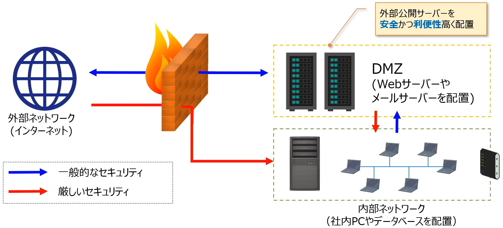
</p>

* WAF（Web Application Firewall）
    * `Webアプリケーション`への攻撃を防ぐ仕組み

* 利用者認証技術
    * 利用者が正規の人物であることを認証する方法として以下のような手法がある
    * `バイオメトリクス認証`：（Biometric：生体認証）指紋認証、顔認証、音声認証など`身体的特徴`を用いて本人確認をする方法
    * `ワンタイムパスワード`：一定時間ごとに発行され、`一度きりしか使用出来ないパスワード`（一回しか使用しないため、仮にパスワードを盗まれても問題ない）
    * `CAPTCHA/ reCAPTCHA`：`コンピューターでは識別不可能な文字や画像をユーザー`に回答させ、ユーザーがコンピューターbotではないことを証明する方法
        * CAPTCHA：ごにょごにょの文字は何を書いてる？なやつ
        * reCAPTCHA：どこに信号機があるのか？なやつ

* その他のセキュリティ対策
* VPN(Virtual Private Network)：ネット回線上に特定の人だけがアクセスできる`仮想的な専用機`を引き、通信の安全性を高める方法
* SSL（Secure Sockets Layer）：`インターネットの通信を暗号化`するプロトコルであり、`クレジットカード等の機密情報`を送る際に使用される（`※　SSLの次世代規格をTLSと呼び、あまり区別されない`）
* ペネトレーションテスト：（Penetration：浸透/ 侵入）`システムの脆弱性を検知するため`、システムに対して`実際に攻撃を仕掛け`、セキュリティレベルをチェックすること（攻撃する人をホワイトハッカーと呼ぶ）
* ファジング：（Fuzz：毛羽/ 綿毛　⇒　けばだたせる/ ぼやけさせる）`ソフトウェアの脆弱性を検知するため`、プログラムに対して異常を引き起こす可能性がある`多様なデータ`を自動入力してチェックすること

|対策|チェックする場所|検査手法|効果|
| --- | --- | --- | --- |
|ペネトレーションテスト|`サーバーやネットワーク`|実際に攻撃を仕掛ける|システムの`脆弱性`や`設計不備`を検知する|
|ファジング|ソフトウェア|`多様なデータ`を送る|ソフトウェアの脆弱性を検知する|

* 情報セキュリティに関するプロトコル

|セキュリティ対策無し|セキュリティ対策あり|
| --- | --- |
|`HTTP`<br>Webサーバーとブラウザ間で情報を通信する際に使用されるプロトコル|`HTTPS`<br>HTTP over SSL/TLSの略で、SSL/TLSを用いてHTTP通信を`暗号化`したプロトコル|
|`IP`<br>TCP/IPモデル第2層で使用され、データを正しいアドレスに送るためのプロトコル|`IPsec`<br>IPプロトコルを拡張し`暗号化`を実現するプロトコル|
|`TELNET`<br>現在のコンピューターから別のコンピューターを遠隔操作するプロトコル|`SSH`<br>現在のコンピューターから別のコンピューターを`暗号化通信`で安全に遠隔操作するプロトコル|

************************************************************
<div style="page-break-after: always;"></div>

### 📖ネットワークセキュリティ過去問演習
<p align="center">
  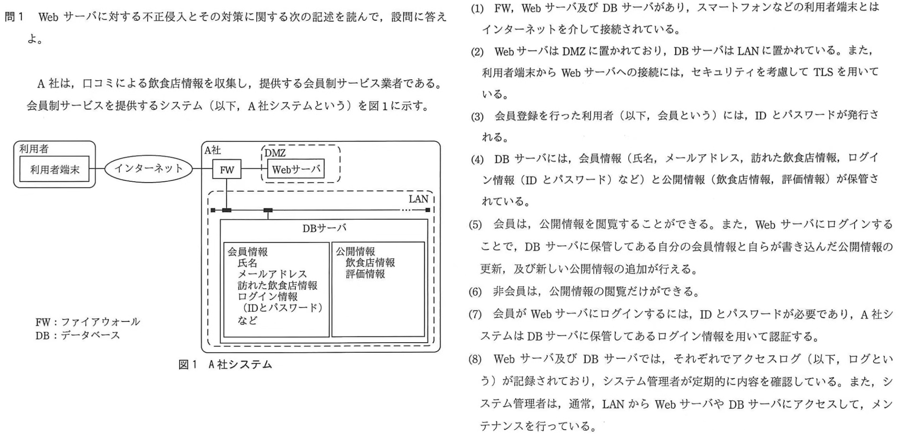
  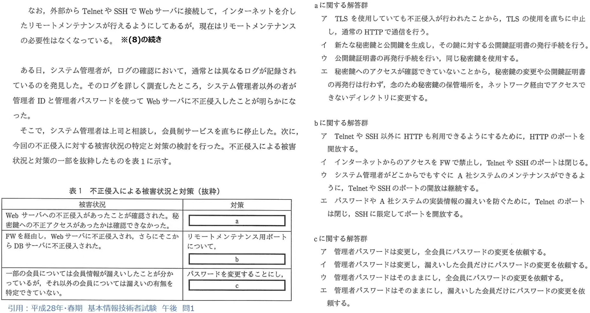
</p>

* 答え：<font color=white>イ・イ・ア</font>
