▶アルゴリズムとプログラミング
* [1. プログラムの基本](#プログラムの基本)
* [2. 基本アルゴリズムの紹介](#基本アルゴリズムの紹介)
* [3. アルゴリズム計算量と演習問題](#アルゴリズム計算量と演習問題)
* [4. プログラミング言語とマークアップ言語](#プログラミング言語とマークアップ言語)
* [5. オブジェクト指向プログラミングとuml](#オブジェクト指向プログラミングとuml)
    * [オブジェクト指向](#オブジェクト指向)
    * [UML](#uml)

* 用語集

|用語|フルネーム|意味|
| --- | --- | --- |
|順次|-|順番に処理を実行|
|選択|-|条件によって処理を実行|
|繰返|-|特定の条件を満たすまで処理を繰返す|
|リロケータブル 再配置可能|Relocatable|プログラムを主記憶上の`どこに配置しても実行可能`|
|リユーザブル 再使用可能|Reusable|主記憶上に読み込まれたプログラムは、それ以降は`再ロードしなくても繰り返し利用可能`|
|リエントラント 再入可能|Reentrant|`複数のタスクから呼び出しに対して平行して実行可能`|
|リカーシブル 再帰的|Recursive|プログラム実行中に`自分自身を呼び出す`ことができる|
|配列|-|配列はデータを格納する箱のようなものが複数並んだものであり、配列は1次元、2次元など任意の次元で作成することが可能|
|リスト|-|データを数珠繋ぎで管理するもの|
|キュー|-|`先入先出`で処理を行うデータ構造（FIFO）|
|スタック|-|`後入先出`で処理を行うデータ構造（LIFO）（PUSH, POP）|
|木構造（完全2分岐）|-|階層構造でデータを保持する方法であり、各データに対して名称がついている `[根（ルート）] - [節（ノード）] - [葉（リーフ）]`、`枝（ブランチ）`によって繋がってる|
|`完全2分木`|-|根/節が全て2つの子を持ち、かつ根から葉までの深さが等しい2分木|
|`2分探索木`|-|`【左の子　<　親　<　右の子】`|
|`ヒープ木`|-|`【親　>　子】`もしくは`【子　>　親】`が常に成立する2分木|
|線形探索法|-|`データを前から順番`に探索していく|
|2分探索法|-|データが昇順、もしくは降順に並んでいる際に、データを2つに分けながら目的データを探索する方法|
|ハッシュ探索法|-|決められた計算式（ハッシュ関数）によってデータを計算し、その計算結果の場所を探索する|
|`シノニム`|-|格納場所が衝突|
|基本交換法 `バブルソート`|-|`隣り合うデータ`の大きさを比較し、`必要に応じて入れ替えること`で並び替える方法|
|基本選択法 `選択ソート`|-|対象データの中から`最大値もしくは最小値`を選択して、先頭データと`交換することで並び替える`|
|基本挿入法 `挿入ソート`|-|整列済配列を用意して、未整列配列から整列済配列の適切な位置にデータを`挿入して並べる`|
|シェルソート|-|1. データを一定間隔ごとに取り出し、そのデータ内で並び替えて元に戻す 2. 間隔を狭めて再度データを取り出し並び替える 3. 間隔が1になるまで繰り返す|
|クイックソート|-|データ内の`基準値`（真ん中くらいの値）を決めて、基準値より大きいデータ/小さいデータにグループ分けしながら整列|
|ヒープソート|-|データを木構造で保持させて、それを`ヒープ木`となるように並べ替える。ヒープ木となったら`根を配列に戻し`、`残りの節は同様の処理を繰り返して整列する`|
|マージソート|-|データが1つになるまで与えられたデータを分割し、そのデータを整列させながら元に戻す|
|オーダー記法|-|`O(n)` 変数n（=データ数）によって値が変わる関数の名称O（"Order"の"O"）|
|プログラム言語|-|コンピューターに処理を命令する際に使用する言語|
|低水準言語|-|コンピューターが理解しやすい形式で記述した言語|
|高水準言語|-|人間が理解できる形式で記述した言語|
|機械語|-|コンピューターが理解できる言語で、0と1で表される|
|アセンブラ言語|-|機械語と1対1で対応する記号で置き換えた言語|
|C言語|-|システム記述に適しており、`OS`などに使用されている言語|
|Java|-|`オブジェクト指向言語`であり、コンピューターの機種やOSに依存せず、どんな環境でも動作する|
|Python|-|`Webアプリ`や`スマホアプリ`、`人工知能`などの開発に適した言語|
|JavaScript|-|スライドショーやポップアップ表示など`動きがあるWebページ`を作成するのに適した言語|
|マークアップ言語|-|`文章の構造を`記述する言語。タグ（目印）を使って内容に意味づけをする|
|HTML|-|`Webページ`を作成するための言語。`タグの定義が決まっている`|
|CSS|-|HTMLで作成された文書に文字のフォント、大きさ、色など`視覚表現`をつける マークアップ言語ではなく`スタイルシート言語`|
|XML|-|アプリケーション間における`データ管理`等を簡単にするための言語。`利用者独自でタグを定義できる`|
|言語プロセッサ|-|機械語へ翻訳を行うプログラム `原始プログラム`：高水準言語（翻訳前） `目的プログラム`：機械語（翻訳後）|
|インタプリタ方式|-|高水準言語で書かれた原始プログラムを、`1行ずつ機械語に翻訳` エラー見つけやすい 実行速度が遅くなる 採用言語：`Python`、`JavaScript`|
|コンパイラ方式|-|高水準言語で書かれた原始プログラムを、`全てまとめて機械語に翻訳` エラー見つけにくい 実行速度が速くなる 採用言語：`C言語`、`Java`|
|コンパイル|-|`コンパイラ`を用いて翻訳する 1. 字句解析 2. 構文解析 3. 意味解析 4. 最適化 5. コード生成|
|リンク|-|`リンカ`を用いて、複数の目的プログラムから1つのロードモジュールを生成する |
|ロード|-|`ローダ`を用いて、ロードモジュールを主記憶にロードする|
|オブジェクト指向|-|継承・カプセル化・ポリモーフィズム|
|オブジェクト|-|「モノ・対象」という概念で、どんなデータが保持されて、どんな動きをするか定義|
|継承|-|親クラス（スーパークラス）の定義を子クラス（サブクラス）に引き継ぐこと|
|カプセル化|-|オブジェクト内のプロパティやメソッドを外部から隠蔽しデータを保護すること|
|ポリモーフィズム（多様性・多相性）|-|親クラスから継承された子クラスが、同じ命令で異なる処理を行うこと|
|汎化|-|下位クラスの`共通部分を抽出`して`上位クラスを定義`すること（その逆が`特化`）|
|集約|-|下位クラスが`集まって`、`上位クラスが構成され`ていること（その逆が`分解`）|
|UML|Unified Modeling Language|`統一モデリング言語`。（共通言語として）オブジェクト指向のシステム開発で使用され、分析から設計、実装まで一貫して用いられるモデリング手法 システム設計における要件や構成は複雑であるため、目的に応じた表現方法を使って関係者内で共通認識を取る　|
|クラス図|-|クラスの定義やクラス同士の`関係を表現`した図|
|シーケンス図|-|オブジェクト間のメッセージのやり取りを`時系列`で表現した図 `オブジェクト間のやり取り`に注視|
|アクティビティ図|-|`処理の流れ`や`条件分岐`を表した図 `一連の処理フロー`に注視|
|ユースケース図|-|ユーザー視点で`このシステムではこんなことができる`という要件を表した図 `アクター`：システムの利用者|
|状態遷移図|-|`状態`が`どのように移り変わるか`説明をする|

* オーダー記法の計算量目安
|アルゴリズムの種類|アルゴリズム|オーダー記法|
| --- | --- | --- |
|データの探索アルゴリズム|`線形探索法`|O(n)|
|データの探索アルゴリズム|`2分探索法`|O(log2n) `nが2の倍数の場合、処理が1増える`|
|データの探索アルゴリズム|`ハッシュ法`|O(1)|
|データの整列アルゴリズム|`基本交換法` `基本選択法` `基本挿入法`|O(n2) `n回の操作で1つのデータだけを並べる処理をnデータ分繰り返す`|
|データの整列アルゴリズム|シェルソート|O(n1.3) ※暗記不要|
|データの整列アルゴリズム|クイックソート ヒープソート|O(nlog2n) ※暗記不要|

************************************************************

### 📖プログラムの基本
* アルゴリズム：問題を解いたり、課題を解決するための`手順`
* プログラム：コンピューターへ命令するための手順を特定の言語で記述したもの
* フローチャート：アルゴリズムはフローチャートを使って表され、原則`上から下`に処理が実行される
    * `順次`：順番に処理を実行
    * `選択`：条件によって処理を実行
    * `繰返`：特定の条件を満たすまで処理を繰返す
    * 変数：値を格納する箱
    * 代入：変数に値を格納すること

  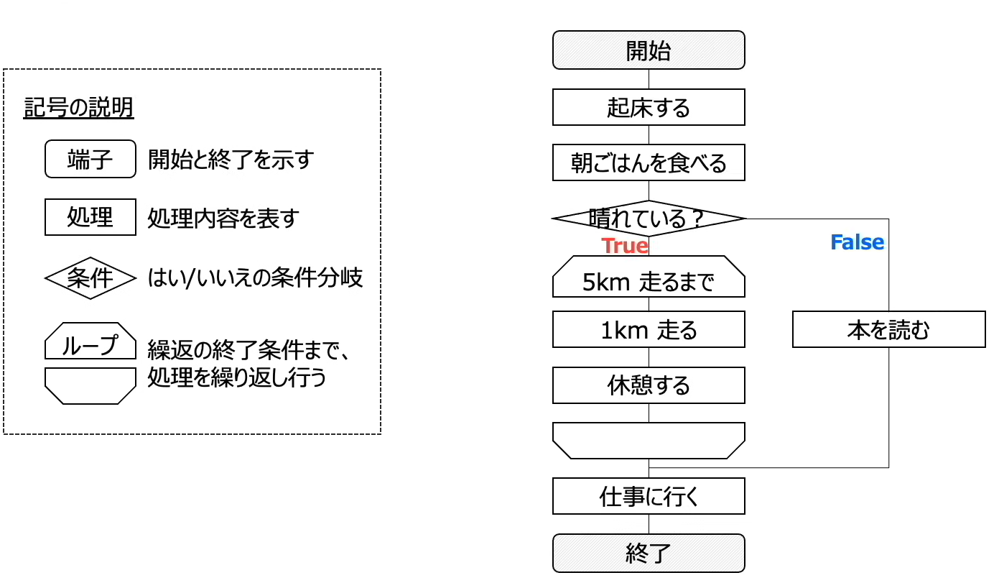

* プログラムの属性
    * リロケータブル（再配置可能）（Relocatable）：プログラムを主記憶上の`どこに配置しても実行可能`
    * リユーザブル（再使用可能）（Reusable）：主記憶上に読み込まれたプログラムは、それ以降は`再ロードしなくても繰り返し利用可能`
    * リエントラント（再入可能）（Reentrant）：`複数のタスクから呼び出しに対して平行して実行可能`
    * リカーシブル（再帰的）（Recursive）：プログラム実行中に`自分自身を呼び出す`ことができる

  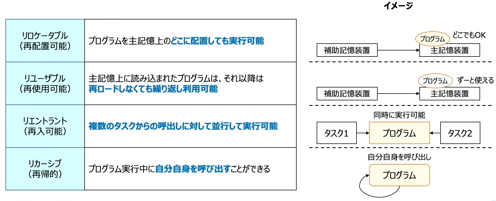

************************************************************

### 📖基本アルゴリズムの紹介
* 基本アルゴリズム一覧
    * `データの持ち方`・`データの探索方法`・`データの整列方法`という3つのカテゴリーで、それぞれのアルゴリズムの挙動を理解する

* データの持ち方：データをどのように保持するか
    * 配列：配列はデータを格納する箱のようなものが複数並んだものであり、配列は1次元、2次元など任意の次元で作成することが可能
        * 各箱に添え字（インデックス番号）が割り振られており、この番号を使用して各データを指定する
    * リスト：データを数珠繋ぎで管理するもの  
        * `「データ-ポインタ]`（リストに格納されているメモリアドレス）
    * キュー/スタック：
      * キュー　：`先入先出`で処理を行うデータ構造（FIFO）
      * スタック：`後入先出`で処理を行うデータ構造（LIFO）（PUSH, POP）
    * 木構造（完全2分岐）：階層構造でデータを保持する方法であり、各データに対して名称がついている
      * `[根（ルート）] - [節（ノード）] - [葉（リーフ）]`、`枝（ブランチ）`によって繋がってる
      * ある関係内で、上にあるのは親、下にあるのは子
      * `完全2分木`：根/節が全て2つの子を持ち、かつ根から葉までの深さが等しい2分木
      * `2分探索木`：`【左の子　<　親　<　右の子】`
      * `ヒープ木`：`【親　>　子】`もしくは`【子　>　親】`が常に成立する2分木

  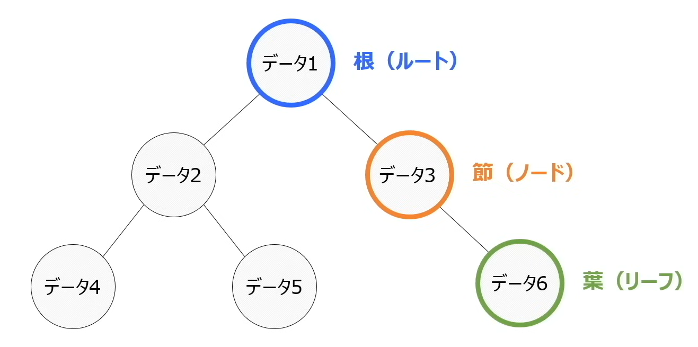
  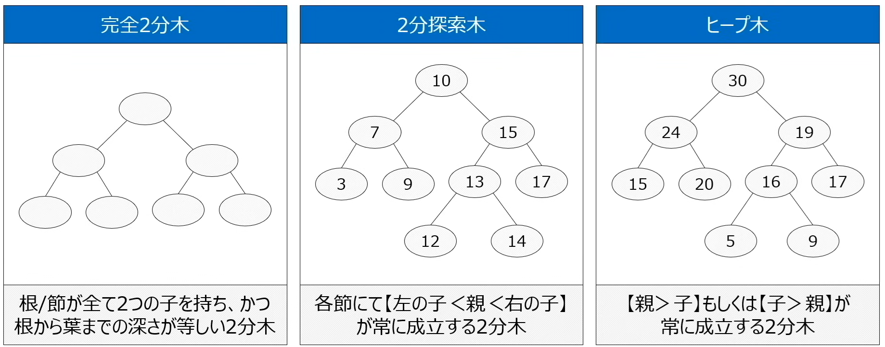

* データの探索方法：データをどのように探索するか
    * 線形探索法：`データを前から順番`に探索していく
    * 2分探索法：データが昇順、もしくは降順に並んでいる際に、データを2つに分けながら目的データを探索する方法
    * ハッシュ探索法：決められた計算式（ハッシュ関数）によってデータを計算し、その計算結果の場所を探索する
      * 計算結果の場所にデータを格納する際に、該位置にすでにデータがある場合がある　⇒　`シノニム`（格納場所が衝突）

  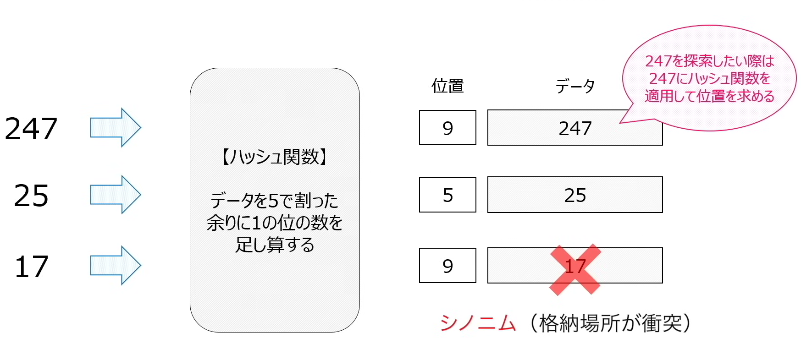

* データ整列方法：データをどのように整列させるか
    * 基本交換法（`バブルソート`）：`隣り合うデータ`の大きさを比較し、`必要に応じて入れ替えること`で並び替える方法
    * 基本選択法（`選択ソート`）：対象データの中から`最大値もしくは最小値`を選択して、先頭データと`交換することで並び替える`
    * 基本挿入法（`挿入ソート`）：整列済配列を用意して、未整列配列から整列済配列の適切な位置にデータを`挿入して並べる`
    * シェルソート：
      1. データを一定間隔ごとに取り出し、そのデータ内で並び替えて元に戻す
      2. 間隔を狭めて再度データを取り出し並び替える
      3. 間隔が1になるまで繰り返す
    * クイックソート：データ内の`基準値`（真ん中くらいの値）を決めて、基準値より大きいデータ/小さいデータにグループ分けしながら整列
    * ヒープソート：データを木構造で保持させて、それを`ヒープ木`となるように並べ替える。ヒープ木となったら`根を配列に戻し`、`残りの節は同様の処理を繰り返して整列する`
    * マージソート：データが1つになるまで与えられたデータを分割し、そのデータを整列させながら元に戻す

************************************************************

### 📖アルゴリズム計算量と演習問題
* 計算量とデータ量
    * 計算量を算出することでアルゴリズムの処理時間を見積もることが出来る
    * 計算量を考える際は`データ量の増加に対する計算量の増加を考える`
    * オーダー記法
      * データ量に対するアルゴリズムの概算計算量をオーダー記法`O(n)`で表現する
      * `O(n)`：変数n（=データ数）によって値が変わる関数の名称O（"Order"の"O"）
      * `データ量n`に対して`計算量O`がどのような値を取るか表現
      * オーダー記法ではデータ量対して計算量がどれくらい増えるかといった`関係性`を表現しているだけであるため、オーダー記法同じでも計算量や処理時間が同じというわけではない

|アルゴリズムの種類|アルゴリズム|オーダー記法|
| --- | --- | --- |
|データの探索アルゴリズム|`線形探索法`|O(n)|
|データの探索アルゴリズム|`2分探索法`|O(log2n) `nが2の倍数の場合、処理が1増える`|
|データの探索アルゴリズム|`ハッシュ法`|O(1)|
|データの整列アルゴリズム|`基本交換法` `基本選択法` `基本挿入法`|O(n2) `n回の操作で1つのデータだけを並べる処理をnデータ分繰り返す`|
|データの整列アルゴリズム|シェルソート|O(n1.3) ※暗記不要|
|データの整列アルゴリズム|クイックソート ヒープソート|O(nlog2n) ※暗記不要|

************************************************************

### 📖プログラミング言語とマークアップ言語
* プログラム言語：コンピューターに処理を命令する際に使用する言語
    * `人間でも分かりやすい`言語で書かれたのが`高水準言語`
    * `低水準言語`：コンピューターが理解しやすい形式で記述した言語
        * 機械語：コンピューターが理解できる言語で、0と1で表される
        * アセンブラ言語：機械語と1対1で対応する記号で置き換えた言語
    * `高水準言語`：人間が理解できる形式で記述した言語
        * C言語：システム記述に適しており、`OS`などに使用されている言語
        * Java：`オブジェクト指向言語`であり、コンピューターの機種やOSに依存せず、どんな環境でも動作する
        * Python：`Webアプリ`や`スマホアプリ`、`人工知能`などの開発に適した言語
        * JavaScript：スライドショーやポップアップ表示など`動きがあるWebページ`を作成するのに適した言語

* マークアップ言語：`文章の構造を`記述する言語。タグ（目印）を使って内容に意味づけをする
    * HTML：`Webページ`を作成するための言語。`タグの定義が決まっている`
    * CSS：HTMLで作成された文書に文字のフォント、大きさ、色など`視覚表現`をつける　※ マークアップ言語ではなく`スタイルシート言語`
    * XML：アプリケーション間における`データ管理`等を簡単にするための言語。`利用者独自でタグを定義できる`

* コンピューターがプログラムを読み取る方法
    * コンピューターは0と1しか理解できないため、プログラミング言語を機械語に翻訳して読み取る
    * `言語プロセッサ`：機械語へ翻訳を行うプログラム
        * 原始プログラム：高水準言語（翻訳前）
        * 目的プログラム：機械語（翻訳後）

        * インタプリタ方式：高水準言語で書かれた原始プログラムを、`1行ずつ機械語に翻訳`
            * プログラムの動作をすぐに確かめられ、`エラーも見つけやすい`
            * 実行速度が`遅くなる`
            * 採用言語：`Python`、`JavaScript`

        * コンパイラ方式：高水準言語で書かれた原始プログラムを、`全てまとめて機械語に翻訳`
            * 実行速度が`速くなる`
            * プログラムの動作をすぐに確認できず`エラーも見つけにくい`
            * 採用言語：`C言語`、`Java`

        * プログラム実行手順
            1. `コンパイル`（プログラミング言語を機械語に翻訳）
                * `コンパイラ`を用いて翻訳する
                1. 字句解析
                2. 構文解析
                3. 意味解析
                4. 最適化
                5. コード生成
            2. `リンク`（様々なプログラム（モジュールなど）をくっつける）
                * `リンカ`を用いて、複数の目的プログラムから1つのロードモジュールを生成する 
            3. `ロード`（主記憶装置に読み込ませる）
                * `ローダ`を用いて、ロードモジュールを主記憶にロードする

  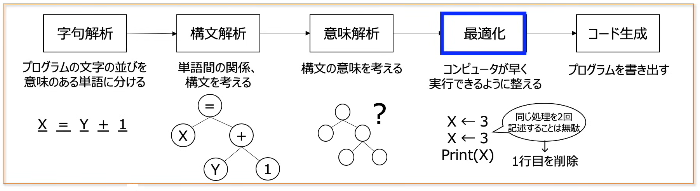
  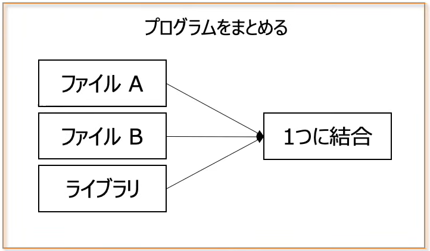
  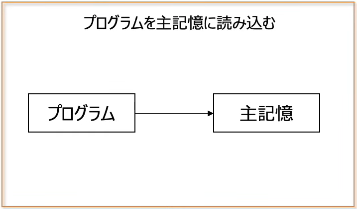

  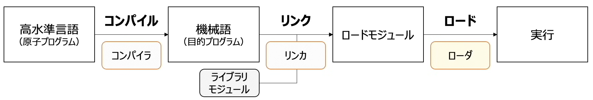

************************************************************

### 📖オブジェクト指向プログラミングとUML

#### オブジェクト指向

  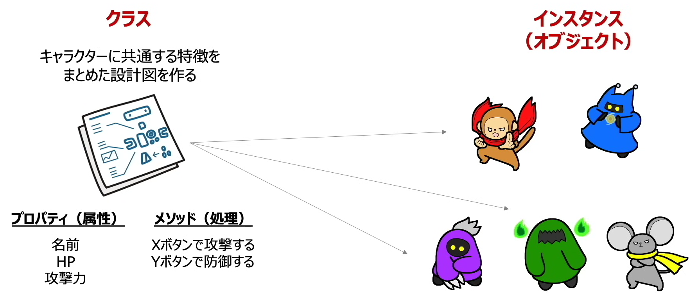

* オブジェクト指向
    * 効率よくかつ分かりやすく開発を行う開発手法
    * `プログラミングする事柄を「モノ」として考え、「モノ」と「モノ」の関係性を定義することでコンピューターを動作させる`
    * オブジェクト：「モノ・対象」という概念で、どんなデータが保持されて、どんな動きをするか定義

    * 三大特徴を持つ

|特徴|説明|
| --- | --- |
|継承|親クラス（スーパークラス）の定義を子クラス（サブクラス）に引き継ぐこと|
|カプセル化|オブジェクト内のプロパティやメソッドを外部から隠蔽しデータを保護すること|
|ポリモーフィズム（多様性・多相性）|親クラスから継承された子クラスが、同じ命令で異なる処理を行うこと|

* `継承`：基となるクラスで定義しているプロパティやメソッドを、新しく作成したクラスに引き継ぐこと。`基なる設計書を活用して新たな設計書を作成する`
    * クラス　⇒　抽象
        * 抽象化：具体的な事象の共通部分を抜き出して1段階大きい粒度で表現すること
    * インスタンス　⇒　具体
        * 具体化：設計書から作られたものは、設計書を具体化したもの

  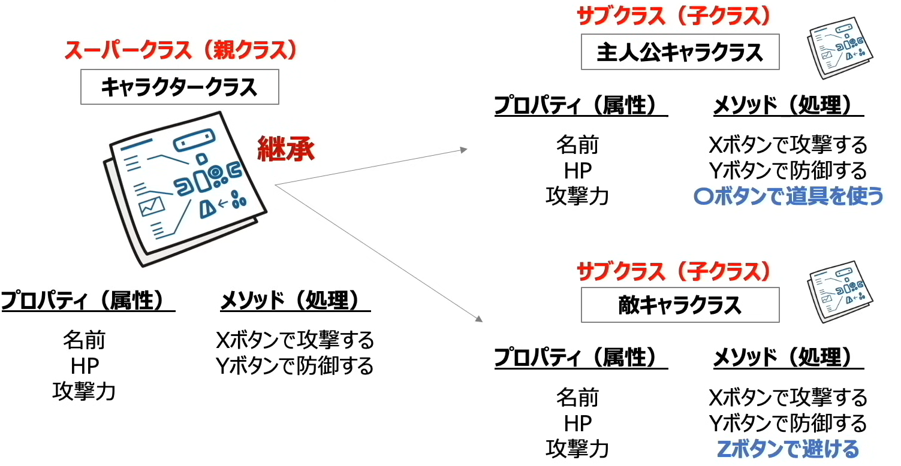

* `カプセル化`：オブジェクト内にあるプロパティ（属性）やメソッド（処理）の情報を、`外部から直接書き換えられないように隠蔽する`こと

  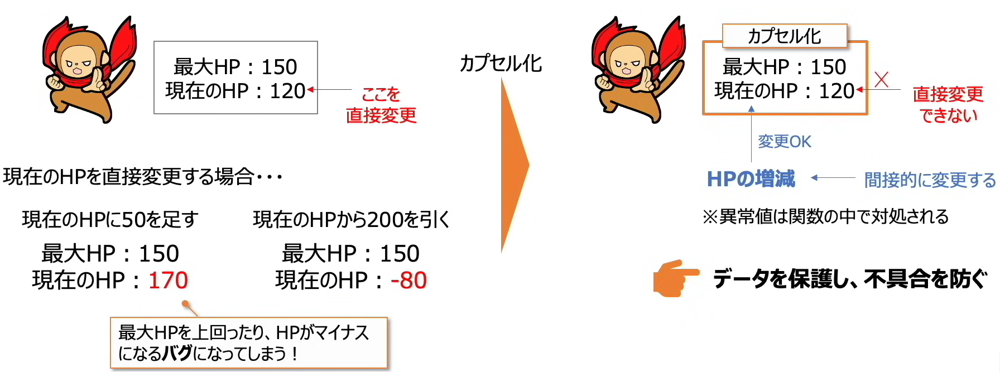

* `ポリモーフィズム`：`オーバーライド`することで、同じ命令をしても各クラスで異なる処理を行うこと

  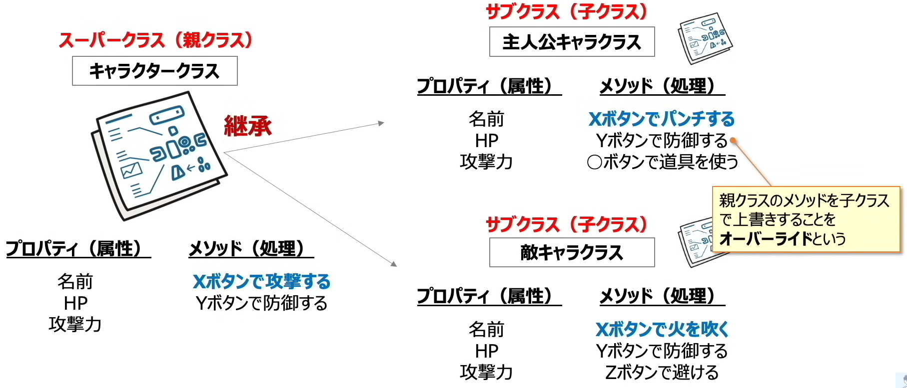

* クラスの階層
  * `汎化`：下位クラスの`共通部分を抽出`して`上位クラスを定義`すること（その逆が`特化`）
  * `集約`：下位クラスが`集まって`、`上位クラスが構成され`ていること（その逆が`分解`）

  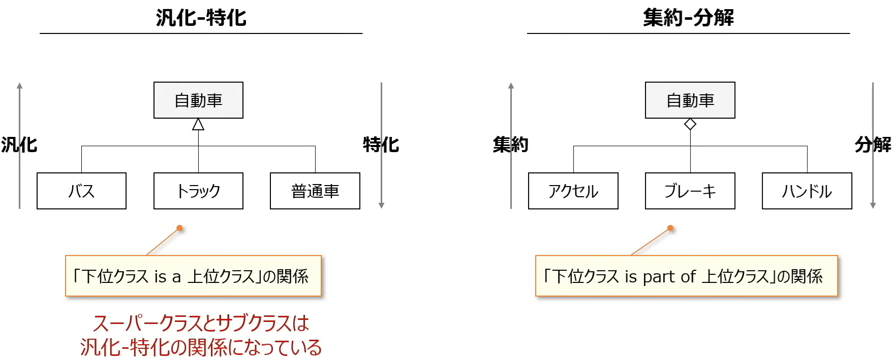

#### UML
* UML（Unified Modeling Language）：`統一モデリング言語`。（共通言語として）オブジェクト指向のシステム開発で使用され、分析から設計、実装まで一貫して用いられるモデリング手法
    * システム設計における要件や構成は複雑であるため、目的に応じた表現方法を使って関係者内で共通認識を取る

* クラス図：クラスの定義やクラス同士の`関係を表現`した図
    * 多重度の見方：自分1つに対して相手のクラスは何個か
    * `*`：値を指定しない（0..* -> 0以上の値）

  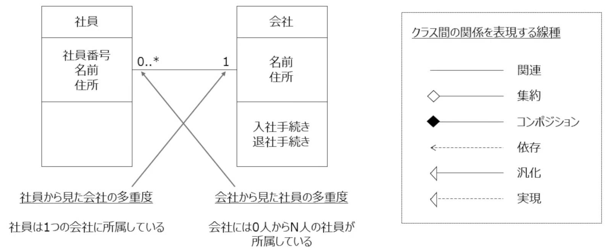

* シーケンス図：オブジェクト間のメッセージのやり取りを`時系列`で表現した図
    * 上（古）　⇒　下（新）
    * `オブジェクト間のやり取り`に注視
    * ユーザー視点

  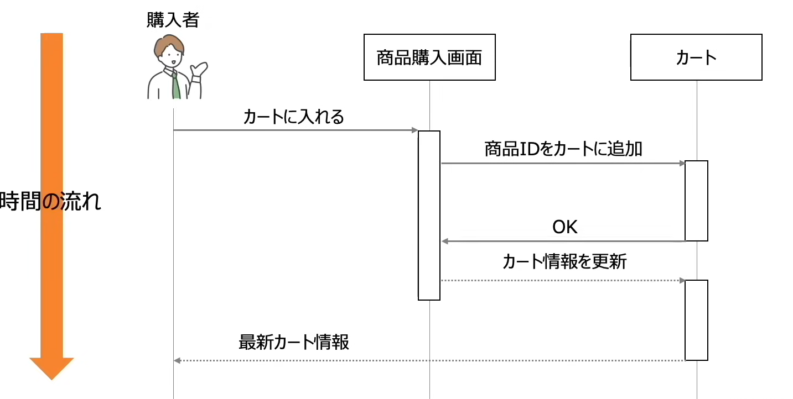

* アクティビティ図
    * `処理の流れ`や`条件分岐`を表した図
    * `一連の処理フロー`に注視

  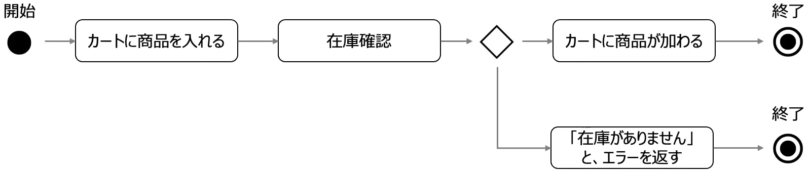

* ユースケース図
    * ユーザー視点で`このシステムではこんなことができる`という要件を表した図
    * `アクター`：システムの利用者

  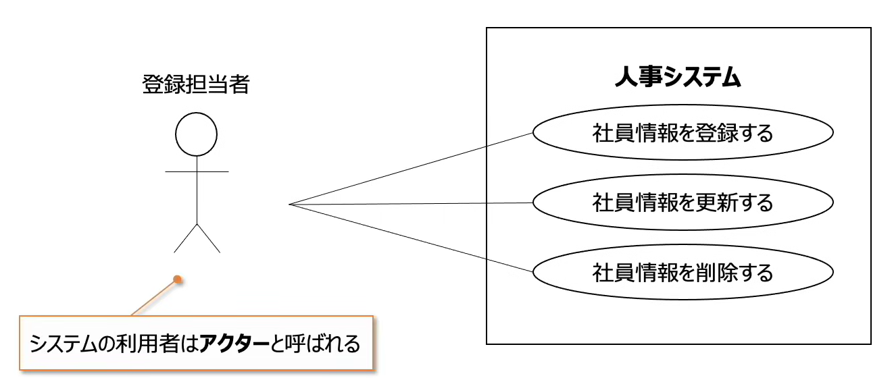

* 状態遷移図
    * `状態`が`どのように移り変わるか`説明をする

  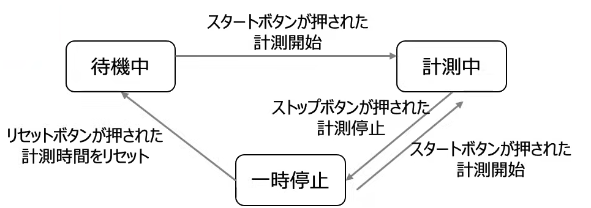

  