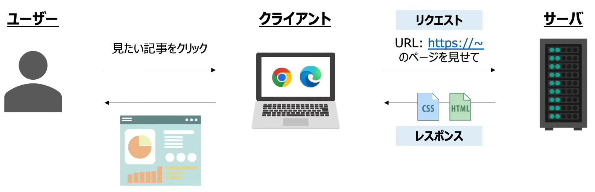
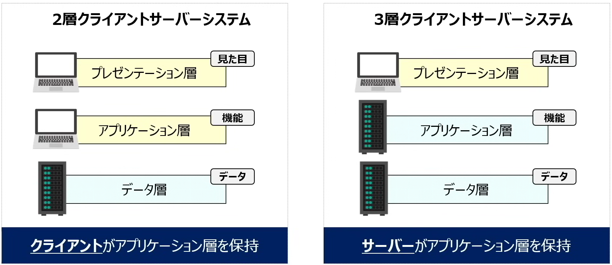
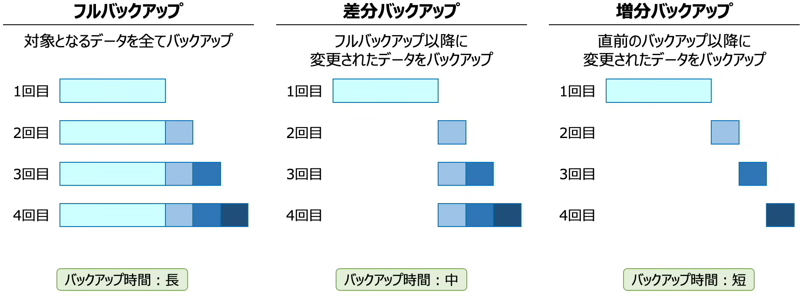
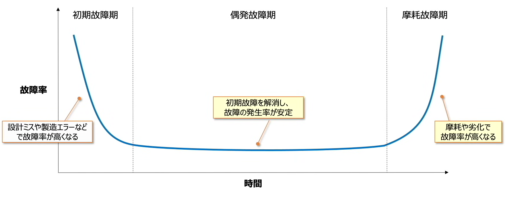
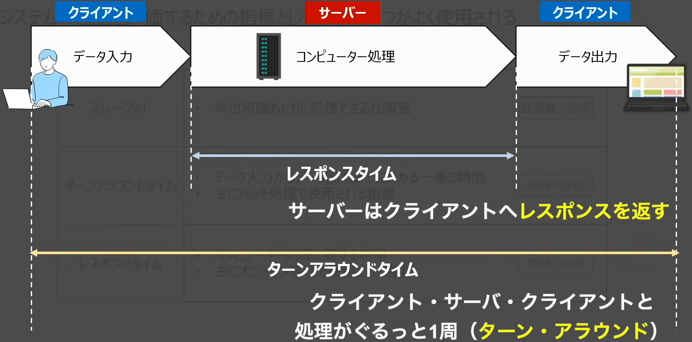
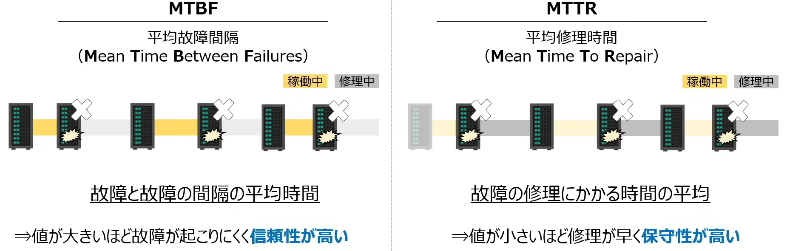

▶システム構成要素
### 📖システムの構成について
### 📖システムの信頼性と性能評価

* 用語集

|用語|フルネーム|意味|
| --- | --- | --- |
|システムの利用形態|-|`バッチ処理`、`リアルタイム処理`|
|バッチ処理|-|処理データを一定期間蓄積し、後のタイミングで`一括処理`を行う 例：売上管理、給与計算など|
|`リアルタイム処理`|-|発生`都度処理`を実施する 例：SNS、銀行ATMなど|
|システムの処理形態|-|`集中処理`、`分散処理`|
|`集中処理`|-|以前の主流 `1つ`のコンピューターが全ての処理を行う|
|`分散処理`|-|現在の主流 `複数`のコンピューターで処理を分担|
|クライアントサーバーシステム|-|サービスを要求する`クライアント`（ユーザーのPCやスマホなど）とサービス（サービス提供側のPCなど）を提供する`サーバー`で処理を分散する 【見た目担当】プレゼンテーション層：Webサイトを表示する 【機能担当】アプリケーション層：データ核　など、システム内の処理を実施する層 【データ担当】データ層：データの管理を行う層|
|`2層クライアントサーバーシステム`|-|`クライアント`がアプリケーション層を保持|
|`3層クライアントサーバーシステム`|-|`サーバー`がアプリケーション層を保持 クライアントは`画面表示のみ担当`し業務処理はサーバーが実施（`ネットワーク通信料抑制`や`DB処理の効率向上`）|
|シンクライアントシステム|Thin-Client|クライアント端末の機能を必要最低限にとどめ。サーバー側でアプリの実行やデータの管理を行う `VDI`、`DaaS`|
|`VDI`|Virtual Desktop Infrastructure|仮想デスクトップ基盤|
|`DaaS`|Desktop as a Service|クラウドサービスの一つ|
|システムの冗長化 システムの二重化|-|業務上必要不可欠なシステムを停止させないために、複数システムを用意して信頼性を高める（障害発生などによりシステムが停止すると全体がダウンしてしまわないように） `デュアルシステム`、`デュプレックスシステム`|
|`デュアルシステム`|-|同じ処理を`2組のシステムで同時に`行い、結果を照合しながら処理|
|`デュプレックスシステム`|-|同じ処理に対して2組のシステムを用意し、`1つは障害が発生した時の予備用`|
|`ホットスタンバイ`|-|起動状態で待機。処理システムが故障した場合、すぐに処理を引き継ぐことができる|
|`コールドスタンバイ`|-|電源オフで待機。処理を引き継ぐ際は、再起動が必要|
|フルバックアップ|-|対象となる`データをすべて`バックアップ|
|`差分`バックアップ|-|`フルバックアップ以降`に`変更されたデータ`をバックアップ|
|`増分`バックアップ|-|`直前のバックアップ以降`に`変更されたデータ`をバックアップ|
|バスタブ曲線|-|機械や装置の`故障率`と`時間`の関係を表したもの|
|システムの性能評価|-|1. 【仕事量】`スループット`：単位時間あたりに処理できる仕事量 2. 【時間】`ターンアラウンドタイム`：`データ入力からデータ主力`までにかかる一連の時間。主に`パッチ処理`で使用される指標 3. 【時間】`レスポンスタイム`：応答時間。`コンピューター処理に要する時間`。主に`オンライン処理`で使用される指標|
|ベンチマークテスト|-|ベンチマーク = 基準、指標 テスト用プログラムの結果を`基準`にして相対的に評価する |
|SPEC|-|`プロセッサの性能`を評価するベンチマークテスト `SPECint`：`整数演算`の性能を測定 `SPECint`：`浮動小数点演算`の性能を測定|
|`TPC`|-|`トランザクション処理の性能`を評価するベンチマークテスト|
|`3DMark`|-|`3Dの性能`を評価するベンチマークテスト|
|システムの評価特性|RASIS||
|信頼性|Reliability|システムが安定して稼働し続けられること、故障しにくいこと 【`MTBF`で評価】|
|可用性|Availability|使いたい時にいつでも使えること 【`稼働率`で評価】|
|保守性|Serviceability|故障した時に早く普及できること 【`MTTR`で評価】|
|保全性|Integrity|データが欠損なく正しく保存されていること|
|安全性|Security|高いセキュリティを維持できること|
|MTBF|Mean Time `Between Failures`|平均故障間隔　=　システムが正常に稼働している時間の平均 `値が大きい`ほど、故障が起こりにくく`信頼性が高い` MTBF = `システムが正常に稼働していた時間` / `故障した回数`|
|MTTR|Mean Time `To Repair`|平均修理時間 `値が小さい`ほど、`保守性が高い` MTTR = `故障中の修理にかかった時間` / `故障した回数`|
|稼働率|-|システムの`全運転時間`のうち、システムが`正常に稼働している時間`の割合 `値が大きい`ほど、安全して稼働していて`可用性が高い` 稼働率 = `システムが正常に稼働している時間` / `システム全運転時間` 稼働率 = `MTBF` / (`MTBF` + `MTTR`)|
|複数システムの稼働率|-|複数システムから構成される場合、`直列システム`か、`並列システム`かによって全体の稼働率が異なる `直列システム`：稼働率A * 稼働率B `並列システム`：1 - (1 - 稼働率A) * (1 - 稼働率B)|
|フォールトアボイダンス|Fault Avoidance|そもそも`故障を起こさない`ように設計 Fault：故障 Avoidance：回避|
|`フォールトトレランス`|Fault Tolerance|`問題が起きても大丈夫`なような設計 Fault：故障 Tolerance：許容範囲|
|フェールセーフ|Fail Safe|故障した時は`安全を優先させる` 例：信号機が故障しても赤信号のままに維持してもらう|
|フェールソフト|Fail Soft|故障した時でも機能を低下させ`継続することを優先` 例：エアコンが故障してもオンオフだけは操作できる|
|フールプルーフ|Fool Proof|人間が間違った操作をしても、誤作動を起こさないようにする 例：扉を閉めないと電子レンジは加熱できない|

************************************************************

### 📖システムの構成について
* システムの利用形態
    * 利用形態でシステムを分類すると`バッチ処理`、`リアルタイム処理`の2種類がある
        * `バッチ処理`：処理データを一定期間蓄積し、後のタイミングで`一括処理`を行う
            * 例：売上管理、給与計算など
        * `リアルタイム処理`：発生`都度処理`を実施する
            * 例：SNS、銀行ATMなど

* システムの処理形態
    * 処理形態でシステムを分類すると`集中処理`、`分散処理`の2種類がある
        * `集中処理`：`1つ`のコンピューターが全ての処理を行う
        * `分散処理`：`複数`のコンピューターで処理を分担
    * 以前は集中処理が使用されていたが`現在は分散処理`が主流になっている
        * 集中処理は、1台のコンピューターが故障すると全システムが停止するリスクと高性能が求められるコスト面を避けるため、分散処理が主流となった

* クライアントサーバーシステム
    * `分散処理`代表格
    * サービスを要求する`クライアント`（ユーザーのPCやスマホなど）とサービス（サービス提供側のPCなど）を提供する`サーバー`で処理を分散する

    * サーバー・クライアントが保持する機能に応じて`2層クライアントサーバーシステム`、`3層クライアントサーバーシステム`の2種類がある
        * 【見た目担当】プレゼンテーション層：Webサイトを表示する
        * 【機能担当】アプリケーション層：データ核　など、システム内の処理を実施する層
        * 【データ担当】データ層：データの管理を行う層
    * `2層クライアントサーバーシステム`：`クライアント`がアプリケーション層を保持
    * `3層クライアントサーバーシステム`：`サーバー`がアプリケーション層を保持
        * クライアントは`画面表示のみ担当`し業務処理はサーバーが実施（`ネットワーク通信料抑制`や`DB処理の効率向上`）

  
  
  
黄：クライアント担当。青：サーバー担当。

* シンクライアントシステム
    * Thin-Client
    * クライアント端末の機能を必要最低限にとどめ。サーバー側でアプリの実行やデータの管理を行う
    * シンクライアントを実現する方法として`VDI`と`DaaS`がある
    * `VDI`（Virtual Desktop Infrastructure）：仮想デスクトップ基盤
    * `DaaS`（Desktop as a Service）：クラウドサービスの一つ

* システムの冗長化（またはシステムの二重化）（`デュアルシステム`、`デュプレックスシステム`）
    * 業務上必要不可欠なシステムを停止させないために、複数システムを用意して信頼性を高める（障害発生などによりシステムが停止すると全体がダウンしてしまわないように）
    * `デュアルシステム`：同じ処理を`2組のシステムで同時に`行い、結果を照合しながら処理
        * `コストはかかるが、信頼が高く、障害に強い`
    * `デュプレックスシステム`：同じ処理に対して2組のシステムを用意し、`1つは障害が発生した時の予備用`
        * `ホットスタンバイ`：起動状態で待機。処理システムが故障した場合、すぐに処理を引き継ぐことができる
        * `コールドスタンバイ`：電源オフで待機。処理を引き継ぐ際は、再起動が必要
* データのバックアップ
    * 3つの方法がある
    * フルバックアップ：対象となる`データをすべて`バックアップ
        * 時間の経過に伴って`データ容量が増え`、`バックアップ必要時間も増えて`しまう。`復元しやすい`
    * `差分`バックアップ：`フルバックアップ以降`に`変更されたデータ`をバックアップ
        * バックアップ時間：中
        * 復元：最初と最新のデータが必要
    * `増分`バックアップ：`直前のバックアップ以降`に`変更されたデータ`をバックアップ
        * バックアップ時間：短い
        * 復元：最初`から`最新のデータが必要（時間がかかる）

  

* バスタブ曲線
    * 機械や装置の`故障率`と`時間`の関係を表したもの

  

************************************************************

### 📖システムの信頼性と性能評価
* システムの性能評価
    * 指標として以下の3つがよく使用される
    * 【仕事量】`スループット`：単位時間あたりに処理できる仕事量
    * 【時間】`ターンアラウンドタイム`：`データ入力からデータ主力`までにかかる一連の時間。主に`パッチ処理`で使用される指標
    * 【時間】`レスポンスタイム`：応答時間。`コンピューター処理に要する時間`。主に`オンライン処理`で使用される指標

  

* ベンチマークテスト
    * ベンチマーク = 基準、指標
    * コンピューターの性能を比較・評価するために行われるものがベンチマークテスト
    * テスト用に作成したプログラムをシステムに実行させ、その結果からシステムを評価するテスト
    * テスト用プログラムの結果を`基準`にして相対的に評価する
    * 標準的なプログラムを使って同じ条件下でテストを行い、数値化して性能を測定する
    * `SPEC`：`プロセッサの性能`を評価するベンチマークテスト
        * `SPECint`：`整数演算`の性能を測定
        * `SPECint`：`浮動小数点演算`の性能を測定
    * `TPC`：`トランザクション処理の性能`を評価するベンチマークテスト
    * `3DMark`：`3Dの性能`を評価するベンチマークテスト

* システムの評価特性（RASIS）
    * 信頼性（Reliability）：システムが安定して稼働し続けられること、故障しにくいこと（`MTBF`で評価）
    * 可用性（Availability）：使いたい時にいつでも使えること（`稼働率`で評価）
    * 保守性（Serviceability）：故障した時に早く普及できること（`MTTR`で評価）
    * 保全性（Integrity）：データが欠損なく正しく保存されていること
    * 安全性（Security）：高いセキュリティを維持できること

    * MTBF（Mean Time `Between Failures`）：平均故障間隔　=　システムが正常に稼働している時間の平均
        * `値が大きい`ほど、故障が起こりにくく`信頼性が高い`
        * MTBF = `システムが正常に稼働していた時間` / `故障した回数`

    * MTTR（Mean Time `To Repair`）：平均修理時間
        * `値が小さい`ほど、`保守性が高い`
        * MTTR = `故障中の修理にかかった時間` / `故障した回数`

    * 稼働率：システムの`全運転時間`のうち、システムが`正常に稼働している時間`の割合
        * `値が大きい`ほど、安全して稼働していて`可用性が高い`
        * 稼働率 = `システムが正常に稼働している時間` / `システム全運転時間`
        * 稼働率 = `MTBF` / (`MTBF` + `MTTR`)

    * 複数システムの稼働率
        * 複数システムから構成される場合、`直列システム`か、`並列システム`かによって全体の稼働率が異なる
        * `直列システム`：システム全体が稼働するのは、システムAとシステムB`両方が稼働`している時
            * システム全体の稼働率： 稼働率A * 稼働率B

        * `並列システム`：システム全体が稼働するのは、システムAとシステムBの`少なくとも一方が稼働`している時
            * システム全体の稼働率： 1 - (1 - 稼働率A) * (1 - 稼働率B)

  

* システムの信頼性設計
    * `フォールトアボイダンス`（Fault Avoidance）：そもそも`故障を起こさない`ように設計
        * Fault：故障
        * Avoidance：回避

    * `フォールトトレランス`（Fault Tolerance）：`問題が起きても大丈夫`なような設計
        * Fault：故障
        * Tolerance：許容範囲

    * フェールセーフ（Fail Safe）：故障した時は`安全を優先させる`（信号機が故障しても赤信号のままに維持してもらう）
    * フェールソフト：故障した時でも機能を低下させ`継続することを優先`（エアコンが故障してもオンオフだけは操作できる）
    * フールプルーフ（Fool Proof）：人間が間違った操作をしても、誤作動を起こさないようにする（扉を閉めないと電子レンジは加熱できない）
